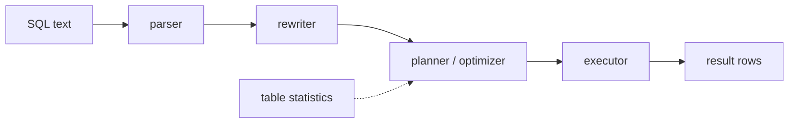
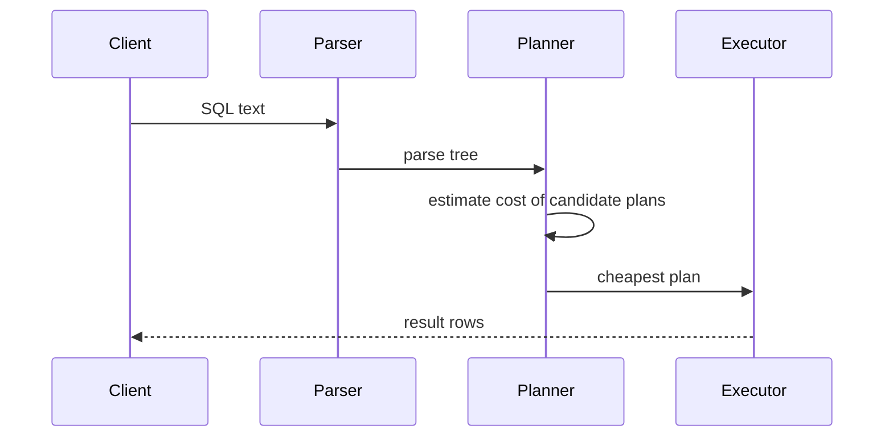
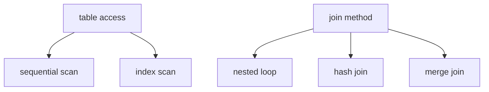

# How a Query Plan Is Determined

## Intuition

SQL is *declarative*: you describe the result you want, not the steps to produce it. `SELECT ... WHERE ... JOIN ...` says nothing about whether to read the table top to bottom, jump through an index, or which table to start the join from. The database fills that gap by building an **execution plan** — the concrete recipe of physical operations that produces your rows. Think of ordering "a vegetarian dinner for four" at a restaurant: you state the outcome, and the kitchen decides which station cooks what, in which order, and on how many burners.

The component that makes those decisions is the **query optimizer** (also called the planner). The same query can be executed in many physically different ways that return identical rows but cost wildly different amounts of time and I/O. The optimizer's job is to pick a *good enough* plan cheaply, not necessarily the mathematically perfect one. It is like a delivery dispatcher choosing a route: there are countless possible routes, and the dispatcher picks a fast one in seconds rather than spending an hour proving which is optimal.

## The Stages

A query goes through a small pipeline before a single row is read. **Parsing** checks the syntax and turns the text into a parse tree — the database confirms the order makes sense and the table and column names exist, like a waiter checking that everything you ordered is actually on the menu. **Rewriting** expands views, resolves `*`, applies rules, and simplifies expressions — turning your phrasing into a normalized form, the way the kitchen translates "the usual" into specific dishes.

Then comes the heart of it: **planning / optimization**. The planner enumerates candidate plans — different access paths and join strategies — estimates the cost of each, and keeps the cheapest. Finally the **executor** runs that chosen plan and streams rows back. The plan is decided *before* execution, based on estimates; whether those estimates were right only becomes visible afterward.

## What the Planner Chooses

Three big decisions dominate the plan. **Access method:** for each table, read it whole with a *sequential scan*, or jump to matching rows through an [index](topic:database-indexes) (*index scan*). The choice of index structure matters too — see [clustered vs non-clustered indexes](topic:clustered-vs-nonclustered-indexes). A sequential scan is like reading every page of a book to find a word; an index scan is like using the book's index — far faster when you want a few entries, but pointless when you want most of the book.

**Join method:** how to combine two inputs — *nested loop* (for each row on the left, look up matches on the right; great when one side is tiny), *hash join* (build a hash table of one side, probe with the other; great for large unsorted inputs), or *merge join* (both inputs sorted, walk them together; great when data is already ordered). It is like merging two guest lists: scan one short list against a long one, or build an index card box from one and flip through it, or — if both are already alphabetized — zip them together.

**Join order:** with several tables, which pair to join first dramatically changes how many intermediate rows flow through later steps. Joining the two most-filtered tables first keeps the working set small, like a kitchen prepping the dish with the fewest portions first so fewer plates pile up on the pass.

## Cost and Statistics

Most modern databases are **cost-based**: each candidate plan gets an estimated cost (a unitless number combining estimated disk pages read and CPU work), and the lowest-cost plan wins. The crucial input is **statistics** — the database keeps, per table, an estimate of the row count, the number of distinct values per column, the most common values, and a histogram of the value distribution. From these it estimates **cardinality**: how many rows each step will produce. Statistics are like a dispatcher's traffic data: the route looks fast on paper only if the traffic estimates are current.

This is why a stale or missing statistic is the classic cause of a *bad* plan. If the optimizer thinks `WHERE status = 'PENDING'` matches 10 rows but it actually matches 2 million, it may pick a nested-loop index scan that is catastrophic at the real size. Databases refresh statistics automatically (PostgreSQL's autovacuum runs `ANALYZE`), but after a big bulk load the numbers can lag — like a GPS still routing you through a road that closed this morning. Running `ANALYZE` updates them.

Selectivity drives the access-method choice directly: a *selective* predicate (few matching rows) favors an index; a non-selective one (most rows match) favors a sequential scan, because bouncing between index and table pages for almost every row is slower than reading the table straight through. The planner also reasons about the cost model differently under concurrency, since matching index entries still need a visibility check — see [MVCC](topic:mvcc).

## Reading the Plan: EXPLAIN

You inspect the chosen plan with **`EXPLAIN`** (shows the plan and the optimizer's *estimates* without running the query) and **`EXPLAIN ANALYZE`** (actually runs it and shows *real* row counts and timings next to the estimates). The single most valuable habit is comparing estimated vs actual rows: a large gap means the statistics misled the planner, and that is your lever to fix. `EXPLAIN` is reading the dispatcher's planned route; `EXPLAIN ANALYZE` is the dashcam footage of the trip actually taken.

The plan is a tree of operators, read inside-out (leaves first): a scan feeds a join, which feeds a sort, which feeds the final output. Each node shows its operation, estimated cost, estimated rows, and width. When tuning, you look for full scans on large tables that should be index lookups, join methods that thrash, and the estimate/actual mismatches that explain why.

## 60-second Interview Answer

SQL is declarative, so the database — not you — decides how to execute a query. The query optimizer (planner) takes the parsed, rewritten query and considers many physically different plans that return the same rows: different access methods (sequential scan vs index scan), different join algorithms (nested loop, hash, merge), and different join orders. Modern databases are cost-based: they estimate the cost of each candidate plan and pick the cheapest.

Those cost estimates depend on table statistics — row counts, distinct values, value distribution histograms — from which the planner estimates cardinality (rows per step). Good statistics yield good plans; stale or missing statistics are the classic reason a query suddenly goes slow, because the planner mis-estimates selectivity and chooses, say, a nested loop where a hash join was needed. You inspect the result with `EXPLAIN` (estimates) and `EXPLAIN ANALYZE` (estimates plus real timings), and the key diagnostic is comparing estimated vs actual row counts.

## Production Relevance

The execution plan is where most query-performance problems live and die. The standard workflow for a slow query is: run `EXPLAIN ANALYZE`, find the most expensive node, check whether the estimate matches reality, and act — add or fix an [index](topic:database-indexes), refresh statistics with `ANALYZE`, or rewrite the query so the planner has better options. It is the difference between a dispatcher endlessly sending trucks down a jammed road and one who looks at live traffic and reroutes.

Plans are not fixed forever. The same query can get a different plan tomorrow because the table grew, the data distribution shifted, or statistics were refreshed — usually for the better, occasionally for the worse after a bulk load before `ANALYZE` catches up. Parameterized queries add a wrinkle: a plan chosen for one parameter value may be poor for another (the "parameter sniffing" problem). Knowing that the plan is an *estimate-driven choice* explains why "it was fast yesterday" is a real and common phenomenon.

## Common Misconceptions

- "SQL tells the database how to run the query." It tells it *what* to return; the optimizer decides *how*. The same SQL can run as a dozen different physical plans.
- "If an index exists, the database will use it." Only if the optimizer estimates it is cheaper. For a non-selective predicate that matches most rows, a sequential scan is genuinely faster, and the planner is right to skip the index.
- "A slow query means a missing index." Often it means *bad statistics*: the planner mis-estimated row counts and chose a poor join or scan. Run `EXPLAIN ANALYZE` before adding indexes.
- "`EXPLAIN` runs my query." Plain `EXPLAIN` only shows the estimated plan; `EXPLAIN ANALYZE` actually executes it (and so can have side effects on writes — wrap those in a transaction you roll back).
- "The plan never changes." It is chosen per execution from current statistics, so the same query can get a new plan as data grows or distributions shift.
- "Lower estimated cost guarantees a faster query." Cost is an estimate built on statistics; if the cardinality estimate is wrong, the cheapest-looking plan can be the slowest in reality — which is exactly why you compare estimated vs actual rows.
