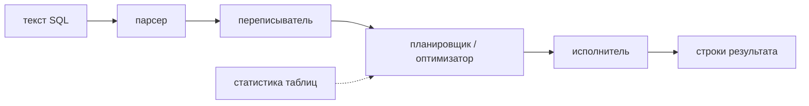
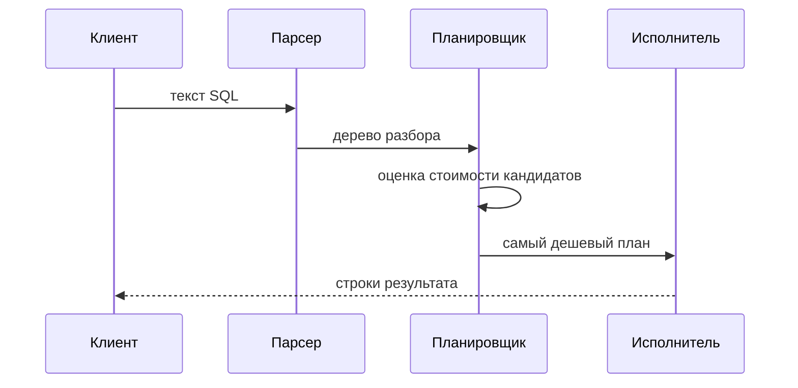
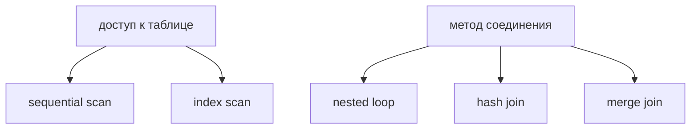

# Как определяется план запроса

## Интуиция

SQL *декларативен*: вы описываете желаемый результат, а не шаги его получения. `SELECT ... WHERE ... JOIN ...` ничего не говорит о том, читать ли таблицу сверху вниз, прыгать ли по индексу и с какой таблицы начинать соединение. Этот пробел база данных закрывает, строя **план выполнения** — конкретный рецепт физических операций, который порождает ваши строки. Представьте заказ «вегетарианский ужин на четверых» в ресторане: вы называете итог, а кухня сама решает, какая станция что готовит, в каком порядке и на скольких конфорках.

Решения принимает **оптимизатор запросов** (он же планировщик). Один и тот же запрос можно выполнить множеством физически разных способов, которые вернут одинаковые строки, но потратят совершенно разное время и ввод-вывод. Задача оптимизатора — дешево выбрать *достаточно хороший* план, а не обязательно математически идеальный. Это как диспетчер доставки, выбирающий маршрут: возможных маршрутов бесконечно много, и диспетчер за секунды выбирает быстрый, а не тратит час на доказательство оптимальности.

## Этапы

Прежде чем будет прочитана хотя бы одна строка, запрос проходит небольшой конвейер. **Разбор (parsing)** проверяет синтаксис и превращает текст в дерево разбора — база убеждается, что порядок осмыслен, а имена таблиц и столбцов существуют, как официант проверяет, что всё заказанное действительно есть в меню. **Перезапись (rewriting)** разворачивает представления, раскрывает `*`, применяет правила и упрощает выражения — приводя вашу формулировку к нормализованному виду, как кухня переводит «как обычно» в конкретные блюда.

Затем — самое главное: **планирование / оптимизация**. Планировщик перебирает кандидатов на план — разные пути доступа и стратегии соединений, — оценивает стоимость каждого и оставляет самый дешевый. Наконец **исполнитель** запускает выбранный план и отдает строки. План определяется *до* выполнения, на основе оценок; верны ли были эти оценки, становится видно только потом.

## Что выбирает планировщик

В плане доминируют три больших решения. **Метод доступа:** для каждой таблицы — читать её целиком *последовательным сканированием* (sequential scan) или прыгать к подходящим строкам через [индекс](topic:database-indexes) (*index scan*). Важна и структура индекса — см. [кластерные и некластерные индексы](topic:clustered-vs-nonclustered-indexes). Последовательное сканирование — как чтение каждой страницы книги в поисках слова; сканирование по индексу — как использование предметного указателя книги: гораздо быстрее, когда нужно несколько записей, но бессмысленно, когда нужна почти вся книга.

**Метод соединения:** как объединить два входа — *вложенный цикл* (nested loop: для каждой строки слева ищем совпадения справа; хорош, когда одна сторона крошечная), *хеш-соединение* (hash join: строим хеш-таблицу из одной стороны и проверяем другой; хорош для больших неотсортированных входов) или *слияние* (merge join: оба входа отсортированы, идём по ним вместе; хорош, когда данные уже упорядочены). Это как объединить два списка гостей: проверять короткий список против длинного, или построить из одного картотеку и листать её, или — если оба уже по алфавиту — просто свести их вместе.

**Порядок соединений:** при нескольких таблицах то, какую пару соединить первой, кардинально меняет, сколько промежуточных строк протечёт через последующие шаги. Соединение двух наиболее отфильтрованных таблиц первыми держит рабочий набор маленьким — как кухня, готовящая сперва блюдо с наименьшим числом порций, чтобы на раздаче скапливалось меньше тарелок.

## Стоимость и статистика

Большинство современных баз — **стоимостные** (cost-based): каждому кандидату назначается оценочная стоимость (безразмерное число, объединяющее оценку прочитанных страниц диска и работы CPU), и побеждает план с минимальной стоимостью. Ключевой вход — **статистика**: база хранит по каждой таблице оценку числа строк, число различных значений по столбцам, самые частые значения и гистограмму распределения значений. Из этого она оценивает **кардинальность**: сколько строк породит каждый шаг. Статистика — как данные о трафике у диспетчера: маршрут выглядит быстрым на бумаге, только если оценки трафика свежие.

Вот почему устаревшая или отсутствующая статистика — классическая причина *плохого* плана. Если оптимизатор думает, что `WHERE status = 'PENDING'` совпадает с 10 строками, а на деле их 2 миллиона, он может выбрать index scan во вложенном цикле, катастрофичный на реальном размере. Базы обновляют статистику автоматически (autovacuum в PostgreSQL запускает `ANALYZE`), но после крупной массовой загрузки числа могут отставать — как навигатор, всё ещё ведущий вас по дороге, закрытой сегодня утром. Запуск `ANALYZE` их обновляет.

Селективность напрямую определяет выбор метода доступа: *селективный* предикат (мало совпадающих строк) благоприятствует индексу; неселективный (совпадает большинство строк) благоприятствует последовательному сканированию, потому что прыгать между страницами индекса и таблицы почти для каждой строки медленнее, чем читать таблицу подряд. Под конкурентным доступом модель стоимости рассуждает иначе, ведь совпавшие записи индекса всё ещё требуют проверки видимости — см. [MVCC](topic:mvcc).

## Чтение плана: EXPLAIN

Выбранный план смотрят через **`EXPLAIN`** (показывает план и *оценки* оптимизатора без запуска) и **`EXPLAIN ANALYZE`** (реально выполняет запрос и показывает *фактические* числа строк и время рядом с оценками). Самая ценная привычка — сравнивать оценочные и фактические строки: большой разрыв означает, что статистика ввела планировщик в заблуждение, и это ваш рычаг для исправления. `EXPLAIN` — это чтение запланированного диспетчером маршрута; `EXPLAIN ANALYZE` — запись с видеорегистратора реально совершённой поездки.

План — это дерево операторов, читаемое изнутри наружу (сначала листья): сканирование питает соединение, которое питает сортировку, которая питает итоговый вывод. Каждый узел показывает свою операцию, оценочную стоимость, оценочное число строк и ширину. При настройке вы ищете полные сканирования больших таблиц, которые должны быть поиском по индексу, методы соединения, которые буксуют, и расхождения оценки и факта, объясняющие причину.

## Ответ за 60 секунд

SQL декларативен, поэтому как выполнять запрос решает база данных, а не вы. Оптимизатор (планировщик) берёт разобранный и переписанный запрос и рассматривает множество физически разных планов, возвращающих одни и те же строки: разные методы доступа (sequential scan против index scan), разные алгоритмы соединения (nested loop, hash, merge) и разный порядок соединений. Современные базы стоимостные: они оценивают стоимость каждого кандидата и выбирают самый дешёвый.

Эти оценки стоимости зависят от статистики таблиц — числа строк, числа различных значений, гистограмм распределения, — из которых планировщик оценивает кардинальность (строки на шаг). Хорошая статистика даёт хорошие планы; устаревшая или отсутствующая статистика — классическая причина внезапного замедления запроса, потому что планировщик неверно оценивает селективность и выбирает, скажем, nested loop там, где нужен был hash join. Результат смотрят через `EXPLAIN` (оценки) и `EXPLAIN ANALYZE` (оценки плюс реальное время), и ключевая диагностика — сравнение оценочного и фактического числа строк.

## Применимость на практике

План выполнения — это место, где живёт и умирает большинство проблем производительности запросов. Стандартный рабочий процесс для медленного запроса: запустить `EXPLAIN ANALYZE`, найти самый дорогой узел, проверить, совпадает ли оценка с реальностью, и действовать — добавить или исправить [индекс](topic:database-indexes), обновить статистику через `ANALYZE` или переписать запрос так, чтобы у планировщика были варианты получше. Это разница между диспетчером, бесконечно гоняющим грузовики по забитой дороге, и тем, кто смотрит на живой трафик и перенаправляет.

Планы не зафиксированы навсегда. Тот же запрос может получить другой план завтра, потому что таблица выросла, распределение данных сместилось или статистика обновилась — обычно к лучшему, изредка к худшему после массовой загрузки, пока `ANALYZE` не догонит. Параметризованные запросы добавляют нюанс: план, выбранный для одного значения параметра, может быть плохим для другого (проблема «parameter sniffing»). Понимание того, что план — это *выбор на основе оценок*, объясняет, почему «вчера было быстро» — реальное и частое явление.

## Частые заблуждения

- «SQL говорит базе, как выполнять запрос». Он говорит, *что* вернуть; *как* решает оптимизатор. Один и тот же SQL может выполняться десятком разных физических планов.
- «Если индекс есть, база его использует». Только если оптимизатор оценит, что так дешевле. Для неселективного предиката, совпадающего с большинством строк, последовательное сканирование действительно быстрее, и планировщик правильно пропускает индекс.
- «Медленный запрос — значит не хватает индекса». Часто это *плохая статистика*: планировщик неверно оценил число строк и выбрал плохое соединение или сканирование. Перед добавлением индексов запустите `EXPLAIN ANALYZE`.
- «`EXPLAIN` запускает мой запрос». Простой `EXPLAIN` лишь показывает оценочный план; `EXPLAIN ANALYZE` реально его выполняет (и потому может иметь побочные эффекты при записи — оборачивайте такие в откатываемую транзакцию).
- «План никогда не меняется». Он выбирается при каждом выполнении по текущей статистике, поэтому тот же запрос может получить новый план по мере роста данных или сдвига распределений.
- «Меньшая оценочная стоимость гарантирует более быстрый запрос». Стоимость — это оценка на основе статистики; если оценка кардинальности неверна, самый дешёвый на вид план может оказаться самым медленным в реальности — именно поэтому сравнивают оценочные и фактические строки.
