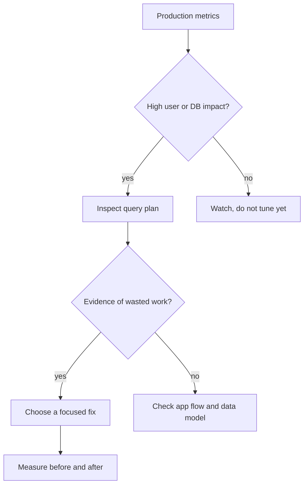
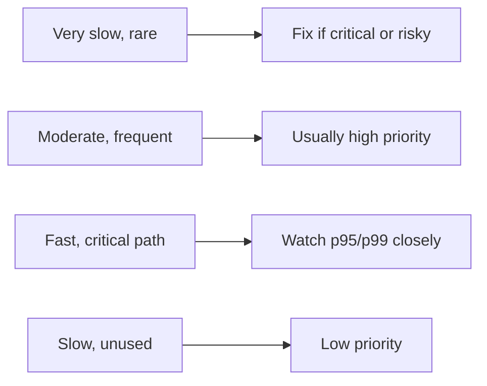

# Choosing Queries to Optimize

## Intuition

You do not optimize "all slow queries". You optimize the queries where better
performance will noticeably improve the system. Start with evidence from
production: latency percentiles, total database time, frequency, lock waits,
timeouts, CPU or I/O pressure, and the user journey affected. It is like managing
a busy kitchen: the dish that takes longest to cook matters, but the station that
slows every table during lunch matters more.

A good candidate usually has at least one of these signals:

- It is slow at meaningful percentiles, for example p95 or p99, not only in one
  rare sample. Like traffic reports, one blocked side street is less important
  than a jam that repeats every rush hour.
- It runs very often, so even a small saving reduces total database load. Like a
  post office stamp step: saving two seconds per parcel matters when there are
  thousands of parcels.
- It sits on a critical user path such as checkout, login, search or billing.
  Like a traffic light at a hospital entrance, small delays matter more because
  the route is important.
- It causes errors, timeouts, pool exhaustion, lock waits or high replica lag.
  Like one stuck loading dock, it can block many trucks behind it.
- Its [query plan](topic:query-plan) shows concrete waste: scanning too many
  rows, a bad join order, missing or unused [indexes](topic:database-indexes), a
  big sort, stale estimates or a large gap between estimated and actual rows.
  Like a kitchen ticket showing that every sandwich requires walking to the
  basement, the plan explains where the work is leaking.

## Where the Evidence Comes From

Use several sources, because each source answers a different question. Slow-query
logs tell you which statements crossed a threshold. APM traces show which request
or background job paid the cost. Database views such as `pg_stat_statements` show
how much total time a normalized query consumes. Dashboards show pressure on CPU,
I/O, locks, connections and replication. It is like running a restaurant: the
waiter hears customer complaints, the kitchen timer shows slow dishes, and the
cash register shows which dish is ordered most often.

For PostgreSQL, a useful first sort is total time, not just max time:

`total_time = mean_time * calls`

The query with a 5 second runtime once per day may matter less than a query that
takes 80 ms but runs 200,000 times per hour. This is the same idea as cleaning a
post office counter: the tiny repeated mess slows everyone, while one large box
in the corner may be annoying but not the bottleneck.

Also separate database time from application time. A request can be slow because
of JSON serialization, network calls, cache misses or an ORM N+1 pattern, not
because one SQL statement is bad. If the trace shows hundreds of small queries,
look at batching, fetching strategy and [prepared statements](topic:prepared-statements)
before obsessing over one line of SQL. It is like a delivery route: the problem
may be too many short stops, not one long road.

## A Practical Triage Checklist

1. **Confirm the symptom.** Check p95/p99 latency, timeout rate and database
   saturation around the same time window. Do not tune a query from a stale log
   line. Like checking today's traffic before rerouting buses, use current data.
2. **Group equivalent SQL.** Normalize literals so `WHERE id = 10` and
   `WHERE id = 11` count as one pattern. Otherwise you mistake many copies of one
   route for many different routes.
3. **Rank by impact.** Look at total time, calls, rows read, rows returned, lock
   wait time and the product feature affected. A common search query may beat a
   rare admin report even if the report is slower.
4. **Inspect the plan.** Use `EXPLAIN` or `EXPLAIN ANALYZE` and compare estimates
   with real rows. See [how a query plan is determined](topic:query-execution-plan)
   before changing SQL blindly. This is the kitchen ticket that tells whether the
   cook is walking too far, chopping too much or waiting for another station.
5. **Pick the smallest credible fix.** Maybe you need a better predicate, a
   covering index, a composite index, fewer selected columns, pagination, batching
   or a different fetch strategy. Use [ways to make a SQL query more efficient](topic:sql-query-optimization)
   and [which indexes to add](topic:indexes-for-query-optimization) as focused
   follow-ups.
6. **Measure the result.** Compare the same workload before and after: latency,
   total database time, plan shape, rows read, CPU/I/O and error rate. Like
   changing a traffic-light schedule, you need to prove the queue became shorter,
   not just that the diagram looks nicer.

## What Usually Gets Priority

Queries on hot user paths come first: login, checkout, search, feed rendering,
payment status and APIs with strict SLOs. A 100 ms win there can improve many
users. It is like fixing the main road into the city before repainting a quiet
parking lot.

Queries that consume a large share of database resources also rise to the top.
If one normalized statement accounts for 30% of database CPU or I/O, optimizing
it can free capacity for the whole system. Like replacing a slow oven used by
every cook, one fix helps the whole kitchen.

Queries that create lock contention, deadlocks or pool exhaustion are urgent even
if their average runtime is not huge. Waiting queries pile up behind them. This
is like one cashier arguing over a receipt while the whole line stops.

Reports, migrations and admin jobs matter when they interfere with production
traffic or breach operational windows. If a nightly report runs for two hours but
only on a read replica, it may be less urgent than a 200 ms checkout query. Like
washing delivery trucks at night, the work is acceptable if it does not block the
morning route.

## 60-second Interview Answer

> I would not start with the query that merely looks slow in isolation. I would
> rank candidates by production impact: p95 and p99 latency, number of calls,
> total database time, errors, timeouts, lock waits, connection pool pressure and
> the business flow affected. I would group equivalent SQL statements, check APM
> traces and slow-query logs, then inspect the query plan with `EXPLAIN` or
> `EXPLAIN ANALYZE` to verify where the work is spent: scans, joins, sorts,
> wrong row estimates or missing indexes. The best first target is usually a
> frequent or critical query that consumes a lot of total DB time and has a clear,
> low-risk fix. After changing it, I would compare before and after metrics on the
> same workload to prove the improvement and check for regressions.

## Production Relevance

Optimization has a cost: indexes slow writes and take space, query rewrites can
change behavior, and ORM fetch changes can move load from one endpoint to
another. Candidate selection prevents random tuning. It is like renovating a
post office: first find the counter where the line forms, then move furniture.

This is also where database topics connect. Use [database-query-fields](topic:database-query-fields)
to understand which columns matter in predicates and projections,
[database normalization](topic:database-normalization) to reason about schema
shape, [query plans](topic:query-plan) to see actual work, and
[indexes](topic:database-indexes) to choose a physical access path. For ORM-heavy
services, check whether default loading creates extra queries with
[Hibernate default fetch strategy](topic:hibernate-default-fetch-strategy) or
whether one request needs intentional eager loading with
[eager fetching for a single query](topic:hibernate-eager-for-one-query). Like
coordinating a kitchen, menu, pantry and delivery window, query speed depends on
several pieces working together.

## Common Misconceptions

- "Optimize the query with the highest max duration." Max duration can be a rare
  outlier. Total time and user impact often matter more. One delayed taxi is not
  the same as a blocked avenue.
- "If a query appears in slow logs, it must be fixed." A slow log entry is a lead,
  not a verdict. Check frequency, business path and plan evidence. Like a smoke
  alarm, investigate before rebuilding the kitchen.
- "Add an index first." An index helps only when it matches the predicates, join
  columns, ordering and selectivity, and it has write/storage costs. Like adding
  a new shelf, it helps only if people can find and use it.
- "Average latency is enough." Averages hide tail latency. Interviewers expect
  p95/p99 thinking because users feel the slow tail. A restaurant with a good
  average wait can still have a few tables waiting too long.
- "One SQL query equals one performance problem." The real issue may be N+1
  calls, transaction scope, locks, missing pagination, network round trips or a
  data model mismatch. Like a traffic jam, the visible car is not always the
  cause.
- "Once optimized, the query stays optimized." Data volume, skew, statistics and
  workload change. Recheck plans and metrics after growth. A delivery route that
  worked in winter may fail when roadworks start.
