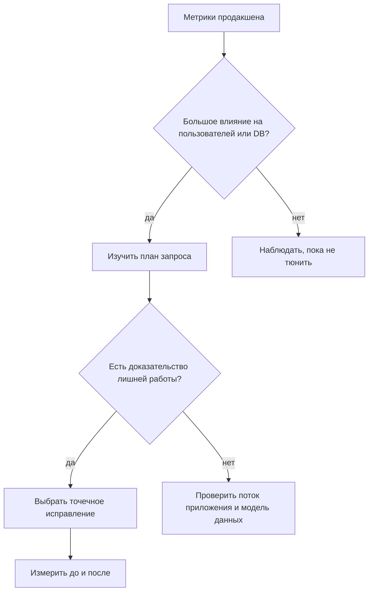
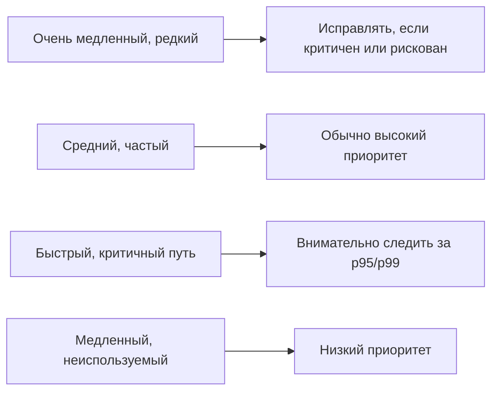

# Как определять запросы для оптимизации

## Интуиция

Оптимизируют не «все медленные запросы». Оптимизируют те запросы, ускорение
которых заметно улучшит систему. Начинай с фактов из продакшена: перцентили
задержки, суммарное время базы данных, частота выполнения, ожидания блокировок,
таймауты, нагрузка на CPU или I/O и затронутый пользовательский путь. Это как
управлять занятой кухней: блюдо, которое готовится дольше всех, важно, но
станция, которая тормозит каждый стол во время обеда, важнее.

Хороший кандидат обычно имеет хотя бы один из этих сигналов:

- Он медленный на значимых перцентилях, например p95 или p99, а не только в одном
  редком замере. Как в отчетах о дорожном движении: одна перекрытая боковая улица
  менее важна, чем пробка, которая повторяется каждый час пик.
- Он выполняется очень часто, поэтому даже небольшая экономия снижает общую
  нагрузку на базу данных. Как шаг с маркировкой на почте: сэкономить две
  секунды на посылке важно, когда посылок тысячи.
- Он находится на критичном пользовательском пути: checkout, login, search или
  billing. Как светофор у въезда в больницу, даже небольшие задержки важнее,
  потому что маршрут критичен.
- Он вызывает ошибки, таймауты, исчерпание пула соединений, ожидания блокировок
  или высокий replica lag. Как один застрявший погрузочный док, он может
  остановить много грузовиков позади себя.
- Его [план запроса](topic:query-plan) показывает конкретные потери: чтение
  слишком большого числа строк, плохой порядок JOIN, отсутствующие или
  неиспользуемые [индексы](topic:database-indexes), большой sort, устаревшие
  оценки или большой разрыв между estimated rows и actual rows. Как кухонный
  чек, из которого видно, что за каждым сэндвичем нужно ходить в подвал, план
  объясняет, где утекает работа.

## Откуда брать доказательства

Используй несколько источников, потому что каждый отвечает на свой вопрос.
Slow-query logs показывают, какие statements перешли порог времени. APM traces
показывают, какой request или фоновая job заплатила эту цену. Представления базы
данных вроде `pg_stat_statements` показывают, сколько суммарного времени
потребляет нормализованный запрос. Дашборды показывают давление на CPU, I/O,
locks, connections и replication. Это как управлять рестораном: официант слышит
жалобы гостей, кухонный таймер показывает медленные блюда, а касса показывает,
какое блюдо заказывают чаще всего.

Для PostgreSQL полезная первая сортировка - по total time, а не только по max
time:

`total_time = mean_time * calls`

Запрос, который выполняется 5 секунд один раз в день, может быть менее важным,
чем запрос на 80 ms, который выполняется 200 000 раз в час. Это та же идея, что
и уборка стойки на почте: маленький повторяющийся беспорядок тормозит всех, а
одна большая коробка в углу может раздражать, но не быть bottleneck.

Также отделяй время базы данных от времени приложения. Request может быть
медленным из-за JSON serialization, сетевых вызовов, cache misses или ORM N+1
pattern, а не из-за одного плохого SQL statement. Если trace показывает сотни
маленьких запросов, сначала смотри на batching, fetching strategy и
[prepared statements](topic:prepared-statements), а не зацикливайся на одной
строке SQL. Это как маршрут доставки: проблема может быть в слишком большом
числе коротких остановок, а не в одной длинной дороге.

## Практический чек-лист сортировки

1. **Подтверди симптом.** Проверь p95/p99 latency, timeout rate и saturation базы
   данных в одном и том же временном окне. Не тюнь запрос по устаревшей строке
   лога. Как перед изменением маршрута автобусов, сначала проверь сегодняшнее
   движение.
2. **Сгруппируй эквивалентный SQL.** Нормализуй литералы, чтобы `WHERE id = 10`
   и `WHERE id = 11` считались одним шаблоном. Иначе ты примешь множество копий
   одного маршрута за множество разных маршрутов.
3. **Ранжируй по влиянию.** Смотри на total time, calls, rows read, rows
   returned, lock wait time и затронутую продуктовую функцию. Частый search query
   может быть важнее редкого admin report, даже если отчет медленнее.
4. **Изучи план.** Используй `EXPLAIN` или `EXPLAIN ANALYZE` и сравни оценки с
   реальными строками. Посмотри, [как определяется план запроса](topic:query-execution-plan),
   прежде чем менять SQL вслепую. Это кухонный чек, который показывает, повар
   слишком далеко ходит, слишком много режет или ждет другую станцию.
5. **Выбери минимальное правдоподобное исправление.** Может понадобиться лучший
   predicate, covering index, composite index, меньше выбранных колонок,
   pagination, batching или другая fetching strategy. Используй темы
   [как сделать SQL-запрос эффективнее](topic:sql-query-optimization) и
   [какие индексы добавлять](topic:indexes-for-query-optimization) как точечные
   продолжения.
6. **Измерь результат.** Сравни одну и ту же нагрузку до и после: latency, total
   database time, форму плана, rows read, CPU/I/O и error rate. Как при изменении
   расписания светофора, нужно доказать, что очередь стала короче, а не просто
   что схема выглядит красивее.

## Что обычно получает приоритет

Сначала идут запросы на горячих пользовательских путях: login, checkout, search,
feed rendering, payment status и API со строгими SLO. Выигрыш в 100 ms там может
помочь многим пользователям. Это как починить главную дорогу в город перед тем,
как перекрашивать тихую парковку.

Запросы, которые потребляют большую долю ресурсов базы данных, тоже поднимаются
вверх. Если один нормализованный statement занимает 30% CPU или I/O базы,
оптимизация может освободить емкость для всей системы. Как заменить медленную
печь, которой пользуется каждый повар: одно исправление помогает всей кухне.

Запросы, создающие lock contention, deadlocks или исчерпание пула соединений,
срочны, даже если их среднее время не огромное. Ожидающие запросы скапливаются
за ними. Это как один кассир, который спорит из-за чека, пока вся очередь стоит.

Отчеты, миграции и admin jobs важны, когда мешают продакшен-трафику или нарушают
операционные окна. Если ночной отчет идет два часа, но только на read replica, он
может быть менее срочным, чем checkout query на 200 ms. Как мыть грузовики ночью:
работа приемлема, если не блокирует утренний маршрут.

## Ответ на собеседовании за 60 секунд

> Я бы не начинал с запроса, который просто выглядит медленным сам по себе. Я бы
> ранжировал кандидатов по влиянию в продакшене: p95 и p99 latency, число calls,
> total database time, errors, timeouts, lock waits, давление на connection pool и
> затронутый бизнес-процесс. Я бы сгруппировал эквивалентные SQL statements,
> проверил APM traces и slow-query logs, затем изучил план запроса через
> `EXPLAIN` или `EXPLAIN ANALYZE`, чтобы подтвердить, где тратится работа:
> scans, joins, sorts, ошибочные row estimates или missing indexes. Лучшей первой
> целью обычно будет частый или критичный запрос, который потребляет много
> суммарного DB time и имеет понятное низкорисковое исправление. После изменения
> я бы сравнил метрики до и после на той же нагрузке, чтобы доказать улучшение и
> проверить регрессии.

## Почему это важно в продакшене

Оптимизация имеет цену: индексы замедляют записи и занимают место, переписывание
запросов может изменить поведение, а изменения ORM fetching могут перенести
нагрузку с одного endpoint на другой. Выбор кандидатов защищает от случайного
тюнинга. Это как ремонтировать почтовое отделение: сначала найди стойку, где
собирается очередь, потом двигай мебель.

Здесь сходятся несколько тем по базам данных. Используй
[поля, важные для запросов](topic:database-query-fields), чтобы понять, какие
колонки важны в predicates и projections, [нормализацию базы данных](topic:database-normalization),
чтобы рассуждать о форме схемы, [планы запросов](topic:query-plan), чтобы увидеть
реальную работу, и [индексы](topic:database-indexes), чтобы выбрать физический
путь доступа. Для сервисов с ORM проверь, не создает ли default loading лишние
запросы через [Hibernate default fetch strategy](topic:hibernate-default-fetch-strategy),
и не нужен ли одному request намеренный eager loading через
[eager fetching for a single query](topic:hibernate-eager-for-one-query). Как
координировать кухню, меню, кладовую и окно доставки, скорость запроса зависит
от нескольких деталей сразу.

## Частые заблуждения

- «Оптимизируй запрос с максимальным max duration». Max duration может быть
  редким выбросом. Total time и влияние на пользователя часто важнее. Одно
  задержанное такси не равно перекрытому проспекту.
- «Если запрос попал в slow logs, его нужно исправить». Запись slow log - это
  зацепка, а не приговор. Проверь частоту, бизнес-путь и доказательства из плана.
  Как с пожарной сигнализацией: сначала разберись, прежде чем перестраивать
  кухню.
- «Сначала добавь индекс». Индекс помогает только когда совпадает с predicates,
  join columns, ordering и selectivity, и у него есть стоимость записи и хранения.
  Как добавить новую полку: она помогает только если люди могут ее найти и
  использовать.
- «Средней latency достаточно». Средние значения прячут tail latency. На
  собеседовании ждут мышления через p95/p99, потому что пользователи чувствуют
  медленный хвост. В ресторане может быть хорошее среднее время ожидания, но
  несколько столов все равно ждут слишком долго.
- «Один SQL-запрос равен одной performance problem». Реальная причина может быть
  в N+1 calls, transaction scope, locks, missing pagination, network round trips
  или несоответствии модели данных. Как в пробке: видимая машина не всегда
  причина.
- «После оптимизации запрос остается оптимальным». Объем данных, skew,
  statistics и workload меняются. После роста нужно снова проверять планы и
  метрики. Маршрут доставки, который работал зимой, может сломаться, когда
  начнется ремонт дороги.
