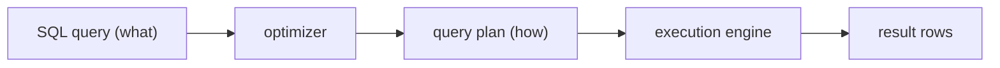
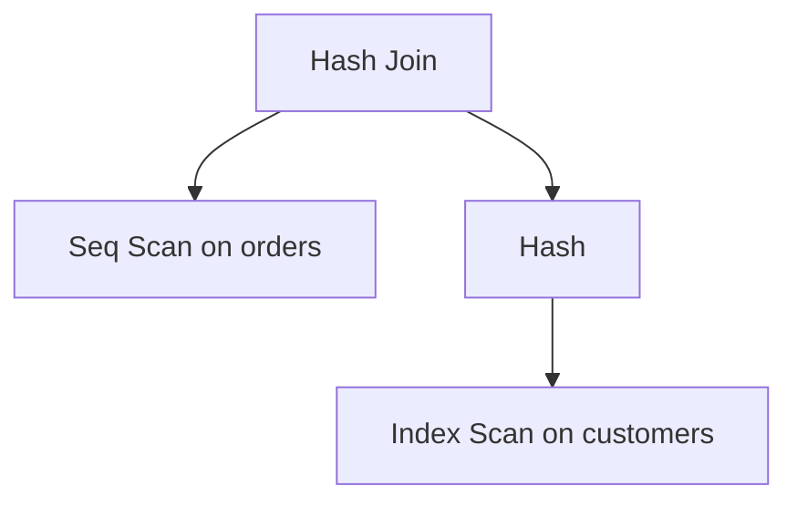
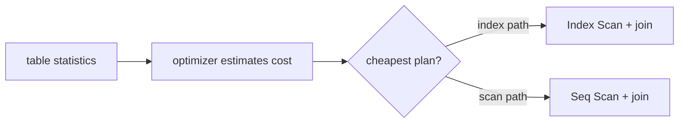

# What Is a Query Plan

## Intuition

SQL is **declarative**: you say *what* rows you want, not *how* to fetch them.
The database has to turn that wish into concrete steps — which table to read
first, whether to use an index, how to combine two tables, whether to sort. That
chosen recipe is the **query plan** (also called the execution plan). Think of
handing a chef an order that just says "a club sandwich": the chef silently
decides the sequence — toast first, fry the bacon, assemble — and that sequence
is the plan, not the order.

The component that writes the plan is the **query optimizer**. For one SQL
statement there are usually many valid plans that all return the same rows but
cost wildly different amounts of work. The optimizer estimates the cost of the
candidates and picks the cheapest. It is like a delivery dispatcher with one
parcel and several possible routes: every route arrives, but the dispatcher
chooses the one with the least traffic and distance.

You can ask the database to show you this recipe with **`EXPLAIN`**. The plan is
a **tree of operators**: each node does one job (scan a table, use an index, join
two inputs, sort, aggregate) and feeds its rows to the node above it. You read it
from the inside out — the deepest, most indented nodes run first and pass rows
upward, like a kitchen where the prep stations finish before the plating station
assembles the dish.

## Reading the Operators

A few operators show up in almost every plan:

- **Seq Scan (full table scan)** — read every row of the table and test the
  filter. Cheap on a tiny table, painful on a huge one. Like a clerk opening
  every box in the warehouse because nothing is sorted.
- **Index Scan / Index Seek** — walk a [B-tree index](topic:database-indexes) to
  jump straight to matching rows. Like using the sorted shelf in a post office to
  go directly to the right street. (See also
  [clustered vs non-clustered indexes](topic:clustered-vs-nonclustered-indexes).)
- **Nested Loop join** — for each row of the outer input, look up matches in the
  inner input. Great when the outer side is tiny; can become
  [O(n²)](topic:quadratic-complexity) when both sides are large. Like checking
  each guest against the whole guest list one by one.
- **Hash Join** — build a hash table from the smaller input, then probe it with
  the larger one. Strong for big, unsorted joins. Like sorting all coats into
  numbered cubbies first, then handing each ticket holder their coat in one
  glance.
- **Sort / Aggregate** — order rows or fold them into groups, used for
  `ORDER BY`, `GROUP BY` and some joins.

Each node in the plan carries **estimates**: how many rows it expects (`rows`)
and a relative `cost`. These are guesses, not measurements — until you actually
run the query.

## Cost-Based, Statistics-Driven

The optimizer is **cost-based**: it does not "know" your data, it estimates from
**statistics** the database keeps about each table — row counts, how many
distinct values a column has, value distribution (histograms). From those it
guesses how **selective** a filter is (how few rows survive it) and therefore
which plan is cheapest. It is like a dispatcher routing by last week's traffic
report: usually right, but only as good as the report.

This is why **stale statistics cause bad plans**. If the optimizer thinks a table
has 1,000 rows but it now has 10 million, it may pick a Nested Loop that is
catastrophic at the real size. Running `ANALYZE` (refreshing statistics) often
fixes a suddenly-slow query — like updating the traffic report so the dispatcher
stops sending trucks down a road that is now jammed.

It also explains why **an index can exist but go unused**: if a filter matches
most of the table, a Seq Scan is genuinely cheaper than bouncing between index
pages and table pages, so the optimizer skips the index on purpose. A courier
ignores the address book when every house on the street needs a delivery anyway.

## EXPLAIN vs EXPLAIN ANALYZE

`EXPLAIN` shows the **estimated** plan without running the query — fast and safe.
`EXPLAIN ANALYZE` (PostgreSQL) actually **executes** it and reports the *real*
row counts and timings alongside the estimates. Comparing the two is the core
diagnostic skill: a big gap between *estimated rows* and *actual rows* points
straight at bad statistics or a misjudged filter. It is the difference between a
planned route on a map and a GPS recording of the trip you actually drove — the
recording reveals where you really got stuck.

> Caution: `EXPLAIN ANALYZE` runs the statement, so for an `INSERT`/`UPDATE`/
> `DELETE` it performs the write (wrap it in a transaction you roll back).

## 60-second Interview Answer

> A query plan is the execution strategy the database's optimizer produces for a
> SQL statement — the tree of physical operators (scans, index lookups, joins,
> sorts, aggregations) and the order they run in. SQL is declarative, so for one
> query there are many possible plans returning the same rows; the optimizer is
> cost-based and uses table statistics to estimate how many rows each step yields
> and picks the cheapest plan. You inspect it with `EXPLAIN`, which shows the
> estimated plan, or `EXPLAIN ANALYZE`, which runs the query and shows actual
> rows and timings. I read it inside-out, watch for `Seq Scan` on big tables,
> compare estimated vs actual rows to spot stale statistics, and check whether
> the join type (Nested Loop vs Hash Join) and index usage fit the data size.

## Production Relevance

Reading plans is the everyday tool for fixing slow queries. The workflow is:
capture the slow statement, run `EXPLAIN ANALYZE`, find the operator burning the
most time (often a `Seq Scan` on a large table or a Nested Loop over many rows),
then act — add or fix an [index](topic:database-indexes), rewrite the query, or
refresh statistics. It is like a restaurant tracing why orders are late: you
watch the line, find the one station that backs everyone up, and fix *that* step
rather than hiring more cooks everywhere.

Plans also interact with transactions: in an MVCC database the engine still
checks row visibility while executing the plan, so the same query can touch
different amounts of work under different load — see
[MVCC](topic:mvcc) and [PostgreSQL isolation levels](topic:postgresql-isolation-levels).

## Common Misconceptions

- "The plan is fixed for a query." No — it depends on current statistics, the
  actual parameter values, and database settings, so the *same* SQL can get
  different plans over time. A dispatcher reroutes the same delivery differently
  on different days.
- "EXPLAIN runs my query." Plain `EXPLAIN` only estimates; `EXPLAIN ANALYZE`
  actually executes it. One is reading the recipe, the other is cooking the dish.
- "An index guarantees an Index Scan." The optimizer uses an index only when it
  estimates that path is cheaper; for low-selectivity filters it deliberately
  picks a Seq Scan.
- "Lower estimated cost always means faster." Cost is an *estimate* from
  statistics; if the stats are stale the estimate lies. Always confirm with
  actual rows/timings from `EXPLAIN ANALYZE`.
- "Nested Loop is bad / Hash Join is good." Neither is universally better —
  Nested Loop wins for a tiny outer input driven by an index; Hash Join wins for
  large unsorted inputs. The right join depends on the data sizes.
