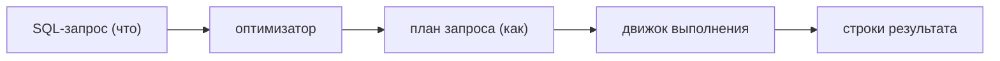
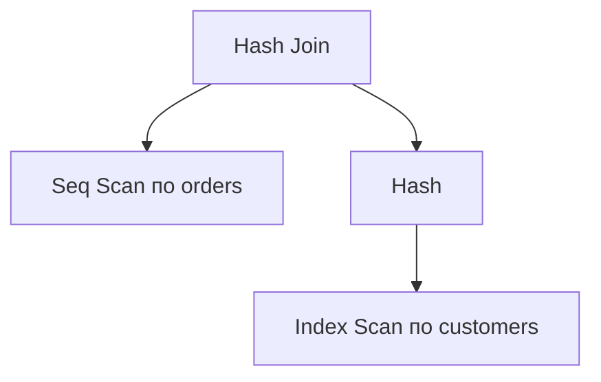
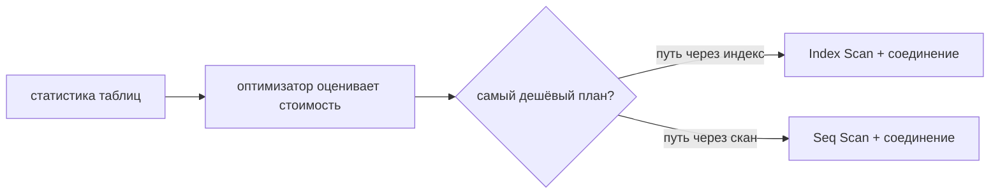

# Что такое план запроса

## Интуиция

SQL **декларативен**: вы говорите, *какие* строки хотите получить, а не *как* их
доставать. База должна превратить это пожелание в конкретные шаги — какую таблицу
читать первой, использовать ли индекс, как соединить две таблицы, нужна ли
сортировка. Этот выбранный рецепт и есть **план запроса** (его же называют планом
выполнения). Представьте, что вы даёте повару заказ, где написано просто «клубный
сэндвич»: повар молча решает последовательность — сначала тосты, обжарить бекон,
собрать — и именно эта последовательность является планом, а не сам заказ.

Компонент, который пишет план, называется **оптимизатором запросов**. Для одного
SQL-запроса обычно существует много допустимых планов: все они возвращают
одинаковые строки, но требуют совершенно разного объёма работы. Оптимизатор
оценивает стоимость кандидатов и выбирает самый дешёвый. Это как диспетчер
доставки с одной посылкой и несколькими маршрутами: любой маршрут доедет, но
диспетчер выбирает тот, где меньше пробок и километража.

Попросить базу показать этот рецепт можно командой **`EXPLAIN`**. План — это
**дерево операторов**: каждый узел делает одну работу (сканировать таблицу,
использовать индекс, соединить два входа, отсортировать, агрегировать) и передаёт
свои строки узлу выше. Читают его изнутри наружу — самые глубокие, наиболее
смещённые вправо узлы выполняются первыми и передают строки вверх, как на кухне,
где станции подготовки заканчивают раньше, чем станция подачи собирает блюдо.

## Чтение операторов

Несколько операторов встречаются почти в каждом плане:

- **Seq Scan (полный просмотр таблицы)** — прочитать каждую строку таблицы и
  проверить фильтр. Дёшево на крошечной таблице, мучительно на огромной. Как
  служащий, который открывает каждую коробку на складе, потому что ничего не
  отсортировано.
- **Index Scan / Index Seek** — пройти по [B-tree индексу](topic:database-indexes),
  чтобы сразу перейти к подходящим строкам. Как использовать отсортированную
  полку на почте, чтобы попасть прямо к нужной улице. (См. также
  [кластерные и некластерные индексы](topic:clustered-vs-nonclustered-indexes).)
- **Nested Loop (соединение вложенными циклами)** — для каждой строки внешнего
  входа искать совпадения во внутреннем. Отлично, когда внешняя сторона
  крошечная; может стать [O(n²)](topic:quadratic-complexity), когда обе стороны
  велики. Как сверять каждого гостя со всем списком гостей по одному.
- **Hash Join (хеш-соединение)** — построить хеш-таблицу из меньшего входа, затем
  проверять её бо́льшим. Сильно на больших, неотсортированных соединениях. Как
  сначала разложить все пальто по пронумерованным ячейкам, а затем выдавать каждому
  по номерку с одного взгляда.
- **Sort / Aggregate** — упорядочить строки или свернуть их в группы; используются
  для `ORDER BY`, `GROUP BY` и некоторых соединений.

Каждый узел плана несёт **оценки**: сколько строк он ожидает (`rows`) и
относительную `cost`. Это догадки, а не измерения — пока вы реально не выполните
запрос.

## Стоимостный, опирающийся на статистику

Оптимизатор **стоимостный**: он не «знает» ваши данные, а оценивает их по
**статистике**, которую база хранит о каждой таблице — число строк, сколько
различных значений у колонки, распределение значений (гистограммы). Из этого он
прикидывает, насколько **селективен** фильтр (как мало строк его переживёт) и,
следовательно, какой план самый дешёвый. Это как диспетчер, прокладывающий
маршрут по отчёту о пробках за прошлую неделю: обычно прав, но не лучше, чем сам
отчёт.

Вот почему **устаревшая статистика приводит к плохим планам**. Если оптимизатор
думает, что в таблице 1 000 строк, а их теперь 10 миллионов, он может выбрать
Nested Loop, катастрофический при реальном размере. Запуск `ANALYZE` (обновление
статистики) часто чинит внезапно замедлившийся запрос — как обновление отчёта о
пробках, чтобы диспетчер перестал гнать грузовики по дороге, которая теперь
стои́т.

Это же объясняет, почему **индекс может существовать, но не использоваться**: если
фильтр подходит под бо́льшую часть таблицы, Seq Scan действительно дешевле, чем
прыгать между страницами индекса и страницами таблицы, поэтому оптимизатор
намеренно пропускает индекс. Курьер игнорирует адресную книгу, когда доставку
всё равно нужно сделать в каждый дом на улице.

## EXPLAIN против EXPLAIN ANALYZE

`EXPLAIN` показывает **оценочный** план без выполнения запроса — быстро и
безопасно. `EXPLAIN ANALYZE` (PostgreSQL) на самом деле **выполняет** его и
сообщает *реальное* число строк и тайминги рядом с оценками. Сравнение этих двух —
ключевой диагностический навык: большой разрыв между *оценочным числом строк* и
*фактическим* прямо указывает на плохую статистику или неверно оценённый фильтр.
Это разница между запланированным маршрутом на карте и GPS-записью реально
проделанной поездки — запись показывает, где вы действительно застряли.

> Осторожно: `EXPLAIN ANALYZE` выполняет запрос, поэтому для `INSERT`/`UPDATE`/
> `DELETE` он реально произведёт запись (оберните его в транзакцию, которую
> откатите).

## Ответ за 60 секунд

> План запроса — это стратегия выполнения, которую оптимизатор базы строит для
> SQL-запроса: дерево физических операторов (сканирования, обращения к индексам,
> соединения, сортировки, агрегации) и порядок их выполнения. SQL декларативен,
> поэтому для одного запроса существует много возможных планов, возвращающих
> одинаковые строки; оптимизатор стоимостный и по статистике таблиц оценивает,
> сколько строк даёт каждый шаг, и выбирает самый дешёвый план. Смотрят его через
> `EXPLAIN`, который показывает оценочный план, или `EXPLAIN ANALYZE`, который
> выполняет запрос и показывает фактические строки и тайминги. Я читаю его изнутри
> наружу, слежу за `Seq Scan` по большим таблицам, сравниваю оценочные и
> фактические строки, чтобы заметить устаревшую статистику, и проверяю, подходят ли
> тип соединения (Nested Loop против Hash Join) и использование индексов к размеру
> данных.

## Применение на практике

Чтение планов — повседневный инструмент для починки медленных запросов. Порядок
действий: поймать медленный запрос, запустить `EXPLAIN ANALYZE`, найти оператор,
сжигающий больше всего времени (часто `Seq Scan` по большой таблице или Nested
Loop по множеству строк), затем действовать — добавить или исправить
[индекс](topic:database-indexes), переписать запрос или обновить статистику. Это
как ресторан, выясняющий, почему заказы опаздывают: вы наблюдаете за линией,
находите ту единственную станцию, которая всех тормозит, и чините *этот* шаг, а не
нанимаете больше поваров повсюду.

Планы также взаимодействуют с транзакциями: в MVCC-базе движок во время выполнения
плана всё ещё проверяет видимость строк, поэтому один и тот же запрос может
выполнять разный объём работы при разной нагрузке — см.
[MVCC](topic:mvcc) и [уровни изоляции в PostgreSQL](topic:postgresql-isolation-levels).

## Частые заблуждения

- «План для запроса фиксирован.» Нет — он зависит от текущей статистики,
  фактических значений параметров и настроек базы, поэтому *один и тот же* SQL со
  временем может получить разные планы. Диспетчер по-разному прокладывает одну и ту
  же доставку в разные дни.
- «EXPLAIN выполняет мой запрос.» Обычный `EXPLAIN` только оценивает; `EXPLAIN
  ANALYZE` на самом деле выполняет его. Одно — это читать рецепт, другое — готовить
  блюдо.
- «Индекс гарантирует Index Scan.» Оптимизатор использует индекс, только когда
  оценивает этот путь как более дешёвый; для малоселективных фильтров он
  намеренно выбирает Seq Scan.
- «Меньшая оценочная стоимость всегда означает быстрее.» Стоимость — это *оценка*
  по статистике; если статистика устарела, оценка врёт. Всегда проверяйте
  фактическими строками/таймингами из `EXPLAIN ANALYZE`.
- «Nested Loop — это плохо, Hash Join — хорошо.» Ни одно не лучше всегда — Nested
  Loop выигрывает при крошечном внешнем входе, управляемом индексом; Hash Join
  выигрывает на больших неотсортированных входах. Правильное соединение зависит от
  размеров данных.
