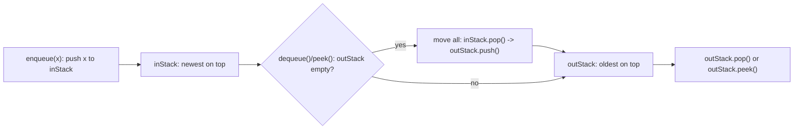

# Queue with Two Stacks

> **Practice mode.** This is a *challenge* topic: implement `TwoStackQueue` in
> `Solution.java`, press **Run tests**, and a hidden harness checks FIFO behavior,
> `peek`, `size`, and empty-queue cases.

## The task

Implement a queue using only two stacks. A queue removes the oldest item first
FIFO, while a stack removes the newest item first LIFO. If that distinction feels
fuzzy, revisit [Stack and Queue: LIFO vs FIFO](topic:stack-and-queue-lifo-fifo).

Real-world analogy: imagine a post office with two trays. New letters go into the
incoming tray, but customers must receive letters in arrival order.

## Core idea

Keep two stacks:

- `inStack`: receives every `enqueue(value)` with `push(value)`.
- `outStack`: serves `dequeue()` and `peek()`.

When `outStack` is empty and someone asks for the front of the queue, move every
item from `inStack` to `outStack`. This reversal makes the oldest value land on
top of `outStack`.

Post office analogy: the incoming tray stacks new letters on top. When the service
tray is empty, the clerk flips the whole pile into the service tray, so the oldest
letter is now on top for the next customer.



## Why the transfer must be lazy

Do not move elements on every `enqueue`. Only move when `outStack` is empty. If
`outStack` already has older values, they must be served before newer values that
just arrived in `inStack`.

Post office analogy: if customers are already being served from the service tray,
you do not mix fresh mail into the front. New letters wait in the incoming tray
until the current service tray is empty.

## Reference shape

The implementation usually looks like this:

```java
void enqueue(int value) {
    inStack.push(value);
}

int dequeue() {
    moveToOutStackIfNeeded();
    if (outStack.isEmpty()) {
        throw new NoSuchElementException("queue is empty");
    }
    return outStack.pop();
}

int peek() {
    moveToOutStackIfNeeded();
    if (outStack.isEmpty()) {
        throw new NoSuchElementException("queue is empty");
    }
    return outStack.peek();
}

void moveToOutStackIfNeeded() {
    if (outStack.isEmpty()) {
        while (!inStack.isEmpty()) {
            outStack.push(inStack.pop());
        }
    }
}
```

Use `ArrayDeque` as the stack container in modern Java. `java.util.Stack` exists,
but it is an older synchronized class; `Deque` gives clearer stack operations
without that legacy baggage.

Kitchen analogy: `ArrayDeque` is like a clean stack of plates on the counter.
`Stack` is like an old locked cabinet: it works, but most kitchens do not need
that extra mechanism for this job.

## Amortized cost

`enqueue` is always O(1): one `push` onto `inStack`.

One `dequeue` can be O(n) in the worst case: if `outStack` is empty, it may move
all elements from `inStack` to `outStack`. But across many operations each element
is moved at most once from `inStack` to `outStack`, then popped once from
`outStack`. That gives amortized O(1) for `dequeue` and `peek`.

Post office analogy: flipping a full incoming tray is a longer action, but each
letter is flipped only once before service. Spread over all letters, the extra
work per letter is constant.

This is the same style of reasoning used in amortized collection operations such
as occasional `ArrayList` resizing in [ArrayList Growth Internals](topic:arraylist-internals):
a rare expensive step can still average out to constant work per operation.

## Edge cases

- Empty `dequeue()` and empty `peek()` should fail clearly, for example with
  `NoSuchElementException`.
- `peek()` must not remove the value.
- `size()` is `inStack.size() + outStack.size()`.
- `isEmpty()` is true only when both stacks are empty.

Traffic analogy: the front car at a toll booth can be inspected without leaving
the lane. That is `peek()`. Removing it is `dequeue()`.

## Production relevance

You usually would not build this queue in application code because Java already
has `Queue` and `Deque`. The interview value is different: it tests whether you
can preserve FIFO using LIFO tools, state an invariant, and explain amortized
complexity without hand-waving.

Workshop analogy: you might not build your own mailbox for production, but making
one once proves you understand hinges, slots, and delivery order.

## 60-second interview answer

> Use two stacks: `inStack` for enqueue and `outStack` for dequeue. Enqueue pushes
> onto `inStack`. For dequeue or peek, if `outStack` is empty, move all elements
> from `inStack` to `outStack`; this reverses the order so the oldest element is
> on top. Then pop or peek from `outStack`. Enqueue is O(1). A single dequeue can
> be O(n), but each element is transferred at most once, so dequeue and peek are
> amortized O(1). Space is O(n).

## Common misconceptions

- "Move items on every enqueue." This can break FIFO when `outStack` still has
  older values. Like putting new post-office tickets ahead of people already in
  line.
- "Dequeue is always O(1)." A single call may transfer many items; the correct
  claim is amortized O(1).
- "Two stacks make it O(n) per operation." Not if transfer is lazy. Each item pays
  for only one trip between stacks.
- "Use `LinkedList` or `Queue` internally." That misses the constraint. The point
  is to build FIFO behavior from stack operations.
