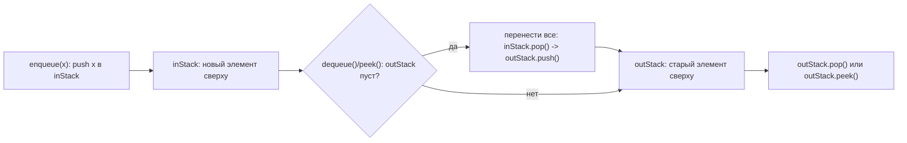

# Очередь на двух стеках

> **Режим практики.** Это *challenge*-тема: реализуй `TwoStackQueue` в
> `Solution.java`, нажми **«Запустить тесты»**, и скрытый harness проверит FIFO
> поведение, `peek`, `size` и случаи пустой очереди.

## Задача

Реализуй queue, используя только два stack. Queue удаляет самый старый элемент
первым, то есть FIFO, а stack удаляет самый новый элемент первым, то есть LIFO.
Если это отличие еще не стало привычным, вернись к теме
[Stack and Queue: LIFO vs FIFO](topic:stack-and-queue-lifo-fifo).

Бытовая аналогия: представь почтовое отделение с двумя лотками. Новые письма
кладут во входящий лоток, но клиенты должны получать письма в порядке прихода.

## Основная идея

Держим два stack:

- `inStack`: принимает каждый `enqueue(value)` через `push(value)`.
- `outStack`: обслуживает `dequeue()` и `peek()`.

Когда `outStack` пуст и кто-то просит первый элемент queue, перенеси все элементы
из `inStack` в `outStack`. Этот разворот кладет самое старое значение на вершину
`outStack`.

Почтовая аналогия: входящий лоток складывает новые письма сверху. Когда лоток
выдачи пуст, сотрудник переворачивает всю стопку в него, и самое старое письмо
оказывается сверху для следующего клиента.



## Почему перенос должен быть ленивым

Не переноси элементы при каждом `enqueue`. Перенос нужен только когда `outStack`
пуст. Если в `outStack` уже лежат более старые значения, они должны быть выданы
раньше новых значений, которые только что пришли в `inStack`.

Почтовая аналогия: если клиентов уже обслуживают из лотка выдачи, свежую почту
не подкладывают в начало. Новые письма ждут во входящем лотке, пока текущий
лоток выдачи не опустеет.

## Опорная форма решения

Обычно реализация выглядит так:

```java
void enqueue(int value) {
    inStack.push(value);
}

int dequeue() {
    moveToOutStackIfNeeded();
    if (outStack.isEmpty()) {
        throw new NoSuchElementException("queue is empty");
    }
    return outStack.pop();
}

int peek() {
    moveToOutStackIfNeeded();
    if (outStack.isEmpty()) {
        throw new NoSuchElementException("queue is empty");
    }
    return outStack.peek();
}

void moveToOutStackIfNeeded() {
    if (outStack.isEmpty()) {
        while (!inStack.isEmpty()) {
            outStack.push(inStack.pop());
        }
    }
}
```

В современном Java как stack-контейнер обычно используют `ArrayDeque`.
`java.util.Stack` существует, но это старый synchronized-класс; `Deque` дает
понятные stack-операции без этого исторического груза.

Кухонная аналогия: `ArrayDeque` похож на чистую стопку тарелок на столе.
`Stack` похож на старый шкафчик с замком: он работает, но для этой задачи
большинству кухонь не нужен лишний механизм.

## Амортизированная стоимость

`enqueue` всегда O(1): один `push` в `inStack`.

Один `dequeue` может быть O(n) в худшем случае: если `outStack` пуст, он может
перенести все элементы из `inStack` в `outStack`. Но на длинной серии операций
каждый элемент переносится из `inStack` в `outStack` не больше одного раза, а
потом один раз извлекается из `outStack`. Поэтому `dequeue` и `peek`
амортизированно O(1).

Почтовая аналогия: перевернуть полный входящий лоток дольше, но каждое письмо
переворачивают только один раз перед выдачей. Если распределить работу по всем
письмам, дополнительная работа на письмо остается постоянной.

Это такой же тип рассуждения, как в амортизированных операциях коллекций,
например при редком расширении `ArrayList` в
[ArrayList Growth Internals](topic:arraylist-internals): редкий дорогой шаг все
равно может давать в среднем постоянную работу на операцию.

## Граничные случаи

- Пустые `dequeue()` и `peek()` должны явно падать, например через
  `NoSuchElementException`.
- `peek()` не должен удалять значение.
- `size()` равен `inStack.size() + outStack.size()`.
- `isEmpty()` истинно только когда оба stack пусты.

Дорожная аналогия: первую машину у пункта оплаты можно посмотреть, не выпуская
из полосы. Это `peek()`. Выпустить ее вперед: это `dequeue()`.

## Зачем это в продакшене

Обычно такую queue не пишут в прикладном коде, потому что в Java уже есть
`Queue` и `Deque`. Ценность вопроса на собеседовании другая: он проверяет,
можешь ли ты сохранить FIFO, имея только LIFO-инструменты, назвать invariant и
объяснить амортизированную сложность без расплывчатых формулировок.

Мастерская аналогия: возможно, ты не будешь делать собственный почтовый ящик для
продакшена, но одна такая сборка показывает, что ты понимаешь петли, прорезь и
порядок доставки.

## Ответ на собеседовании за 60 секунд

> Используем два stack: `inStack` для enqueue и `outStack` для dequeue. Enqueue
> делает push в `inStack`. Для dequeue или peek, если `outStack` пуст, переносим
> все элементы из `inStack` в `outStack`; это разворачивает порядок, и самый
> старый элемент оказывается сверху. Затем делаем pop или peek из `outStack`.
> Enqueue работает за O(1). Один dequeue может быть O(n), но каждый элемент
> переносится не больше одного раза, поэтому dequeue и peek амортизированно O(1).
> Память: O(n).

## Частые заблуждения

- «Переносить элементы при каждом enqueue». Это может сломать FIFO, если в
  `outStack` еще лежат более старые значения. Как если бы в почтовом отделении
  новые талоны клали впереди людей, которые уже стоят в очереди.
- «Dequeue всегда O(1)». Один вызов может перенести много элементов; корректная
  формулировка: амортизированно O(1).
- «Два stack дают O(n) на каждую операцию». Нет, если перенос ленивый. Каждый
  элемент оплачивает только один переход между stack.
- «Использовать внутри `LinkedList` или `Queue`». Это нарушает ограничение.
  Смысл задачи: построить FIFO-поведение из stack-операций.
