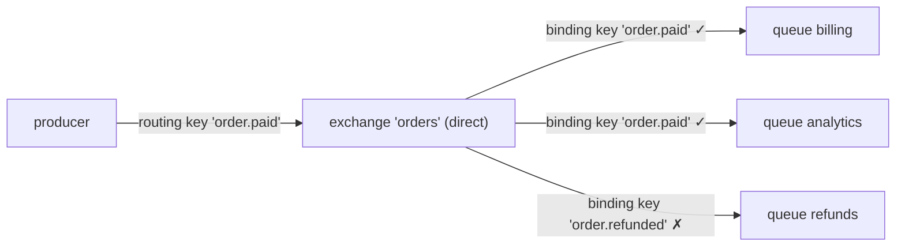
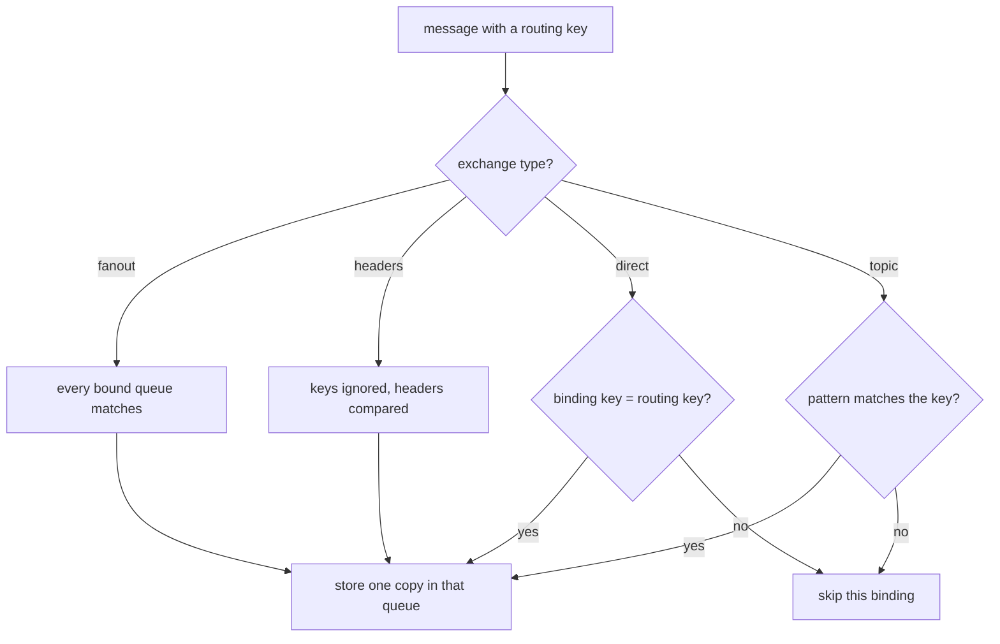
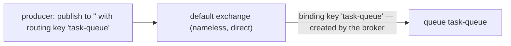

# Binding key vs routing key

Both are just strings. The difference is **what they are attached to, who sets
them, and when**.

- The **routing key** is a property of a **message**. The producer stamps it on
  every publish, at runtime, and names no queue at all.
- The **binding key** is a property of a **binding** — the link between an
  exchange and a queue. Whoever owns the queue declares it once, at setup time,
  and the producer never sees it.

They meet in exactly one place: inside the exchange, at publish time. The
exchange compares the routing key of the message against the binding key of each
binding, and every binding that matches puts one copy of the message into its
queue.

A useful way to hold it: the routing key is what the message **says about
itself** ("I am an order that was paid"); the binding key is what a queue
**subscribes to** ("send me anything about paid orders"). This is why a producer
can be deployed once and consumers can be added, moved or removed afterwards
without touching it — the whole point of the exchange sitting in the middle, as
[How Message Queues Like RabbitMQ Work](topic:rabbitmq-queues) covers in more
detail.

## The exchange type is the comparison rule

The keys mean nothing on their own. The *type of the exchange* decides how the
comparison is done:

| Exchange type | How the binding key is compared with the routing key |
| --- | --- |
| `direct` | exact string equality, character for character, case-sensitive |
| `topic` | the binding key is a pattern over dot-separated words: `*` = exactly one word, `#` = zero or more words |
| `fanout` | not compared at all — every bound queue gets a copy |
| `headers` | not compared at all — message headers are matched instead (`x-match: all` / `any`) |

So "which queue receives this message?" is never answered by one key — it is
answered by the pair *(exchange type, binding key)* versus the routing key.

## Wildcards live on the binding side only

`*` and `#` are meaningful **only inside a binding key**, and only on a `topic`
exchange. In a routing key they are ordinary characters.

Publishing with routing key `order.*` does not broadcast to every `order.…`
queue — the exchange looks for bindings that match the literal two-word key
`order` + `*`. Usually that is nothing at all, and the message is dropped.
Concrete on the message, patterns on the binding: never the other way round.

Also note that a routing key is a flat string; the dots have no meaning to a
`direct` exchange. `order.paid` there is one opaque token, not two words.

## The relation is many-to-many

- Several queues may be bound with the **same** binding key — each gets its own
  copy. That is how you add a new consumer to an existing event.
- One queue may have **several** bindings with different binding keys — it
  accepts messages of several kinds.
- If two bindings of the *same* queue both match one message, that queue still
  receives exactly **one** copy. Overlapping patterns like `order.#` and
  `#.created` never duplicate a message inside a queue.

Bindings can also connect an exchange to another exchange (exchange-to-exchange
binding); the matching rules are identical, only the destination differs.

## The default exchange: "publishing to a queue" is a lie

Every queue is automatically bound to the nameless default exchange (`""`, a
`direct` exchange) with a binding key equal to **its own name**. That is the
whole trick behind the tutorial line `channel.basicPublish("", "task-queue", …)`:

There is still an exchange, still a binding, and still a routing key — the
routing key just happens to equal the queue name. It is not a special
"publish straight to a queue" API, and a typo in the name silently sends the
message nowhere.

## What happens when nothing matches

The message is **unroutable**: RabbitMQ drops it and the `basic.publish` call
still looks successful, because publishing is fire-and-forget by default. You
only find out if you asked to:

- publish with the `mandatory` flag and handle the `basic.return` callback;
- give the exchange an **alternate-exchange** so unroutable messages land in a
  catch-all queue;
- watch the broker's `messages_unroutable` metric.

This is the single most common "the consumer never got my message" incident, and
the cause is nearly always a mismatch between a key someone typed on the producer
and a key someone else typed in the binding.

## 60-second interview answer

> Both are strings, but they belong to different objects. The routing key belongs
> to the message: the producer sets it on every publish and doesn't know any
> queue. The binding key belongs to the binding between an exchange and a queue:
> the consumer side sets it once when it declares its topology. The exchange
> compares them at publish time, and its type is the comparison rule — `direct`
> means they must be equal, `topic` treats the binding key as a `*`/`#` pattern,
> `fanout` ignores both, `headers` matches headers instead. Wildcards are only
> legal in a binding key; in a routing key they're literal characters. Several
> queues can share one binding key and one queue can have several, but a queue
> never gets two copies of the same message. And if no binding matches, the
> message is unroutable and is dropped silently unless you publish it as
> `mandatory` or configure an alternate exchange.

## Why it matters in production

- **Deploy order.** Bindings are consumer-side configuration. A new service can
  bind itself to an existing event stream without redeploying the producer, and
  that only works if producers publish descriptive routing keys rather than
  targeting queues.
- **Routing key design.** Make it a hierarchy from general to specific —
  `order.eu.paid`, `log.payments.error` — so future consumers can bind patterns
  like `order.eu.#` you did not anticipate. A key like `queue3` cannot be
  subscribed to usefully by anyone.
- **Debugging.** "The message never arrived" splits into three checks: did the
  producer publish the routing key you think, does a binding key match it under
  this exchange type, and is the queue actually bound to *this* exchange.
- **Contrast with Kafka.** There is no exchange and no binding key there:
  a producer writes to a topic and consumers subscribe to that topic, so the
  routing decision moves out of the broker — see
  [Kafka vs RabbitMQ](topic:kafka-vs-rabbitmq). The trade-off between letting the
  broker route and letting the receiver decide is the same one discussed in
  [Types of Interaction Between Microservices](topic:microservice-interaction-types).

## Common traps

- **"The routing key names the queue."** It never does. It matches binding keys;
  the queue name only enters the picture on the default exchange, where the
  broker made the binding key equal to it.
- **"I'll publish with `#` to reach everybody."** Wildcards in a routing key are
  literal characters. To reach everybody, bind a queue with `#` or use a fanout
  exchange.
- **"An unroutable message is an error."** It is silently discarded, and the
  publisher gets no exception. Publisher confirms tell you the *broker* got the
  message, not that any queue did.
- **"`direct` understands the dots."** Only `topic` splits the key into words.
  On a `direct` exchange, `order.paid` is one opaque string.
- **"Two matching bindings mean two copies in the queue."** They mean one copy in
  that queue. Two copies happen when two *different* queues match.
- **"Changing the binding key affects messages already in the queue."** Routing
  happens once, at publish time. Re-binding only changes where future messages
  go; whatever is already in a queue stays there.
- **"Fanout ignores the routing key, so I can leave it empty forever."** True
  today, but the key still travels with the message; if the topology later moves
  to a topic exchange, an empty or meaningless routing key leaves you with
  nothing to bind patterns to.
