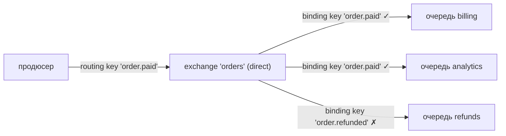
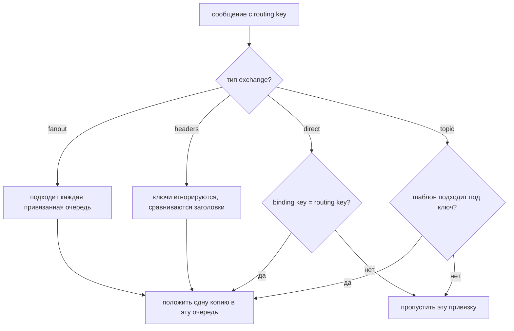
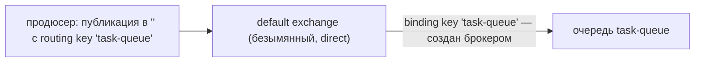

# Binding key против routing key

Оба — просто строки. Разница в том, **к чему они прикреплены, кто их задаёт и
когда**.

- **routing key** — свойство **сообщения**. Продюсер ставит его на каждую
  публикацию, во время работы, и не называет никакой очереди.
- **binding key** — свойство **привязки** (binding), то есть связи между
  exchange и очередью. Тот, кто владеет очередью, объявляет его один раз при
  настройке топологии, и продюсер его никогда не видит.

Встречаются они ровно в одном месте: внутри exchange, в момент публикации.
Exchange сравнивает routing key сообщения с binding key каждой привязки, и
каждая совпавшая привязка кладёт одну копию сообщения в свою очередь.

Удобная формулировка: routing key — это то, что сообщение **говорит о себе**
(«я — заказ, который оплатили»); binding key — это то, на что **подписалась
очередь** («присылайте мне всё про оплаченные заказы»). Именно поэтому продюсер
можно выкатить один раз, а потребителей потом добавлять, переносить и удалять,
не трогая его, — ради этого exchange и стоит посередине, о чём подробнее в теме
[Как работают очереди вроде RabbitMQ](topic:rabbitmq-queues).

## Тип exchange и есть правило сравнения

Сами по себе ключи не значат ничего. Как именно их сравнивать, решает *тип
exchange*:

| Тип exchange | Как binding key сравнивается с routing key |
| --- | --- |
| `direct` | точное равенство строк, символ в символ, с учётом регистра |
| `topic` | binding key — шаблон по словам через точку: `*` — ровно одно слово, `#` — ноль или больше слов |
| `fanout` | не сравниваются вообще — копию получает каждая привязанная очередь |
| `headers` | не сравниваются вообще — вместо них сопоставляются заголовки сообщения (`x-match: all` / `any`) |

Так что вопрос «в какую очередь попадёт это сообщение?» никогда не решается
одним ключом — его решает пара *(тип exchange, binding key)* против routing key.

## Шаблоны живут только на стороне привязки

`*` и `#` что-то значат **только внутри binding key** и только на `topic`
exchange. В routing key это обычные символы.

Публикация с routing key `order.*` не разошлёт сообщение по всем очередям
`order.…` — exchange будет искать привязки, подходящие под буквальный ключ из
двух слов: `order` и `*`. Обычно таких нет вообще, и сообщение выбрасывается.
Конкретика — на сообщении, шаблоны — на привязке, и никогда наоборот.

Ещё важно, что routing key — плоская строка: для `direct` exchange точки ничего
не значат. Там `order.paid` — один непрозрачный токен, а не два слова.

## Связь «многие ко многим»

- Несколько очередей могут быть привязаны с **одним и тем же** binding key —
  каждая получит свою копию. Так добавляют нового потребителя к существующему
  событию.
- У одной очереди может быть **несколько** привязок с разными binding key — она
  принимает сообщения нескольких видов.
- Если две привязки *одной и той же* очереди совпали с одним сообщением, очередь
  всё равно получит ровно **одну** копию. Пересекающиеся шаблоны вроде `order.#`
  и `#.created` никогда не дублируют сообщение внутри очереди.

Привязка может соединять и exchange с другим exchange (exchange-to-exchange
binding); правила сопоставления те же самые, отличается только назначение.

## Default exchange: «публикация в очередь» — это иллюзия

Каждая очередь автоматически привязана к безымянному default exchange (`""`,
тип `direct`) с binding key, равным **её собственному имени**. В этом и весь
фокус строчки из туториалов `channel.basicPublish("", "task-queue", …)`:

Exchange всё равно есть, привязка всё равно есть, и routing key всё равно есть —
просто routing key совпадает с именем очереди. Это не особый API «публикация
прямо в очередь», и опечатка в имени молча отправит сообщение в никуда.

## Что происходит, когда не совпало ничего

Сообщение становится **недоставляемым** (unroutable): RabbitMQ его выбрасывает,
а вызов `basic.publish` при этом выглядит успешным, потому что по умолчанию
публикация — это «отправил и забыл». Узнать об этом можно, только если попросить:

- публиковать с флагом `mandatory` и обрабатывать callback `basic.return`;
- задать exchange **alternate-exchange**, чтобы недоставляемые сообщения падали
  в очередь-накопитель;
- следить за метрикой брокера `messages_unroutable`.

Это самый частый инцидент в духе «потребитель не получил моё сообщение», и
причина почти всегда одна: ключ, который набрал один человек на продюсере, не
совпал с ключом, который другой человек набрал в привязке.

## Ответ на собеседовании за 60 секунд

> Оба — строки, но принадлежат разным объектам. Routing key принадлежит
> сообщению: продюсер задаёт его на каждой публикации и не знает ни одной
> очереди. Binding key принадлежит привязке между exchange и очередью: сторона
> потребителя задаёт его один раз, когда объявляет топологию. Exchange
> сравнивает их в момент публикации, и правилом сравнения служит его тип:
> `direct` требует равенства, `topic` считает binding key шаблоном с `*` и `#`,
> `fanout` игнорирует оба, `headers` вместо них сопоставляет заголовки. Шаблоны
> допустимы только в binding key; в routing key это буквальные символы.
> Несколько очередей могут делить один binding key, а у одной очереди их может
> быть несколько, но двух копий одного сообщения очередь не получит. А если не
> совпала ни одна привязка, сообщение недоставляемо и молча выбрасывается — если
> только не публиковать его с `mandatory` или не настроить alternate exchange.

## Почему это важно в проде

- **Порядок выкатки.** Привязки — это конфигурация со стороны потребителя. Новый
  сервис может подписаться на существующий поток событий, не переливая продюсер,
  но работает это только тогда, когда продюсеры публикуют описательные routing
  key, а не целятся в конкретные очереди.
- **Дизайн routing key.** Делайте иерархию от общего к частному —
  `order.eu.paid`, `log.payments.error`, — чтобы будущие потребители могли
  привязаться по шаблону вроде `order.eu.#`, о котором вы не задумывались. На
  ключ `queue3` осмысленно подписаться уже никто не сможет.
- **Отладка.** «Сообщение не дошло» распадается на три проверки: тот ли routing
  key реально опубликовал продюсер, совпадает ли с ним хоть один binding key при
  таком типе exchange и привязана ли очередь именно к *этому* exchange.
- **Сравнение с Kafka.** Там нет ни exchange, ни binding key: продюсер пишет в
  топик, а потребители подписываются на топик, поэтому решение о маршрутизации
  уезжает из брокера — см. [Kafka против RabbitMQ](topic:kafka-vs-rabbitmq).
  Тот же компромисс между «маршрутизирует брокер» и «решает получатель» разобран
  в теме [Типы взаимодействия между микросервисами](topic:microservice-interaction-types).

## Частые заблуждения

- **«Routing key называет очередь».** Никогда. Он сопоставляется с binding key;
  имя очереди появляется в этой картине только на default exchange, где брокер
  сам сделал binding key равным ему.
- **«Опубликую с `#` и достану всех».** Шаблоны в routing key — буквальные
  символы. Чтобы достать всех, привяжите очередь с `#` или используйте fanout
  exchange.
- **«Недоставляемое сообщение — это ошибка».** Оно молча выбрасывается, и
  публикующая сторона не получает исключения. Publisher confirms говорят, что
  сообщение получил *брокер*, а не что его получила хоть одна очередь.
- **«`direct` понимает точки».** Разбивает ключ на слова только `topic`. Для
  `direct` exchange `order.paid` — одна непрозрачная строка.
- **«Две совпавшие привязки — две копии в очереди».** Это одна копия в этой
  очереди. Две копии получаются, когда совпали две *разные* очереди.
- **«Смена binding key повлияет на сообщения, которые уже лежат в очереди».**
  Маршрутизация происходит один раз, в момент публикации. Перепривязка меняет
  только маршрут будущих сообщений; то, что уже в очереди, там и останется.
- **«Fanout игнорирует routing key, значит его можно навсегда оставить пустым».**
  Сегодня — да, но ключ всё равно едет вместе с сообщением; если топология потом
  переедет на topic exchange, с пустым или бессмысленным routing key привязывать
  шаблоны будет не к чему.
