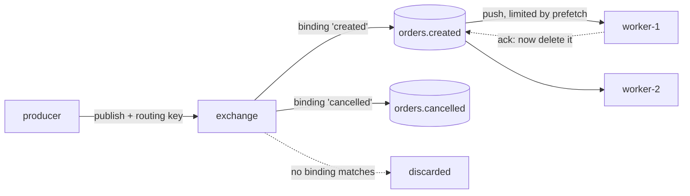
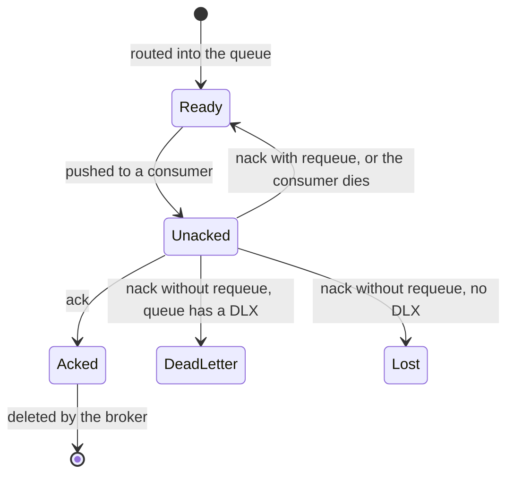
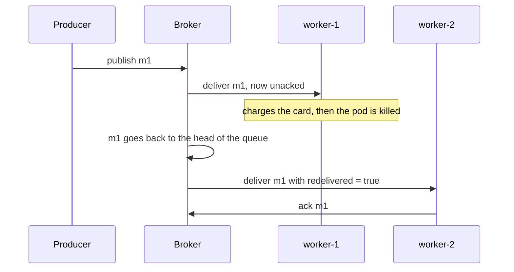

# How Message Queues Like RabbitMQ Work

> **Teaching model.** The runnable code uses `VisualBroker`, a learning model that
> reproduces the mechanics an interviewer asks about — exchange, binding, queue,
> push delivery, prefetch, ack, requeue, dead-letter — and emits trace events the
> panel on the right replays. The API is deliberately close to AMQP 0-9-1 (the
> protocol RabbitMQ speaks), but everything runs in one thread so you can step
> through the message flow. The *behaviour you reason about* is the real thing.

## The one-sentence model

A broker is **a router in front of a set of ordered buffers**. Producers hand
messages to the router (the **exchange**), routing rules (**bindings**) copy each
message into zero or more **queues**, and the broker **pushes** them to whichever
consumers are subscribed — deleting a message only when that consumer says
"done" (**ack**).

Everything interesting about RabbitMQ falls out of those two halves: *routing*
decides who gets a copy, and *acknowledgement* decides when it is safe to forget.

## The path of a message

Note what the producer does **not** do: it never names a queue and never knows a
consumer exists. It publishes to an exchange with a **routing key** and is done.
Adding a second consumer later — an audit log, a search indexer — is a change to
the *bindings*, not to the producer. That is the decoupling everybody means when
they say "we put a queue in between".

## Exchanges: who gets a copy

The exchange stores nothing. It is pure routing, and its **type** is the rule:

| Type | Rule | Typical use |
| --- | --- | --- |
| `direct` | binding key **equals** routing key | task queue, "one job → one worker pool" |
| `fanout` | every bound queue, routing key ignored | publish/subscribe, one event → many independent readers |
| `topic` | pattern match on dotted keys: `*` = one word, `#` = zero or more | content-based routing, e.g. `payment.#` |
| `headers` | match on message headers instead of the key | rare; when the key is not expressive enough |

Two consequences people miss:

- **Fanout gives each queue its own copy.** Two queues bound to a fanout exchange
  hold two separate messages that are acked independently. This is how one event
  feeds several services — the shape behind
  [event-carried state transfer](topic:event-carried-state-transfer).
- **An unroutable message is thrown away.** If no binding matches, `publish`
  still succeeds — the producer is not told anything by default. You opt into
  knowing with the `mandatory` flag plus a return listener, publisher confirms,
  or an alternate exchange. Silent loss here is a classic production surprise.

## The queue: an ordered buffer that decouples

The queue is the only thing that actually **stores** messages. It is
[FIFO](topic:stack-and-queue-lifo-fifo): messages are appended at the tail and
taken from the head. Two properties matter:

- **It absorbs bursts.** A producer publishing 10 000 jobs to an offline worker
  does not fail; the queue holds them and the producer returns immediately. That
  is the whole difference between
  [synchronous and asynchronous communication](topic:sync-vs-async-communication):
  the producer's latency stops depending on the consumer's speed.
- **Queue depth is your load signal.** A depth that keeps rising means consumers
  are permanently slower than producers, and no amount of buffering fixes that —
  you need more consumers or faster handlers. It is one of the first
  [metrics](topic:application-metrics) to alert on.

Memory is finite, so a queue is not an infinite buffer. Real deployments bound it
with a max length, a TTL, or `x-overflow` behaviour (drop the head, or reject the
publish), and a very deep queue in RabbitMQ hurts throughput as it starts paging
to disk.

## Push delivery, prefetch and competing consumers

RabbitMQ **pushes**: a consumer subscribes once, and the broker sends messages to
it as they arrive. (Contrast with [Kafka](topic:kafka-vs-rabbitmq), where the
consumer pulls by offset.) Two knobs control the pushing:

- **Competing consumers.** Several consumers on the *same* queue share its
  messages round-robin — each message goes to exactly **one** of them. This is
  how you scale a queue horizontally: start more workers.
- **Prefetch (`basic.qos`).** The maximum number of messages the broker will
  leave **unacknowledged** with one consumer. With `prefetch = 1` a worker gets a
  new message only after acking the previous one, so a slow worker cannot hoard
  work while a fast one idles — "fair dispatch". With unlimited prefetch the
  broker dumps the whole queue into one consumer's buffer, which wrecks both
  fairness and memory, and makes a crash redeliver a huge batch.

Prefetch is a throughput/latency trade-off, not a correctness one: `1` is the
fairest and slowest, a value in the tens or low hundreds is the usual production
setting.

## The ack is the contract

A delivered message is **not** deleted. It sits in an *unacked* state, still owned
by the broker, until the consumer answers:

So: **ack after the work is done, never before.** Auto-ack mode (`autoAck=true`)
acks at delivery time and converts the whole system to at-most-once — a crash
mid-handler loses the message for good. That is a legitimate choice for
throw-away telemetry and a bug everywhere else.

## Why delivery is at-least-once

The broker cannot tell "the consumer died before doing the work" from "the
consumer did the work and died before the ack reached me". Faced with that
ambiguity it retries, so the practical guarantee is **at-least-once** — and
duplicates are a normal event, not an incident.

The consequence is the one interviewers actually want: **your handler must be
idempotent**. Deduplicate on a stable message id with the
[Inbox pattern](topic:inbox-pattern), or design the operation to be naturally
[idempotent](topic:http-idempotency) so applying it twice equals applying it
once. On the producer side, publishing reliably as part of a database transaction
is the [Outbox pattern](topic:outbox-pattern). "Exactly-once delivery" does not
exist over an unreliable network; exactly-once *effect* does, and that is what
those patterns buy you.

## Dead-letter queues and poison messages

`nack(requeue = true)` puts the message straight back at the head — so a message
that always fails is redelivered immediately, fails again, and spins in a hot
loop burning CPU. That is a **poison message**.

The fix is a **dead-letter exchange/queue** (`x-dead-letter-exchange`): after
giving up, `nack(requeue = false)` parks the message in a separate queue where a
human or a retry job can look at it, instead of blocking the main queue. Messages
also get dead-lettered when they exceed a TTL or the queue's max length. A queue
with **no** dead-letter target simply destroys such messages — silent data loss.

For retries with backoff, the usual trick is a delay queue: dead-letter into a
queue with a TTL that dead-letters *back* into the working queue when it expires.

## What survives a broker restart

Durability needs **three** things together, and forgetting one is the classic
"we lost messages" post-mortem:

1. the **queue** declared `durable`;
2. the **message** published as persistent (`delivery_mode = 2`);
3. the producer waiting for a **publisher confirm** before considering it sent.

Even then, a single broker is a single point of failure — production setups use a
quorum queue (Raft-replicated across nodes) so a node loss does not lose the
queue. And persistence is not free: fsync-ing every message costs throughput.

## Ordering

A single queue with a single consumer delivers in FIFO order. Ordering breaks the
moment you add:

- **more consumers** — two workers process messages concurrently, so completion
  order is arbitrary;
- **requeues** — a nacked message goes back to the *head* and jumps in front of
  messages published after it;
- **prefetch > 1** with a multi-threaded handler.

If you need per-entity ordering, route each entity's messages to one queue
consumed by one consumer (the "consistent hashing" shape) — you cannot get it by
tuning prefetch.

## Interview answer (60 seconds)

> A producer never writes to a queue; it publishes to an exchange with a routing
> key. Bindings and the exchange type decide which queues get a copy — direct is
> an exact key match, fanout copies to every bound queue, topic matches patterns.
> A message that matches nothing is discarded. The queue is the ordered buffer
> that actually stores messages, which is what decouples producer speed from
> consumer speed. The broker pushes messages to subscribed consumers, round-robin
> between competing consumers on the same queue, bounded by each consumer's
> prefetch, and the message stays "unacked" until the consumer acks it — only then
> is it deleted. If the consumer dies first, the message is requeued and
> redelivered with `redelivered = true`, which is why the guarantee is
> at-least-once and handlers must be idempotent. Repeated failures go to a
> dead-letter queue instead of looping forever, and surviving a restart needs a
> durable queue plus persistent messages plus publisher confirms.

## Common misconceptions

- ❌ "The producer sends to a queue." — It publishes to an **exchange**. Bindings
  choose the queues; the producer names none of them.
- ❌ "If nobody is listening, publish fails." — With no matching binding the
  message is dropped and `publish` still returns fine. You need `mandatory` +
  returns, publisher confirms, or an alternate exchange to notice.
- ❌ "Delivered means processed." — Delivered means *unacked*. Until the ack the
  broker still owns it, and a crash puts it back in the queue.
- ❌ "Fanout means the consumers share the messages." — Each **queue** gets its own
  copy; consumers on the *same* queue share. Competing consumers vs pub/sub is
  about how many queues you bind, not how many consumers you start.
- ❌ "RabbitMQ can do exactly-once." — No broker can, over a network. You get
  at-least-once delivery plus an idempotent consumer, which is effectively-once
  processing.
- ❌ "Just retry with requeue until it works." — For a permanently bad message
  that is an infinite hot loop. Cap the attempts and dead-letter it.
- ❌ "Messages are safe because the queue is durable." — Durable queue *and*
  persistent messages *and* publisher confirms. Any one alone still loses data.
- ❌ "A queue keeps messages so consumers can re-read them." — A queue deletes on
  ack; there is no replay. Re-reading history is the
  [Kafka](topic:kafka-vs-rabbitmq) model, and that difference is usually the real
  reason to pick one over the other.
- ❌ "Bigger prefetch is always faster." — It improves throughput up to a point,
  then destroys fairness, inflates consumer memory, and makes each crash
  redeliver a big batch.
