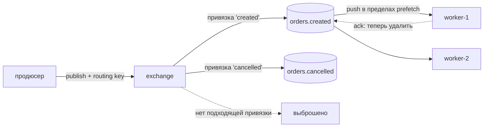
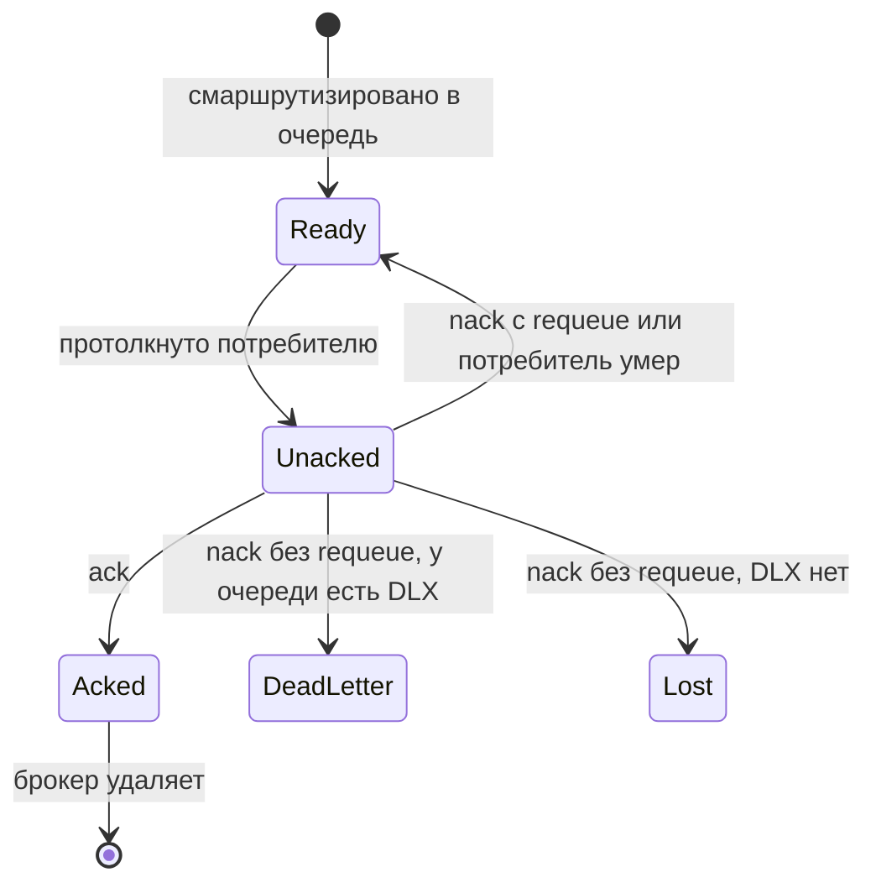
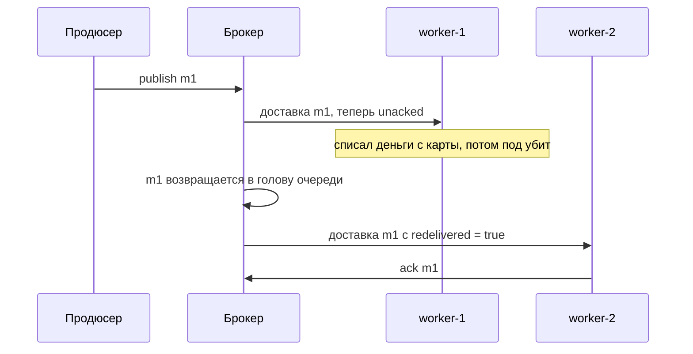

# Как работают очереди вроде RabbitMQ

> **Учебная модель.** Запускаемый код использует `VisualBroker` — учебную модель,
> которая воспроизводит ровно ту механику, о которой спрашивают на собеседовании:
> exchange, привязка, очередь, push-доставка, prefetch, ack, requeue,
> dead-letter — и отправляет трассировочные события, которые проигрывает панель
> справа. API намеренно близок к AMQP 0-9-1 (протокол, на котором говорит
> RabbitMQ), но всё выполняется в одном потоке, чтобы можно было пройти поток
> сообщений по шагам. *Поведение, о котором вы рассуждаете*, — настоящее.

## Модель в одном предложении

Брокер — это **маршрутизатор перед набором упорядоченных буферов**. Продюсеры
отдают сообщения маршрутизатору (**exchange**), правила маршрутизации
(**привязки**) копируют каждое сообщение в ноль или больше **очередей**, а брокер
**проталкивает** их подписанным потребителям — и удаляет сообщение только тогда,
когда потребитель скажет «готово» (**ack**).

Всё интересное в RabbitMQ вытекает из этих двух половин: *маршрутизация* решает,
кто получит копию, а *подтверждение* решает, когда сообщение можно забыть.

## Путь сообщения

Обратите внимание, чего продюсер **не** делает: он никогда не называет очередь и
не знает, что потребитель вообще существует. Он публикует в exchange с
**routing key** — и на этом всё. Добавить потом второго потребителя — журнал
аудита, поисковый индексатор — это изменение *привязок*, а не продюсера. Именно
эту развязку имеют в виду, когда говорят «мы поставили между ними очередь».

## Exchange: кто получит копию

Exchange ничего не хранит. Это чистая маршрутизация, и его **тип** — это правило:

| Тип | Правило | Типичное применение |
| --- | --- | --- |
| `direct` | ключ привязки **равен** routing key | очередь задач, «одна работа → один пул воркеров» |
| `fanout` | все привязанные очереди, routing key игнорируется | publish/subscribe, одно событие → много независимых читателей |
| `topic` | шаблон по ключу из слов через точку: `*` = одно слово, `#` = ноль или более | маршрутизация по содержимому, например `payment.#` |
| `headers` | сопоставление по заголовкам сообщения, а не по ключу | редко; когда ключа не хватает по выразительности |

Два следствия, которые часто упускают:

- **fanout даёт каждой очереди собственную копию.** Две очереди, привязанные к
  fanout exchange, хранят два отдельных сообщения, которые подтверждаются
  независимо. Так одно событие питает несколько сервисов — это форма
  [event-carried state transfer](topic:event-carried-state-transfer).
- **Недоставляемое сообщение выбрасывается.** Если ни одна привязка не подошла,
  `publish` всё равно завершается успешно — по умолчанию продюсеру ничего не
  сообщают. Узнать об этом можно, включив флаг `mandatory` вместе с return
  listener, publisher confirms или alternate exchange. Такая тихая потеря —
  классический сюрприз в проде.

## Очередь: упорядоченный буфер, который развязывает

Очередь — единственное, что действительно **хранит** сообщения. Она работает по
[FIFO](topic:stack-and-queue-lifo-fifo): сообщения добавляются в хвост и берутся
из головы. Важны два свойства:

- **Она поглощает всплески.** Продюсер, публикующий 10 000 задач при выключенном
  воркере, не падает; очередь их держит, а продюсер сразу возвращается. В этом и
  вся разница между
  [синхронным и асинхронным взаимодействием](topic:sync-vs-async-communication):
  задержка продюсера перестаёт зависеть от скорости потребителя.
- **Глубина очереди — ваш сигнал о нагрузке.** Постоянно растущая глубина
  означает, что потребители стабильно медленнее продюсеров, и никакой буфер это
  не исправит — нужны либо новые потребители, либо более быстрые обработчики.
  Это одна из первых [метрик](topic:application-metrics), на которую ставят алерт.

Память конечна, поэтому очередь — не бесконечный буфер. В реальных развёртываниях
её ограничивают максимальной длиной, TTL или поведением `x-overflow` (выбрасывать
голову либо отклонять публикацию), а очень глубокая очередь в RabbitMQ снижает
пропускную способность, когда начинает сбрасываться на диск.

## Push-доставка, prefetch и конкурирующие потребители

RabbitMQ **проталкивает** сообщения: потребитель подписывается один раз, и брокер
сам шлёт ему сообщения по мере поступления. (В отличие от
[Kafka](topic:kafka-vs-rabbitmq), где потребитель сам вычитывает по offset.)
Проталкиванием управляют две ручки:

- **Конкурирующие потребители.** Несколько потребителей на *одной* очереди делят
  её сообщения по кругу — каждое сообщение достаётся ровно **одному** из них. Так
  очередь масштабируется горизонтально: запускаете больше воркеров.
- **Prefetch (`basic.qos`).** Максимальное число сообщений, которые брокер
  оставит **неподтверждёнными** у одного потребителя. При `prefetch = 1` воркер
  получает новое сообщение только после подтверждения предыдущего, поэтому
  медленный воркер не может нахватать работу, пока быстрый простаивает, — это
  «честная раздача» (fair dispatch). При неограниченном prefetch брокер сваливает
  всю очередь в буфер одного потребителя, что ломает и честность, и память, а при
  падении вызывает повторную доставку огромной пачки.

Prefetch — это компромисс между пропускной способностью и задержкой, а не вопрос
корректности: `1` — самый честный и самый медленный вариант, в проде обычно
ставят значение в десятки или первые сотни.

## Ack — это контракт

Доставленное сообщение **не** удаляется. Оно находится в состоянии *unacked*, всё
ещё принадлежит брокеру, пока потребитель не ответит:

Отсюда правило: **ack после выполнения работы, никогда до неё.** Режим auto-ack
(`autoAck=true`) подтверждает в момент доставки и превращает всю систему в
at-most-once — падение посреди обработчика теряет сообщение навсегда. Это
допустимый выбор для одноразовой телеметрии и баг во всех остальных случаях.

## Почему доставка at-least-once

Брокер не может отличить «потребитель умер, не сделав работу» от «потребитель
сделал работу и умер до того, как ack дошёл до меня». В такой неоднозначности он
повторяет доставку, поэтому практическая гарантия — **at-least-once**, а дубликаты
— штатное событие, а не инцидент.

Отсюда следствие, которого и ждут на собеседовании: **ваш обработчик обязан быть
идемпотентным**. Дедуплицируйте по стабильному id сообщения через
[паттерн Inbox](topic:inbox-pattern) или проектируйте операцию естественно
[идемпотентной](topic:http-idempotency), чтобы применить её дважды означало то же,
что применить один раз. На стороне продюсера надёжная публикация вместе с
транзакцией базы — это [паттерн Outbox](topic:outbox-pattern). «Доставки
exactly-once» не существует поверх ненадёжной сети; существует exactly-once
*эффект*, и именно его дают эти паттерны.

## Dead-letter очереди и ядовитые сообщения

`nack(requeue = true)` возвращает сообщение прямо в голову очереди — поэтому
сообщение, которое падает всегда, будет тут же доставлено снова, снова упадёт и
закрутится в горячем цикле, сжигая CPU. Это **ядовитое сообщение** (poison
message).

Лечение — **dead-letter exchange/очередь** (`x-dead-letter-exchange`): сдавшись,
`nack(requeue = false)` отправляет сообщение в отдельную очередь, где на него
может посмотреть человек или задание повторов, вместо того чтобы блокировать
основную очередь. В dead-letter сообщения попадают ещё и когда истекает TTL или
превышена максимальная длина очереди. Очередь **без** dead-letter цели просто
уничтожает такие сообщения — тихая потеря данных.

Для повторов с задержкой обычно используют приём с delay-очередью: сделать
dead-letter в очередь с TTL, которая по истечении срока делает dead-letter
*обратно* в рабочую очередь.

## Что переживает перезапуск брокера

Долговечность требует **трёх** вещей одновременно, и забытая одна из них — это
классический разбор полётов «мы потеряли сообщения»:

1. **очередь** объявлена как `durable`;
2. **сообщение** опубликовано как persistent (`delivery_mode = 2`);
3. продюсер дождался **publisher confirm**, прежде чем считать его отправленным.

Но даже так один брокер — единая точка отказа: в проде используют quorum queue
(реплицируемую по Raft между узлами), чтобы потеря узла не унесла очередь. И
персистентность не бесплатна: fsync на каждое сообщение стоит пропускной
способности.

## Порядок сообщений

Одна очередь с одним потребителем доставляет в порядке FIFO. Порядок ломается,
как только появляется:

- **несколько потребителей** — два воркера обрабатывают сообщения параллельно,
  поэтому порядок завершения произвольный;
- **requeue** — отклонённое сообщение возвращается в *голову* и обгоняет
  сообщения, опубликованные позже него;
- **prefetch > 1** вместе с многопоточным обработчиком.

Если нужен порядок в рамках одной сущности, направляйте её сообщения в одну
очередь, читаемую одним потребителем (схема «consistent hashing») — настройкой
prefetch этого не добиться.

## Ответ на собеседовании (60 секунд)

> Продюсер никогда не пишет в очередь; он публикует в exchange с routing key.
> Привязки и тип exchange решают, какие очереди получат копию: direct — точное
> совпадение ключа, fanout — копия в каждую привязанную очередь, topic —
> совпадение по шаблону. Сообщение, не подошедшее ни под одну привязку,
> выбрасывается. Очередь — это упорядоченный буфер, который и хранит сообщения,
> благодаря чему скорость продюсера развязана со скоростью потребителя. Брокер
> проталкивает сообщения подписанным потребителям, по кругу между конкурирующими
> потребителями одной очереди, в пределах prefetch каждого, и сообщение остаётся
> «unacked», пока потребитель не отправит ack — только тогда оно удаляется. Если
> потребитель умер раньше, сообщение возвращается в очередь и доставляется снова с
> `redelivered = true`, поэтому гарантия — at-least-once, а обработчики обязаны
> быть идемпотентными. Постоянные ошибки уводят сообщение в dead-letter очередь
> вместо бесконечного цикла, а чтобы пережить перезапуск, нужны durable-очередь,
> persistent-сообщения и publisher confirms.

## Частые заблуждения

- ❌ «Продюсер отправляет в очередь». — Он публикует в **exchange**. Очереди
  выбирают привязки; продюсер не называет ни одной.
- ❌ «Если никто не слушает, publish упадёт». — Без подходящей привязки сообщение
  выбрасывается, а `publish` всё равно возвращается успешно. Чтобы заметить,
  нужны `mandatory` + returns, publisher confirms или alternate exchange.
- ❌ «Доставлено — значит обработано». — Доставлено значит *unacked*. До ack
  сообщение всё ещё принадлежит брокеру, и падение вернёт его в очередь.
- ❌ «fanout значит, что потребители делят сообщения». — Собственную копию получает
  каждая **очередь**; делят сообщения потребители на *одной* очереди.
  Конкурирующие потребители против pub/sub — это вопрос числа привязанных
  очередей, а не числа запущенных потребителей.
- ❌ «RabbitMQ умеет exactly-once». — Ни один брокер не умеет — поверх сети это
  невозможно. Вы получаете at-least-once доставку плюс идемпотентного
  потребителя, что даёт effectively-once обработку.
- ❌ «Просто повторяй с requeue, пока не получится». — Для навсегда испорченного
  сообщения это бесконечный горячий цикл. Ограничьте число попыток и отправьте
  его в dead-letter.
- ❌ «Сообщения в безопасности, потому что очередь durable». — Нужны durable-очередь
  *и* persistent-сообщения *и* publisher confirms. Что-то одно всё равно теряет
  данные.
- ❌ «Очередь хранит сообщения, чтобы потребители могли перечитать их». — Очередь
  удаляет по ack; повтора чтения нет. Перечитывание истории — это модель
  [Kafka](topic:kafka-vs-rabbitmq), и обычно именно эта разница и определяет
  выбор между ними.
- ❌ «Чем больше prefetch, тем быстрее». — До какого-то предела он повышает
  пропускную способность, а дальше рушит честность раздачи, раздувает память
  потребителя и превращает каждое падение в повторную доставку большой пачки.
