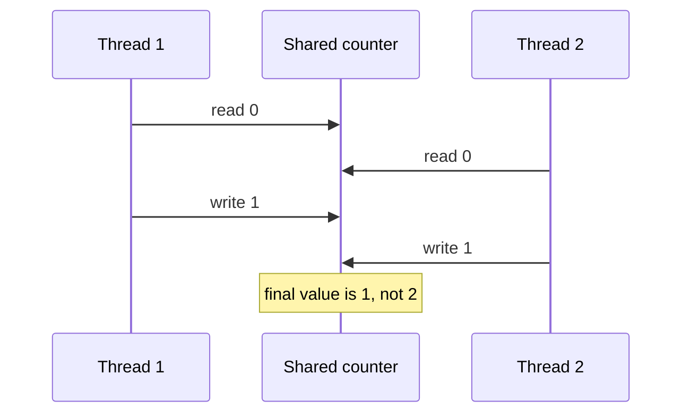
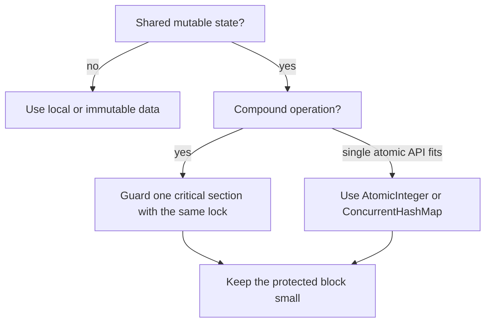
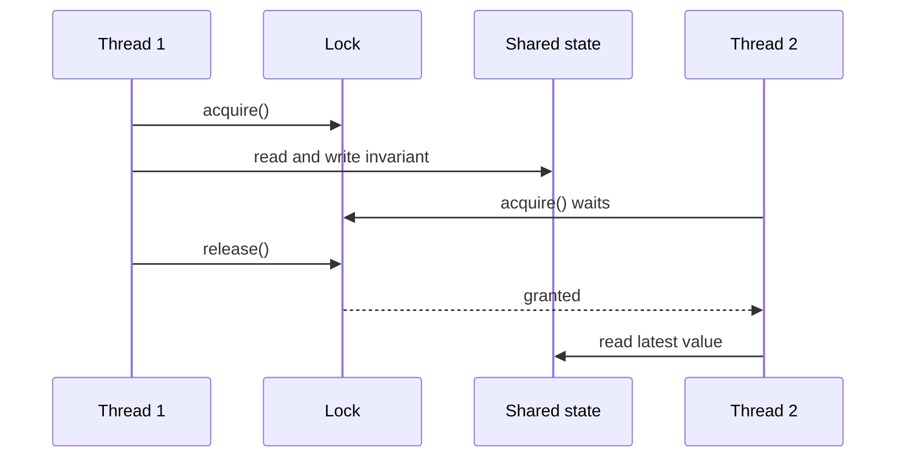

# Avoiding Race Conditions

A race condition happens when the result depends on the timing of two or more threads touching the same mutable state. In a busy kitchen, two cooks can both read the same order ticket before either marks it done; the mistake is not that two cooks exist, but that the shared ticket is updated without coordination.

For Java interviews, the important phrase is: shared mutable state plus a non-atomic operation. A statement such as `count++` looks like one action, but it is read, compute, write. It is like a post office counter where two clerks both look at the same stamp drawer count, both subtract one, and both write back the same new number.

## The Practical Checklist

First, avoid sharing mutable state. Prefer local variables, immutable objects, request-scoped data, or message passing. In a kitchen, each cook keeping a private prep bowl cannot overwrite another cook's bowl.

Second, if state must be shared, protect every compound operation with the same synchronization rule. Use `synchronized`, `ReentrantLock`, or another explicit lock around the [critical section](topic:critical-section). In traffic terms, one intersection needs one traffic light; two unrelated lights for the same crossing only create confusion.

Third, choose higher-level atomic tools when they match the operation. `AtomicInteger.incrementAndGet()`, `ConcurrentHashMap.putIfAbsent()`, queues, and other `java.util.concurrent` classes can remove hand-written locking for common cases. This is like using a numbered ticket machine at a post office instead of asking clerks to coordinate on paper; see [Concurrent vs Synchronized Collections](topic:concurrent-synchronized-collections).

Fourth, keep lock scope small and consistent. Protect the shared read-modify-write, not slow logging, network calls, or unrelated calculation. In a kitchen, hold the pantry key only while taking the ingredient, not while cooking the whole dish.

Fifth, design so ownership is clear. One thread, one actor, one executor task, or one database transaction should own a piece of mutable state at a time. This connects to basic [Java Multithreading](topic:java-multithreading) and to how work is scheduled in a [Thread Pool](topic:java-thread-pool). It is like assigning one clerk to a cash drawer for a shift instead of letting everyone dip into it.

## 60-Second Interview Answer

To avoid race conditions, first identify shared mutable state and non-atomic operations. The best fix is often to remove sharing: use immutable objects, local variables, thread confinement, or message passing. If the state really must be shared, make the whole invariant-changing operation atomic with the same lock, `synchronized`, `ReentrantLock`, or a higher-level concurrent abstraction. For counters and maps, prefer atomic classes or `java.util.concurrent` APIs when they express the operation directly. Also keep the critical section small, use a consistent lock for the same data, and do not assume `volatile` makes compound updates safe.

## What Must Be Protected

Protect the invariant, not just one line. If `balance`, `lastUpdatedAt`, and `version` must change together, they belong in the same protected operation. It is like updating a delivery label, shelf number, and receipt together; changing only one sticker leaves the package in a contradictory state.

Use the same lock for all access paths to that invariant. A lock protects only code that agrees to use it. In a post office, a locked cabinet helps only if every clerk stores the form in that cabinet, not in a second unlocked drawer.

When the operation is just a numeric update, the focused topic [Thread Safety of Numeric Addition](topic:thread-safe-addition) shows why the increment itself is a compound operation. The same pattern appears in counters, caches, lazy initialization, inventory reservation, and rate limiters.

## Production Relevance

Race conditions rarely fail on every run. They often appear under load, on faster machines, or after a harmless-looking refactor changes timing. It is like a restaurant that works during lunch rehearsal but loses orders on a packed Friday night.

They also hide behind tests that run with one thread or tiny data. Use stress tests, deterministic unit tests around invariants, code review for shared state, and production metrics for impossible states. A post office audit catches the drawer total after the shift; it does not rely on watching every clerk's hand movement.

## Common Misconceptions

`volatile` fixes visibility, not atomicity. It helps a thread see a fresh value, but it does not turn read-modify-write into one indivisible action. A clear glass pantry door lets cooks see the shelf, but it does not stop two cooks from grabbing the last item at the same time.

Thread-safe methods do not automatically make a multi-step workflow thread-safe. Calling `containsKey()` and then `put()` can still race unless the map offers an atomic method such as `putIfAbsent()`. It is like checking a mailbox and then walking away before placing your letter; someone else may use it in between.

Using different locks for the same data is the same as having no reliable lock. Every access path must follow the same rule. Two traffic officers giving signals at the same intersection are worse than one.

Sleeping, retrying, or making code "usually ordered" is not synchronization. Timing tricks only make the race harder to reproduce. Waiting five seconds before entering a kitchen does not create a reservation system for the stove.
