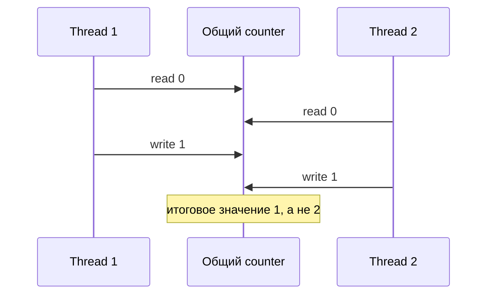
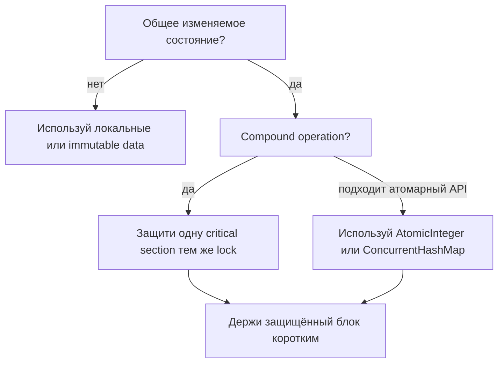
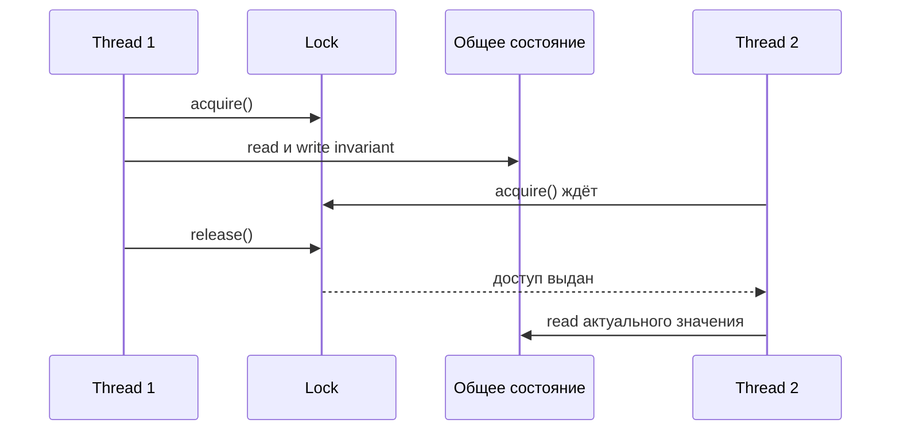

# Как избежать состояния гонки

Состояние гонки возникает, когда результат зависит от тайминга двух или более threads, которые трогают одно и то же изменяемое состояние. На загруженной кухне два повара могут оба прочитать один и тот же заказ до того, как кто-то отметит его выполненным; ошибка не в том, что поваров двое, а в том, что общий заказ обновляется без координации.

Для Java-интервью важная формула такая: общее изменяемое состояние плюс неатомарная операция. Выражение вроде `count++` выглядит как одно действие, но внутри это read, compute, write. Это похоже на почтовое отделение, где два сотрудника смотрят на одно и то же число марок в ящике, оба вычитают одну и оба записывают одно и то же новое число.

## Практический чеклист

Сначала избегай общего изменяемого состояния. Предпочитай локальные переменные, immutable objects, request-scoped data или message passing. На кухне личная миска заготовок у каждого повара не может перезаписать миску другого повара.

Во-вторых, если состояние должно быть общим, защищай каждую compound operation одним и тем же правилом синхронизации. Используй `synchronized`, `ReentrantLock` или другой явный lock вокруг [critical section](topic:critical-section). В терминах дорожного движения одному перекрёстку нужен один светофор; два несогласованных светофора на одном перекрёстке только создают путаницу.

В-третьих, выбирай высокоуровневые атомарные инструменты, когда они подходят к операции. `AtomicInteger.incrementAndGet()`, `ConcurrentHashMap.putIfAbsent()`, queues и другие классы `java.util.concurrent` часто убирают необходимость писать lock вручную. Это как автомат с номерками на почте вместо координации сотрудников на бумаге; смотри [Concurrent и synchronized коллекции](topic:concurrent-synchronized-collections).

В-четвёртых, держи область lock маленькой и последовательной. Защищай общий read-modify-write, а не медленное логирование, сетевые вызовы или несвязанные вычисления. На кухне ключ от кладовой держат только пока берут ингредиент, а не пока готовят всё блюдо.

В-пятых, проектируй код так, чтобы владение было ясным. Один thread, один actor, одна executor task или одна database transaction должны владеть частью изменяемого состояния в конкретный момент. Это связано с базовой темой [Java Multithreading](topic:java-multithreading) и с тем, как планируется работа в [Thread Pool](topic:java-thread-pool). Это как закрепить кассовый ящик за одним сотрудником на смену, а не позволять всем брать из него одновременно.

## Ответ на 60 секунд

Чтобы избежать race conditions, сначала найди общее изменяемое состояние и неатомарные операции. Лучшее исправление часто состоит в том, чтобы убрать совместное использование: применять immutable objects, локальные переменные, thread confinement или message passing. Если состояние действительно должно быть общим, сделай всю операцию, меняющую invariant, атомарной с помощью одного и того же lock, `synchronized`, `ReentrantLock` или более высокоуровневой concurrent abstraction. Для counters и maps предпочитай atomic classes или API из `java.util.concurrent`, когда они прямо выражают нужную операцию. Также держи critical section короткой, используй согласованный lock для одних и тех же данных и не считай, что `volatile` делает compound updates безопасными.

## Что нужно защищать

Защищай invariant, а не только одну строку. Если `balance`, `lastUpdatedAt` и `version` должны меняться вместе, они должны быть частью одной защищённой операции. Это как одновременно обновить наклейку доставки, номер полки и квитанцию; если поменять только одну наклейку, посылка окажется в противоречивом состоянии.

Используй один и тот же lock для всех путей доступа к этому invariant. Lock защищает только тот код, который договорился его использовать. На почте запертый шкаф помогает только если каждый сотрудник кладёт форму в этот шкаф, а не во второй незапертый ящик.

Когда операция является обычным числовым обновлением, отдельная тема [Потокобезопасность сложения чисел](topic:thread-safe-addition) показывает, почему сам increment является compound operation. Тот же шаблон встречается в counters, caches, lazy initialization, inventory reservation и rate limiters.

## Значение в production

Race conditions редко падают на каждом запуске. Они часто проявляются под нагрузкой, на более быстрых машинах или после безобидного рефакторинга, который меняет тайминг. Это как ресторан, который справляется на учебном обеде, но теряет заказы в загруженную пятницу вечером.

Они также прячутся за тестами, которые запускаются в один thread или на маленьких данных. Используй stress tests, deterministic unit tests вокруг invariants, code review для общего состояния и production metrics для невозможных состояний. Почтовая ревизия сверяет итог ящика после смены; она не пытается следить за каждым движением руки сотрудника.

## Частые заблуждения

`volatile` исправляет visibility, но не atomicity. Он помогает thread увидеть свежее значение, но не превращает read-modify-write в одно неделимое действие. Прозрачная дверь кладовой даёт поварам видеть полку, но не мешает двум поварам одновременно взять последний ингредиент.

Thread-safe методы не делают многошаговый workflow автоматически thread-safe. Вызовы `containsKey()` и затем `put()` всё ещё могут гоняться, если map не даёт атомарный метод вроде `putIfAbsent()`. Это как проверить почтовый ящик, отойти, а потом вернуться с письмом; за это время кто-то другой может его занять.

Разные locks для одних и тех же данных почти равны отсутствию надёжного lock. Каждый путь доступа должен соблюдать одно правило. Два регулировщика с разными сигналами на одном перекрёстке хуже, чем один.

`sleep`, retry или код, который «обычно выполняется в нужном порядке», не являются синхронизацией. Трюки с таймингом только делают race труднее воспроизвести. Подождать пять секунд перед входом на кухню не значит создать систему бронирования плиты.
