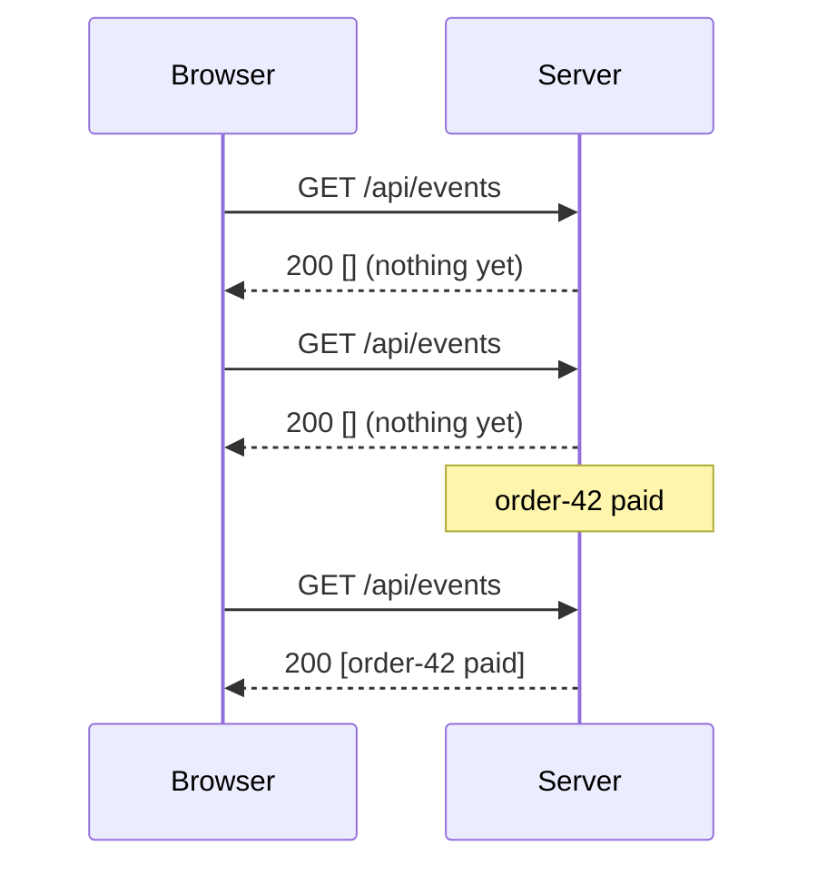
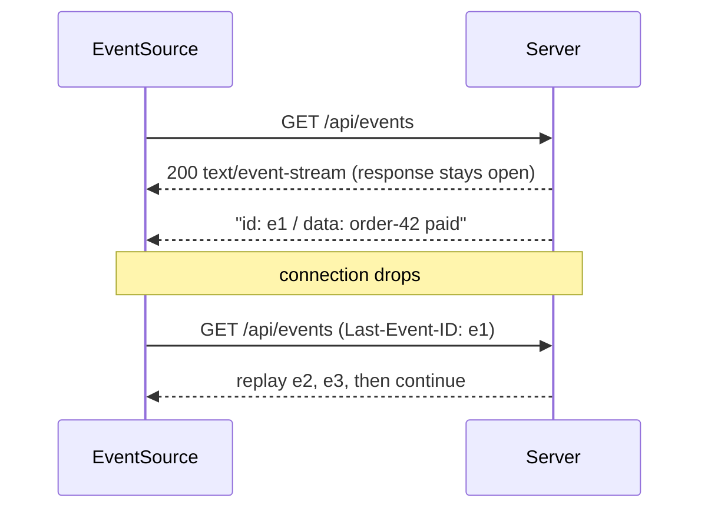
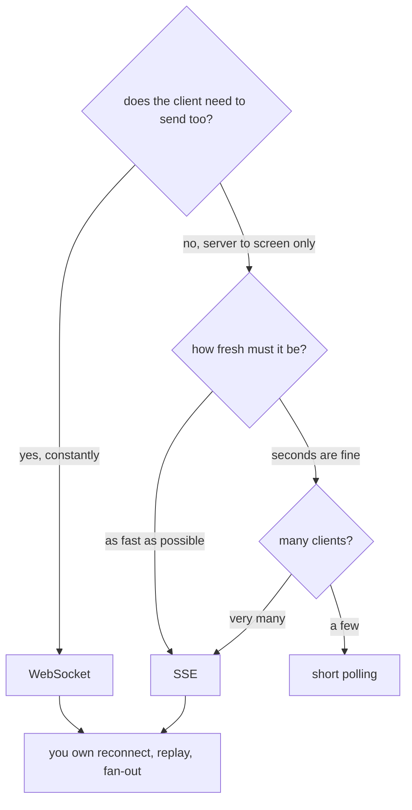

# Notifying a Browser in Real Time

## The problem, in one sentence

A browser tab is not a server. It has no address anyone can connect to, and in
HTTP the client opens the connection, sends a request, reads the response, and
the exchange is over. So when your backend learns something interesting — a
payment cleared, a message arrived, a report finished — **there is no wire to
send it down**. Everything below is a different way of manufacturing one.

That is worth saying out loud in an interview, because every technology here is
a workaround for the same missing capability, not four unrelated features. See
[how the frontend and the backend talk](topic:frontend-backend-interaction) for
the request/response model this is fighting against.

## The four answers

| | what it is | direction | cost when idle | delay |
|---|---|---|---|---|
| **Short polling** | `GET /events` on a timer | client asks | one round trip per interval | up to one interval |
| **Long polling** | `GET /events` the server *does not answer* until it has news | client asks | one parked request per client | ~zero |
| **SSE** | one `GET` whose response never ends | server → browser | one open connection | ~zero |
| **WebSocket** | one handshake upgraded to a two-way frame tunnel | both ways | one open connection | ~zero |

## Short polling: ask again

The client sets a timer and re-asks. Nothing is held open, so the server is
completely stateless between requests — which is exactly why this survives a
load balancer, a restart and a mobile network without a single line of extra
code.

The price is visible in that picture: two of the three round trips bought
nothing, and the event still waited. And the two knobs fight each other — halve
the interval and you double the requests; double it and you double the
worst-case delay. Note that each "empty" request is not free: TCP/TLS setup or
at least a stream, headers (often larger than the answer), authentication, a
handler, usually a database query, and a log line — multiplied by every open tab
you have. See [HTTP and its methods](topic:http-methods) for what actually
travels each time.

## Long polling: let the server wait instead

Identical protocol, opposite side does the waiting. The client sends the same
`GET`, and the server simply **does not respond** until either an event appears
or a hold timeout expires. Delivery becomes immediate over completely ordinary
HTTP — no upgrade, no new protocol, no proxy surprises.

Three things you must be able to say about it:

- **The hold has to expire on purpose** (typically 20–60 s), earlier than the
  browser, the proxy or the load balancer would kill a silent connection.
- **Every message ends the request**, so the client must immediately open a new
  one. Under chatty traffic long polling degrades back into one request per
  message — plus a small window between responses where nothing is listening.
- **It must not block a thread per client.** On a classic servlet thread pool,
  10 000 parked clients means 10 000 blocked threads; you need async servlets,
  `DeferredResult`/`SseEmitter`, or a reactive stack. See
  [Java thread pool](topic:java-thread-pool) for why parking a pool thread on a
  wait is the expensive part.

## Server-Sent Events: a response that never ends

One ordinary `GET` answered with `Content-Type: text/event-stream` and a body
the server keeps writing into, one `data:` block at a time. It is still HTTP:
your auth headers, gzip, HTTP/2 multiplexing, logging and tracing all keep
working, and there is no separate protocol to operate.

The two features people forget it has: the browser **reconnects by itself**, and
it sends `Last-Event-ID` so the server can replay exactly what was missed — the
gap heals with no application code, *provided your handler actually honours that
header*. The limits: text only (binary must be encoded), no way to send data
back up the same connection, and over HTTP/1.1 an EventSource occupies one of
the browser's ~6 connections per origin (a non-issue over HTTP/2).

## WebSocket: stop speaking HTTP

One `GET` with `Upgrade: websocket` answered with `101 Switching Protocols`, and
from that moment the connection is a bare two-way frame pipe. There is no
request, no response, no status code, no caching, no REST semantics. Either side
sends whenever it likes, and a chat line or a cursor position costs a few bytes
instead of a round trip.

That freedom is also the bill. A raw socket gives you **nothing** above the
frame: no message types, no acknowledgements, no retries, no replay. Drop the
connection and the frames written into it are simply gone — there is no
`Last-Event-ID` equivalent — so reconnect logic, resubscription and a state
re-fetch are code you write. That is why libraries like STOMP over SockJS,
Socket.IO or Phoenix Channels exist: they re-add the parts HTTP had given you
for free.

## Choosing

Reasonable defaults: **polling** for a dashboard that may be a few seconds stale
or a job whose status you check five times; **SSE** for notifications, live
prices, progress bars, streamed AI tokens — anything that flows one way;
**WebSocket** for chat, collaborative editing, games, trading — anything where
the client talks back constantly. **Long polling** is mostly a compatibility
answer today, for environments where a long-lived streaming response is not
survivable.

## What actually breaks in production

- **Fan-out across instances.** An open connection is *state*, and it lives in
  exactly one process. Deploy a second instance and an event handled by B cannot
  reach a client attached to A — no error, no log line, just a screen that stays
  wrong. Every push transport needs a shared bus underneath (Redis pub/sub,
  [Kafka or RabbitMQ](topic:kafka-vs-rabbitmq)) so any instance can reach any
  connection. Polling never had the problem: the news is in shared storage, so
  any instance can answer.
- **Everything in the middle.** Reverse proxies, [API
  gateways](topic:api-gateway), corporate proxies and load balancers have idle
  timeouts and buffers. Nginx needs `proxy_buffering off` for SSE; many
  gateways need an explicit WebSocket upgrade rule; a 60-second idle timeout
  silently kills a quiet stream. Heartbeats (an SSE comment line, a WebSocket
  ping) exist to keep the path warm — see [timeouts, fallbacks and circuit
  breakers](topic:service-timeouts-fallbacks).
- **Cross-origin.** `EventSource` is a normal HTTP request and obeys
  [CORS](topic:cors); a WebSocket does not — it has its own `Origin` check that
  the server must enforce itself.
- **Auth on a long-lived connection.** A token is validated once at connect
  time, and then the connection outlives it. Browsers cannot set headers on
  `EventSource` or `WebSocket`, so people pass tokens in the query string (where
  they land in access logs) or use cookies. You need a plan for expiry: a
  server-side deadline that closes the connection and lets the client reconnect
  with a fresh token. See [designing a security scheme for your
  endpoints](topic:endpoint-security-design).
- **Connection count.** Idle connections are cheap in memory but not free, and
  each one pins a file descriptor. Tens of thousands per node is normal on a
  non-blocking stack and impossible on thread-per-request.
- **Backpressure and bursts.** A slow client makes send buffers grow. Decide up
  front whether you drop, coalesce ("something changed, refetch") or disconnect.

## The 60-second interview answer

> HTTP only lets the client start a conversation, so a server that wants to tell
> a browser something has to be given a channel. Short polling asks on a timer:
> simple and stateless, but you pay a round trip per "nothing yet" and the delay
> is up to one interval. Long polling has the client ask once and the server hold
> the request until it has news — near-zero delay over plain HTTP, at the cost of
> a parked request per client and a re-open after every message. SSE is a single
> GET whose response never ends: the server writes events into it, the browser
> reconnects on its own and resumes with `Last-Event-ID`, and it is still
> ordinary HTTP — but it is one-way. A WebSocket upgrades one handshake into a
> two-way frame tunnel, which is what you want when the client also sends
> constantly, but it gives you nothing above the frame: reconnect, replay and
> ordering are yours. I pick by direction and message rate: polling if seconds of
> staleness are fine, SSE for server-to-screen streams, WebSocket for genuinely
> bidirectional work. And whichever I pick, I remember that an open connection is
> state — with more than one instance I need a shared bus to fan events out, and
> the client should treat a pushed message as a hint and re-fetch the truth.

## Common traps and misconceptions

- **"WebSocket is the modern one, so use it."** It is the most capable and the
  most work. For one-way notifications SSE gives you reconnect and replay for
  free, and stays inside HTTP.
- **"Polling is always wrong."** With few clients, a tolerant freshness
  requirement, or hostile network middleboxes, polling is the correct
  engineering decision — it has no connection state, no fan-out layer and no
  reconnect logic to get wrong.
- **"Long polling is just polling with a bigger interval."** The difference is
  *who waits*. Polling asks on a timer and is late; long polling asks once and
  is answered the instant something happens.
- **"SSE and WebSocket are both real-time, so they are equivalent."** SSE is
  one-directional and HTTP; WebSocket is bidirectional and not. That is the
  whole decision.
- **"HTTP/2 makes polling free."** It removes the connection setup and
  compresses headers, but the server still does the work and the database still
  gets queried on every empty poll.
- **"The push delivered it, so the UI is correct."** Networks drop, sockets
  reconnect, events arrive twice or out of order. Treat a message as a hint,
  key your state by id, and re-fetch after a reconnect — the same reasoning as
  the [Inbox pattern](topic:inbox-pattern) for redelivered messages.
- **"It worked on my machine with one instance."** It did. The fan-out problem
  appears on the second one, and it fails silently.
- **"A WebSocket keeps my session."** After 101 there are no cookies, no status
  codes and no per-request auth. Whatever you need on top of the frame, you
  design — the same trade-off as choosing between
  [synchronous and asynchronous communication](topic:sync-vs-async-communication)
  anywhere else.
