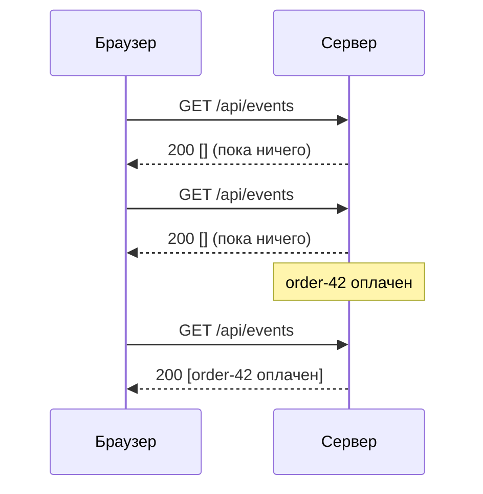
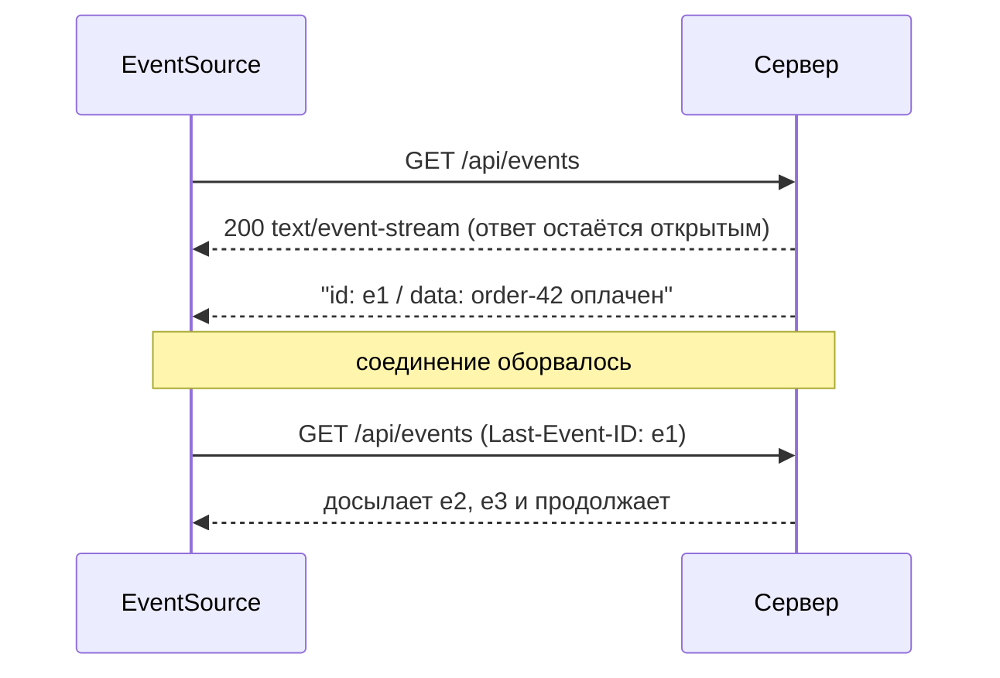
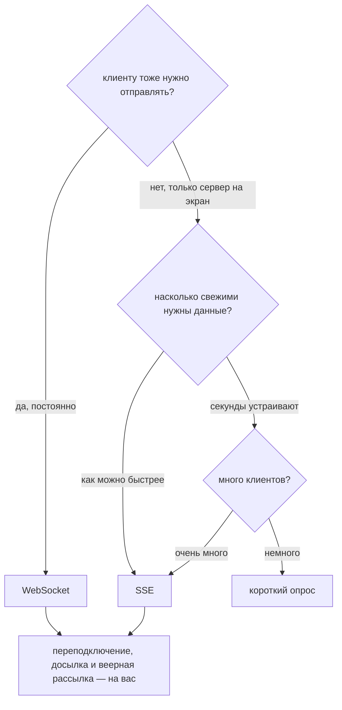

# Уведомление браузера в реальном времени

## Проблема в одном предложении

Вкладка браузера — не сервер. У неё нет адреса, к которому можно подключиться, а
в HTTP соединение открывает клиент: он отправляет запрос, читает ответ, и обмен
на этом закончен. Поэтому, когда бэкенд узнаёт что-то важное — прошёл платёж,
пришло сообщение, досчитался отчёт, — **отправить это просто некуда**. Всё, что
ниже, — разные способы такой «провод» изготовить.

Это стоит проговорить вслух на собеседовании, потому что каждая технология здесь
— обходной путь для одной и той же отсутствующей возможности, а не четыре
независимые фичи. Модель «запрос-ответ», с которой всё это борется, разобрана в
теме [как взаимодействуют фронтенд и бэкенд](topic:frontend-backend-interaction).

## Четыре ответа

| | что это | направление | цена в простое | задержка |
|---|---|---|---|---|
| **Короткий опрос** | `GET /events` по таймеру | спрашивает клиент | обмен за каждый интервал | до целого интервала |
| **Длинный опрос** | `GET /events`, на который сервер *не отвечает*, пока нет новостей | спрашивает клиент | один припаркованный запрос на клиента | ~ноль |
| **SSE** | один `GET`, ответ на который не заканчивается | сервер → браузер | одно открытое соединение | ~ноль |
| **WebSocket** | одно рукопожатие, повышенное до двустороннего туннеля кадров | в обе стороны | одно открытое соединение | ~ноль |

## Короткий опрос: спросить снова

Клиент заводит таймер и переспрашивает. Ничего не удерживается открытым, поэтому
между запросами сервер полностью без состояния — именно поэтому такая схема без
единой лишней строки кода переживает балансировщик, перезапуск и мобильную сеть.

Цена видна прямо на картинке: два обмена из трёх не купили ничего, а событие всё
равно подождало. И две настройки тянут в разные стороны: уменьшишь интервал вдвое
— удвоишь число запросов; увеличишь вдвое — удвоишь худшую задержку. Учтите, что
«пустой» запрос не бесплатен: установка TCP/TLS или хотя бы поток, заголовки
(часто больше самого ответа), аутентификация, обработчик, обычно запрос в базу и
строка в логе — и всё это умножается на каждую открытую вкладку. Что именно
летит каждый раз, разобрано в теме [HTTP и его методы](topic:http-methods).

## Длинный опрос: пусть ждёт сервер

Протокол тот же, ждёт противоположная сторона. Клиент отправляет тот же `GET`, а
сервер попросту **не отвечает**, пока не появится событие или не истечёт время
удержания. Доставка становится мгновенной по совершенно обычному HTTP — без
апгрейда, без нового протокола, без сюрпризов от прокси.

Три вещи, которые нужно уметь про него сказать:

- **Удержание обязано истекать намеренно** (обычно 20–60 с) — раньше, чем
  молчащее соединение оборвёт браузер, прокси или балансировщик.
- **Каждое сообщение завершает запрос**, поэтому клиент должен тут же открыть
  новый. На плотном трафике длинный опрос вырождается обратно в запрос на
  сообщение — плюс небольшое окно между ответами, когда никто не слушает.
- **Он не должен блокировать поток на клиента.** На классическом пуле
  сервлет-потоков 10 000 припаркованных клиентов означают 10 000 заблокированных
  потоков; нужны асинхронные сервлеты, `DeferredResult`/`SseEmitter` или
  реактивный стек. Почему парковка потока пула на ожидании и есть самое дорогое,
  разобрано в теме [пул потоков в Java](topic:java-thread-pool).

## Server-Sent Events: ответ, который не заканчивается

Один обычный `GET`, на который отвечают `Content-Type: text/event-stream` и
телом, куда сервер продолжает писать блоки `data:` по мере событий. Это
по-прежнему HTTP: заголовки авторизации, gzip, мультиплексирование HTTP/2,
логирование и трассировка продолжают работать, и никакого отдельного протокола
эксплуатировать не нужно.

Две возможности, о которых забывают: браузер **переподключается сам** и
отправляет `Last-Event-ID`, чтобы сервер дослал ровно пропущенное, — дыра
затягивается без прикладного кода, *при условии что ваш обработчик действительно
учитывает этот заголовок*. Ограничения: только текст (двоичные данные надо
кодировать), нет способа отправить что-то обратно по тому же соединению, и по
HTTP/1.1 EventSource занимает одно из примерно шести соединений браузера на
origin (по HTTP/2 это уже не проблема).

## WebSocket: перестать говорить на HTTP

Один `GET` с `Upgrade: websocket`, ответ `101 Switching Protocols` — и с этого
момента соединение представляет собой голую двустороннюю трубу для кадров. Нет
ни запроса, ни ответа, ни кода состояния, ни кэширования, ни семантики REST.
Отправлять может любая сторона в любой момент, и строка чата или позиция курсора
стоят нескольких байт вместо полного обмена.

Эта свобода — она же и счёт. Голый сокет не даёт **ничего** поверх кадра: ни
типов сообщений, ни подтверждений, ни повторов, ни досылки. Оборвалось
соединение — записанные в него кадры просто исчезли, аналога `Last-Event-ID`
нет, — поэтому логика переподключения, переподписки и перезапроса состояния
пишется вами. Именно поэтому существуют STOMP поверх SockJS, Socket.IO и Phoenix
Channels: они возвращают то, что HTTP давал даром.

## Как выбирать

Разумные значения по умолчанию: **опрос** — для дашборда, который может отставать
на несколько секунд, или задачи, статус которой проверяют пять раз; **SSE** — для
уведомлений, живых котировок, прогресс-баров, потоковых токенов ИИ, то есть
всего, что течёт в одну сторону; **WebSocket** — для чата, совместного
редактирования, игр, торговли, то есть всего, где клиент постоянно отвечает.
**Длинный опрос** сегодня — в основном ответ ради совместимости, для сред, где
долгоживущий потоковый ответ не выживает.

## Что на самом деле ломается в проде

- **Веерная рассылка между экземплярами.** Открытое соединение — это
  *состояние*, и живёт оно ровно в одном процессе. Выкатите второй экземпляр — и
  событие, обработанное на B, не дойдёт до клиента, подключённого к A: ни ошибки,
  ни строки в логе, просто экран остался неверным. Любому push-транспорту нужна
  общая шина снизу (Redis pub/sub, [Kafka или RabbitMQ](topic:kafka-vs-rabbitmq)),
  чтобы любой экземпляр мог достучаться до любого соединения. У опроса такой
  проблемы не было: новость лежит в общем хранилище, и ответить может любой
  экземпляр.
- **Всё, что стоит посередине.** У обратных прокси, [API-шлюзов](topic:api-gateway),
  корпоративных прокси и балансировщиков есть таймауты простоя и буферы. Nginx
  требует `proxy_buffering off` для SSE; многим шлюзам нужно явное правило
  апгрейда до WebSocket; таймаут простоя в 60 секунд молча убивает тихий поток.
  Heartbeat (строка-комментарий в SSE, ping в WebSocket) существует именно для
  того, чтобы держать путь «тёплым», — см. [таймауты, фолбэки и
  circuit breaker](topic:service-timeouts-fallbacks).
- **Другой origin.** `EventSource` — обычный HTTP-запрос и подчиняется
  [CORS](topic:cors); WebSocket — нет: у него собственная проверка `Origin`,
  которую сервер обязан выполнять сам.
- **Аутентификация долгоживущего соединения.** Токен проверяется один раз при
  подключении, а дальше соединение его переживает. Браузер не даёт выставить
  заголовки для `EventSource` и `WebSocket`, поэтому токен передают в строке
  запроса (где он оседает в логах доступа) или в куках. Нужен план на истечение:
  серверный дедлайн, который закрывает соединение и позволяет клиенту
  переподключиться со свежим токеном. См. [проектирование схемы безопасности
  эндпоинтов](topic:endpoint-security-design).
- **Число соединений.** Простаивающие соединения дёшевы по памяти, но не
  бесплатны, и каждое занимает файловый дескриптор. Десятки тысяч на узел —
  норма на неблокирующем стеке и невозможны при модели «поток на запрос».
- **Обратное давление и всплески.** Медленный клиент раздувает буферы отправки.
  Решите заранее, что делаете: отбрасываете, схлопываете («что-то изменилось,
  перезапроси») или отключаете.

## Ответ на собеседовании за 60 секунд

> HTTP позволяет начать разговор только клиенту, поэтому серверу, который хочет
> что-то сообщить браузеру, нужно выдать канал. Короткий опрос спрашивает по
> таймеру: просто и без состояния, но вы платите обменом за каждое «пока ничего»,
> а задержка — до целого интервала. При длинном опросе клиент спрашивает один
> раз, а сервер придерживает запрос до появления новости — почти нулевая задержка
> по обычному HTTP ценой припаркованного запроса на клиента и переоткрытия после
> каждого сообщения. SSE — это один GET, ответ на который не заканчивается:
> сервер пишет в него события, браузер сам переподключается и продолжает с
> `Last-Event-ID`, и всё это остаётся обычным HTTP, — но он односторонний.
> WebSocket превращает одно рукопожатие в двусторонний туннель кадров, что нужно,
> когда клиент тоже постоянно отправляет, но поверх кадра он не даёт ничего:
> переподключение, досылка и порядок — ваши. Выбираю по направлению и частоте
> сообщений: опрос, если отставание в секунды устраивает; SSE — для потоков от
> сервера на экран; WebSocket — для действительно двустороннего взаимодействия. И
> что бы я ни выбрал, помню, что открытое соединение — это состояние: при более
> чем одном экземпляре нужна общая шина для рассылки, а клиент должен считать
> push-сообщение подсказкой и перезапрашивать истину.

## Ловушки и заблуждения

- **«WebSocket современнее, значит его и берём».** Он самый мощный и самый
  трудозатратный. Для односторонних уведомлений SSE даёт переподключение и
  досылку даром и остаётся внутри HTTP.
- **«Опрос — это всегда неправильно».** При небольшом числе клиентов, терпимом
  требовании к свежести или враждебных сетевых посредниках опрос — правильное
  инженерное решение: у него нет ни состояния соединений, ни слоя рассылки, ни
  логики переподключения, в которых можно ошибиться.
- **«Длинный опрос — это опрос с бо́льшим интервалом».** Разница в том, *кто
  ждёт*. Опрос спрашивает по таймеру и опаздывает; длинный опрос спрашивает один
  раз, и ему отвечают в момент события.
- **«SSE и WebSocket оба про реальное время, значит они равнозначны».** SSE
  односторонний и это HTTP; WebSocket двусторонний и это уже не HTTP. В этом всё
  решение и состоит.
- **«HTTP/2 делает опрос бесплатным».** Он убирает установку соединения и
  сжимает заголовки, но работу сервер всё равно делает, и база всё равно
  опрашивается при каждом пустом запросе.
- **«Push доставил, значит интерфейс верен».** Сети рвутся, сокеты
  переподключаются, события приходят дважды или не по порядку. Считайте
  сообщение подсказкой, ключуйте состояние по id и перезапрашивайте после
  переподключения — та же логика, что и в [паттерне Inbox](topic:inbox-pattern)
  для повторно доставленных сообщений.
- **«У меня на одном экземпляре работало».** Работало. Проблема веерной рассылки
  появляется на втором и проявляется молча.
- **«WebSocket сохраняет мою сессию».** После 101 нет ни кук, ни кодов
  состояния, ни авторизации на каждый запрос. Всё, что нужно поверх кадра,
  проектируете вы — тот же компромисс, что и при выборе между [синхронным и
  асинхронным взаимодействием](topic:sync-vs-async-communication) где угодно
  ещё.
