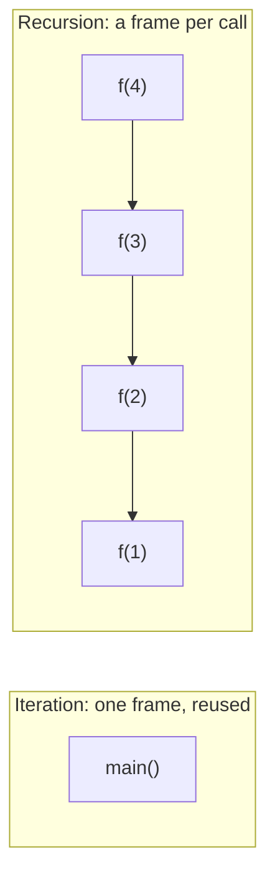
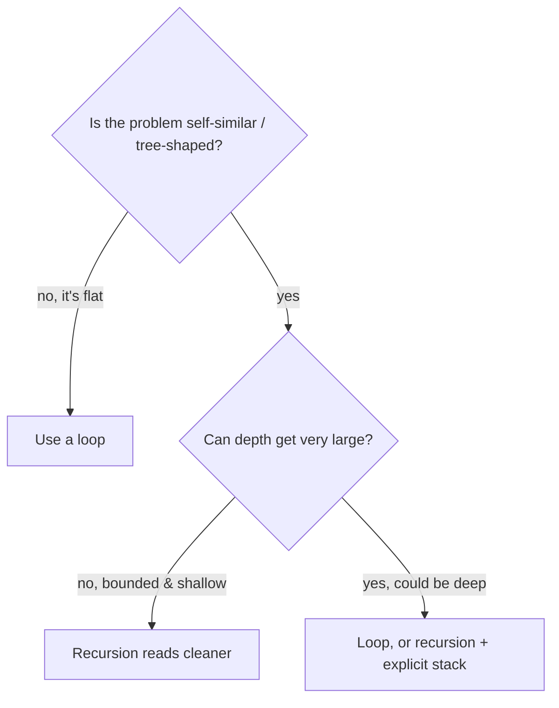

# Recursion vs Iteration

The honest answer is: **neither is universally "better"** — it is a trade-off, and
a strong candidate explains *when* each one wins instead of picking a favourite.

- **Iteration (a loop)** repeats work in the *same* place. Think of washing a tall
  stack of plates: one sink, one sponge, you reuse them for every plate. Nothing
  piles up.
- **Recursion** solves a problem by calling *itself* on a smaller piece. Think of a
  set of Russian nesting dolls (matryoshka): to open the biggest one you must open
  the next one inside, and the next, until the tiniest doll — then you close them
  back up in reverse.

## What actually differs: the stack

Every method call gets a **stack frame** — a tray that holds its parameters and
local variables. A loop runs inside **one** frame and reuses it on every pass.
Recursion stacks a **new** frame for every call and only unwinds them when the
calls return.

That single difference drives everything else. Picture a cafeteria stack of trays:
a loop takes one tray and keeps reusing it; recursion adds a tray for every call.
The tray dispenser has a fixed height, so if the recursion goes too deep the trays
hit the ceiling — that is a [StackOverflowError](topic:stackoverflow-error). See
[method calls and stack frames](topic:method-call-stack-frames) and where the
[stack lives versus the heap](topic:jvm-memory-areas) for the full picture; and
[how to overflow in fewer calls](topic:stack-overflow-fewer-calls) for how frame
size affects the limit.

## When a loop wins

- **Flat, sequential work** — summing an array, scanning a list, counting. There is
  no self-similar structure to exploit; a loop is the natural shape.
- **Performance and memory** — a loop has no per-call overhead and uses O(1) stack.
  It is like a postal worker sorting letters into one tray: fast, no setup per
  letter. Recursion pays for a new frame each call (depth = O(n) stack memory).
- **Unbounded depth** — anything that could recurse millions deep (walking a long
  linked list) must be a loop in Java, or it will overflow the stack.

## When recursion wins

- **Self-similar / tree-shaped problems** — traversing a file system, walking a
  tree or JSON, parsing nested brackets. The code mirrors the structure: "process
  this node, then recurse into each child." Forcing it into a loop usually means
  you rebuild the call stack by hand with an explicit `Deque`.
- **Divide and conquer** — quicksort, mergesort, binary-style splits. Naturally
  expressed as "solve two halves, combine." Like splitting a big mailing into two
  smaller piles, handing each to a helper, then merging the sorted results.
- **Clarity** — for the right problem, recursion reads like the definition itself
  (e.g. a tree's depth is `1 + max(depth of children)`).

## The Java-specific trap: no tail-call optimization

In some languages, a recursion whose recursive call is the **last** thing it does
(a *tail call*) is automatically turned into a loop by the compiler, so it uses no
extra stack. **Java does not do this.** Even a perfectly tail-recursive method in
Java keeps stacking frames and can still overflow. So in Java you cannot rely on
"it's tail-recursive, it's fine" — if depth is large, convert it to a loop.

## 60-second interview answer

> Neither is universally better — it depends on the problem. A loop runs in one
> stack frame, has no call overhead and never overflows, so it fits flat,
> sequential work and anything that could go very deep. Recursion is clearer for
> self-similar, tree-shaped problems — tree traversal, parsing, divide and conquer
> like quicksort — where the code mirrors the structure. The cost is a stack frame
> per call, so depth is O(n) memory. The key Java point: Java has **no tail-call
> optimization**, so even tail recursion keeps stacking frames and can throw
> `StackOverflowError`. Any recursion can be rewritten as a loop, sometimes with an
> explicit stack. I default to a loop for performance-critical or deep work, and
> reach for recursion when it makes a tree-shaped algorithm dramatically clearer.

## Common misconceptions

- ❌ "Recursion is always slower / always faster." — It usually has more overhead
  (a frame per call), but the gap is small and clarity can matter more. Measure
  before optimizing.
- ❌ "Tail recursion is free in Java." — No. Java has no TCO; tail-recursive methods
  still grow the stack and can overflow.
- ❌ "Recursion is more memory-efficient." — The opposite: it uses O(depth) stack,
  while the loop uses O(1). Deep recursion is the *expensive* one.
- ❌ "Some problems can only be solved with recursion." — Every recursion can be
  turned into iteration (with your own stack if needed). Recursion is a style
  choice, not a capability.
- ❌ "A loop is always uglier." — For a tree or parser, the hand-rolled stack loop is
  often the *uglier* one; pick the shape that matches the data.
- ⚠️ Recursion does not by itself make an algorithm slow — a bad algorithm does.
  See [why O(n²) is bad](topic:quadratic-complexity) and
  [streams vs loops performance](topic:streams-vs-loops-performance) for where the
  real cost usually hides.
