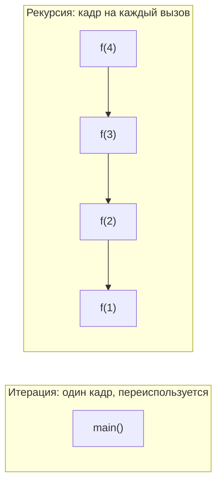
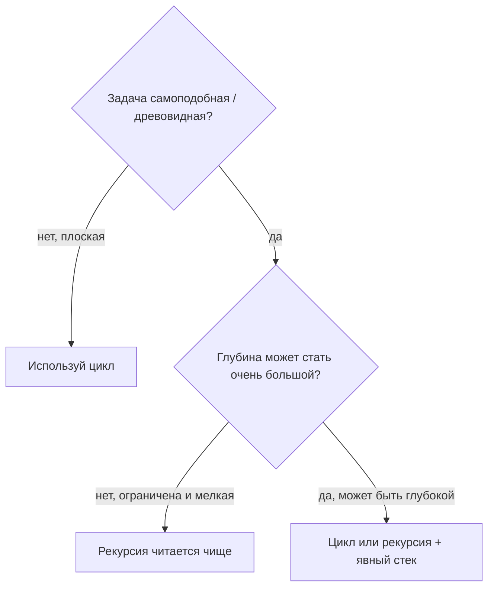

# Рекурсия против цикла

Честный ответ: **универсального «лучше» нет** — это компромисс, и сильный кандидат
объясняет, *когда* выигрывает каждый вариант, вместо того чтобы выбирать любимчика.

- **Итерация (цикл)** повторяет работу в *одном и том же* месте. Представьте, что
  моете высокую стопку тарелок: одна раковина, одна губка, вы переиспользуете их
  для каждой тарелки. Ничего не накапливается.
- **Рекурсия** решает задачу, вызывая *саму себя* на меньшем кусочке. Представьте
  набор матрёшек: чтобы открыть самую большую, нужно открыть следующую внутри, и
  следующую, до самой маленькой — а потом закрыть их обратно в обратном порядке.

## Что реально отличается: стек

Каждый вызов метода получает **кадр стека** — поднос, на котором лежат его
параметры и локальные переменные. Цикл работает внутри **одного** кадра и
переиспользует его на каждом проходе. Рекурсия кладёт **новый** кадр на каждый
вызов и снимает их только когда вызовы возвращаются.

Эта единственная разница тянет за собой всё остальное. Вообразите стопку подносов
в столовой: цикл берёт один поднос и переиспользует его; рекурсия добавляет поднос
на каждый вызов. У раздатчика подносов фиксированная высота, поэтому если рекурсия
уйдёт слишком глубоко, подносы упрутся в потолок — это
[StackOverflowError](topic:stackoverflow-error). См.
[вызовы методов и кадры стека](topic:method-call-stack-frames) и где
[живёт стек по сравнению с кучей](topic:jvm-memory-areas) для полной картины; а
[как переполнить стек за меньшее число вызовов](topic:stack-overflow-fewer-calls) —
о том, как размер кадра влияет на предел.

## Когда выигрывает цикл

- **Плоская, последовательная работа** — сумма массива, проход по списку, подсчёт.
  Здесь нет самоподобной структуры, которую можно использовать; цикл — естественная
  форма.
- **Производительность и память** — у цикла нет накладных расходов на вызов, и он
  использует O(1) стека. Это как почтальон, раскладывающий письма в один лоток:
  быстро, без настройки под каждое письмо. Рекурсия платит за новый кадр на каждый
  вызов (глубина = O(n) памяти стека).
- **Неограниченная глубина** — всё, что может уйти в рекурсию на миллионы уровней
  (проход по длинному связному списку), в Java обязано быть циклом, иначе стек
  переполнится.

## Когда выигрывает рекурсия

- **Самоподобные / древовидные задачи** — обход файловой системы, дерева или JSON,
  разбор вложенных скобок. Код повторяет структуру: «обработать этот узел, затем
  спуститься в каждого ребёнка». Загнать это в цикл обычно означает вручную
  воссоздавать стек вызовов через явный `Deque`.
- **Разделяй и властвуй** — quicksort, mergesort, бинарные разбиения. Естественно
  выражается как «реши две половины, объедини». Как разделить большую рассылку на
  две меньшие стопки, отдать каждую помощнику, а потом слить отсортированные
  результаты.
- **Ясность** — для подходящей задачи рекурсия читается как само определение
  (например, глубина дерева — это `1 + max(глубина детей)`).

## Ловушка именно Java: нет оптимизации хвостовых вызовов

В некоторых языках рекурсия, у которой рекурсивный вызов — **последнее**, что она
делает (*хвостовой вызов*), автоматически превращается компилятором в цикл и не
использует дополнительный стек. **Java так не делает.** Даже идеально
хвостово-рекурсивный метод в Java продолжает накапливать кадры и всё равно может
переполнить стек. Поэтому в Java нельзя полагаться на «он хвостово-рекурсивный,
значит всё хорошо» — если глубина большая, переписывайте в цикл.

## Ответ за 60 секунд

> Универсально лучше нет — зависит от задачи. Цикл работает в одном кадре стека, без
> накладных расходов на вызов и никогда не переполняется, поэтому подходит для
> плоской, последовательной работы и всего, что может уйти очень глубоко. Рекурсия
> яснее для самоподобных, древовидных задач — обход дерева, разбор, «разделяй и
> властвуй» вроде quicksort — где код повторяет структуру. Цена — кадр стека на
> каждый вызов, то есть глубина даёт O(n) памяти. Ключевой момент по Java: в Java
> **нет оптимизации хвостовых вызовов**, поэтому даже хвостовая рекурсия копит кадры
> и может бросить `StackOverflowError`. Любую рекурсию можно переписать циклом,
> иногда с явным стеком. По умолчанию я беру цикл для критичного по
> производительности или глубокого кода, а к рекурсии обращаюсь, когда она делает
> древовидный алгоритм заметно понятнее.

## Частые заблуждения

- ❌ «Рекурсия всегда медленнее / всегда быстрее.» — Обычно у неё больше накладных
  расходов (кадр на вызов), но разрыв невелик, и ясность может быть важнее. Сначала
  измерьте.
- ❌ «Хвостовая рекурсия в Java бесплатна.» — Нет. В Java нет TCO;
  хвостово-рекурсивные методы всё равно растят стек и могут переполнить его.
- ❌ «Рекурсия экономнее по памяти.» — Наоборот: она использует O(глубины) стека, а
  цикл — O(1). Глубокая рекурсия — это *дорогой* вариант.
- ❌ «Некоторые задачи решаются только рекурсией.» — Любую рекурсию можно превратить
  в итерацию (со своим стеком, если нужно). Рекурсия — выбор стиля, а не
  возможность.
- ❌ «Цикл всегда уродливее.» — Для дерева или парсера самодельный цикл со стеком
  часто как раз *уродливее*; выбирайте форму под данные.
- ⚠️ Рекурсия сама по себе не делает алгоритм медленным — это делает плохой
  алгоритм. См. [почему O(n²) — это плохо](topic:quadratic-complexity) и
  [производительность стримов и циклов](topic:streams-vs-loops-performance) о том,
  где обычно прячется настоящая цена.
