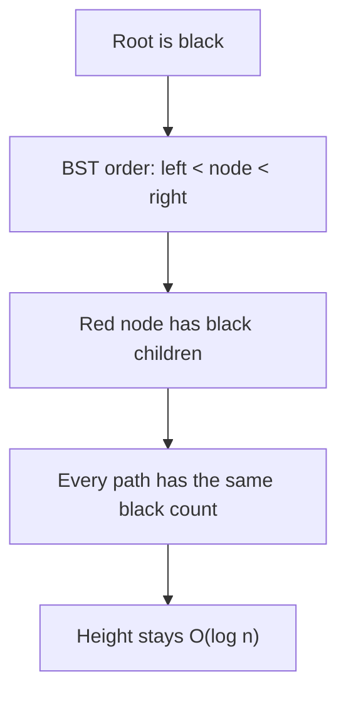
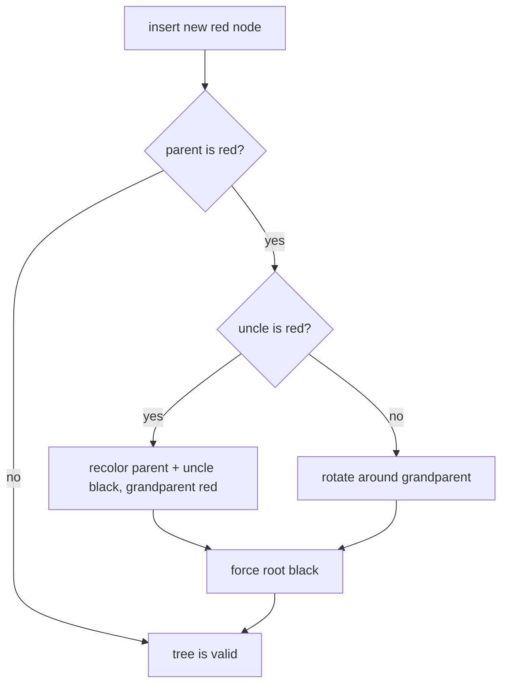

# Red-Black Tree

A red-black tree is a self-balancing binary search tree. Every node has a key,
left and right children, and one extra bit of information: red or black. Like a
post office line with colored priority cards, the color is not the customer data;
it is a rule marker that keeps the line from stretching too far in one direction.

In a plain binary search tree, inserting already sorted keys can create a long
chain. Then search becomes O(n), like checking every shelf in a kitchen one by
one because all labels ended up on the same side. A red-black tree keeps the
binary-search order, but after insert/delete it uses recoloring and rotations to
keep height proportional to O(log n).

## The Rules

- The root is black. Think of it as the main traffic light at an intersection:
  the whole system starts from a stable signal.
- Every missing child, often called a NIL leaf, is treated as black. It is like
  empty mailboxes still counting as fixed slots in the post office wall.
- A red node cannot have a red child. Two red lights in a row would let one road
  dominate traffic, so the tree breaks that run immediately.
- Every path from a node to a NIL leaf has the same number of black nodes. This
  is the balance rule: each route through the building passes the same number of
  locked doors, so no route becomes wildly longer than another.
- The tree is still a binary search tree: smaller keys go left, larger keys go
  right. Colors do not replace comparison; they only keep the shape healthy.

These rules do not make the tree perfectly balanced like a complete tree. They
make it balanced enough: the longest path is no more than about twice the
shortest black-balanced path, so operations stay logarithmic.

## Insert Repair

New nodes are inserted like in a normal binary search tree, usually as red. Red is
the least disruptive color, like putting a new delivery box on a temporary cart
before deciding whether the shelves need rearranging.

If the parent is black, nothing is broken. If the parent is red, the tree checks
the uncle. A red uncle means the local area has too many red markers, so parent
and uncle become black and the grandparent becomes red. That is like moving two
temporary queue tickets into confirmed counters, then letting the floor manager
above them re-check traffic.

If the uncle is black or missing, recoloring alone is not enough. The tree rotates
around the grandparent. A rotation is a small pointer change that preserves
in-order traversal, like sliding a kitchen shelf bracket: jars stay sorted left to
right, but the heavy side moves closer to the center.

## 60-Second Interview Answer

A red-black tree is a binary search tree with node colors and strict invariants:
the root is black, red nodes cannot have red children, and every path to a NIL
leaf has the same number of black nodes. Insert and delete may temporarily break
these rules, so the tree repairs itself with recoloring and left/right rotations.
The result is not perfect balance, but the height remains O(log n), which keeps
search, insert, and delete O(log n). In Java, this idea appears in `TreeMap` and
[TreeSet](topic:treeset), and also in [HashMap](topic:hashmap) buckets after
treeification.

## Production Relevance

Java's sorted collections use this idea when you need ordered keys rather than
only fast hash lookup. `TreeSet` is backed by `TreeMap`, so understanding this
tree explains why it can give nearest-neighbor and range operations in sorted
order. If ordering is defined by `compareTo()` or a `Comparator`, the comparison
rules matter just as much as the tree rules; review
[Comparator vs Comparable](topic:comparator-vs-comparable) when that part feels
unclear. It is like a warehouse that can only stay organized if every worker uses
the same label order.

Red-black trees also explain why very collision-heavy `HashMap` buckets can stop
being plain linked lists. Since Java 8, a long bucket can become a small
red-black tree so lookup in that bucket is closer to O(log n) than O(n). This is
not the normal path for a healthy [HashMap](topic:hashmap), but it is an important
fallback, like a post office opening a sorted side counter when one queue becomes
too long.

## Common Misconceptions

- "Red-black means perfectly balanced." No. It is deliberately weaker than
  perfect balance, which keeps repairs cheap.
- "Color affects key order." No. Order still comes only from comparison; color
  controls shape.
- "Rotation changes sorted order." No. A rotation changes parent/child links, but
  in-order traversal remains the same.
- "A red-black tree is always faster than HashMap." No. It gives ordered
  O(log n) operations; a good hash table usually gives average O(1) lookup.
- "The insert algorithm is the hard part, deletion is similar." Deletion has its
  own extra cases, often harder to explain cleanly in an interview.
- "TreeSet uniqueness uses equals()." `TreeSet` uniqueness follows comparison
  result `0`, which can surprise people coming from hash-based collections.

For interviews, focus on the invariants, why they bound height, and how recolor
vs rotation repairs a local violation. You do not need to memorize every deletion
case unless the role expects data-structure implementation depth.
