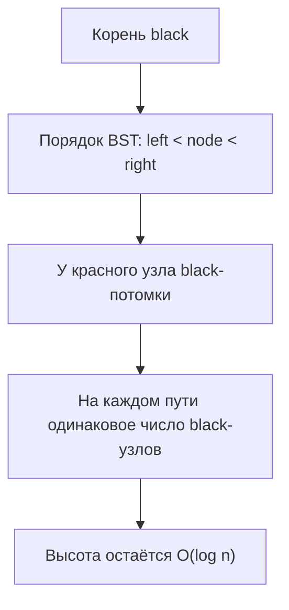
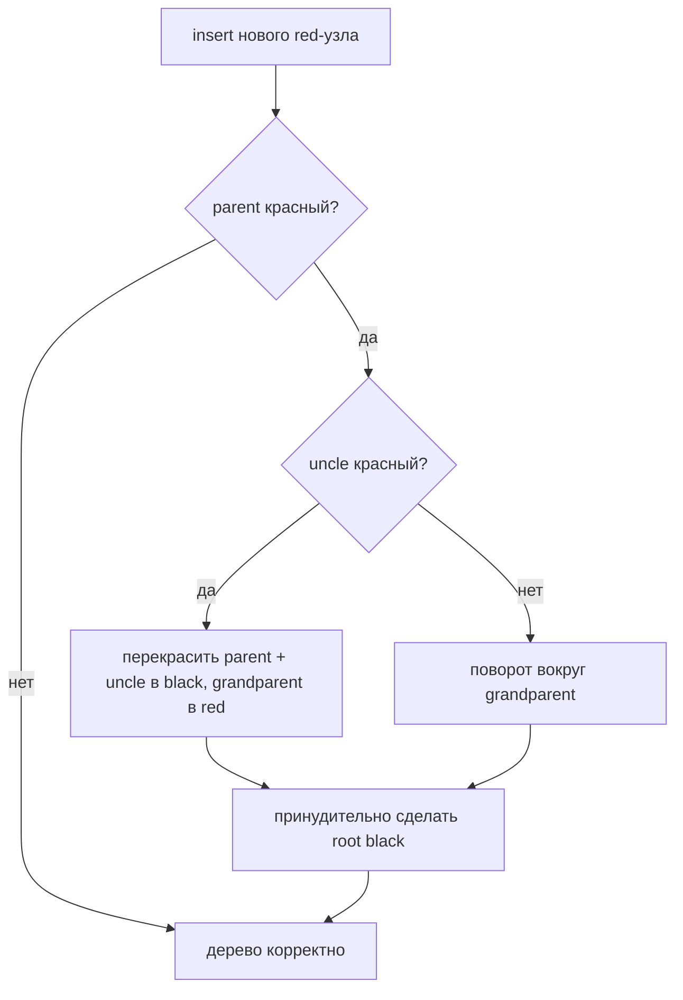

# Красно-чёрное дерево

Красно-чёрное дерево — это самобалансирующееся бинарное дерево поиска. У каждого
узла есть ключ, левый и правый потомки и один дополнительный бит информации:
красный или чёрный. Как в очереди на почте с цветными талонами приоритета, цвет
не является данными клиента; это служебная метка правил, которая не даёт очереди
растянуться слишком далеко в одну сторону.

В обычном бинарном дереве поиска вставка уже отсортированных ключей может
создать длинную цепочку. Тогда поиск становится O(n), как если бы на кухне
приходилось проверять каждую полку по очереди, потому что все ярлыки оказались
с одной стороны. Красно-чёрное дерево сохраняет порядок binary search tree, но
после insert/delete использует перекраску и повороты, чтобы высота оставалась
пропорциональной O(log n).

## Правила

- Корень чёрный. Представь главный светофор на перекрёстке: вся система
  начинается со стабильного сигнала.
- Каждый отсутствующий потомок, часто называемый NIL leaf, считается чёрным. Это
  похоже на пустые почтовые ящики, которые всё равно считаются фиксированными
  ячейками на стене почты.
- У красного узла не может быть красного потомка. Два красных сигнала подряд
  позволили бы одной дороге забрать слишком много движения, поэтому дерево сразу
  разрывает такую цепочку.
- На каждом пути от узла до NIL leaf одинаковое число чёрных узлов. Это правило
  баланса: каждый маршрут через здание проходит одинаковое число запертых дверей,
  поэтому один маршрут не становится намного длиннее другого.
- Дерево всё ещё остаётся binary search tree: меньшие ключи идут влево, большие
  вправо. Цвета не заменяют сравнение; они только поддерживают здоровую форму.

Эти правила не делают дерево идеально сбалансированным, как complete tree. Они
делают его достаточно сбалансированным: самый длинный путь не более чем примерно
в два раза длиннее самого короткого чёрно-сбалансированного пути, поэтому
операции остаются логарифмическими.

## Исправление вставки

Новые узлы вставляются как в обычное бинарное дерево поиска, обычно красными.
Красный — наименее разрушительный цвет, как новая коробка доставки на временной
тележке перед решением, нужно ли переставлять полки.

Если родитель чёрный, ничего не сломано. Если родитель красный, дерево проверяет
дядю. Красный дядя означает, что в локальной зоне слишком много красных меток,
поэтому родитель и дядя становятся чёрными, а дед становится красным. Это похоже
на перевод двух временных талонов очереди в подтверждённые окна, после чего
менеджер этажом выше снова проверяет поток.

Если дядя чёрный или отсутствует, одной перекраски недостаточно. Дерево делает
поворот вокруг деда. Поворот — это небольшое изменение ссылок, которое сохраняет
in-order traversal, как сдвиг кронштейна кухонной полки: банки остаются
отсортированными слева направо, но тяжёлая сторона перемещается ближе к центру.

## Ответ за 60 секунд

Красно-чёрное дерево — это бинарное дерево поиска с цветами узлов и строгими
инвариантами: корень чёрный, у красных узлов не бывает красных потомков, а на
каждом пути до NIL leaf одинаковое число чёрных узлов. Insert и delete могут
временно нарушить эти правила, поэтому дерево исправляет себя перекраской и
левыми/правыми поворотами. Баланс не идеальный, но высота остаётся O(log n), а
значит search, insert и delete остаются O(log n). В Java эта идея встречается в
`TreeMap` и [TreeSet](topic:treeset), а также в бакетах [HashMap](topic:hashmap)
после treeification.

## Практическая польза

Отсортированные коллекции Java используют эту идею, когда нужны упорядоченные
ключи, а не только быстрый hash lookup. `TreeSet` построен поверх `TreeMap`,
поэтому понимание этого дерева объясняет, почему он умеет искать соседние
значения и диапазоны в отсортированном порядке. Если порядок задан через
`compareTo()` или `Comparator`, правила сравнения так же важны, как правила
дерева; когда это неясно, посмотри
[Comparator vs Comparable](topic:comparator-vs-comparable). Это как склад,
который остаётся организованным только если все сотрудники используют один и тот
же порядок ярлыков.

Красно-чёрные деревья также объясняют, почему бакеты `HashMap` с большим числом
коллизий могут перестать быть обычными связными списками. Начиная с Java 8,
длинный бакет может стать маленьким красно-чёрным деревом, чтобы поиск внутри
бакета был ближе к O(log n), а не O(n). Для здорового [HashMap](topic:hashmap) это
не обычный путь, но важная страховка, как если бы почта открыла отсортированное
дополнительное окно, когда одна очередь стала слишком длинной.

## Частые заблуждения

- «Красно-чёрное» означает идеально сбалансированное. Нет. Баланс намеренно
  слабее идеального, чтобы исправления были дешёвыми.
- Цвет влияет на порядок ключей. Нет. Порядок задаётся только сравнением; цвет
  управляет формой.
- Поворот меняет отсортированный порядок. Нет. Поворот меняет связи
  parent/child, но in-order traversal остаётся тем же.
- Красно-чёрное дерево всегда быстрее HashMap. Нет. Оно даёт упорядоченные
  операции O(log n); хорошая hash table обычно даёт средний lookup O(1).
- Алгоритм insert сложный, а delete примерно такой же. У delete есть свои
  дополнительные случаи, которые часто сложнее аккуратно объяснить на
  собеседовании.
- Уникальность в TreeSet использует equals(). Уникальность `TreeSet` следует из
  результата сравнения `0`, что удивляет после hash-based collections.

На собеседовании держи фокус на инвариантах, на том, почему они ограничивают
высоту, и на том, как перекраска или поворот исправляет локальное нарушение. Не
нужно заучивать все случаи удаления, если роль не требует глубокой реализации
структур данных.
