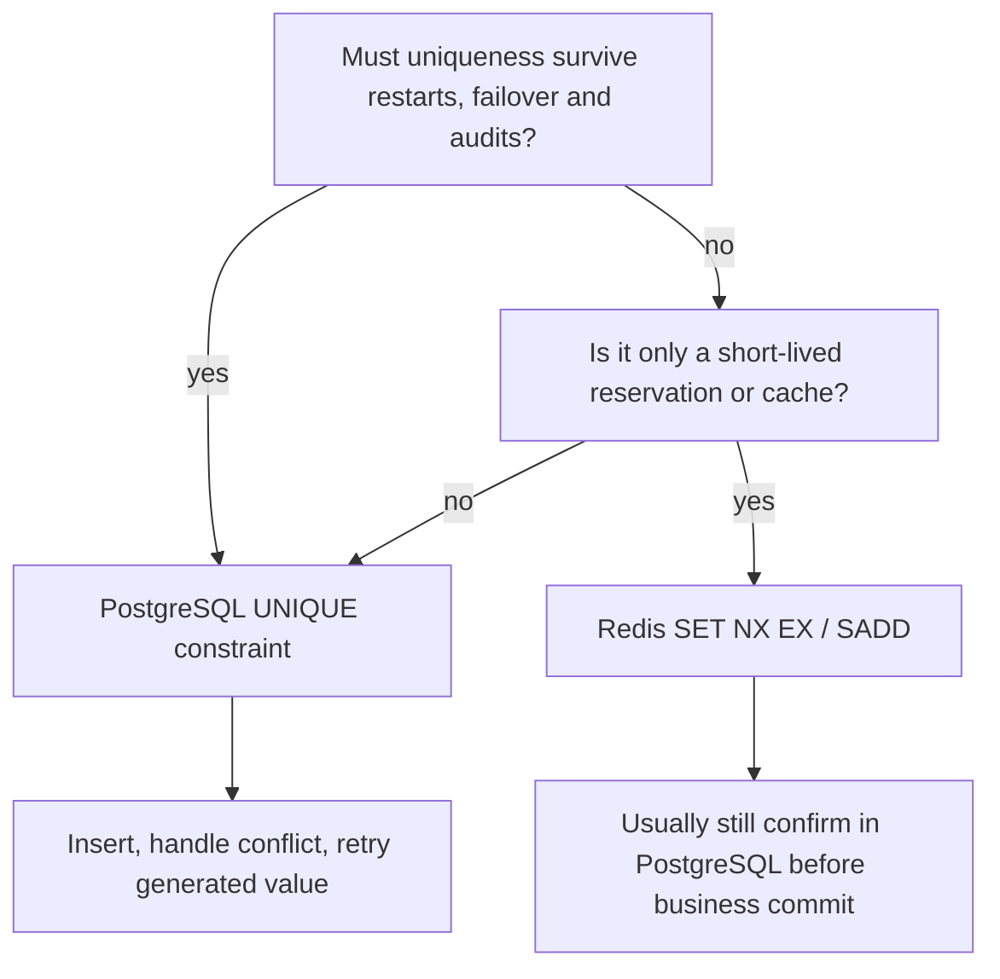
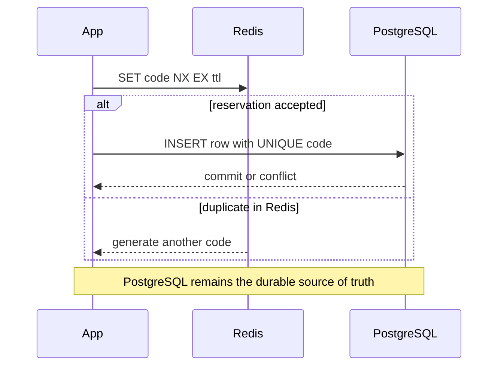

# Redis vs PostgreSQL for Unique Generated Values

The interview question is usually not "which one is faster?". It is "what is the
source of truth?". Redis is an in-memory coordination and cache tool. PostgreSQL
is a durable relational database with constraints and transactions. For generated
values such as coupon codes, invite tokens, public order numbers or short ids,
the right choice depends on whether uniqueness is a permanent business rule or a
temporary speed gate. Analogy: Redis is the fast note on the kitchen counter;
PostgreSQL is the official order book the restaurant audits at closing time.

## Rule of thumb

Use **PostgreSQL** when the value is part of durable business data: two users must
never receive the same coupon, order number or external id, even after restarts,
deployments, failover and concurrent requests. Put a `UNIQUE` constraint or
unique index on the column, insert the generated value, and retry on conflict.
This is the same idea as a post office clerk writing every parcel number into the
official ledger before handing out the receipt.

Use **Redis** when the value is temporary, high-volume and allowed to expire:
short-lived login tokens, rate-limit keys, idempotency windows, "already tried in
this batch" checks or a pre-reservation before a slower database write. Use one
atomic command such as `SET key value NX EX seconds` or `SADD` rather than a
separate read-then-write. Redis is like putting a colored clip on a kitchen
ticket so two cooks do not grab it at the same time; the clip helps today, but it
is not the archive.

Use **both** when you need speed and correctness. Redis can reject obvious
duplicates early or reserve a candidate for a short time, but PostgreSQL still
owns the final uniqueness guarantee through a constraint. The traffic analogy is
a fast toll gate plus the central vehicle registry: the gate keeps cars moving,
but the registry decides whether a plate is officially unique.

## Why PostgreSQL is the final authority

PostgreSQL enforces uniqueness inside the database, close to the data it protects.
A `UNIQUE` constraint is backed by an index, so concurrent inserts cannot both
commit the same value. This is a direct use of [Database Indexes](topic:database-indexes)
and the consistency part of [ACID](topic:acid-principles). Analogy: the official
ledger is on the clerk's desk, so two clerks cannot legally stamp the same parcel
number into the same book.

The safe pattern is "try to insert, then handle duplicate", not "select first,
then insert". A pre-check can race: two requests both see "free", then both try
to claim the same value. A unique constraint turns that race into one success and
one conflict. This behavior also relates to transaction visibility and
[PostgreSQL isolation levels](topic:postgresql-isolation-levels). Analogy:
looking at an empty parking spot from across the street does not reserve it;
putting the car into the spot does.

PostgreSQL is also better when the uniqueness rule is tied to other relational
facts: `tenant_id + code`, active subscriptions, foreign keys, audit history or a
business transaction that creates several rows together. The database can keep
those rules near the rows and roll them back together. Analogy: a kitchen order,
payment slip and delivery address belong in the same official folder, not on
three separate sticky notes.

## Where Redis fits

Redis is excellent for very fast, low-latency coordination when losing the key
after a TTL or failover is acceptable for the design. `SET key value NX EX 60`
means "create this key only if it does not exist, and expire it after 60 seconds".
That single command is atomic inside Redis. Analogy: a traffic light can hold a
lane for a minute, but it does not prove who owns the road.

Redis becomes risky as the only store for permanent uniqueness. It can be durable
when configured with AOF or snapshots, but durability, replication lag, failover
and eviction policy are now part of your correctness story. If a duplicate coupon
would cost money or break a contract, make PostgreSQL the authority. Analogy: a
whiteboard in the post office may be copied every evening, but the signed ledger
is still the record that settles disputes.

Redis is also not automatically transactionally connected to PostgreSQL. If Redis
reserves a code and PostgreSQL insert fails, you need a compensating delete or a
short TTL. If PostgreSQL commits but Redis update fails, the database must still
be trusted. Analogy: a waiter may put a "reserved" card on a table, but if the
booking system rejects the reservation, the card must disappear soon.

## Practical design for generated values

For a permanent generated value, generate a candidate, insert it into PostgreSQL
under a `UNIQUE` constraint, and retry on duplicate. With a sufficiently large
random space, duplicates should be rare, but the constraint is still mandatory.
Analogy: most parcel numbers will be new, but the clerk still checks the ledger
before issuing the receipt.

For a bursty system, Redis can reduce wasted database attempts: reserve the
candidate with `SET NX EX`, then insert into PostgreSQL, then either keep the
Redis key until its TTL or update it as a cache of known used values. This is an
optimization, not the guarantee. Analogy: the kitchen expediter can mark a ticket
as "in progress" so cooks do not duplicate work, but the paid order book decides
what actually exists.

For a purely temporary token, Redis alone may be enough: password reset token
used within 15 minutes, one-time login challenge, request deduplication window or
rate-limit key. The token's meaning expires with the Redis key. Analogy: a deli
queue ticket matters during lunch service; nobody audits it next month.

## 60-second interview answer

> I use PostgreSQL when uniqueness is a durable business invariant. I put a
> unique constraint or unique index on the column, insert the generated value,
> and handle conflict by generating another value. This is concurrency-safe and
> survives restarts because PostgreSQL is the source of truth. I use Redis when
> the check is temporary or performance-oriented: short-lived reservations,
> tokens, idempotency windows or fast pre-checks. Redis commands like `SET NX EX`
> are atomic and very fast, but Redis alone is not a substitute for a database
> constraint when duplicates would corrupt business data. In many systems I use
> Redis as a speed gate and PostgreSQL as the final authority.

## Production relevance

- Coupon codes and public ids need a PostgreSQL `UNIQUE` constraint because
  duplicates are business bugs. Analogy: two customers cannot leave the post
  office with the same official parcel number.
- Login challenges, reset links and rate-limit windows can often live in Redis
  because expiry is part of the requirement. Analogy: a kitchen timer is useful
  exactly because it rings and stops mattering.
- Multi-tenant uniqueness often belongs in PostgreSQL as a composite unique
  constraint, for example `(tenant_id, code)`. Analogy: two apartment buildings
  may both have flat 12, but inside one building the flat number must be unique.
- If Redis is used in front, monitor memory, eviction policy, persistence mode
  and failover behavior. Analogy: a notice board is only reliable if nobody wipes
  it before the kitchen has copied the real orders.

## Common misconceptions

- "Redis is faster, so it should own uniqueness." Speed is not the same as
  authority. Permanent uniqueness should be enforced where the permanent data is.
- "A SELECT before INSERT is enough." It is not safe under concurrency; two
  requests can pass the check together. Insert with a unique constraint and handle
  conflict.
- "Redis commands are not atomic." Individual commands such as `SET NX EX` are
  atomic. The risky part is splitting the logic into separate `GET` and `SET`
  commands or expecting Redis and PostgreSQL to commit as one transaction.
- "PostgreSQL is too slow for generated codes." Usually the unique index check is
  cheap. If traffic is extreme, use Redis to reduce retries, but keep the
  PostgreSQL constraint.
- "A UUID means no uniqueness check is needed." UUID collisions are practically
  impossible for good UUID versions, but if the value is stored as a business key,
  the database constraint is still cheap protection against bugs, truncation,
  wrong generators or manual data changes.
