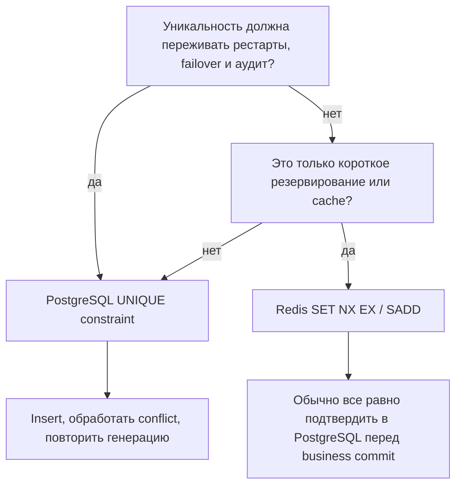
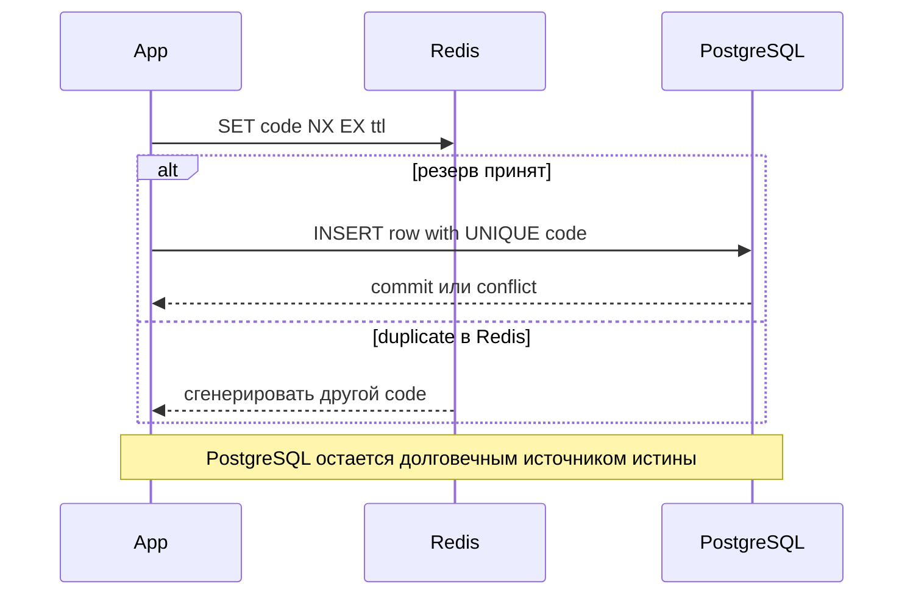

# Redis vs PostgreSQL для уникальности сгенерированных значений

На собеседовании вопрос обычно не в том, "что быстрее?". Вопрос в том, "где
источник истины?". Redis - это in-memory инструмент для координации и кэша.
PostgreSQL - долговечная реляционная база данных с constraints и transactions.
Для сгенерированных значений вроде промокодов, invite tokens, публичных номеров
заказов или коротких ids выбор зависит от того, уникальность - постоянное
бизнес-правило или временный быстрый фильтр. Аналогия: Redis - быстрая записка
на кухонной стойке; PostgreSQL - официальный журнал заказов, который ресторан
сверяет в конце дня.

## Главное правило

Используй **PostgreSQL**, когда значение является частью долговечных бизнес-данных:
два пользователя не должны получить один и тот же купон, номер заказа или
внешний id даже после рестартов, деплоев, failover и параллельных запросов.
Поставь `UNIQUE` constraint или unique index на колонку, вставляй
сгенерированное значение и повторяй попытку при конфликте. Это как сотрудник
почты, который записывает каждый номер посылки в официальный журнал перед тем,
как выдать квитанцию.

Используй **Redis**, когда значение временное, высоконагруженное и может истечь:
короткоживущие login tokens, rate-limit keys, idempotency windows, проверки
"уже пробовали в этом batch" или предварительное резервирование перед более
медленной записью в базу. Используй одну атомарную команду вроде
`SET key value NX EX seconds` или `SADD`, а не отдельные read-then-write шаги.
Redis похож на цветную скрепку на кухонном заказе: она помогает двум поварам не
взять один талон одновременно, но это не архив.

Используй **оба**, когда нужны и скорость, и корректность. Redis может рано
отсеять очевидные дубликаты или зарезервировать кандидат на короткое время, но
PostgreSQL все равно владеет финальной гарантией уникальности через constraint.
Дорожная аналогия: быстрый шлагбаум плюс центральный реестр машин. Шлагбаум
ускоряет поток, но реестр решает, уникален ли номер официально.

## Почему PostgreSQL - финальный авторитет

PostgreSQL обеспечивает уникальность внутри базы, рядом с данными, которые он
защищает. `UNIQUE` constraint поддерживается индексом, поэтому два параллельных
insert не смогут оба закоммитить одно и то же значение. Это прямое применение
[индексов в базе данных](topic:database-indexes) и consistency из
[ACID](topic:acid-principles). Аналогия: официальный журнал лежит у сотрудника
на стойке, поэтому два сотрудника не могут законно проштамповать один и тот же
номер посылки в одной книге.

Безопасный паттерн - "попробовать insert, затем обработать duplicate", а не
"сначала select, потом insert". Предварительная проверка может попасть в race:
два запроса одновременно видят "свободно", а затем оба пытаются занять одно и то
же значение. Unique constraint превращает эту гонку в один успех и один conflict.
Это связано и с видимостью данных в транзакциях, и с
[уровнями изоляции PostgreSQL](topic:postgresql-isolation-levels). Аналогия:
увидеть свободное парковочное место через дорогу не значит зарезервировать его;
зарезервировать - значит поставить туда машину.

PostgreSQL также лучше, когда правило уникальности связано с другими
реляционными фактами: `tenant_id + code`, активные подписки, foreign keys, audit
history или бизнес-транзакция, которая создает несколько строк вместе. База
может держать эти правила рядом со строками и откатывать их вместе. Аналогия:
кухонный заказ, чек оплаты и адрес доставки должны лежать в одной официальной
папке, а не на трех разных стикерах.

## Где подходит Redis

Redis отлично подходит для очень быстрой low-latency координации, когда потеря
ключа после TTL или failover допустима по дизайну. `SET key value NX EX 60`
означает "создать ключ только если его еще нет, и удалить через 60 секунд".
Эта одна команда атомарна внутри Redis. Аналогия: светофор может на минуту
удержать полосу, но он не доказывает, кому принадлежит дорога.

Redis становится рискованным как единственное хранилище постоянной уникальности.
Он может быть долговечным при настройке AOF или snapshots, но durability,
replication lag, failover и eviction policy теперь становятся частью твоей
истории корректности. Если дубликат купона стоит денег или ломает договор,
авторитетом должен быть PostgreSQL. Аналогия: доску объявлений на почте могут
переписывать каждый вечер, но спор решает подписанный журнал.

Redis также не становится автоматически одной транзакцией с PostgreSQL. Если
Redis зарезервировал код, а PostgreSQL insert упал, нужен compensating delete или
короткий TTL. Если PostgreSQL сделал commit, а обновление Redis не прошло, верить
нужно базе. Аналогия: официант может поставить карточку "reserved" на стол, но
если система бронирования отклонила бронь, карточка должна скоро исчезнуть.

## Практический дизайн для сгенерированных значений

Для постоянного сгенерированного значения создай кандидат, вставь его в
PostgreSQL под `UNIQUE` constraint и повтори попытку при duplicate. При достаточно
большом пространстве случайных значений дубликаты должны быть редкими, но
constraint все равно обязателен. Аналогия: большинство номеров посылок будут
новыми, но сотрудник все равно проверяет журнал перед выдачей квитанции.

Для всплесков нагрузки Redis может уменьшить лишние попытки записи в базу:
зарезервируй кандидат через `SET NX EX`, затем вставь в PostgreSQL, а потом либо
оставь Redis key до TTL, либо обнови его как cache известных занятых значений.
Это оптимизация, а не гарантия. Аналогия: экспедитор на кухне может пометить
талон как "in progress", чтобы повара не дублировали работу, но оплаченный журнал
заказов решает, что реально существует.

Для чисто временного token одного Redis может быть достаточно: password reset
token на 15 минут, one-time login challenge, окно дедупликации запросов или
rate-limit key. Смысл token истекает вместе с Redis key. Аналогия: номерок в
очереди гастронома важен во время обеда; через месяц его никто не аудирует.

## Ответ на собеседовании за 60 секунд

> Я использую PostgreSQL, когда уникальность является долговечным бизнес-инвариантом.
> Я ставлю unique constraint или unique index на колонку, вставляю сгенерированное
> значение и при конфликте генерирую другое. Это безопасно при конкуренции и
> переживает рестарты, потому что PostgreSQL - источник истины. Redis я использую,
> когда проверка временная или нужна для производительности: короткие резервы,
> tokens, idempotency windows или быстрые pre-checks. Команды Redis вроде
> `SET NX EX` атомарны и очень быстры, но один Redis не заменяет database
> constraint, если дубликаты испортят бизнес-данные. Во многих системах я
> использую Redis как быстрый фильтр, а PostgreSQL как финальный авторитет.

## Практическая важность

- Coupon codes и публичные ids нуждаются в PostgreSQL `UNIQUE` constraint, потому
  что дубликаты - бизнес-ошибки. Аналогия: два клиента не могут уйти с почты с
  одним официальным номером посылки.
- Login challenges, reset links и rate-limit windows часто могут жить в Redis,
  потому что expiry является частью требования. Аналогия: кухонный таймер полезен
  именно потому, что звенит и перестает быть важным.
- Multi-tenant уникальность часто должна быть в PostgreSQL как composite unique
  constraint, например `(tenant_id, code)`. Аналогия: в двух домах может быть
  квартира 12, но внутри одного дома номер квартиры должен быть уникален.
- Если Redis стоит впереди, следи за memory, eviction policy, persistence mode и
  failover behavior. Аналогия: доска объявлений надежна только тогда, когда ее не
  стерли до того, как кухня перенесла реальные заказы в журнал.

## Частые заблуждения

- "Redis быстрее, значит он должен владеть уникальностью." Скорость не равна
  авторитету. Постоянная уникальность должна проверяться там, где живут
  постоянные данные.
- "SELECT перед INSERT достаточно." При конкуренции это небезопасно: два запроса
  могут пройти проверку вместе. Делай insert с unique constraint и обрабатывай
  conflict.
- "Команды Redis не атомарны." Отдельные команды вроде `SET NX EX` атомарны.
  Риск появляется, когда логика разбита на отдельные `GET` и `SET` или когда от
  Redis и PostgreSQL ждут одного общего commit.
- "PostgreSQL слишком медленный для сгенерированных кодов." Обычно проверка
  unique index дешевая. Если нагрузка экстремальная, используй Redis для снижения
  повторов, но оставь PostgreSQL constraint.
- "UUID означает, что проверка уникальности не нужна." Коллизии хороших UUID
  практически невозможны, но если значение хранится как бизнес-ключ, database
  constraint все равно дешево защищает от bugs, truncation, неправильных
  generators и ручных изменений данных.
