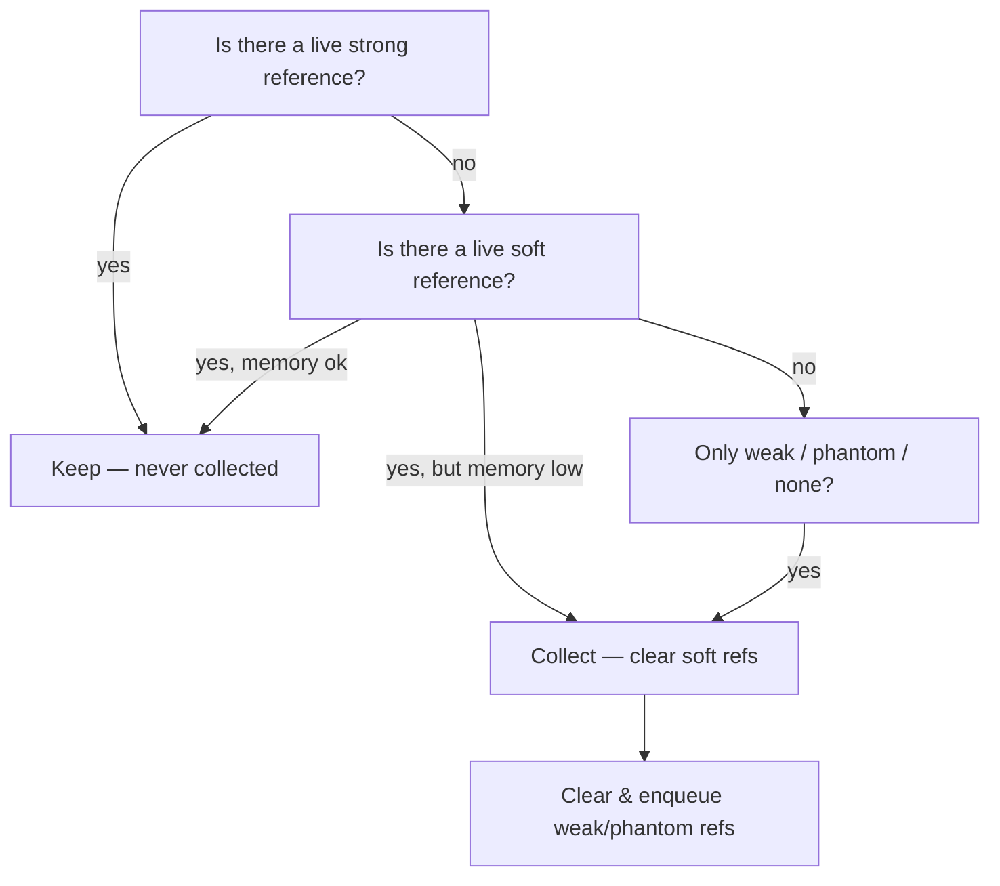
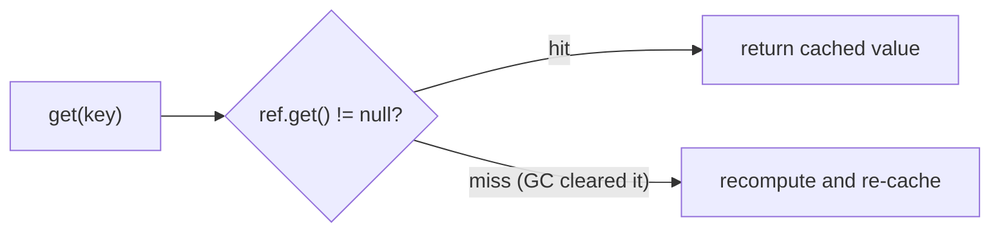
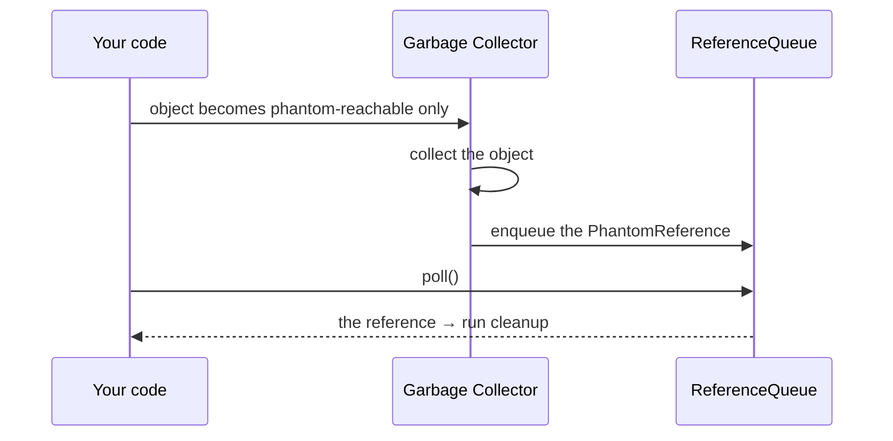

# Reference Types and a Memory-Sensitive Cache

## The intuition

The garbage collector keeps an object alive only while something still *reaches*
it. But not every reference pulls with the same force. Java gives you four
strengths — `strong`, `SoftReference`, `WeakReference`, `PhantomReference` — and
the GC treats each differently.

Think of the heap as a **coat-check room at a busy theatre**, and the GC as the
attendant who clears out coats nobody is claiming:

- **Strong** — you are *wearing* the coat. Nobody can take it. An ordinary
  `Object o = new Object()` is a strong reference: while it is reachable, the
  object is never collected. (Related: [where references live](topic:reference-types-storage)
  and [what a variable stores](topic:variable-storage).)
- **Soft** — you handed the coat in for a **ticket**. The cloakroom keeps it as
  long as there is room, but if the racks overflow it clears older coats first.
  A `SoftReference` survives a normal GC and is cleared **only when the JVM is
  about to run out of memory** — perfect for a cache.
- **Weak** — a **sticky note** that says "hold this if convenient". At the very
  next cleanup, if nobody is actually holding the coat, it's gone. A
  `WeakReference` is cleared at the next GC as soon as no strong/soft reference
  remains.
- **Phantom** — a **forwarding address** you leave after moving out. You can
  never get back into the old room (`get()` is always `null`), but the post
  office notifies you *after* the room has actually been emptied, so you can do
  final paperwork. A `PhantomReference` is enqueued **after** the object is
  collected, for safe cleanup.

The golden rule: **reachability is decided by the strongest live reference.** If
an object has both a strong and a weak reference, it is strongly reachable — the
weak one is irrelevant until the strong one disappears.



## The soft-reference cache (the headline answer)

The question — *"a cache the JVM clears itself when memory runs low"* — is exactly
what `SoftReference` is for. Like the cloakroom that keeps coats until the racks
are full, the JVM keeps softly-referenced values while there is free heap and
drops them under pressure instead of throwing `OutOfMemoryError`.

```java
class ImageCache {
    private final Map<String, SoftReference<BigImage>> cache = new HashMap<>();

    BigImage get(String key) {
        SoftReference<BigImage> ref = cache.get(key);
        BigImage img = (ref == null) ? null : ref.get();   // may be null if GC cleared it
        if (img == null) {                                 // cache miss → recompute
            img = load(key);
            cache.put(key, new SoftReference<>(img));
        }
        return img;
    }
}
```



Two cautions: the *keys* and the empty `SoftReference` wrappers are still strong,
so a long-lived cache should also evict stale entries; and because clearing
depends on the real GC and free heap, treat a soft cache as a **best-effort**
speed-up, never as guaranteed storage.

## Weak references and WeakHashMap

A `WeakReference` is the cloakroom sticky note: discarded the moment nobody truly
holds the coat. `WeakHashMap` builds on this — its **keys** are weak, so an entry
vanishes automatically once the key is no longer strongly referenced anywhere
else. That makes it ideal for **metadata keyed by an object you don't own**
(listeners, per-object caches): when the object dies, its entry cleans itself up,
much like the [WeakHashMap-style auto-eviction you'd otherwise hand-roll over a HashMap](topic:hashmap).
The trap: it is the **key** that is weak, not the value — a value that strongly
references its own key keeps the entry alive forever.

## Phantom references and cleanup

`finalize()` is the unreliable building inspector who *might* show up before
demolition — it can run late, run on any thread, or never run, and it can even
resurrect the object. A `PhantomReference` plus a `ReferenceQueue` is the post
office forwarding address instead: you learn about the death **only after** the
object is truly gone, on your own thread, with no way to resurrect it. That is
why modern code (e.g. `Cleaner`) uses phantom references to release native memory
or file handles deterministically.



## A 60-second interview answer

> Java has four reference strengths. A **strong** reference is the ordinary one —
> the object lives as long as it is reachable. A **SoftReference** is cleared only
> when the JVM is low on memory, which makes it the right tool for a
> memory-sensitive cache. A **WeakReference** is cleared at the very next GC once
> no stronger reference remains; `WeakHashMap` uses weak keys so entries
> auto-evict. A **PhantomReference** never returns its referent from `get()` and
> is enqueued only *after* the object is collected, so it's used with a
> `ReferenceQueue` for reliable cleanup instead of `finalize()`. The key rule is
> that reachability is decided by the strongest live reference. To build a cache
> the JVM clears itself, store values in `SoftReference`s (e.g.
> `Map<K, SoftReference<V>>`): the GC keeps them while there's free heap and
> drops them under pressure.

## Production relevance

- **Caches** that must not cause `OutOfMemoryError` use soft references (or a
  proper cache library that does this for you).
- **WeakHashMap** for per-object metadata / listener registries that should not
  keep their keys alive.
- **`Cleaner` / phantom references** to free off-heap resources deterministically,
  replacing `finalize()`. The GC itself runs in the [heap generations](topic:heap-generations)
  you should already know.

## Common traps and misconceptions

- **"SoftReference is a cache."** It is a *building block*; you still manage keys,
  eviction and concurrency around it.
- **"Soft and weak are basically the same."** No — soft survives normal GC and is
  cleared only under memory pressure; weak is cleared at the **next** GC.
- **"`phantom.get()` returns the object."** It always returns `null` — phantoms
  exist only to signal collection through a queue.
- **"Weak references stop a leak by themselves."** Only if nothing else holds the
  object strongly; one stray strong reference (a static list, a listener) pins it.
- **"WeakHashMap weakly holds values."** It weakly holds **keys**; a value that
  references its key defeats the whole point.
- **"finalize() is fine for cleanup."** It is deprecated and unreliable — prefer a
  phantom reference with a `ReferenceQueue` (or `Cleaner`).
