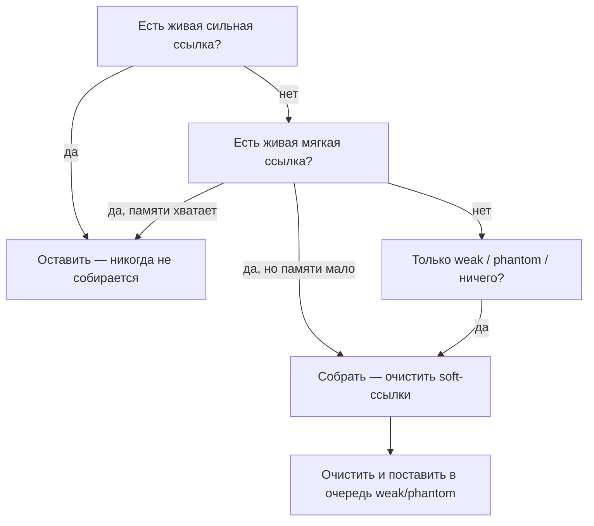
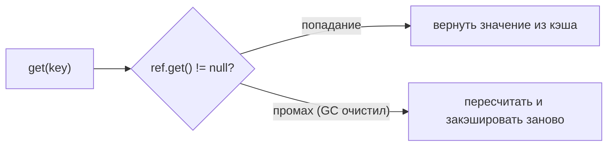
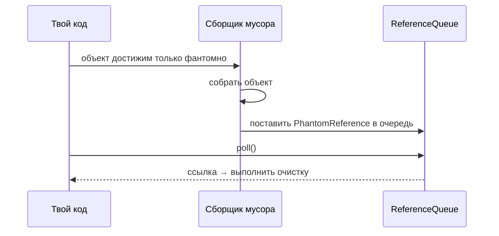

# Типы ссылок и кэш, чувствительный к памяти

## Интуиция

Сборщик мусора держит объект живым, только пока что-то до него *дотягивается*. Но
не каждая ссылка тянет с одинаковой силой. Java даёт четыре силы — `strong`,
`SoftReference`, `WeakReference`, `PhantomReference` — и GC обходится с каждой
по-своему.

Представь кучу как **гардероб в переполненном театре**, а GC — как гардеробщика,
который убирает пальто, которые никто не забирает:

- **Strong** — ты *надел* пальто. Его никто не заберёт. Обычное
  `Object o = new Object()` — это сильная ссылка: пока объект достижим, его не
  соберут. (Связано: [где живут ссылки](topic:reference-types-storage) и
  [что хранит переменная](topic:variable-storage).)
- **Soft** — ты сдал пальто и получил **номерок**. Гардероб держит его, пока есть
  место, но если вешалки переполнены, первыми убирают старые пальто.
  `SoftReference` переживает обычный GC и очищается **только когда JVM вот-вот
  останется без памяти** — идеально для кэша.
- **Weak** — **стикер** с надписью «придержи, если несложно». На ближайшей же
  уборке, если пальто никто реально не держит, оно исчезает. `WeakReference`
  очищается на ближайшем GC, как только не остаётся сильной/мягкой ссылки.
- **Phantom** — **адрес для пересылки**, который ты оставляешь, съезжая. Вернуться
  в старую комнату уже нельзя (`get()` всегда `null`), но почта уведомит тебя
  *после* того, как комнату действительно освободили, чтобы ты доделал бумаги.
  `PhantomReference` ставится в очередь **после** сборки объекта — для безопасной
  очистки.

Золотое правило: **достижимость определяется самой сильной живой ссылкой.** Если
на объект есть и сильная, и слабая ссылка, он достижим сильно — слабая ни на что
не влияет, пока не исчезнет сильная.



## Кэш на мягких ссылках (главный ответ)

Вопрос — *«кэш, который JVM сам очистит при нехватке памяти»* — это ровно то, для
чего нужен `SoftReference`. Как гардероб, который держит пальто, пока есть место,
JVM держит мягко удерживаемые значения, пока в куче есть свободное место, и
сбрасывает их под давлением, вместо того чтобы бросить `OutOfMemoryError`.

```java
class ImageCache {
    private final Map<String, SoftReference<BigImage>> cache = new HashMap<>();

    BigImage get(String key) {
        SoftReference<BigImage> ref = cache.get(key);
        BigImage img = (ref == null) ? null : ref.get();   // может быть null, если GC очистил
        if (img == null) {                                 // промах → пересчитать
            img = load(key);
            cache.put(key, new SoftReference<>(img));
        }
        return img;
    }
}
```



Две оговорки: *ключи* и пустые обёртки `SoftReference` остаются сильными, поэтому
долгоживущий кэш должен ещё и выселять устаревшие записи; и поскольку очистка
зависит от реального GC и свободной кучи, мягкий кэш — это **ускорение по мере
возможности**, а не гарантированное хранилище.

## Слабые ссылки и WeakHashMap

`WeakReference` — это гардеробный стикер: его выбрасывают, как только пальто никто
по-настоящему не держит. `WeakHashMap` построен на этом — его **ключи** слабые,
поэтому запись исчезает автоматически, как только ключ больше нигде не удерживается
сильно. Это идеально для **метаданных по объекту, которым ты не владеешь**
(слушатели, кэши на объект): когда объект умирает, его запись убирается сама — как
[авто-выселение в духе WeakHashMap, которое иначе пришлось бы городить поверх HashMap](topic:hashmap).
Ловушка: слабый именно **ключ**, а не значение — значение, которое сильно ссылается
на свой ключ, держит запись живой вечно.

## Фантомные ссылки и очистка

`finalize()` — ненадёжный инспектор здания, который *может* зайти перед сносом: он
может сработать поздно, на любом потоке или вообще не сработать, и даже воскресить
объект. `PhantomReference` вместе с `ReferenceQueue` — это вместо него адрес для
пересылки: ты узнаёшь о «смерти» **только после** того, как объект действительно
исчез, на своём потоке и без шанса его воскресить. Поэтому современный код
(например, `Cleaner`) использует фантомные ссылки, чтобы детерминированно
освобождать нативную память или файловые дескрипторы.



## Ответ за 60 секунд

> В Java четыре силы ссылок. **Strong** — обычная: объект живёт, пока достижим.
> **SoftReference** очищается только при нехватке памяти, поэтому это правильный
> инструмент для кэша, чувствительного к памяти. **WeakReference** очищается на
> ближайшем GC, как только не остаётся более сильной ссылки; `WeakHashMap`
> использует слабые ключи, поэтому записи выселяются сами. **PhantomReference**
> никогда не возвращает объект из `get()` и ставится в очередь только *после*
> сборки объекта, поэтому используется с `ReferenceQueue` для надёжной очистки
> вместо `finalize()`. Ключевое правило: достижимость определяется самой сильной
> живой ссылкой. Чтобы сделать кэш, который JVM сам очистит, храни значения в
> `SoftReference` (например, `Map<K, SoftReference<V>>`): GC держит их, пока есть
> свободная куча, и сбрасывает под давлением.

## Применимость на практике

- **Кэши**, которые не должны вызывать `OutOfMemoryError`, используют мягкие
  ссылки (или нормальную библиотеку кэширования, которая делает это за тебя).
- **WeakHashMap** для метаданных/реестров слушателей по объекту, которые не должны
  держать свои ключи живыми.
- **`Cleaner` / фантомные ссылки** — чтобы детерминированно освобождать
  off-heap-ресурсы вместо `finalize()`. Сам GC работает в
  [поколениях кучи](topic:heap-generations), которые ты уже должен знать.

## Частые ловушки и заблуждения

- **«SoftReference — это кэш».** Это *строительный блок*; ключи, выселение и
  конкурентность вокруг него ты всё равно ведёшь сам.
- **«Soft и weak — практически одно и то же».** Нет — soft переживает обычный GC и
  очищается только при нехватке памяти; weak очищается на **ближайшем** GC.
- **«`phantom.get()` возвращает объект».** Он всегда возвращает `null` — фантомы
  существуют лишь чтобы сигналить о сборке через очередь.
- **«Слабые ссылки сами по себе устраняют утечку».** Только если объект больше
  никто не держит сильно; одна случайная сильная ссылка (статический список,
  слушатель) приколачивает его.
- **«WeakHashMap слабо держит значения».** Он слабо держит **ключи**; значение,
  ссылающееся на свой ключ, рушит всю идею.
- **«finalize() годится для очистки».** Он устарел и ненадёжен — предпочитай
  фантомную ссылку с `ReferenceQueue` (или `Cleaner`).
