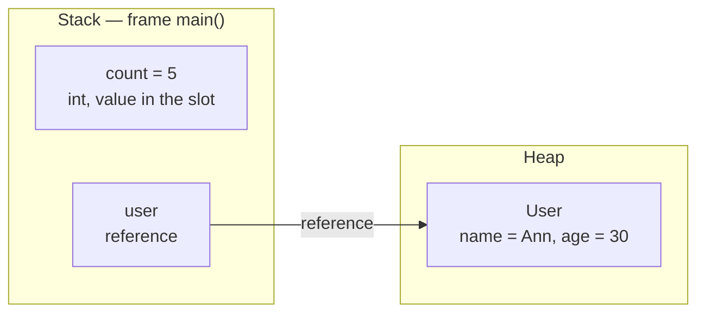
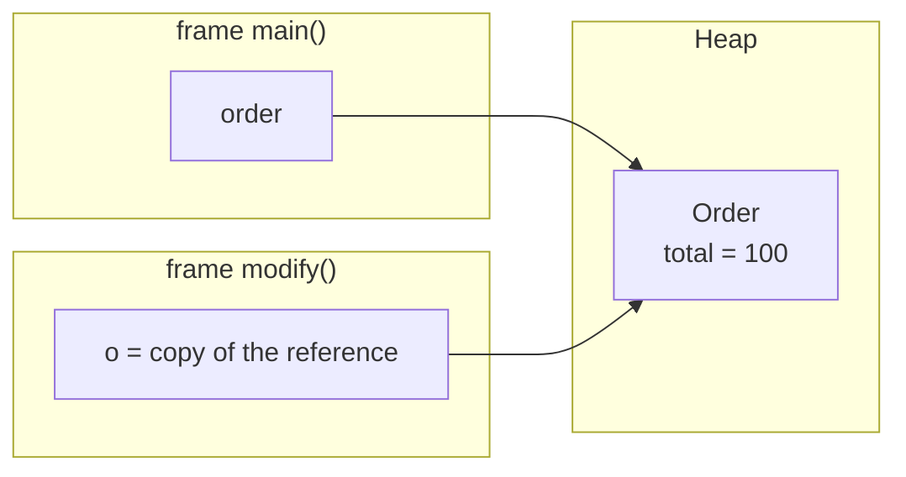

# Where Reference Types Are Stored

Java has two families of types, and they are stored differently:

- **Primitive types** (`int`, `long`, `double`, `boolean`, `char`, …) store their
  **value** directly inside the variable.
- **Reference types** (every class, array, `String`, your own objects, …) store a
  **reference** — a handle that points at an object. The **object itself lives on
  the heap**; the variable holds only the arrow to it.

> **Cloakroom analogy.** Think of a theatre cloakroom. Your **coat** is the object:
> it hangs on a numbered rack in the back room — that back room is the **heap**. You
> don't carry the coat around; you carry a small **numbered ticket** — that ticket is
> the **reference**. A primitive is different: it's like a **coin in your pocket** —
> you carry the value itself, not a ticket to it.

So the precise answer to "where are reference types stored?" has two halves:

1. **The object** (the instance of the reference type) is on the **heap**.
2. **The reference** is wherever the variable lives:
   - a **local variable** → in that method's **stack frame**;
   - a **field of an object** → **inside that object, on the heap**;
   - a **static field** → in the class's metadata (the **method area / Metaspace**),
     still pointing at an object on the heap.

> **Cloakroom analogy.** `count = 5` is the coin in your pocket — the number is right
> there. `user` is a ticket; the actual `User` coat hangs on the heap rack, and the
> ticket just tells you which one.

## Copying a value vs copying a reference

This is the distinction interviewers are really probing.

- **Copying a primitive** copies the **value** into a separate slot. The two are
  independent — change one, the other is untouched.
- **Copying a reference** copies only the **handle**. Both variables now point at the
  **same object** (this is called *aliasing*). A change made through one is visible
  through the other, because there is only one object.

> **Cloakroom analogy.** Copying a primitive is like telling a friend "I have 5
> coins" and they write down 5 — now you each have your own number. Copying a
> reference is like **photocopying your ticket**: there are two tickets, but still
> **one coat** on the rack. If you scribble on the coat through either ticket, both
> ticket-holders see the scribble.

## Passing objects to methods: Java is pass-by-value

Java is **always pass-by-value**. For an object, the *value that gets copied* is the
**reference**, not the object. So inside the method:

- mutating the object (`o.total = 90`) **is** visible to the caller — same object;
- reassigning the parameter (`o = new Order()`) is **not** visible — you only
  repointed the method's own copy of the ticket.

> **Cloakroom analogy.** Handing an object to a method is handing over a **photocopy
> of your ticket**. The clerk can use it to fetch *your* coat and sew on a new button
> (you'll see that). But if the clerk throws their photocopy away and grabs a
> *different* coat, your original ticket still points at your coat.

## Reassigning, null, and garbage

The object does not vanish the moment you stop using it. When you reassign a variable
to a new object, or set it to `null`, the old object simply becomes **unreachable**.
It stays on the heap until the **garbage collector** proves nothing can reach it and
reclaims the memory. See [JVM Heap Generations](topic:heap-generations) for how the GC
organises and sweeps that space.

> **Cloakroom analogy.** Tearing up your ticket (`p = null`) doesn't make the coat
> disappear — it just becomes an **unclaimed coat** on the rack. At closing time the
> attendant (the GC) clears out everything nobody can claim.

## 60-second interview answer

> In Java, *where* a value is stored depends on its type. A **primitive** is stored
> by value — the bits live directly in the variable's slot. A **reference type** is
> split in two: the **object lives on the heap**, and the variable holds a
> **reference** to it. Where that reference sits depends on the variable: a local
> variable's reference is in the **stack frame**; a field's reference is **inside the
> owning object on the heap**; a static field's reference is with the **class
> metadata**. Because variables hold references, assigning one object variable to
> another copies the **reference**, so both point at one object (aliasing). And Java
> is **pass-by-value**: passing an object copies its reference, so the method can
> mutate the shared object but can't repoint the caller's variable. Objects you stop
> referencing stay on the heap until the **garbage collector** reclaims them.

## Production relevance

- **Aliasing bugs.** Storing the *same* mutable object in two places and mutating it
  through one reference surprises code reading it through the other. Defensive copies
  or immutable objects (like an immutable [String](topic:string-immutability)) avoid
  this.
- **`equals` vs `==`.** `==` compares **references** (same object?), while `equals`
  compares **content**. Knowing references are what's stored explains why `==` on two
  equal-looking objects is often `false`.
- **Memory leaks in managed memory.** Java has a GC, but a forgotten reference (e.g. a
  static collection that keeps growing) keeps objects **reachable** forever, so they
  are never collected. "No `free()`" is not "no leaks".

## Common misconceptions

- **"Objects are stored in the variable."** No — the variable stores a **reference**;
  the object is on the heap.
- **"Java passes objects by reference."** No — Java passes the **reference by value**.
  You can mutate the object, but reassigning the parameter doesn't affect the caller.
- **"`b = a` copies the object."** It copies the **reference**; both names share one
  object until you explicitly clone it.
- **"Local objects live on the stack."** The **reference** is on the stack; the
  **object** is on the heap. (The JIT may stack-allocate via escape analysis, but
  that's an invisible optimization, not the language model.)
- **"`null` / reassignment frees the object immediately."** It only makes it
  *eligible* for GC; reclamation happens later.
- **"All fields are on the heap, so primitives must be too."** A primitive **field**
  is stored by value **inside its object**, which is on the heap — but a primitive
  **local variable** sits in the stack frame.
