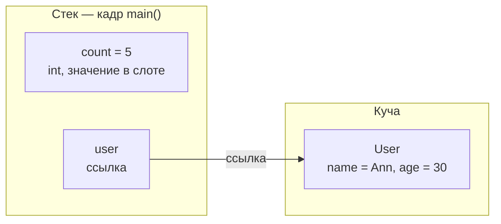
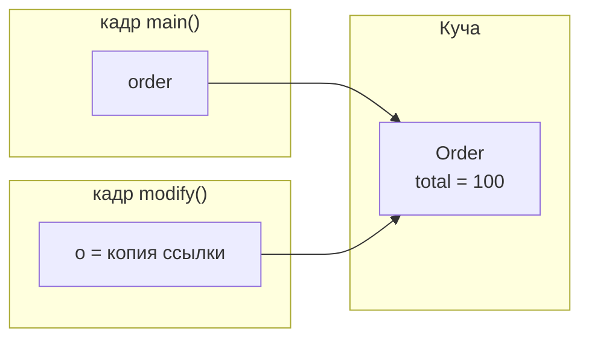

# Где хранятся ссылочные типы

В Java есть два семейства типов, и хранятся они по-разному:

- **Примитивные типы** (`int`, `long`, `double`, `boolean`, `char`, …) хранят своё
  **значение** прямо внутри переменной.
- **Ссылочные типы** (любой класс, массив, `String`, ваши объекты, …) хранят
  **ссылку** — хэндл, указывающий на объект. **Сам объект живёт в куче**, а
  переменная держит лишь стрелку на него.

> **Аналогия с гардеробом.** Представьте театральный гардероб. Ваше **пальто** — это
> объект: оно висит на пронумерованной вешалке в подсобке — эта подсобка и есть
> **куча**. Вы не носите пальто с собой; вы носите маленький **номерок** — это и есть
> **ссылка**. С примитивом иначе: это как **монета в кармане** — вы носите само
> значение, а не номерок к нему.

Поэтому точный ответ на вопрос «где хранятся ссылочные типы?» состоит из двух частей:

1. **Объект** (экземпляр ссылочного типа) находится в **куче**.
2. **Ссылка** находится там, где живёт переменная:
   - **локальная переменная** → в **кадре стека** этого метода;
   - **поле объекта** → **внутри этого объекта, в куче**;
   - **статическое поле** → в метаданных класса (**область методов / Metaspace**),
     по-прежнему указывая на объект в куче.

> **Аналогия с гардеробом.** `count = 5` — это монета в кармане, число прямо тут.
> `user` — это номерок; само пальто `User` висит на вешалке в куче, а номерок лишь
> говорит, какое именно.

## Копирование значения против копирования ссылки

Именно эту грань на самом деле проверяет интервьюер.

- **Копирование примитива** копирует **значение** в отдельный слот. Они независимы —
  меняешь одно, второе не затрагивается.
- **Копирование ссылки** копирует только **хэндл**. Обе переменные теперь указывают
  на **один и тот же объект** (это называется *алиасинг*). Изменение через одну видно
  через другую, потому что объект всего один.

> **Аналогия с гардеробом.** Скопировать примитив — это как сказать другу «у меня 5
> монет», и он записал 5: теперь у каждого своё число. Скопировать ссылку — это
> **сделать ксерокопию номерка**: номерков два, но пальто на вешалке всё равно
> **одно**. Если через любой номерок что-то написать на пальто, это увидят оба
> владельца номерков.

## Передача объектов в методы: Java передаёт по значению

Java **всегда передаёт по значению**. Для объекта *копируется значение* — это
**ссылка**, а не объект. Поэтому внутри метода:

- изменение объекта (`o.total = 90`) **видно** вызывающему коду — объект тот же;
- переприсваивание параметра (`o = new Order()`) **не видно** — вы лишь
  перенаправили собственную копию номерка внутри метода.

> **Аналогия с гардеробом.** Передать объект в метод — это отдать **ксерокопию
> номерка**. Гардеробщик может по ней достать *ваше* пальто и пришить новую пуговицу
> (это вы увидите). Но если он выбросит свою копию и возьмёт *другое* пальто, ваш
> исходный номерок всё равно указывает на ваше пальто.

## Переприсваивание, null и мусор

Объект не исчезает в тот момент, когда вы перестаёте им пользоваться. Когда вы
переприсваиваете переменную на новый объект или присваиваете ей `null`, старый объект
просто становится **недостижимым**. Он остаётся в куче, пока **сборщик мусора** не
убедится, что до него не добраться, и не освободит память. О том, как GC организует и
очищает это пространство, см. [JVM Heap Generations](topic:heap-generations).

> **Аналогия с гардеробом.** Порвать номерок (`p = null`) не заставит пальто исчезнуть
> — оно просто станет **невостребованным пальто** на вешалке. К закрытию гардеробщик
> (GC) убирает всё, что никто не может забрать.

## Ответ за 60 секунд

> В Java *где* хранится значение, зависит от его типа. **Примитив** хранится по
> значению — биты лежат прямо в слоте переменной. **Ссылочный тип** разделён на две
> части: **объект живёт в куче**, а переменная держит **ссылку** на него. Где именно
> эта ссылка — зависит от переменной: ссылка локальной переменной в **кадре стека**;
> ссылка поля — **внутри объекта-владельца в куче**; ссылка статического поля — рядом
> с **метаданными класса**. Поскольку переменные хранят ссылки, присваивание одной
> объектной переменной другой копирует **ссылку**, и обе указывают на один объект
> (алиасинг). И Java передаёт **по значению**: при передаче объекта копируется его
> ссылка, поэтому метод может изменить общий объект, но не может перенаправить
> переменную вызывающего кода. Объекты, на которые перестали ссылаться, остаются в
> куче, пока их не освободит **сборщик мусора**.

## Значимость на практике

- **Ошибки из-за алиасинга.** Если хранить *один и тот же* изменяемый объект в двух
  местах и менять его через одну ссылку, это удивит код, читающий его через другую.
  Защитные копии или неизменяемые объекты (как неизменяемый
  [String](topic:string-immutability)) спасают от этого.
- **`equals` против `==`.** `==` сравнивает **ссылки** (тот же объект?), а `equals`
  сравнивает **содержимое**. Понимание того, что хранятся именно ссылки, объясняет,
  почему `==` для двух одинаково выглядящих объектов часто `false`.
- **Утечки при управляемой памяти.** В Java есть GC, но забытая ссылка (например,
  статическая коллекция, которая всё растёт) держит объекты **достижимыми** вечно, и
  они никогда не собираются. «Нет `free()`» не значит «нет утечек».

## Частые заблуждения

- **«Объекты хранятся в переменной».** Нет — переменная хранит **ссылку**, а объект
  находится в куче.
- **«Java передаёт объекты по ссылке».** Нет — Java передаёт **ссылку по значению**.
  Объект изменить можно, но переприсваивание параметра не влияет на вызывающий код.
- **«`b = a` копирует объект».** Это копирует **ссылку**; оба имени делят один объект,
  пока вы явно его не клонируете.
- **«Локальные объекты живут на стеке».** На стеке лежит **ссылка**; **объект** — в
  куче. (JIT может разместить объект на стеке через escape analysis, но это невидимая
  оптимизация, а не модель языка.)
- **«`null` / переприсваивание освобождает объект сразу».** Это лишь делает его
  *пригодным* для сборки; освобождение происходит позже.
- **«Все поля в куче, значит и примитивы тоже».** Примитивное **поле** хранится по
  значению **внутри своего объекта**, который в куче, — но примитивная **локальная
  переменная** лежит в кадре стека.
