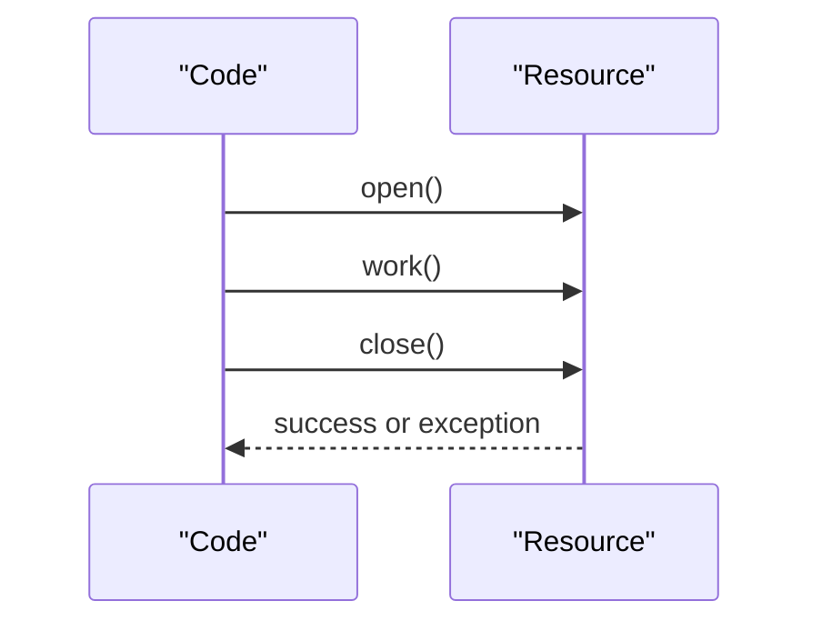
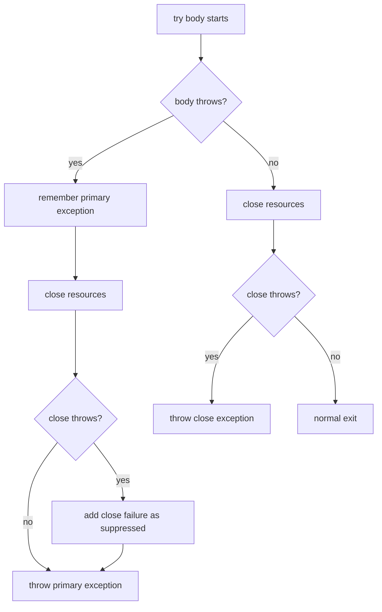

# Resource Exception Handling

Resource-related exceptions usually appear when code talks to something that must
be closed: a file, socket, database connection, stream, lock-like handle, or
printer-like device. In Java, the standard answer is `try-with-resources`: put
the resource in the `try (...)` header, and Java calls `close()` automatically.
Think of borrowing a kitchen knife from a shared counter: when the job is done,
the knife goes back even if the recipe fails halfway.

This topic builds on [Exceptions in Java and Their Types](topic:exception-basics)
and the difference between `finally` and cleanup discussed in
[final vs finally vs finalize](topic:final-finally-finalize).



## The Core Rule

`try-with-resources` works with objects that implement `AutoCloseable` or
`Closeable`. Java creates the resource, runs the body, and then closes the
resource automatically. That closing happens whether the body returns normally,
throws an exception, or exits early with `return`. It is like a post office clerk
who stamps the envelope, then always returns the stamp to the drawer before the
next customer.

```java
try (InputStream in = Files.newInputStream(path)) {
    return in.read();
}
```

The compiler expands this idea into code that is similar to a careful
`try/finally`, but it also handles the tricky exception rules correctly. In a
kitchen analogy, it is not just "wash the pan later"; it also records whether the
meal burned before the pan broke during washing.

## When Work Fails

If the body throws, Java still closes the resource before the exception reaches
`catch`. The body exception remains the primary exception. This matters because
the real business failure is usually in the work, not in cleanup. Imagine a
delivery route where the package was lost first, and the van door squeaked later:
the lost package is the main incident.

## When close() Fails

If the body succeeds but `close()` throws, the close exception becomes the
exception you catch. For example, flushing a buffered stream can fail during
`close()` because pending bytes are written at the end. In everyday terms, the
letter was written successfully, but sealing the envelope failed, so that is the
failure you report.

## Suppressed Exceptions

If the body throws and then `close()` also throws, Java keeps the body exception
as primary and attaches the close failure as a suppressed exception. You can read
those with `Throwable.getSuppressed()`. This prevents the cleanup failure from
hiding the original problem. It is like a restaurant receipt: the main line says
"order burned", and a note below says "dishwasher also jammed".



## Multiple Resources

When several resources are declared, Java closes them in reverse order of
declaration. That mirrors dependencies: if a `Statement` depends on a
`Connection`, close the `Statement` first, then the `Connection`. Picture stacked
trays in a cafe: you remove the top tray before the one underneath.

```java
try (Connection c = dataSource.getConnection();
     PreparedStatement ps = c.prepareStatement(sql);
     ResultSet rs = ps.executeQuery()) {
    // use rs
}
```

The close order is `rs`, then `ps`, then `c`.

## Where finally Fits

`finally` still exists, but it should not be your first choice for ordinary
resource cleanup. With `try-with-resources`, resource closing happens before the
`finally` block runs. Use `finally` for cleanup that is not an `AutoCloseable`
resource or for small side effects like restoring a flag. It is like cleaning the
kitchen tools automatically first, then writing the shift note at the end.

## 60-Second Interview Answer

In Java, resource cleanup is normally handled with `try-with-resources`. Any
object in the `try (...)` header must implement `AutoCloseable` or `Closeable`,
and Java calls `close()` automatically after the block. Resources are closed in
reverse declaration order. If the try body throws, that exception stays primary.
If `close()` also throws, the close exception is attached as suppressed and can
be inspected with `getSuppressed()`. If only `close()` throws, that close
exception is the one caught. `finally` can still run, but try-with-resources is
preferred for resources because it avoids leaks and preserves the original
exception correctly.

## Production Relevance

Resource leaks become production incidents: open files exhaust descriptors,
database connections starve the pool, and sockets stay around longer than the
request. `try-with-resources` makes cleanup local and reliable. It is the same
habit as returning the post office scanner immediately after each parcel: nobody
else gets blocked waiting for a tool you forgot to put back.

Suppressed exceptions are also useful in logs. If a database operation fails and
closing the statement fails too, good logging should show both. The main
exception explains the failed operation; the suppressed exception explains the
cleanup side effect.

## Common Misconceptions

- "I need `finally` for every resource." Usually no. Prefer
  `try-with-resources` for `AutoCloseable` resources; use `finally` for other
  cleanup. Like a dishwasher for plates, use the built-in tool when the item fits.
- "`close()` exceptions always replace the real exception." Not with
  `try-with-resources`. When the body already failed, close failures are
  suppressed. The kitchen fire report should not be overwritten by "mop broke".
- "Resources close in declaration order." They close in reverse order. Unstack
  the top box before the lower one.
- "Suppressed means ignored." Suppressed means attached to the primary exception,
  not lost. It is a note stapled to the main receipt.
- "`AutoCloseable.close()` cannot throw checked exceptions." It can throw
  `Exception`; `Closeable.close()` narrows this to `IOException`. Handle or
  declare it like any checked exception.
