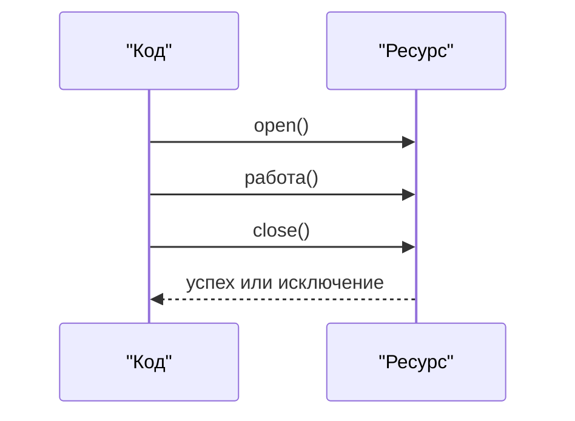
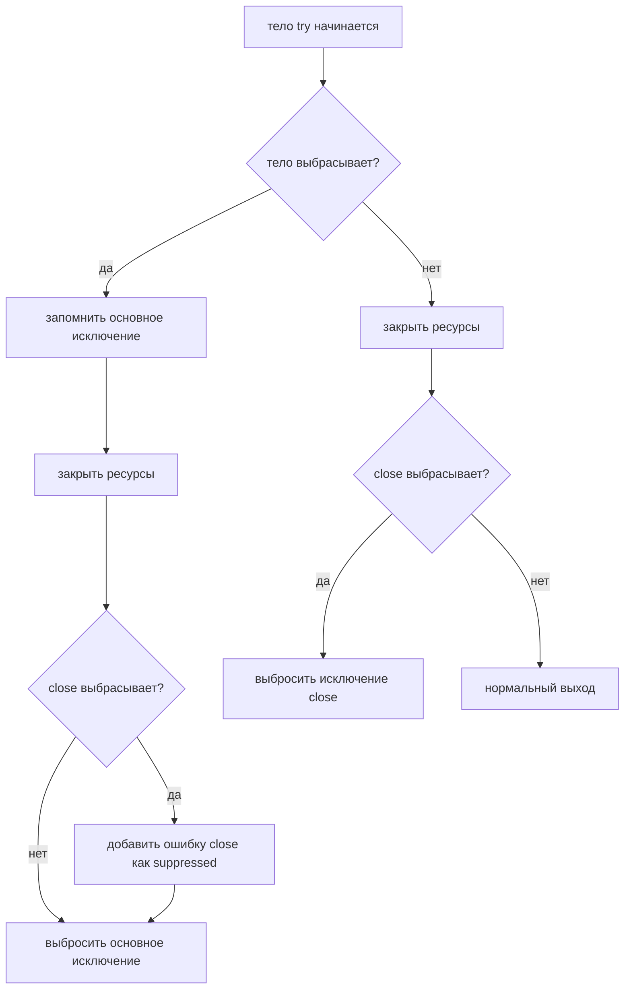

# Обработка исключений ресурсов

Исключения, связанные с ресурсами, обычно появляются, когда код работает с тем,
что нужно закрывать: файлом, сокетом, соединением с базой данных, stream,
lock-подобным handle или устройством вроде принтера. В Java стандартный ответ -
`try-with-resources`: поместить ресурс в заголовок `try (...)`, и Java
автоматически вызовет `close()`. Представь общий кухонный нож: когда работа
закончена, нож возвращается на стойку, даже если рецепт сорвался на середине.

Эта тема продолжает [Exceptions in Java and Their Types](topic:exception-basics)
и разницу между `finally` и очисткой из
[final vs finally vs finalize](topic:final-finally-finalize).



## Главное правило

`try-with-resources` работает с объектами, которые реализуют `AutoCloseable` или
`Closeable`. Java создаёт ресурс, выполняет тело, а затем автоматически закрывает
ресурс. Закрытие происходит и при нормальном завершении, и при исключении, и при
раннем `return`. Это как сотрудник почты: он ставит штамп на конверт и всегда
возвращает штамп в ящик перед следующим клиентом.

```java
try (InputStream in = Files.newInputStream(path)) {
    return in.read();
}
```

Компилятор разворачивает эту идею в код, похожий на аккуратный `try/finally`, но
ещё и правильно обрабатывает сложные правила исключений. В кухонной аналогии это
не просто "помыть сковороду потом"; это ещё и запись, что блюдо подгорело раньше,
чем сковорода сломалась при мытье.

## Когда падает работа

Если тело выбрасывает исключение, Java всё равно закрывает ресурс до того, как
исключение попадёт в `catch`. Исключение из тела остаётся основным. Это важно,
потому что настоящая бизнес-ошибка обычно в работе, а не в очистке. Представь
доставку: сначала потеряли посылку, а потом заскрипела дверь фургона. Главный
инцидент - потерянная посылка.

## Когда падает close()

Если тело успешно, но `close()` выбрасывает исключение, пойманным исключением
становится ошибка close. Например, buffered stream может записывать оставшиеся
байты во время `close()`, и именно там может произойти сбой. В бытовой картинке:
письмо написали успешно, но конверт не удалось запечатать, значит сообщаем об
этой ошибке.

## Suppressed exceptions

Если тело выбрасывает исключение, а затем `close()` тоже выбрасывает, Java
сохраняет исключение из тела как основное и прикрепляет ошибку закрытия как
suppressed exception. Их можно прочитать через `Throwable.getSuppressed()`. Это
не даёт ошибке очистки скрыть исходную проблему. Как в чеке ресторана: главная
строка говорит "заказ подгорел", а ниже примечание "посудомойка тоже заклинила".



## Несколько ресурсов

Когда объявлено несколько ресурсов, Java закрывает их в порядке, обратном
объявлению. Это отражает зависимости: если `Statement` зависит от `Connection`,
сначала закрывают `Statement`, потом `Connection`. Представь стопку подносов в
кафе: сначала снимают верхний поднос, потом тот, что под ним.

```java
try (Connection c = dataSource.getConnection();
     PreparedStatement ps = c.prepareStatement(sql);
     ResultSet rs = ps.executeQuery()) {
    // use rs
}
```

Порядок закрытия: `rs`, затем `ps`, затем `c`.

## Где здесь finally

`finally` всё ещё существует, но это не первый выбор для обычной очистки
ресурсов. При `try-with-resources` закрытие ресурсов происходит до выполнения
блока `finally`. Используй `finally` для очистки, которая не является ресурсом
`AutoCloseable`, или для небольших побочных действий вроде восстановления флага.
Это как сначала автоматически помыть кухонные инструменты, а потом в конце
оставить заметку смене.

## Ответ за 60 секунд

В Java очистку ресурсов обычно делают через `try-with-resources`. Любой объект в
заголовке `try (...)` должен реализовывать `AutoCloseable` или `Closeable`, и
Java автоматически вызывает `close()` после блока. Ресурсы закрываются в
порядке, обратном объявлению. Если тело try выбрасывает исключение, оно остаётся
основным. Если `close()` тоже выбрасывает, ошибка закрытия прикрепляется как
suppressed, и её можно посмотреть через `getSuppressed()`. Если выбрасывает
только `close()`, пойманным будет исключение close. `finally` всё ещё может
выполняться, но для ресурсов предпочтителен try-with-resources, потому что он
предотвращает утечки и корректно сохраняет исходное исключение.

## Зачем это в продакшене

Утечки ресурсов превращаются в продакшен-инциденты: открытые файлы исчерпывают
file descriptors, соединения с базой занимают пул, а сокеты живут дольше
запроса. `try-with-resources` делает очистку локальной и надёжной. Это такая же
привычка, как сразу возвращать почтовый сканер после каждой посылки: никто
другой не ждёт инструмент, который забыли положить на место.

Suppressed exceptions полезны и в логах. Если операция с базой упала, а закрытие
statement тоже упало, хороший лог должен показать оба факта. Основное исключение
объясняет сбой операции; suppressed exception объясняет побочный сбой очистки.

## Частые заблуждения

- "Для каждого ресурса нужен `finally`." Обычно нет. Для ресурсов
  `AutoCloseable` предпочитай `try-with-resources`; `finally` оставь для другой
  очистки. Как посудомойка для тарелок: используй встроенный инструмент, когда
  предмет подходит.
- "`close()` всегда заменяет настоящее исключение." Не при
  `try-with-resources`. Если тело уже упало, ошибки close становятся suppressed.
  Отчёт о пожаре на кухне не должен быть перезаписан фразой "сломалась швабра".
- "Ресурсы закрываются в порядке объявления." Они закрываются в обратном порядке.
  Сначала снимают верхнюю коробку, потом нижнюю.
- "Suppressed значит проигнорировано." Suppressed значит прикреплено к основному
  исключению, а не потеряно. Это заметка, приколотая к главному чеку.
- "`AutoCloseable.close()` не может выбрасывать checked exceptions." Может
  выбрасывать `Exception`; `Closeable.close()` сужает это до `IOException`.
  Обрабатывай или объявляй его как любое checked exception.
