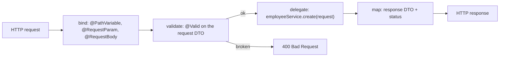
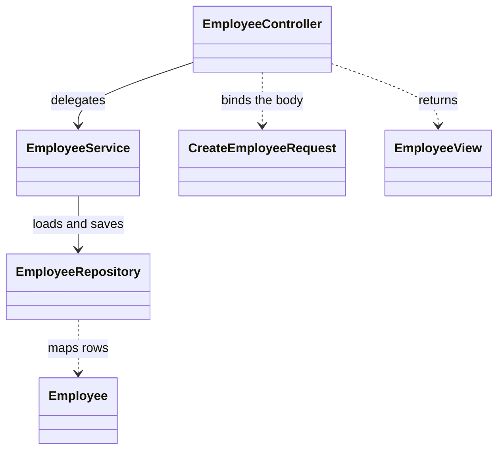
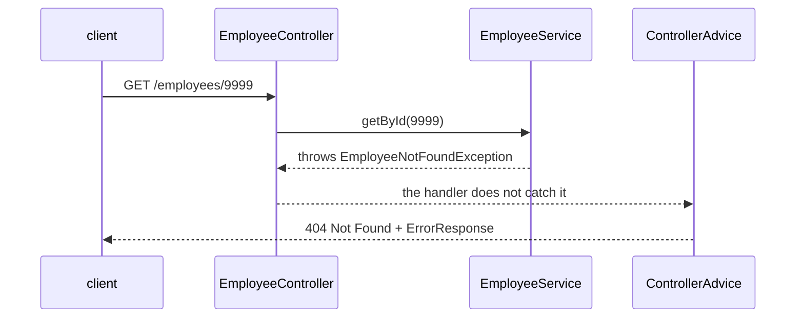

# Designing Endpoints in a REST Controller

Picking the URL is the first decision, not the whole job — that part is
[naming](topic:rest-endpoint-naming). Designing a controller means writing down
**four decisions per operation**:

1. **Which method and URL** name it.
2. **What binds out of the request** — path variable, query parameter, body,
   header.
3. **Which types cross the HTTP boundary** — a request DTO in, a response DTO
   out.
4. **Which status** answers, and what the body is when it does.

Everything else — validation, paging, error mapping — is one of those four made
explicit. And there is a fifth rule that is not per-operation: the method itself
does no work.

## What a handler method actually is

Four stages, and three of them are declarations rather than code. Binding
happens *before* your method body runs, so a letter where a number belongs is a
`400` you never see. Validation is annotations on the DTO. Mapping is the return
type plus the status. What is left to actually write is one line: the call to the
service.

That is the answer to "what belongs in a controller": **HTTP in, a call out, a
status back.** A controller is an adapter — see
[@Repository vs @Service](topic:spring-repository-vs-service) for the layer it
adapts to.

## The design of one resource

| Operation | Endpoint | In | Out | Status |
|---|---|---|---|---|
| List | `GET /employees` | filters + `Pageable` | `Page<EmployeeView>` | `200` |
| Read one | `GET /employees/{id}` | `id` | `EmployeeView` | `200` / `404` |
| Create | `POST /employees` | `CreateEmployeeRequest` | `EmployeeView` | `201` + `Location` |
| Replace | `PUT /employees/{id}` | `id` + `UpdateEmployeeRequest` | `EmployeeView` | `200` / `204` |
| Change part | `PATCH /employees/{id}` | `id` + patch body | `EmployeeView` | `200` / `204` |
| Delete | `DELETE /employees/{id}` | `id` | — | `204` |

One controller owns one resource, because that is what makes the class readable
and what keeps its dependencies to one service. Which of `PUT` and `PATCH` you
expose is a separate decision with its own trade-offs — see
[PUT vs PATCH](topic:put-vs-patch). When two different departments change two
different parts of the same entity, that is an argument for **sub-resources**
(`PUT /employees/{id}/salary`) rather than one fat body; the reasoning is worked
through in [REST and separation of concerns](topic:employee-api-rest-cqrs) and
[Employee API: Design](topic:employee-api-design).

## Where each part of the request goes

- **Path** — identity: `/employees/{id}`. It is part of the resource's name.
- **Query string** — selection: filters, sort, `page`, `size`. Selecting part of
  a collection does not make a new resource.
- **Body** — the data being sent. `GET` and `DELETE` have no defined body
  semantics; caches key on the URL and intermediaries may drop it.
- **Headers** — metadata about the call, not about the resource:
  `Authorization`, `Accept`, `Idempotency-Key`, correlation ids.

The parameter list of the method is that decision, written in Java. Which is why
`@RequestParam Map<String, String> everything` is not a shortcut — it is the
design being deleted.

## The types that cross the boundary

`Employee` is a database row with an identity and a lifecycle. `EmployeeView` is
a message. Letting the entity be both is the single most common controller
mistake:

- **Outbound**, the JSON becomes whatever the table happens to hold. Renaming a
  column breaks every client. A lazy association turns serialization into extra
  queries — the [N+1 problem](topic:hibernate-n-plus-one) firing inside the
  Jackson writer, after the transaction has closed. A field nobody meant to
  publish is one forgotten annotation away from the wire.
- **Inbound**, it is worse: the client is now allowed to send `id`, `createdAt`,
  `role`, `version`. Every one of those needs code to ignore it, and the code to
  ignore it is more work than a DTO with three fields.

A request DTO also gives validation somewhere to live, and gives the endpoint a
shape you can publish — see [sharing API endpoints](topic:sharing-api-endpoints).

## Status codes are part of the contract

The status line is the part of the answer machines read: clients, gateways and
retry policies branch on it before anyone parses JSON.

- `201 Created` **plus `Location`** for a create — the server invented the id, so
  it has to say where the thing now lives. `200` forces every client to dig the
  id out of the body.
- `204 No Content` for a delete, and for an update that returns nothing. `204`
  promises there is nothing to read, so returning a body with it is a
  contradiction a client is entitled to ignore.
- `400` for a malformed request, `404` for a thing that is not there, `409` for a
  conflict with the current state, `422` when the syntax is fine but the content
  is not.
- `202 Accepted` when you took the work but have not done it yet — the honest
  answer for long operations, with a status URL to poll.

Never `200 {"success": false}`. That is an error smuggled past every layer that
was built to notice errors.

## Errors: one place, not one per method

The service throws a domain exception; the handler lets it fly; a single
`@RestControllerAdvice` maps exception types to statuses and produces one error
body for the whole API. A `try/catch` in the handler would duplicate that
decision in every method and let two endpoints disagree about what "not found"
looks like. Keep the exception types in the domain vocabulary and map them at the
edge — see [resource exception handling](topic:resource-exception-handling).

## Collections have a size

`List<EmployeeView>` is fine on the developer's twenty rows and an outage on
production's two million: one request builds the whole list in heap, serializes
it, and the client waits for all of it. So a collection endpoint is designed with
`page` and `size` from the start, a **default** size and a **hard cap** — because
the client is the one choosing, and `?size=1000000` is a request for the whole
table. Sorting and filters are parameters of the same endpoint, not new
endpoints.

## The controller does no work

A rule that lives inside a handler method can only be reached by an HTTP request.
A scheduled job, a Kafka consumer and a unit test each need their own copy, and
the transaction boundary is now in the wrong place — `@Transactional` belongs on
the service method that does the whole operation, not around half of it (see
[how @Transactional works](topic:spring-transactional-proxy)). The test for
"a raise above the grade cap is rejected" should be three lines against a
service, not a `MockMvc` request.

So: no repository calls, no transaction, no business branching, no
`if (user.isAdmin())` buried in a mapping method. If a handler is longer than
five lines, something below it is missing.

## The 60-second interview answer

> I start from the resource, not the operations: one controller owns one
> resource, `/employees` and `/employees/{id}`, and every operation is one method
> on it — `GET` list, `GET` one, `POST` create, `PUT`/`PATCH` change, `DELETE`.
> For each one I decide four things: what binds out of the request — id in the
> path, filters and paging in the query string, data in the body; what types
> cross the boundary — a request DTO and a response DTO, never the JPA entity;
> which status answers — `201` with `Location` for a create, `204` with no body
> for a delete, `200` otherwise; and what the method does, which is bind,
> validate with `@Valid`, call the service, map the result. Collections are paged
> with a default and a capped size. Errors are domain exceptions mapped to
> statuses by one `@RestControllerAdvice`, so the error format is part of the
> contract instead of per-method improvisation. The controller itself holds no
> business logic — that lives in the service, where a scheduler, a consumer and a
> test can reach it too.

## Why it matters in production

- **The DTO boundary is what lets the schema move.** With entities on the wire,
  every refactor of the table is a coordinated release with other teams. With
  DTOs it is a mapping change in one file.
- **A missing page cap is a denial of service you shipped yourself.** One
  `?size=1000000` against a table that grew is an `OutOfMemoryError` in a
  service that was fine yesterday.
- **A consistent error body is what makes clients handle errors at all.** If
  half the endpoints return `{"error": "..."}` and half return a stack trace,
  clients end up matching on strings.
- **Retries need more than a good design.** A well-shaped `POST /employees` can
  still create two rows when the client retries after a timeout; that is an
  `Idempotency-Key` and a de-duplication decision — see
  [avoiding duplicate sales](topic:duplicate-sale-prevention).
- **Browsers add their own layer.** A public endpoint called from a web app has
  to answer preflight requests too; see [CORS](topic:cors).
- **The signature is the published contract.** Adding a required field to a
  request DTO breaks every existing caller, so evolution is additive-optional
  first, then a new version — which is also what a gateway routes on, see
  [why an API gateway is needed](topic:api-gateway).

## Common misconceptions

- **"The controller should validate everything."** It validates *shape*:
  required, non-blank, in range, well-formed. "This employee may not exceed their
  grade cap" needs the data, so it belongs in the service. Split by what the rule
  needs to know.
- **"Returning the entity is fine, it's just JSON."** It is a promise that your
  table is your API. It also serializes lazily-loaded associations, publishes
  fields you forgot about, and lets clients set fields you never meant to accept.
- **"`ResponseEntity` everywhere is more professional."** Return it when you set
  the status or headers yourself — a `201` with `Location`, a `204`. When the
  status is always `200`, returning the DTO is clearer, and `@ResponseStatus`
  covers the fixed cases.
- **"Wrap everything in try/catch so the API never 500s."** A caught-and-hidden
  exception becomes a `200` with an empty body, which is a worse failure than a
  `500`: nothing retries, nothing alerts, and the client believes it worked.
- **"One controller per screen."** Screens change weekly and resources do not. A
  screen that needs three resources makes three calls, or gets an explicit
  aggregate endpoint — not a controller shaped like a page layout.
- **"Paging is an optimisation for later."** It is a contract change: adding
  `Page<T>` to an endpoint that returned an array breaks every consumer. Design
  it in on day one.
- **"The status code doesn't really matter, the body says what happened."** Only
  your own client reads the body. Caches, proxies, gateways, retry policies,
  circuit breakers and monitoring all read the status.
