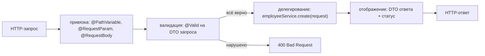
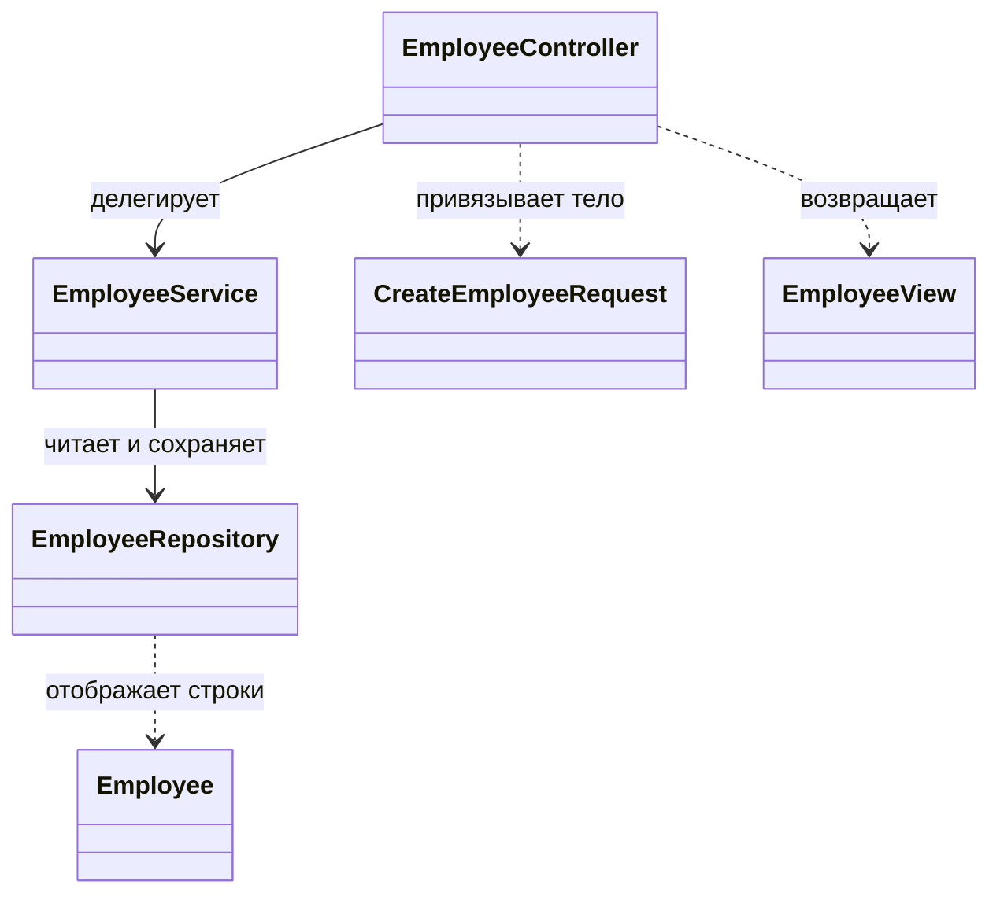
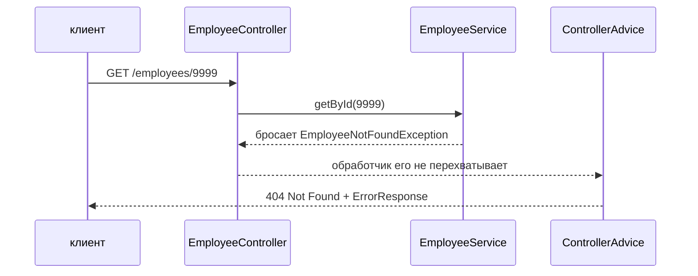

# Проектирование эндпоинтов в REST-контроллере

Выбрать URL — первое решение, а не вся работа: это про
[именование](topic:rest-endpoint-naming). Спроектировать контроллер значит
записать **четыре решения на операцию**:

1. **Какие метод и URL** её называют.
2. **Что извлекается из запроса** — переменная пути, параметр строки запроса,
   тело, заголовок.
3. **Какие типы пересекают границу HTTP** — DTO запроса на вход, DTO ответа на
   выход.
4. **Какой статус** отвечает и какое при этом тело.

Всё остальное — валидация, постраничность, отображение ошибок — это одно из этих
четырёх решений, сделанное явным. И есть пятое правило, не привязанное к
операции: сам метод не делает работу.

## Что на самом деле представляет собой метод-обработчик

Четыре стадии, и три из них — декларации, а не код. Привязка происходит *до*
того, как выполнится тело вашего метода, поэтому буква там, где ждали число, —
это `400`, которого вы даже не увидите. Валидация — это аннотации на DTO.
Отображение — это тип возврата плюс статус. Написать остаётся одну строку: вызов
сервиса.

Это и есть ответ на вопрос «что относится к контроллеру»: **HTTP внутрь, вызов
наружу, статус обратно.** Контроллер — адаптер; о слое, к которому он
адаптирует, см. [@Repository vs @Service](topic:spring-repository-vs-service).

## Дизайн одного ресурса

| Операция | Эндпоинт | Вход | Выход | Статус |
|---|---|---|---|---|
| Список | `GET /employees` | фильтры + `Pageable` | `Page<EmployeeView>` | `200` |
| Чтение одного | `GET /employees/{id}` | `id` | `EmployeeView` | `200` / `404` |
| Создание | `POST /employees` | `CreateEmployeeRequest` | `EmployeeView` | `201` + `Location` |
| Замена | `PUT /employees/{id}` | `id` + `UpdateEmployeeRequest` | `EmployeeView` | `200` / `204` |
| Изменение части | `PATCH /employees/{id}` | `id` + тело изменений | `EmployeeView` | `200` / `204` |
| Удаление | `DELETE /employees/{id}` | `id` | — | `204` |

Один контроллер владеет одним ресурсом: именно это делает класс читаемым и
удерживает его зависимости на одном сервисе. Что выставлять для изменения —
`PUT` или `PATCH` — отдельное решение со своими компромиссами, см.
[PUT против PATCH](topic:put-vs-patch). Когда разные отделы меняют разные части
одной сущности, это аргумент за **под-ресурсы**
(`PUT /employees/{id}/salary`), а не за одно раздутое тело; рассуждение
разобрано в [REST и разделении ответственности](topic:employee-api-rest-cqrs) и
[API сотрудника: Дизайн](topic:employee-api-design).

## Куда идёт каждая часть запроса

- **Путь** — идентичность: `/employees/{id}`. Это часть имени ресурса.
- **Строка запроса** — выборка: фильтры, сортировка, `page`, `size`. Выбор части
  коллекции не создаёт новый ресурс.
- **Тело** — отправляемые данные. У `GET` и `DELETE` нет определённой семантики
  тела: кэши ключуются по URL, а посредники тело могут выбросить.
- **Заголовки** — метаданные вызова, а не ресурса: `Authorization`, `Accept`,
  `Idempotency-Key`, идентификаторы корреляции.

Список параметров метода — это то самое решение, записанное на Java. Поэтому
`@RequestParam Map<String, String> everything` — не сокращение, а стёртый дизайн.

## Типы, пересекающие границу

`Employee` — строка базы с идентичностью и жизненным циклом. `EmployeeView` —
сообщение. Позволить сущности быть и тем и другим — самая частая ошибка
контроллера:

- **На выходе** JSON становится тем, что оказалось в таблице. Переименование
  колонки ломает всех клиентов. Ленивая связь превращает сериализацию в
  дополнительные запросы — [проблема N+1](topic:hibernate-n-plus-one),
  срабатывающая внутри писателя Jackson, уже после закрытия транзакции. А поле,
  которое никто не собирался публиковать, отделено от провода одной забытой
  аннотацией.
- **На входе** хуже: клиенту теперь позволено прислать `id`, `createdAt`,
  `role`, `version`. Каждое из них требует кода, который его проигнорирует, — а
  такого кода больше, чем DTO из трёх полей.

DTO запроса ещё и даёт валидации место, где жить, и придаёт эндпоинту форму,
которую можно опубликовать, — см.
[как делиться эндпоинтами](topic:sharing-api-endpoints).

## Коды статусов — часть контракта

Строка статуса — та часть ответа, которую читают машины: клиенты, шлюзы и
политики повторов ветвятся по ней ещё до того, как кто-то разберёт JSON.

- `201 Created` **плюс `Location`** для создания: id придумал сервер, значит он
  и обязан сказать, где теперь лежит вещь. `200` заставляет каждого клиента
  выкапывать id из тела.
- `204 No Content` для удаления и для изменения, которое ничего не возвращает.
  `204` обещает, что читать нечего, поэтому тело вместе с ним — противоречие,
  которое клиент вправе проигнорировать.
- `400` для некорректного запроса, `404` для того, чего нет, `409` для конфликта
  с текущим состоянием, `422` когда синтаксис верен, а содержимое — нет.
- `202 Accepted`, когда работу приняли, но ещё не сделали: честный ответ для
  долгих операций, вместе с URL статуса для опроса.

Никогда — `200 {"success": false}`. Это ошибка, протащенная мимо всех слоёв,
которые построены, чтобы ошибки замечать.

## Ошибки: одно место, а не по одному на метод

Сервис бросает доменное исключение; обработчик не мешает ему лететь дальше;
единственный `@RestControllerAdvice` отображает типы исключений в статусы и
производит одно тело ошибки на весь API. `try/catch` в обработчике продублировал
бы это решение в каждом методе и позволил бы двум эндпоинтам разойтись в том,
как выглядит «не найдено». Держите типы исключений в словаре домена и отображайте
их на границе — см.
[обработку исключений ресурсов](topic:resource-exception-handling).

## У коллекций есть размер

`List<EmployeeView>` нормален на двадцати строках разработчика и превращается в
аварию на двух миллионах в проде: один запрос собирает весь список в куче,
сериализует его, и клиент ждёт всё целиком. Поэтому эндпоинт коллекции
проектируется с `page` и `size` сразу, со значением **по умолчанию** и **жёстким
максимумом** — потому что выбирает клиент, а `?size=1000000` — это запрос всей
таблицы. Сортировка и фильтры — параметры того же эндпоинта, а не новые
эндпоинты.

## Контроллер не делает работу

До правила, живущего внутри метода-обработчика, можно добраться только
HTTP-запросом. Планировщику, консьюмеру Kafka и юнит-тесту нужна каждому своя
копия, а транзакционная граница оказывается не в том месте: `@Transactional`
принадлежит методу сервиса, который выполняет операцию целиком, а не её половину
(см. [как работает @Transactional](topic:spring-transactional-proxy)). Тест
«повышение выше потолка грейда отклоняется» должен быть тремя строчками против
сервиса, а не запросом через `MockMvc`.

Значит: никаких вызовов репозитория, никакой транзакции, никакого бизнесового
ветвления, никакого `if (user.isAdmin())`, закопанного в метод отображения. Если
обработчик длиннее пяти строк, чего-то под ним не хватает.

## Ответ на собеседовании за 60 секунд

> Я начинаю с ресурса, а не с операций: один контроллер владеет одним ресурсом,
> `/employees` и `/employees/{id}`, и каждая операция — один метод над ним:
> `GET` список, `GET` один, `POST` создать, `PUT`/`PATCH` изменить, `DELETE`
> удалить. Для каждой я принимаю четыре решения: что извлекается из запроса — id
> в пути, фильтры и постраничность в строке запроса, данные в теле; какие типы
> пересекают границу — DTO запроса и DTO ответа, но не JPA-сущность; какой статус
> отвечает — `201` с `Location` на создание, `204` без тела на удаление, иначе
> `200`; и что делает метод, а делает он следующее: привязать, проверить через
> `@Valid`, вызвать сервис, отобразить результат. Коллекции отдаются страницами
> со значением по умолчанию и ограниченным максимумом. Ошибки — это доменные
> исключения, отображаемые в статусы одним `@RestControllerAdvice`, поэтому
> формат ошибки — часть контракта, а не импровизация каждого метода. Сам
> контроллер не содержит бизнес-логики: она в сервисе, где до неё дотянутся и
> планировщик, и консьюмер, и тест.

## Почему это важно в продакшене

- **Граница DTO — это то, что позволяет схеме двигаться.** С сущностями на
  проводе каждый рефакторинг таблицы — согласованный релиз с другими командами.
  С DTO это изменение маппинга в одном файле.
- **Отсутствие ограничения страницы — это отказ в обслуживании, который вы
  выпустили сами.** Один `?size=1000000` по выросшей таблице — это
  `OutOfMemoryError` в сервисе, который вчера был в порядке.
- **Единый формат ошибки — это то, что вообще заставляет клиентов обрабатывать
  ошибки.** Если половина эндпоинтов возвращает `{"error": "..."}`, а половина —
  стек-трейс, клиенты начинают сопоставлять строки.
- **Повторам нужен не только хороший дизайн.** Правильно устроенный
  `POST /employees` всё ещё может создать две строки, если клиент повторит запрос
  после таймаута; это `Idempotency-Key` и решение о дедупликации — см.
  [как избежать дублей продаж](topic:duplicate-sale-prevention).
- **Браузеры добавляют свой слой.** Публичный эндпоинт, вызываемый из
  веб-приложения, обязан отвечать и на preflight-запросы; см. [CORS](topic:cors).
- **Сигнатура — это опубликованный контракт.** Добавление обязательного поля в
  DTO запроса ломает всех существующих вызывающих, поэтому развитие идёт сначала
  добавлением необязательного, а затем новой версией — по которой, кстати,
  маршрутизирует шлюз, см.
  [зачем нужен API Gateway](topic:api-gateway).

## Частые заблуждения

- **«Контроллер должен валидировать всё».** Он валидирует *форму*:
  обязательность, непустоту, диапазон, корректный формат. «Этот сотрудник не
  может превысить потолок своего грейда» требует данных, поэтому живёт в сервисе.
  Делите по тому, что правилу нужно знать.
- **«Возвращать сущность нормально, это же просто JSON».** Это обещание, что ваша
  таблица и есть ваш API. Плюс сериализация лениво загруженных связей, публикация
  полей, о которых вы забыли, и возможность для клиентов выставлять поля, которые
  вы принимать не собирались.
- **«`ResponseEntity` везде — это профессиональнее».** Возвращайте его, когда сами
  задаёте статус или заголовки: `201` с `Location`, `204`. Когда статус всегда
  `200`, возврат DTO понятнее, а фиксированные случаи закрывает
  `@ResponseStatus`.
- **«Оберни всё в try/catch, чтобы API никогда не отдавал 500».**
  Перехваченное и спрятанное исключение превращается в `200` с пустым телом, а
  это отказ хуже, чем `500`: ничто не повторяется, ничто не алертит, и клиент
  уверен, что всё получилось.
- **«По контроллеру на экран».** Экраны меняются еженедельно, ресурсы — нет.
  Экрану, которому нужны три ресурса, делает три вызова или получает явный
  агрегирующий эндпоинт, но не контроллер в форме вёрстки страницы.
- **«Постраничность — оптимизация на потом».** Это изменение контракта:
  добавление `Page<T>` в эндпоинт, который возвращал массив, ломает всех
  потребителей. Проектируйте её с первого дня.
- **«Код статуса не так уж важен, в теле же написано, что произошло».** Тело
  читает только ваш собственный клиент. Статус читают кэши, прокси, шлюзы,
  политики повторов, circuit breaker'ы и мониторинг.
