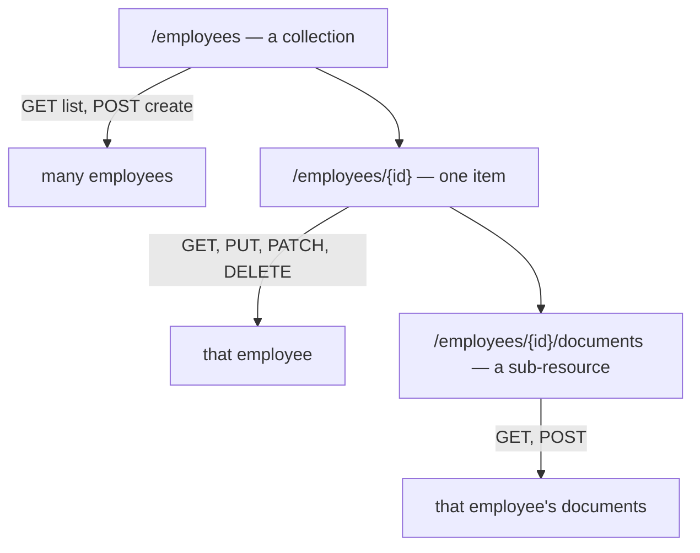
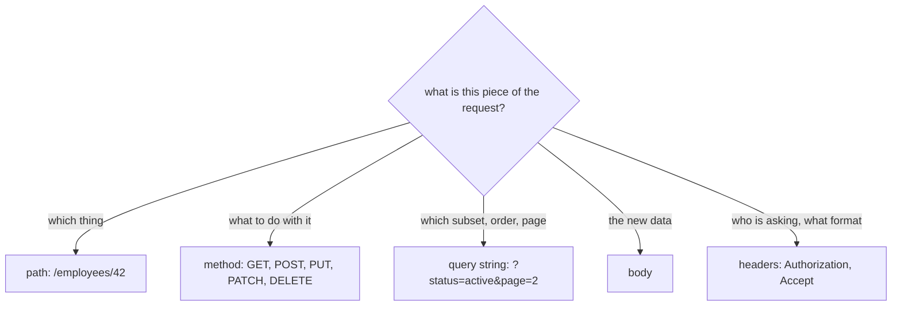

# Naming REST Endpoints

An endpoint has two halves, and the whole question is which half gets which job:

- the **path** names the **thing** — a noun;
- the **method** names **what happens to it** — the verb.

So there is no `/getEmployee` and no `/updateEmployee`. There is one URL that
names an employee, and `GET`, `PUT`, `PATCH` and `DELETE` are the things you can
do to it. The action never appears in the path, because the action already has a
place to live.

## The shape of a surface

Three kinds of URL cover almost everything:

Read the URL column on its own: `/employees`, `/employees/{id}`,
`/employees/{id}/documents`. It reads like the nouns your domain already talks
about — which is the point. A consumer who has seen one endpoint can guess the
next one, and that is the only measurable benefit of the convention.

| Operation | Endpoint | Success |
|---|---|---|
| List employees | `GET /employees` | `200` |
| Read one | `GET /employees/{id}` | `200` / `404` |
| Create | `POST /employees` | `201` + `Location` |
| Replace | `PUT /employees/{id}` | `200` / `204` |
| Change part of one | `PATCH /employees/{id}` | `200` / `204` |
| Delete | `DELETE /employees/{id}` | `204` |

`POST` goes to the **collection** because the client does not yet know the id —
the server invents it and returns it in `Location`. `PUT`, `PATCH` and `DELETE`
go to the **item**, because you have to say which one. Which of `PUT` and `PATCH`
you expose for "change data" is a separate decision with its own trade-offs; see
[PUT vs PATCH](topic:put-vs-patch).

## Where each part of a request goes

Most naming arguments end the moment you ask "what kind of information is this?"

Identity goes in the path; selection goes in the query string. That is why
`GET /employees/42` is right and `GET /employees?id=42` is not: an id identifies
one thing, it does not filter a list. And it is why
`/employees?department=finance&status=active&sort=-hiredAt&page=2` is right and
`/employees/byDepartment/finance` is not: a filtered list is the same collection
seen through a window, not a new resource. Move the window into the path and
every combination of filters needs a URL of its own.

## Spelling: the small rules

They matter only because a path is compared byte for byte — a router does not
know that `/Employees` and `/employees` were meant to be the same thing.

- **Lower case, hyphens for multi-word nouns**: `/purchase-orders`, not
  `/purchaseOrders` or `/purchase_orders`. Hostnames are case-insensitive; paths
  are not, so a capital letter is a second URL.
- **Plural for collections**: `/employees/42`, consistently. Singular collections
  are defensible, mixing the two is not.
- **No trailing slash** — `/employees/` and `/employees` are different URLs,
  and one of them will be the one your client hard-codes.
- **No file extension**: the format is negotiated with `Accept`, not baked into
  the resource's name. `/employees.json` is a name that can never serve CSV.
- **No internal names**: the URL is a public vocabulary, so it should not leak
  `tbl_emp_v2` or a database column list.
- **Version where it can be routed**: `/api/v1/employees` is the common choice
  precisely because a gateway can route on it — see
  [why an API gateway is needed](topic:api-gateway). Header-based versioning is
  purer and harder to debug from a browser address bar.

## Actions that are not CRUD

Sooner or later something is a genuine verb: approve, cancel, recalculate,
send. Two honest options:

1. **Make the action a noun.** The result of the action is often a resource:
   `POST /orders/{id}/cancellation`, `POST /employees/{id}/salary-reviews`,
   `POST /invoices/{id}/refunds`. Now it has a URL, a body, a status and a
   history, and it can be read back with `GET`.
2. **Name the command explicitly.** `POST /orders/{id}/cancel` is not RESTful
   and is widely used anyway, because it is unambiguous. Keep it `POST` (never
   `GET`), keep it rare, and keep it consistent.

What you must not do is smuggle the action into a general-purpose endpoint —
`PATCH /employees/42` with `{"action":"approve"}` is an RPC call wearing a REST
costume, and no intermediary can make sense of it. The trade-offs of modelling
commands are worked through in
[Employee API: Commands](topic:employee-api-commands) and
[REST and separation of concerns](topic:employee-api-rest-cqrs).

## Why the split earns its keep

Because the noun and the verb are separate, a server can give two different
answers to what looks like one mistake:

- **404 Not Found** — there is no such thing.
- **405 Method Not Allowed** (plus `Allow: GET, PUT, DELETE`) — the thing is
  right there, it just does not do that.

An RPC surface can only ever say 404, because a name it does not know is a name
it does not know. The same split is what lets caches work (`GET` responses are
cacheable, and the URL is the cache key), what lets a proxy retry safely
(`GET`, `PUT` and `DELETE` are idempotent), and what lets an API be documented as
a table instead of a list of procedures.

That last point is why naming is a design task, not a style preference: the
endpoint names are the part of your service other teams actually integrate
against — see [sharing API endpoints](topic:sharing-api-endpoints) and
[Employee API: Design](topic:employee-api-design).

## The 60-second interview answer

> I name the URL after the thing and let the HTTP method say what happens to it.
> So a resource gets two URLs: the collection `/employees` and the item
> `/employees/{id}`. Reading is `GET` on either, creating is `POST` on the
> collection — the server assigns the id and returns it in `Location` —
> replacing is `PUT` on the item, a partial change is `PATCH`, removing is
> `DELETE`. There is no verb in the path, so no `/getEmployee` and no
> `/deleteEmployee`. Filtering, sorting and paging select part of the same
> collection, so they go in the query string:
> `/employees?department=finance&page=2`. Relationships become sub-resources,
> `/employees/{id}/documents`, but I stop nesting once an item has its own id.
> Conventions: lower case with hyphens, plural collections, no trailing slash, no
> file extension, version in the prefix. When an operation genuinely is not CRUD
> I model its result as a resource — `POST /orders/{id}/cancellation` — or accept
> an explicit `POST` command, but I never hide a write behind `GET`.

## Why it matters in production

- **A `GET` that changes data is an outage waiting for a crawler.** Browsers
  prefetch links, link-checkers follow them, and clients and gateways retry `GET`
  after a timeout because the method promises it is safe. `GET /users/42/delete`
  has taken out real databases.
- **A read behind `POST` throws away the infrastructure.** No caching, no
  bookmarkable URL, no safe retry, and a CDN in front of the service can do
  nothing for you.
- **Names are the hardest thing to change.** An endpoint with external consumers
  is a published contract; a rename means running both spellings and chasing
  clients for months. This is the piece of design that gets frozen first.
- **Guessability is a support cost.** On a consistent surface a consumer reads
  the docs once. On an RPC surface every operation is a separate question, and
  the answer is usually in a chat thread.
- **Retries need identity, not just a good name.** A well-named `POST /orders`
  can still create two orders when a client retries — that is a separate
  mechanism; see [avoiding duplicate sales](topic:duplicate-sale-prevention).

## Common misconceptions

- **"The verb has to be in the name or nobody knows what it does."** The method
  is part of the request, not decoration. `DELETE /employees/42` says what it
  does more precisely than `/deleteEmployee` does, because it also says which
  one.
- **"`POST /getEmployees` is fine, the filter body is too big for a URL."**
  It is a real constraint (proxies commonly cap a URL around 2–8 KB), and it is
  worth being deliberate about: you lose caching, bookmarking and safe retries.
  If you take that trade, keep the URL a noun — `POST /employees/searches` — so
  the surface stays readable.
- **"Singular vs plural is a style argument."** The argument is, the consistency
  is not. Half a surface in each dialect means every URL has to be looked up.
- **"Nest everything, it shows the hierarchy."**
  `/departments/3/employees/42/documents/7` forces a client to know the whole
  family tree to fetch one document. Once a document has its own id,
  `/documents/7` is enough; keep the nested URL for *listing* within a parent.
- **"Query parameters are not RESTful."** A URL with a query string is still a
  URL and still identifies a resource — the filtered list. Nothing about it is
  less RESTful than a path segment.
- **"`PUT` is for updates, `POST` is for creates, always."** `POST` to a
  collection is a create; `PUT` to a client-chosen URL can be a create too. What
  matters is what the body means, not the word "update".
- **"Endpoint naming is cosmetic."** It decides what a client can guess, what a
  cache can store, what a gateway can route and what a retry can safely repeat.
  None of that is cosmetic.
