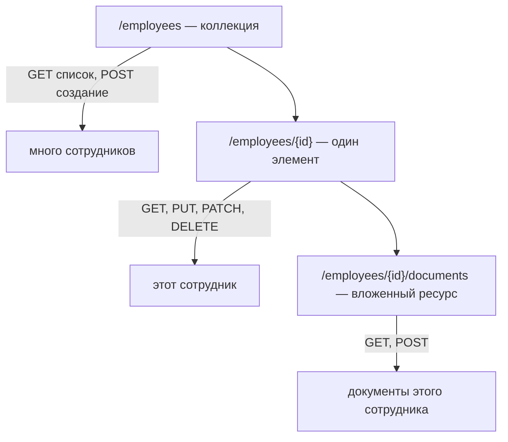
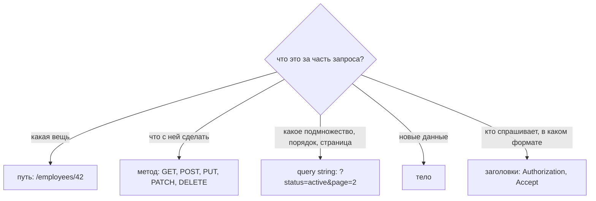

# Именование REST-эндпоинтов

У эндпоинта две половины, и весь вопрос в том, какая из них за что отвечает:

- **путь** называет **вещь** — существительное;
- **метод** называет **то, что с ней произойдёт**, — глагол.

Поэтому нет ни `/getEmployee`, ни `/updateEmployee`. Есть один URL, который
называет сотрудника, а `GET`, `PUT`, `PATCH` и `DELETE` — это то, что с ним
можно сделать. Действие никогда не появляется в пути, потому что у действия уже
есть своё место.

## Форма поверхности

Три вида URL покрывают почти всё:

Прочитайте один только столбец URL: `/employees`, `/employees/{id}`,
`/employees/{id}/documents`. Он читается как существительные, которыми ваша
предметная область уже пользуется, — в этом и смысл. Потребитель, увидевший один
эндпоинт, может угадать следующий, и это единственная измеримая польза от
соглашения.

| Операция | Эндпоинт | Успех |
|---|---|---|
| Список сотрудников | `GET /employees` | `200` |
| Прочитать одного | `GET /employees/{id}` | `200` / `404` |
| Создать | `POST /employees` | `201` + `Location` |
| Заменить | `PUT /employees/{id}` | `200` / `204` |
| Изменить часть | `PATCH /employees/{id}` | `200` / `204` |
| Удалить | `DELETE /employees/{id}` | `204` |

`POST` идёт по **коллекции**, потому что клиент ещё не знает id: сервер его
придумывает и возвращает в `Location`. `PUT`, `PATCH` и `DELETE` идут по
**элементу**, потому что нужно указать, какому именно. Что из `PUT` и `PATCH`
выставлять для «изменения данных» — отдельное решение со своими компромиссами,
см. [PUT против PATCH](topic:put-vs-patch).

## Куда попадает каждая часть запроса

Большинство споров об именовании заканчивается в тот момент, когда спрашиваешь:
«а что это за информация?»

Идентичность — в путь, выборка — в query string. Именно поэтому
`GET /employees/42` правильно, а `GET /employees?id=42` — нет: id опознаёт одну
вещь, а не фильтрует список. И поэтому
`/employees?department=finance&status=active&sort=-hiredAt&page=2` правильно, а
`/employees/byDepartment/finance` — нет: отфильтрованный список — это та же
коллекция, увиденная через окно, а не новый ресурс. Перенесите окно в путь — и
каждой комбинации фильтров понадобится собственный URL.

## Написание: мелкие правила

Они важны только потому, что путь сравнивается побайтово: маршрутизатор не
знает, что `/Employees` и `/employees` задумывались как одно и то же.

- **Нижний регистр, дефисы для составных существительных**: `/purchase-orders`,
  а не `/purchaseOrders` и не `/purchase_orders`. Имена хостов нечувствительны к
  регистру, пути — чувствительны, поэтому заглавная буква даёт второй URL.
- **Множественное число для коллекций**: `/employees/42`, и так везде.
  Единственное число для коллекций защитимо, а вот смешивать оба нельзя.
- **Без слэша в конце**: `/employees/` и `/employees` — разные URL, и именно один
  из них ваш клиент зашьёт в код.
- **Без расширения файла**: формат согласуется заголовком `Accept`, а не
  вшивается в имя ресурса. `/employees.json` — имя, которое никогда не сможет
  отдать CSV.
- **Без внутренних имён**: URL — это публичный словарь, поэтому он не должен
  выдавать наружу `tbl_emp_v2` или список колонок таблицы.
- **Версия там, где по ней можно маршрутизировать**: `/api/v1/employees` —
  распространённый выбор именно потому, что по нему может маршрутизировать шлюз,
  см. [зачем нужен API Gateway](topic:api-gateway). Версионирование заголовком
  чище, но его труднее отладить из адресной строки браузера.

## Действия, которые не CRUD

Рано или поздно что-то оказывается настоящим глаголом: подтвердить, отменить,
пересчитать, отправить. Есть два честных варианта:

1. **Сделать действие существительным.** Результат действия часто и есть ресурс:
   `POST /orders/{id}/cancellation`, `POST /employees/{id}/salary-reviews`,
   `POST /invoices/{id}/refunds`. Теперь у него есть URL, тело, статус и
   история, и его можно прочитать обратно через `GET`.
2. **Назвать команду явно.** `POST /orders/{id}/cancel` — не RESTful, и всё
   равно так делают повсеместно, потому что это однозначно. Оставьте `POST`
   (никогда не `GET`), держите такие эндпоинты редкими и единообразными.

Чего делать нельзя — так это протаскивать действие через универсальный эндпоинт:
`PATCH /employees/42` с телом `{"action":"approve"}` — это RPC-вызов в костюме
REST, и ни один посредник не сможет в нём разобраться. Компромиссы моделирования
команд разобраны в [API сотрудника: Команды](topic:employee-api-commands) и
[REST и разделение ответственности](topic:employee-api-rest-cqrs).

## Чем окупается это разделение

Раз существительное и глагол разделены, сервер может дать два разных ответа на
то, что выглядит как одна ошибка:

- **404 Not Found** — такой вещи нет.
- **405 Method Not Allowed** (плюс `Allow: GET, PUT, DELETE`) — вещь на месте,
  просто она так не умеет.

RPC-поверхность способна ответить только 404: незнакомое имя — это незнакомое
имя, и всё. То же разделение позволяет работать кэшам (ответы `GET` кэшируемы, а
ключом кэша служит URL), позволяет прокси безопасно повторять запрос (`GET`,
`PUT` и `DELETE` идемпотентны) и позволяет документировать API таблицей, а не
списком процедур.

Последнее и объясняет, почему именование — это задача проектирования, а не
вопрос стиля: имена эндпоинтов — та часть вашего сервиса, с которой другие
команды реально интегрируются, см.
[общий доступ к API-эндпоинтам](topic:sharing-api-endpoints) и
[API сотрудника: Дизайн](topic:employee-api-design).

## Ответ на собеседовании за 60 секунд

> Я называю URL по вещи, а что с ней произойдёт — говорит HTTP-метод. Поэтому у
> ресурса два URL: коллекция `/employees` и элемент `/employees/{id}`. Чтение —
> это `GET` по любому из них, создание — `POST` по коллекции (сервер назначает
> id и возвращает его в `Location`), замена — `PUT` по элементу, частичное
> изменение — `PATCH`, удаление — `DELETE`. Глагола в пути нет, поэтому никаких
> `/getEmployee` и `/deleteEmployee`. Фильтрация, сортировка и постраничность
> выбирают часть той же коллекции, поэтому они уходят в query string:
> `/employees?department=finance&page=2`. Связи становятся вложенными ресурсами,
> `/employees/{id}/documents`, но я перестаю вкладывать, как только у элемента
> появляется собственный id. Соглашения: нижний регистр с дефисами,
> множественное число для коллекций, без слэша в конце, без расширения файла,
> версия в префиксе. Когда операция действительно не CRUD, я моделирую её
> результат как ресурс — `POST /orders/{id}/cancellation` — или соглашаюсь на
> явную команду через `POST`, но никогда не прячу запись за `GET`.

## Почему это важно в продакшене

- **`GET`, который меняет данные, — это авария, ждущая краулера.** Браузеры
  предзагружают ссылки, проверяльщики ссылок по ним ходят, а клиенты и шлюзы
  повторяют `GET` после таймаута, потому что метод обещает безопасность.
  `GET /users/42/delete` уже выносил реальные базы.
- **Чтение за `POST` выбрасывает всю инфраструктуру.** Ни кэширования, ни URL,
  который можно сохранить в закладки, ни безопасного повтора — и CDN перед
  сервисом ничем не поможет.
- **Имена тяжелее всего менять.** Эндпоинт с внешними потребителями — это
  опубликованный контракт; переименование означает месяцы работы обоих написаний
  и погони за клиентами. Эта часть дизайна замораживается первой.
- **Предсказуемость — это стоимость поддержки.** На единообразной поверхности
  потребитель читает документацию один раз. На RPC-поверхности каждая операция —
  отдельный вопрос, и ответ на него обычно лежит в переписке.
- **Повторам нужна идентичность, а не только хорошее имя.** Даже отлично
  названный `POST /orders` при повторе клиента может создать два заказа — это
  отдельный механизм, см.
  [как избежать дублирующих продаж](topic:duplicate-sale-prevention).

## Распространённые заблуждения

- **«Глагол должен быть в имени, иначе никто не поймёт, что это делает».** Метод
  — часть запроса, а не украшение. `DELETE /employees/42` говорит о действии
  точнее, чем `/deleteEmployee`, потому что заодно говорит, над кем именно.
- **«`POST /getEmployees` — это нормально, тело фильтра не влезает в URL».** Это
  реальное ограничение (прокси обычно режут URL где-то на 2–8 КБ), и решать его
  стоит осознанно: вы теряете кэширование, закладки и безопасные повторы. Если
  идёте на такой размен, оставьте URL существительным —
  `POST /employees/searches`, — чтобы поверхность осталась читаемой.
- **«Единственное или множественное число — спор о стиле».** Спор — да,
  последовательность — нет. Половина поверхности на одном диалекте, половина на
  другом означает, что каждый URL приходится смотреть в документации.
- **«Вкладывайте всё, это же показывает иерархию».**
  `/departments/3/employees/42/documents/7` заставляет клиента знать всё
  генеалогическое древо, чтобы забрать один документ. Раз у документа есть
  собственный id, хватит `/documents/7`; вложенный URL оставьте для *списка*
  внутри родителя.
- **«Параметры запроса — это не RESTful».** URL с query string — всё ещё URL, и
  он всё так же опознаёт ресурс — отфильтрованный список. Ничем он не менее
  RESTful, чем сегмент пути.
- **«`PUT` — для изменений, `POST` — для создания, всегда».** `POST` по
  коллекции — это создание; `PUT` по URL, выбранному клиентом, тоже может быть
  созданием. Важно, что означает тело, а не слово «изменение».
- **«Именование эндпоинтов — косметика».** Оно решает, что клиент сможет
  угадать, что кэш сможет сохранить, по чему шлюз сможет маршрутизировать и что
  повтор сможет безопасно продублировать. Ничего косметического здесь нет.
