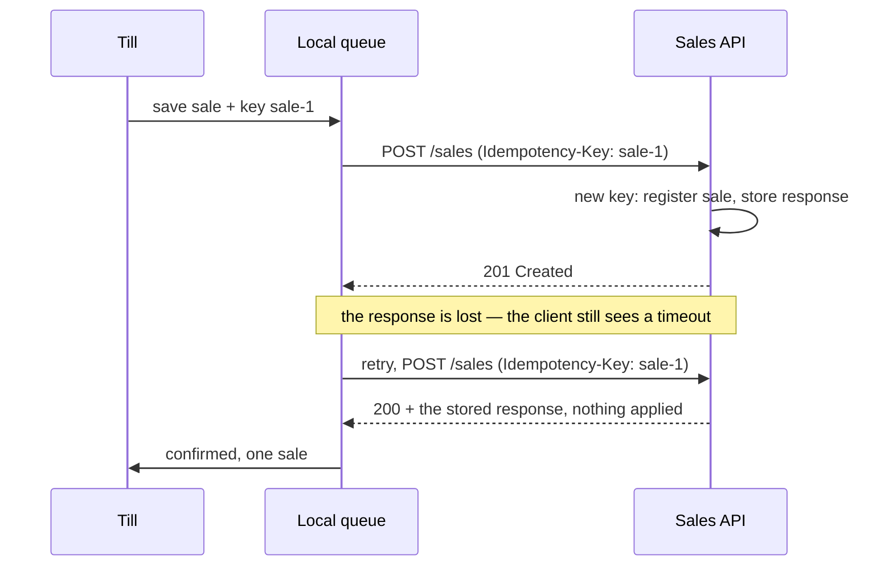
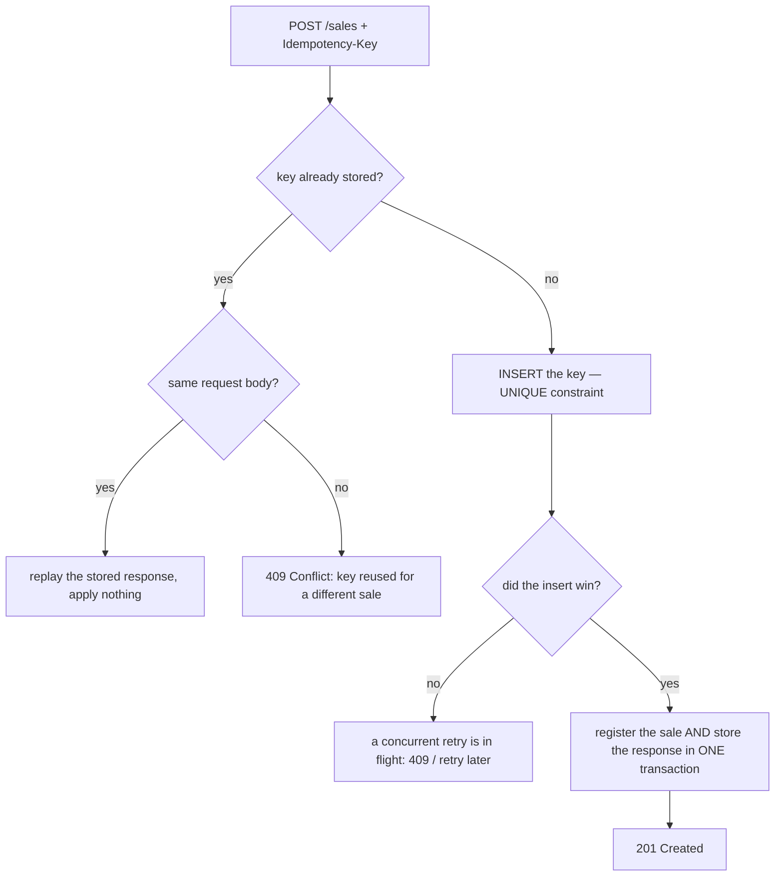
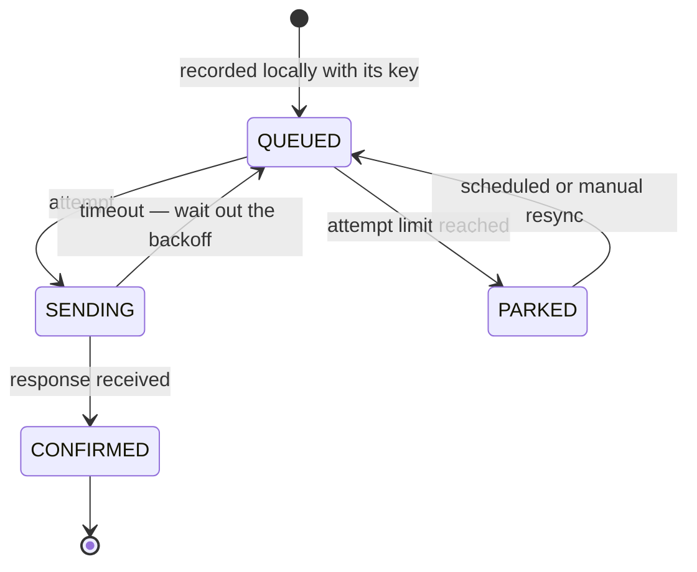

# Registering Sales over an Unreliable Connection

A till in a market stall, a courier's phone in a lift, a vending machine on a
GSM modem. Money changes hands locally; the backend has to learn about it over a
link that drops mid-request. The question is not "how do I retry" — it is "how do
I retry without ever charging the customer twice, and without ever losing a
sale".

## The one problem that generates all the others

The client sends `POST /sales` and gets… nothing. A timeout. There are exactly
two possible worlds behind that silence:

1. the request never reached the server — nothing was registered;
2. the server registered the sale and the **response** was lost on the way back.

**The client cannot tell them apart.** A timeout is not an answer. So the client
has only two bad options — give up (and lose real money in world 2's twin, world
1) or retry (and double-charge in world 2) — unless you remove the dilemma by
making the retry *safe*. That is the whole design: make the write idempotent, and
then retry as much as you like.



## The design in four moves

### 1. The client mints the idempotency key, once, per business action

The key is born with the sale, on the device, **before** the first network call —
a UUID, or `deviceId + local sequence number`. Not on the server (the server may
never see the first attempt), not per HTTP attempt, not derived from the payload.

This is the single most important decision, and the classic interview trap: if
the retry path re-creates the sale and generates a *fresh* key, you have no
idempotency at all — the server sees two different sales and registers both. Run
the **A new key per retry** example and watch the total double.

### 2. The sale is written locally before it is sent

The device gets a durable local queue (SQLite, a WAL file, Room/Core Data —
anything that survives a crash and a dead battery). `recordSale` commits locally;
sending is a separate, retryable step. Two consequences:

- the till keeps selling while offline (**store-and-forward**), and
- a sale is never "lost in a request", because the request was never where the
  sale lived.

This is the client-side mirror of the [Outbox pattern](topic:outbox-pattern) —
write the business fact and the "must be delivered" record together, deliver
later.

### 3. The client retries with capped exponential backoff and jitter

Same key, growing delay: 200 ms, 400 ms, 800 ms… up to a cap (say 30 s), plus
random jitter so a fleet of tills does not retry in lockstep and flatten the
server the moment it recovers. After N attempts the sale is *parked*, not
dropped — a background sync or an operator retries it later. Retry only on
timeouts, 5xx and 429; a 400 will never succeed no matter how often you send it.
Pair this with sane [timeouts, fallbacks and circuit
breakers](topic:service-timeouts-fallbacks) on the calling side.

### 4. The server deduplicates by the key, and replays the stored response

The server keeps an **idempotency store**: `key -> (status, response body,
created_at)`. For each request:



Two details do the real work:

- **The dedup record and the business write share one local transaction.** If
  they did not, a crash between them would leave a key with no sale (silently
  swallowing it forever) or a sale with no key (letting the retry duplicate it).
  This is the [ACID](topic:acid-principles) atomicity you already have inside one
  database — use it.
- **Store and replay the response, don't just skip.** A retry must get the same
  answer as the original: the same receipt id, the same `201`-equivalent body.
  "Silently ignore" leaves the client unable to confirm and unable to show a
  receipt. This is the difference between deduplication and idempotency.

If the sale is consumed asynchronously from a broker rather than over HTTP, the
same server-side idea has a name: the [Inbox pattern](topic:inbox-pattern).

## Concurrency: two retries at once

A slow first attempt plus an eager retry can put two requests with the same key
on two instances at the same moment. Neither finds the key, both try to register
— unless the uniqueness check *is* the write. Put a **unique constraint on the
key column** and let the database arbitrate: the loser gets a constraint
violation and returns `409`/"retry shortly" instead of a second sale. An
application-level `if (exists)` check is a race, not a guard — the same reasoning
as [optimistic vs pessimistic locking](topic:optimistic-vs-pessimistic-locking).
A distributed lock in Redis is an optimisation on top, never the source of truth
(see [Redis vs PostgreSQL for unique
values](topic:redis-vs-postgresql-uniqueness)).

## The API shape

```
POST /sales
Idempotency-Key: 5f2a-…            # or saleId inside the body
{ "saleId": "5f2a-…", "deviceId": "pos-7", "occurredAt": "2026-07-27T10:04:11Z",
  "lines": [...], "total": 250 }

201 Created   — first time, body = the registered sale
200 OK        — replay of a stored response, nothing applied
409 Conflict  — same key, different body (or a concurrent attempt in flight)
```

Notice the sale carries its **own** id and its **own** timestamp. Both come from
the device, because the server's clock says when the sale *synced*, not when it
*happened*. A `PUT /sales/{saleId}` is an equally good shape: a client-chosen id
makes the whole endpoint naturally idempotent, which is exactly what `PUT` means.

## The lifecycle you are actually building



`CONFIRMED` is the only state in which the local row may be pruned, and even then
most systems keep it for a while so a reconciliation job can compare the device's
sales against the server's.

## The things that bite in production

- **Key retention.** The idempotency store cannot grow forever, but the retention
  window must outlast the longest possible retry — including a till that was in a
  drawer for a week. Purge after, say, 30 days, not 30 minutes; index the key
  column so the lookup stays cheap ([database indexes](topic:database-indexes)).
- **Ordering.** Sales synced hours late arrive out of order. Never let the
  arrival order define business order: sort by the client's `occurredAt` plus a
  per-device sequence number.
- **Clock skew.** Device clocks are wrong, sometimes by years. Record both
  `occurredAt` (device) and `receivedAt` (server), and reject or flag anything
  implausible instead of trusting either one blindly.
- **Same key, different body.** Almost always a client bug (a reused key). Fail
  loudly with `409` — quietly returning the old response hides a real, different
  sale.
- **Partial failure downstream.** If registering a sale also triggers loyalty
  points and an email, don't do that inline; write the sale and an outbox row,
  and let the [Outbox pattern](topic:outbox-pattern) fan out afterwards.
- **Reconciliation.** Idempotency protects each sale; nothing protects you from
  a device whose queue was wiped. A daily "device says N sales, server has M" job
  is the only way to notice.

## The 60-second interview answer

> The client can never distinguish "my request was lost" from "the response was
> lost", so I make the write idempotent and retry freely. The till generates a
> `saleId`/idempotency key when the sale happens and writes the sale to a durable
> local queue *before* the first send — so it can keep selling offline and
> nothing is lost with the request. A background sender POSTs `/sales` with that
> key, retrying on timeouts and 5xx with capped exponential backoff plus jitter,
> and parking the sale after N attempts rather than dropping it. The server keeps
> an idempotency store keyed by that key with a unique constraint; the first
> request registers the sale and stores the response *in the same transaction*,
> and every later request replays that stored response without applying anything
> — a concurrent retry loses the unique-constraint race and gets a 409. Keys are
> retained longer than the longest possible retry. The sale carries the device's
> `occurredAt`, so late syncs don't scramble the reports. That gives at-least-once
> delivery with effectively-once registration; true exactly-once delivery is
> impossible over an unreliable link, which is exactly why the *effect* has to be
> idempotent instead.

## Common misconceptions

- **"Retrying is dangerous."** Retrying a *non-idempotent* endpoint is dangerous.
  Fix the endpoint, then retry as much as you want.
- **"The server should generate the id."** Then the client has no name for the
  sale during the very failure it needs to survive.
- **"Deduplicate by the payload."** Two customers buying the same coffee for the
  same price at the same second are two sales. The key must be an explicit
  identity, never a hash of the contents.
- **"Use a database transaction across the call."** There is no transaction
  spanning the device and the server. That is precisely why you need an
  idempotency key.
- **"Exactly-once delivery solves this."** It does not exist over a lossy link
  (the Two Generals problem). You get at-least-once delivery plus an idempotent
  effect, and you call the combination effectively-once.
- **"A message broker would make this go away."** It moves the problem: the
  broker also gives you at-least-once, so the consumer still needs
  [dedup](topic:inbox-pattern). Choosing the transport is a separate question —
  see [types of interaction between microservices](topic:microservice-interaction-types)
  and [synchronous vs asynchronous communication](topic:sync-vs-async-communication).
