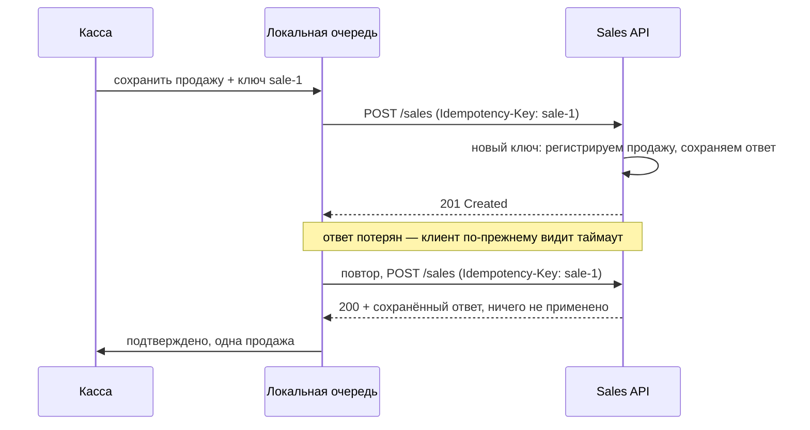
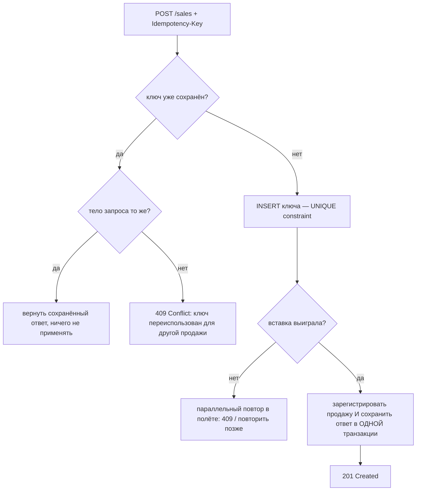
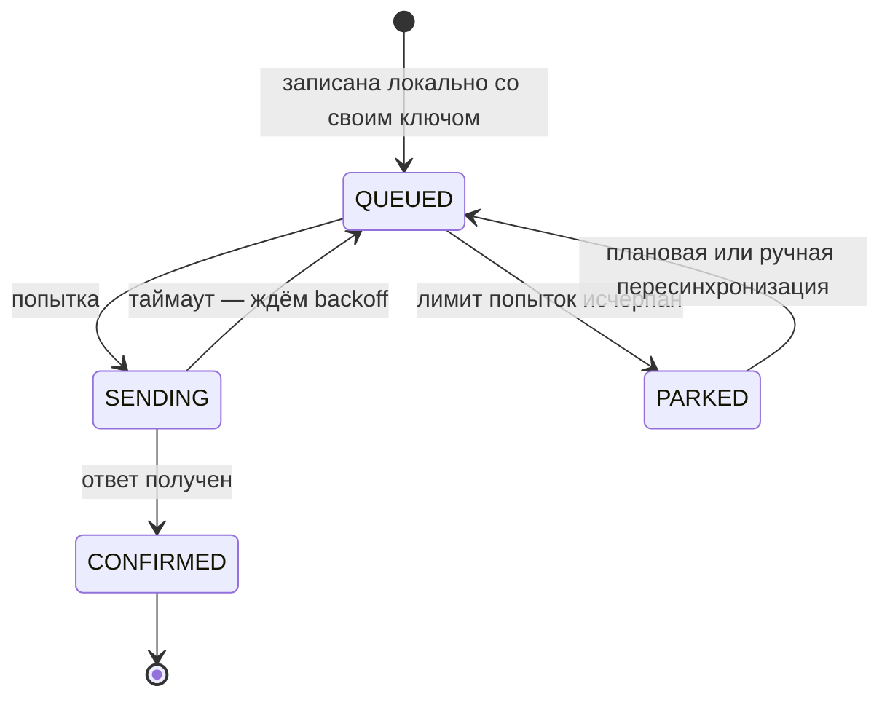

# Регистрация продаж при ненадёжном соединении

Касса на рынке, телефон курьера в лифте, вендинговый автомат на GSM-модеме.
Деньги переходят из рук в руки локально, а бэкенд должен узнать об этом по связи,
которая рвётся посреди запроса. Вопрос не в том, «как повторить запрос», а в том,
«как повторить его, ни разу не списав с клиента дважды и ни разу не потеряв
продажу».

## Одна проблема, порождающая все остальные

Клиент отправляет `POST /sales` и получает… ничего. Таймаут. За этим молчанием
стоят ровно два возможных мира:

1. запрос не дошёл до сервера — ничего не зарегистрировано;
2. сервер зарегистрировал продажу, а **ответ** потерялся на обратном пути.

**Клиент не может их различить.** Таймаут — это не ответ. Поэтому у клиента есть
только два плохих варианта: сдаться (и потерять реальные деньги в мире 1) или
повторить (и списать дважды в мире 2) — если только не убрать саму дилемму,
сделав повтор *безопасным*. В этом весь дизайн: сделай запись идемпотентной, и
тогда повторяй сколько угодно.



## Дизайн в четыре хода

### 1. Ключ идемпотентности создаёт клиент, один раз, на бизнес-действие

Ключ рождается вместе с продажей, на устройстве, **до** первого сетевого вызова —
UUID или `deviceId + локальный порядковый номер`. Не на сервере (сервер может
вообще не увидеть первую попытку), не на каждую HTTP-попытку и не выведенный из
содержимого запроса.

Это самое важное решение и классическая ловушка на собеседовании: если путь
повтора пересоздаёт продажу и генерирует *новый* ключ, идемпотентности нет вовсе —
сервер видит две разные продажи и регистрирует обе. Запусти пример **Новый ключ
на каждый повтор** и посмотри, как итог удваивается.

### 2. Продажа записывается локально до отправки

У устройства есть надёжная локальная очередь (SQLite, WAL-файл, Room/Core Data —
что угодно, что переживёт падение приложения и разряженную батарею). `recordSale`
фиксирует продажу локально; отправка — отдельный, повторяемый шаг. Отсюда два
следствия:

- касса продолжает продавать в офлайне (**store-and-forward**) и
- продажа никогда не «теряется в запросе», потому что запрос никогда и не был
  местом, где она жила.

Это клиентское зеркало [паттерна Outbox](topic:outbox-pattern) — записать
бизнес-факт и запись «должно быть доставлено» вместе, доставить позже.

### 3. Клиент повторяет с экспоненциальным backoff, ограничением и джиттером

Тот же ключ, растущая пауза: 200 мс, 400 мс, 800 мс… до потолка (скажем, 30 с),
плюс случайный джиттер, чтобы парк касс не повторял запросы синхронно и не клал
сервер в момент его восстановления. После N попыток продажа *паркуется*, а не
выбрасывается — её позже отправит фоновая синхронизация или оператор. Повторять
стоит только по таймаутам, 5xx и 429; запрос с 400 не пройдёт, сколько его ни
отправляй. Дополни это разумными [timeouts, fallbacks и circuit
breakers](topic:service-timeouts-fallbacks) на стороне вызывающего.

### 4. Сервер дедуплицирует по ключу и повторяет сохранённый ответ

Сервер держит **хранилище идемпотентности**: `key -> (status, тело ответа,
created_at)`. Для каждого запроса:



Реальную работу делают две детали:

- **Запись дедупликации и бизнес-запись живут в одной локальной транзакции.**
  Иначе падение между ними оставило бы ключ без продажи (навсегда молча проглотив
  её) или продажу без ключа (позволив повтору её продублировать). Это та самая
  атомарность из [ACID](topic:acid-principles), которая у тебя уже есть внутри
  одной базы — используй её.
- **Сохраняй и повторяй ответ, а не просто пропускай запрос.** Повтор должен
  получить тот же ответ, что и оригинал: тот же id чека, то же тело. «Молча
  проигнорировать» оставляет клиента без подтверждения и без чека. Именно в этом
  разница между дедупликацией и идемпотентностью.

Если продажа потребляется асинхронно из брокера, а не по HTTP, у той же серверной
идеи есть имя — [паттерн Inbox](topic:inbox-pattern).

## Конкурентность: два повтора одновременно

Медленная первая попытка плюс нетерпеливый повтор могут положить два запроса с
одним ключом на два инстанса в один и тот же момент. Ни один не находит ключ, оба
пытаются зарегистрировать продажу — если только проверка уникальности *и есть*
запись. Повесь **UNIQUE constraint на колонку ключа** и позволь базе рассудить
спор: проигравший получает нарушение ограничения и возвращает `409`/«повтори
чуть позже» вместо второй продажи. Проверка `if (exists)` на уровне приложения —
это гонка, а не защита; та же логика, что в [оптимистичных и пессимистичных
блокировках](topic:optimistic-vs-pessimistic-locking). Распределённый лок в Redis
— оптимизация сверху, но никогда не источник истины (см. [Redis или PostgreSQL
для уникальных значений](topic:redis-vs-postgresql-uniqueness)).

## Форма API

```
POST /sales
Idempotency-Key: 5f2a-…            # или saleId внутри тела
{ "saleId": "5f2a-…", "deviceId": "pos-7", "occurredAt": "2026-07-27T10:04:11Z",
  "lines": [...], "total": 250 }

201 Created   — первый раз, тело = зарегистрированная продажа
200 OK        — повтор сохранённого ответа, ничего не применено
409 Conflict  — тот же ключ, другое тело (или параллельная попытка в полёте)
```

Обрати внимание: продажа несёт **свой** id и **своё** время. И то и другое
приходит с устройства, потому что часы сервера говорят, когда продажа
*синхронизировалась*, а не когда она *произошла*. `PUT /sales/{saleId}` —
не менее хорошая форма: выбранный клиентом id делает эндпоинт идемпотентным по
своей природе, а это ровно то, что и означает `PUT`.

## Жизненный цикл, который ты на самом деле строишь



`CONFIRMED` — единственное состояние, в котором локальную запись можно удалять, да
и то большинство систем держат её ещё какое-то время, чтобы задача сверки могла
сравнить продажи устройства с продажами сервера.

## Что кусается в продакшене

- **Хранение ключей.** Хранилище идемпотентности не может расти вечно, но окно
  хранения должно переживать самый долгий возможный повтор — включая кассу,
  пролежавшую неделю в ящике. Чисти через 30 дней, а не через 30 минут, и
  проиндексируй колонку ключа, чтобы поиск оставался дешёвым ([индексы в базе
  данных](topic:database-indexes)).
- **Порядок.** Продажи, синхронизированные с задержкой в часы, приходят не по
  порядку. Никогда не позволяй порядку прибытия определять бизнес-порядок:
  сортируй по клиентскому `occurredAt` плюс порядковому номеру устройства.
- **Расхождение часов.** Часы на устройствах врут, иногда на годы. Записывай и
  `occurredAt` (устройство), и `receivedAt` (сервер), и отклоняй или помечай всё
  неправдоподобное, вместо того чтобы слепо верить одному из них.
- **Тот же ключ, другое тело.** Почти всегда это баг клиента (переиспользованный
  ключ). Падай громко с `409` — тихий возврат старого ответа скрывает реальную,
  другую продажу.
- **Частичный сбой ниже по стеку.** Если регистрация продажи ещё и начисляет
  бонусы и шлёт письмо, не делай этого внутри запроса: запиши продажу и строку
  outbox, а рассылку сделает [паттерн Outbox](topic:outbox-pattern) позже.
- **Сверка.** Идемпотентность защищает каждую продажу; ничто не защитит тебя от
  устройства, у которого стёрли очередь. Ежедневная задача «устройство говорит N
  продаж, на сервере M» — единственный способ это заметить.

## Ответ на собеседовании за 60 секунд

> Клиент не может отличить «мой запрос потерялся» от «потерялся ответ», поэтому я
> делаю запись идемпотентной и спокойно повторяю. Касса генерирует
> `saleId`/ключ идемпотентности в момент продажи и записывает продажу в надёжную
> локальную очередь *до* первой отправки — так она может продолжать продавать в
> офлайне, и ничего не теряется вместе с запросом. Фоновый отправщик шлёт
> `POST /sales` с этим ключом, повторяя по таймаутам и 5xx с экспоненциальным
> backoff, ограничением и джиттером, и после N попыток паркует продажу, а не
> выбрасывает её. Сервер держит хранилище идемпотентности по этому ключу с
> UNIQUE constraint: первый запрос регистрирует продажу и сохраняет ответ *в
> одной транзакции*, а каждый следующий возвращает сохранённый ответ, ничего не
> применяя; параллельный повтор проигрывает гонку за уникальный ключ и получает
> 409. Ключи хранятся дольше, чем самый долгий возможный повтор. Продажа несёт
> `occurredAt` устройства, поэтому поздняя синхронизация не путает отчёты. Это
> даёт доставку at-least-once с регистрацией effectively-once; настоящая доставка
> exactly-once по ненадёжной связи невозможна — именно поэтому идемпотентным
> должен быть *эффект*.

## Частые заблуждения

- **«Повторять запросы опасно».** Опасно повторять *неидемпотентный* эндпоинт.
  Почини эндпоинт — и повторяй сколько угодно.
- **«Id должен генерировать сервер».** Тогда у клиента нет имени для продажи
  ровно в том сбое, который он должен пережить.
- **«Дедуплицировать по содержимому запроса».** Два покупателя, купившие один и
  тот же кофе по той же цене в одну и ту же секунду, — это две продажи. Ключ
  обязан быть явной идентичностью, а не хешем содержимого.
- **«Использовать транзакцию базы вокруг вызова».** Нет транзакции, охватывающей
  устройство и сервер. Именно поэтому и нужен ключ идемпотентности.
- **«Exactly-once доставка решает проблему».** По теряющей связи её не существует
  (проблема двух генералов). Ты получаешь доставку at-least-once плюс
  идемпотентный эффект, и эту комбинацию называешь effectively-once.
- **«С брокером сообщений проблема исчезнет».** Она переедет: брокер тоже даёт
  at-least-once, поэтому потребителю всё равно нужна
  [дедупликация](topic:inbox-pattern). Выбор транспорта — отдельный вопрос, см.
  [типы взаимодействия между микросервисами](topic:microservice-interaction-types)
  и [синхронную и асинхронную коммуникацию](topic:sync-vs-async-communication).
