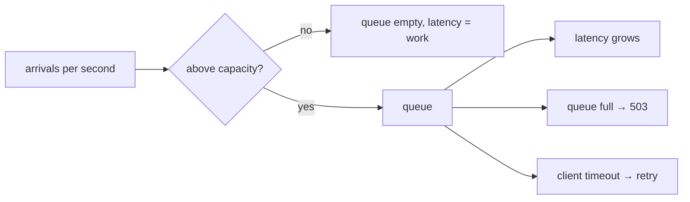
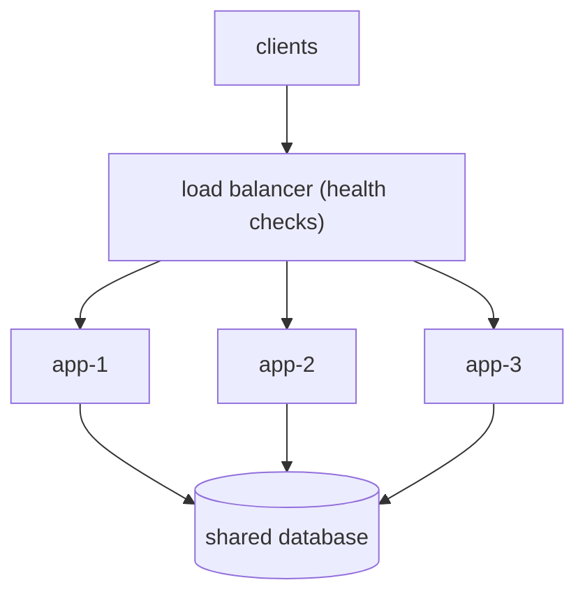
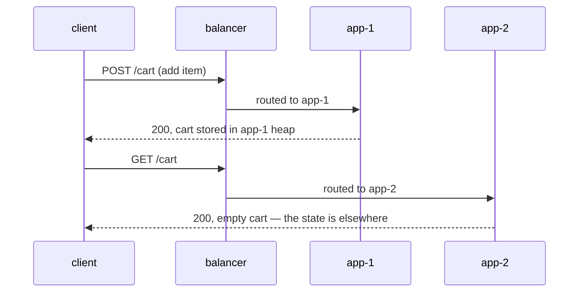

# A single server is overwhelmed — what breaks, and how do you scale it?

## "Overwhelmed" is arithmetic, not a mood

One instance has a fixed number of things it can do at once — worker threads,
connections, event-loop slots — and each request holds one of them for some
amount of time. That gives you a number:

```
throughput = concurrency / service time
```

200 threads, 50 ms per request → 4000 requests per second. That is the ceiling,
and no amount of clever code changes it; only making the work shorter or the
slots more numerous does. (In a Spring Boot service the slots are literally the
[thread pool](topic:java-thread-pool) your container is configured with.)

While arrivals stay under that number, everything is boring: the queue is empty
and latency is exactly the service time. Once arrivals exceed it, the surplus has
to go somewhere, and there are only three somewheres.



That is the whole failure mode. Notice what is *not* in it: the code did not get
slower. Every method still takes the same time; profiling the application under
overload finds nothing, because the extra seconds are spent waiting in line.

## What actually breaks, in order

1. **The queue grows.** Utilisation approaches 100% and the surplus accumulates.
2. **Latency climbs — non-linearly.** This is the part people get wrong. Going
   from 50% to 60% utilisation costs a little latency; going from 90% to 95%
   costs a lot. Queueing theory says the wait scales roughly with `1 / (1 - ρ)`,
   which is why a system looks fine right up until it very suddenly does not.
3. **Timeouts fire.** Clients give up. The server does not know, so it finishes
   their requests anyway and writes the responses into closed sockets — capacity
   spent on nothing. **A server can be 100% busy and 0% useful.**
4. **Retries make it worse.** A client that timed out usually retries, so offered
   load *rises* at the exact moment the server is least able to take it. This is
   a retry storm, and it is why retries need jitter, budgets and a circuit
   breaker — see [timeouts, fallbacks and circuit breakers](topic:service-timeouts-fallbacks).
   If the retried operation is not idempotent, you also get duplicates, which is
   its own problem — see [avoiding duplicate sales](topic:duplicate-sale-prevention).
5. **Rejections start.** The queue fills and the server refuses. This *looks*
   like the failure and it is actually the healthy behaviour: a bounded queue
   converts overload into a fast, honest 503 for the surplus while everything
   inside the bound still gets a normal answer.
6. **Resource exhaustion.** Connections, file descriptors, heap held by queued
   request objects. This is where an overloaded service stops being slow and
   starts crashing.

The single most useful design rule falls out of point 3: **never let the queue be
deeper than the client's timeout.** Past that depth, the server is guaranteed to
be working only on requests whose clients have already left. Bound the queue and
shed load instead of storing it.

## Vertical scaling: the same box, more of it

Give the machine more CPU and memory, raise the pool sizes, and the single number
goes up. It deserves more respect than it usually gets in interviews:

- no new code, no new failure modes, no distributed anything;
- one process to reason about, so debugging and profiling stay simple;
- often the right first move, because modern machines are enormous.

What it does not buy:

- **a ceiling that goes away** — it moves, and hardware runs out;
- **elasticity** — resizing usually means restarting the thing serving traffic;
- **availability** — the failure domain is still exactly one machine. When it
  dies, the service is not slow; it is *absent*.

That last point is usually the argument that actually wins the budget.

## Horizontal scaling: more boxes behind a load balancer

Run N identical replicas and put a load balancer in front. Clients resolve the
balancer's address; it picks a replica per request.



Capacity is now a deployment decision instead of a hardware one, it can change
while the service is running, and losing one machine costs `1/N` of capacity
instead of all of it. In return you take on four obligations.

**1. The balancer must know who is alive.** Without health checks its list of
backends is a configuration file, not a fact about the world, so it keeps handing
a dead replica its full share — a clean fraction of requests failing, with
perfectly normal latency and CPU. With health checks, the corpse leaves the
rotation, but only after the detection window; every request in that window
failed for a real user. Health checks bound the damage of a crash, they do not
prevent it. A check that only asks "is the port open?" also misses the more
common case: a replica that answers, slowly.

**2. Choosing the replica matters once replicas differ.** Round robin, least
connections, weighted, hash-based — with identical nodes and identical requests
they all look the same, which is why the choice is usually made carelessly. Then
one node hits a long GC pause or restarts with a cold cache, and round robin
keeps handing it a full share it cannot finish, so it queues and refuses while
its neighbours idle. Routing by *observed load* (least connections /
least-outstanding-requests) self-corrects, because a node that is not finishing
work stops looking cheap to send to.

**3. Size for N-1, not N.** Losing a replica does not reduce the traffic; it
redistributes it. Three replicas at 70% each become two at over 100% — the
classic cascade, where the survivors fall over one at a time. Headroom is not
waste, it is the thing that makes the redundancy real.

**4. Replicas must be interchangeable — this is the hard one.** Anything a
replica keeps in its own heap between requests (an `HttpSession`, a cart, a
half-finished upload, a local cache, a scheduled job, an in-memory rate-limit
counter) makes the second replica *wrong* rather than helpful: a request that
lands elsewhere sees an unauthenticated user with an empty cart, and nothing
appears in any error log.



The fix is to move the state out: sessions into Redis or the database, files into
object storage, caches made per-node and disposable, schedulers made
leader-elected. **Sticky sessions** (a cookie or a source-IP hash pinning a client
to one replica) stop the misses and are a legitimate stopgap, but read what you
agreed to: load is balanced by client rather than by request, so one heavy client
can saturate one node; a replica cannot be drained for deployment without
dropping its clients' state; and when it dies, everything pinned to it dies with
it. Sticky sessions make state *reachable*, not *safe*.

## The bottleneck moves — it does not disappear

Scale the application tier from three instances to ten and throughput may barely
improve, because the constraint was never the application tier. Ten replicas all
queue on the same primary database, the same payment gateway, the same lock.

This is the most important habit the question is testing: **find the constraint
before you multiply anything.** The usual order of investigation is arrival rate
versus measured capacity, then where the time inside a request goes, then what is
shared. And the fixes for a database bottleneck are their own ladder — better
queries and [indexes](topic:database-indexes) first, then
[query optimisation](topic:sql-query-optimization), then caching, then read
replicas, then partitioning or sharding — because "add app servers" does nothing
for any of them.

Related: the balancer itself is now a single point of failure, which is handled
with a pair of balancers and a floating IP, or DNS/anycast in front — and in
practice by using a managed one. It is also the natural place for TLS
termination ([HTTP vs HTTPS](topic:http-vs-https)) and, in a microservice system,
often sits alongside an [API gateway](topic:api-gateway) that adds routing, auth
and rate limiting.

## Sometimes the right answer is not to scale

Before adding a single instance, check whether you can remove load instead:
caching, fixing an [N+1 query](topic:hibernate-n-plus-one), batching, moving slow
work out of the request path into a queue
([synchronous vs asynchronous](topic:sync-vs-async-communication)), or rate
limiting an abusive client. A 10× cheaper request is a 10× bigger server, for
free.

## The 60-second interview answer

> A single instance has a fixed capacity: concurrency divided by service time.
> Above it, the surplus queues, so latency climbs non-linearly, clients hit their
> timeouts and retry — which raises load further — and eventually the queue fills
> and the server returns 503s. The first thing I'd do is measure: arrival rate,
> the per-instance capacity, and where time inside a request goes, because the
> fix depends on whether the constraint is really the app tier. If it is, vertical
> scaling is the cheapest move and often enough, but it leaves one failure domain
> and needs a restart. Horizontal scaling — N replicas behind a load balancer with
> health checks — gives elastic capacity *and* survives losing a machine, at the
> cost of making the service stateless: sessions and files move to Redis, the
> database or object storage. I'd size for N-1 so losing a replica doesn't
> cascade, bound the queues so overload becomes a fast 503 instead of wasted work,
> and expect the bottleneck to move to the database, where the answer is caching,
> read replicas and query work rather than more app servers.

## Common traps

- **"The server is slow, let's profile the code."** Under queueing, no method got
  slower. Compare arrival rate to capacity first.
- **"Bigger queue, fewer errors."** A queue deeper than the client timeout
  converts errors into *wasted* work: the server is busy and useless. Rejecting
  fast is kinder than answering late.
- **"Just add instances."** Not if the constraint is a shared database, a lock,
  or a third-party API. Multiplying the part that was not the limit changes
  nothing.
- **"Horizontal scaling is strictly better."** It is strictly more complex. On
  throughput alone a bigger box often wins; the honest reason to go horizontal is
  usually availability and elasticity.
- **"We have three replicas so we can lose one."** Only if three at their current
  utilisation still fit the traffic on two.
- **"Sticky sessions solve session state."** They pin state to a machine that can
  die. They are a bridge to externalised state, not a destination.
- **"The load balancer distributes load evenly."** It distributes *requests*
  evenly. Equal shares to unequal nodes is not balance.
- **"Health checks mean no failed requests."** They mean failures stop after the
  detection window. Everything inside that window still failed.
- **"Autoscale on CPU."** CPU is a poor proxy for a service that blocks on I/O; a
  saturated thread pool can sit at 30% CPU. Scale on queue depth, latency or
  in-flight requests.
- **Forgetting long-lived connections.** [WebSockets](topic:websocket-connection)
  and [long polling](topic:long-polling) pin a client to one replica for the
  connection's lifetime, so they need connection-count-aware balancing and a
  shared bus to fan out messages across replicas.
