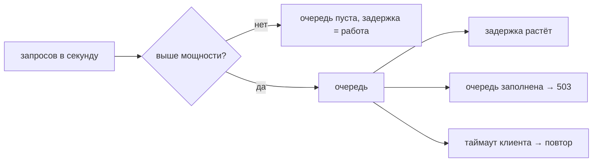
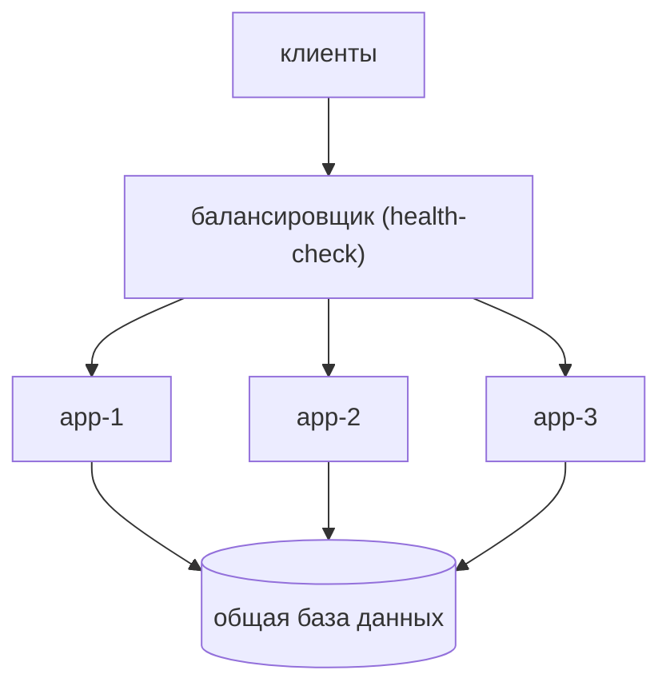
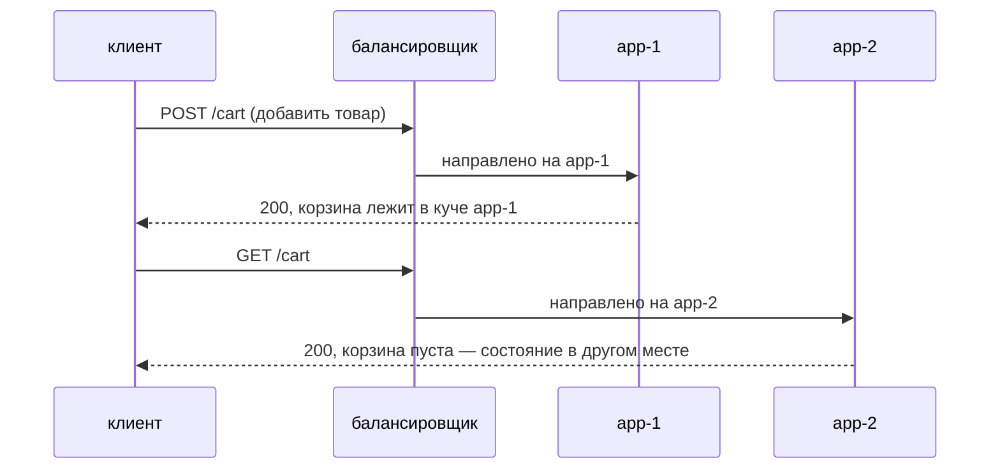

# Один сервер не справляется — что ломается и как его масштабировать?

## «Не справляется» — это арифметика, а не ощущение

У одного экземпляра фиксированное число дел, которые он может делать
одновременно, — рабочие потоки, соединения, слоты event loop, — и каждый запрос
занимает одно из них на некоторое время. Отсюда получается число:

```
пропускная способность = одновременность / время обработки
```

200 потоков, 50 мс на запрос → 4000 запросов в секунду. Это и есть потолок, и
никакой умный код его не меняет; меняет только сокращение работы или увеличение
числа слотов. (В сервисе на Spring Boot слоты — это буквально
[пул потоков](topic:java-thread-pool), настроенный у вашего контейнера.)

Пока приход держится ниже этого числа, всё скучно: очередь пуста, а задержка
ровно равна времени обработки. Как только приход его превышает, излишку надо
куда-то деться, а деться можно только в три места.



Это весь режим отказа. Обратите внимание, чего в нём *нет*: код не стал
медленнее. Каждый метод по-прежнему занимает то же время; профилирование
приложения под перегрузкой не находит ничего, потому что лишние секунды уходят на
стояние в очереди.

## Что ломается на самом деле, по порядку

1. **Растёт очередь.** Загрузка приближается к 100%, и излишек копится.
2. **Растёт задержка — нелинейно.** Вот здесь чаще всего ошибаются. Переход с
   50% на 60% загрузки стоит немного задержки; переход с 90% на 95% — очень
   много. Теория массового обслуживания говорит, что ожидание растёт примерно
   как `1 / (1 - ρ)`, и поэтому система выглядит нормально ровно до момента,
   когда очень внезапно перестаёт.
3. **Срабатывают таймауты.** Клиенты сдаются. Сервер об этом не знает, поэтому
   всё равно доделывает их запросы и записывает ответы в закрытые сокеты —
   мощность, потраченная впустую. **Сервер может быть на 100% занят и на 0%
   полезен.**
4. **Повторы делают только хуже.** Клиент, упёршийся в таймаут, обычно повторяет
   запрос, поэтому предлагаемая нагрузка *растёт* ровно в тот момент, когда
   сервер меньше всего способен её принять. Это retry storm, и именно поэтому
   повторам нужны джиттер, бюджеты и circuit breaker — см.
   [таймауты, фолбэки и circuit breaker](topic:service-timeouts-fallbacks). А
   если повторяемая операция не идемпотентна, вы получаете ещё и дубликаты — это
   отдельная задача, см.
   [как избежать дублей продаж](topic:duplicate-sale-prevention).
5. **Начинаются отказы.** Очередь заполняется, и сервер отвергает запросы. Это
   *выглядит* как сбой, а на самом деле это здоровое поведение: ограниченная
   очередь превращает перегрузку в быстрый честный 503 для излишка, а всё, что
   помещается в границу, получает нормальный ответ.
6. **Исчерпание ресурсов.** Соединения, файловые дескрипторы, куча, занятая
   объектами запросов в очереди. Здесь перегруженный сервис перестаёт быть
   медленным и начинает падать.

Из пункта 3 следует самое полезное проектное правило: **очередь никогда не должна
быть глубже клиентского таймаута.** За этой глубиной сервер гарантированно
работает только над запросами, чьи клиенты уже ушли. Ограничивайте очередь и
сбрасывайте нагрузку вместо того, чтобы её копить.

## Вертикальное масштабирование: та же коробка, но больше

Дайте машине больше CPU и памяти, поднимите размеры пулов — и единственное число
вырастет. Этот вариант заслуживает большего уважения, чем ему обычно оказывают на
собеседованиях:

- ни строчки нового кода, ни новых режимов отказа, никакой распределённости;
- один процесс, о котором надо думать, поэтому отладка и профилирование остаются
  простыми;
- часто это правильный первый шаг, потому что современные машины огромны.

Чего он не даёт:

- **исчезновения потолка** — потолок сдвигается, а железо заканчивается;
- **эластичности** — смена размера обычно означает рестарт того, что обслуживает
  трафик;
- **доступности** — домен отказа по-прежнему ровно одна машина. Когда она
  умирает, сервис не медленный; его *нет*.

Именно последний пункт обычно и выигрывает бюджет.

## Горизонтальное масштабирование: больше коробок за балансировщиком

Запустите N одинаковых реплик и поставьте перед ними балансировщик. Клиенты
резолвят адрес балансировщика, а он выбирает реплику на каждый запрос.



Мощность теперь решение о деплое, а не о железе, её можно менять на ходу, и
потеря одной машины стоит `1/N` мощности, а не всей. Взамен вы берёте на себя
четыре обязательства.

**1. Балансировщик обязан знать, кто жив.** Без health-check'ов его список
бэкендов — это конфиг, а не факт о мире, поэтому он продолжает отдавать мёртвой
реплике полную долю: ровная доля запросов падает при совершенно нормальных
задержке и CPU. С health-check'ами труп покидает ротацию, но только после окна
обнаружения; каждый запрос в этом окне провалился у настоящего пользователя.
Health-check'и ограничивают ущерб от падения, но не предотвращают его. А проверка
в стиле «порт открыт?» пропускает ещё и более частый случай: реплику, которая
отвечает, но медленно.

**2. Выбор реплики важен, когда реплики различаются.** Round robin, least
connections, взвешенный, по хэшу — при одинаковых узлах и одинаковых запросах они
выглядят одинаково, поэтому выбор обычно и делают небрежно. А потом один узел
попадает в длинную паузу GC или перезапускается с холодным кэшем, и round robin
продолжает отдавать ему полную долю, которую тот не успевает доделать: узел копит
очередь и начинает отказывать, пока соседи простаивают. Маршрутизация по
*наблюдаемой загрузке* (least connections / least-outstanding-requests)
самокорректируется, потому что узел, который не доделывает работу, перестаёт
выглядеть дешёвым для отправки.

**3. Считайте по N-1, а не по N.** Потеря реплики не уменьшает трафик, а
перераспределяет его. Три реплики по 70% превращаются в две по 105% — классический
каскад, где выжившие падают по очереди. Запас — это не расточительство, а то, что
делает избыточность настоящей.

**4. Реплики должны быть взаимозаменяемыми — вот это трудное.** Всё, что реплика
хранит в собственной куче между запросами (`HttpSession`, корзина,
недозагруженный файл, локальный кэш, планировщик задач, счётчик рейт-лимита в
памяти), делает вторую реплику не полезной, а *неправильной*: запрос, попавший не
туда, видит неаутентифицированного пользователя с пустой корзиной, и ни в одном
журнале ошибок ничего не появляется.



Лечится это выносом состояния наружу: сессии в Redis или базу, файлы в объектное
хранилище, кэши — пер-нодовые и одноразовые, планировщики — с выбором лидера.
**Sticky-сессии** (кука или хэш IP-адреса, прикрепляющие клиента к одной реплике)
прекращают промахи и как временная мера законны, но прочтите, на что вы
согласились: нагрузка балансируется по клиентам, а не по запросам, поэтому один
тяжёлый клиент может насытить один узел; реплику нельзя вывести из-под трафика
для деплоя, не потеряв состояние её клиентов; а когда она умирает, вместе с ней
умирает всё, что к ней прикреплено. Sticky-сессии делают состояние *достижимым*,
а не *надёжным*.

## Узкое место переезжает — оно не исчезает

Увеличьте слой приложения с трёх экземпляров до десяти — и пропускная способность
может почти не вырасти, потому что ограничением слой приложения никогда и не был.
Десять реплик стоят в очереди к той же основной базе, тому же платёжному шлюзу,
той же блокировке.

Это самая важная привычка, которую проверяет вопрос: **найдите ограничение,
прежде чем что-либо умножать.** Обычный порядок разбирательства — скорость
прихода против измеренной мощности, затем куда уходит время внутри запроса, затем
что является общим. А лечение узкого места в базе — это отдельная лестница:
сначала лучшие запросы и [индексы](topic:database-indexes), затем
[оптимизация запросов](topic:sql-query-optimization), затем кэширование, затем
реплики для чтения, затем секционирование или шардирование, — потому что «добавить
серверов приложения» не помогает ни в одном из этих случаев.

Смежное: сам балансировщик теперь единая точка отказа, и лечится это парой
балансировщиков с плавающим IP или DNS/anycast перед ними, а на практике — тем,
что берут управляемый. Он же естественное место для терминации TLS
([HTTP против HTTPS](topic:http-vs-https)), а в микросервисной системе часто
стоит рядом с [API Gateway](topic:api-gateway), который добавляет маршрутизацию,
аутентификацию и рейт-лимиты.

## Иногда правильный ответ — не масштабировать

Прежде чем добавлять хоть один экземпляр, проверьте, нельзя ли вместо этого убрать
нагрузку: кэширование, починка [проблемы N+1](topic:hibernate-n-plus-one),
батчинг, вынос медленной работы из пути запроса в очередь
([синхронно или асинхронно](topic:sync-vs-async-communication)), рейт-лимит для
злоупотребляющего клиента. Запрос, который стал в 10 раз дешевле, — это
бесплатный сервер, который стал в 10 раз больше.

## Ответ на собеседовании за 60 секунд

> У одного экземпляра фиксированная мощность: одновременность, делённая на время
> обработки. Выше неё излишек уходит в очередь, поэтому задержка растёт
> нелинейно, клиенты упираются в таймауты и повторяют запросы — что поднимает
> нагрузку ещё выше, — и в итоге очередь заполняется и сервер начинает отдавать
> 503. Первое, что я бы сделал, — измерил: скорость прихода, мощность одного
> экземпляра и куда уходит время внутри запроса, потому что лечение зависит от
> того, действительно ли ограничение в слое приложения. Если да, вертикальное
> масштабирование — самый дешёвый шаг и часто достаточный, но оно оставляет один
> домен отказа и требует рестарта. Горизонтальное — N реплик за балансировщиком с
> health-check'ами — даёт эластичную мощность *и* переживает потерю машины ценой
> того, что сервис приходится сделать stateless: сессии и файлы переезжают в
> Redis, базу или объектное хранилище. Я бы считал размер по N-1, чтобы потеря
> реплики не вызвала каскад, ограничил очереди, чтобы перегрузка превращалась в
> быстрый 503, а не в работу впустую, и ожидал бы, что узкое место переедет в
> базу, где лечение — это кэш, реплики для чтения и работа с запросами, а не
> новые серверы приложения.

## Частые ловушки

- **«Сервер тормозит, давайте профилировать код».** При очереди ни один метод не
  стал медленнее. Сначала сравните скорость прихода с мощностью.
- **«Очередь побольше — ошибок поменьше».** Очередь глубже клиентского таймаута
  превращает ошибки в *работу впустую*: сервер занят и бесполезен. Быстро
  отказать милосерднее, чем ответить поздно.
- **«Просто добавим экземпляров».** Не поможет, если ограничение — общая база,
  блокировка или сторонний API. Умножение того, что не было пределом, не меняет
  ничего.
- **«Горизонтальное строго лучше».** Оно строго сложнее. По чистой пропускной
  способности большая коробка часто выигрывает; честная причина идти вширь —
  обычно доступность и эластичность.
- **«У нас три реплики, значит одну можно потерять».** Только если три при
  текущей загрузке всё ещё вмещают трафик вдвоём.
- **«Sticky-сессии решают проблему состояния сессии».** Они прикрепляют состояние
  к машине, которая может умереть. Это мост к вынесенному состоянию, а не
  конечная точка.
- **«Балансировщик распределяет нагрузку равномерно».** Он равномерно распределяет
  *запросы*. Равные доли неравным узлам — это не баланс.
- **«С health-check'ами не будет упавших запросов».** С ними падения прекращаются
  после окна обнаружения. Всё, что попало в это окно, всё равно упало.
- **«Автомасштабирование по CPU».** CPU — плохой заменитель для сервиса, который
  блокируется на I/O; насыщенный пул потоков может стоять на 30% CPU.
  Масштабируйтесь по глубине очереди, задержке или числу запросов в работе.
- **Забыть про долгоживущие соединения.**
  [WebSocket](topic:websocket-connection) и [длинный опрос](topic:long-polling)
  прикрепляют клиента к одной реплике на время жизни соединения, поэтому им нужны
  балансировка с учётом числа соединений и общая шина, чтобы рассылать сообщения
  между репликами.
