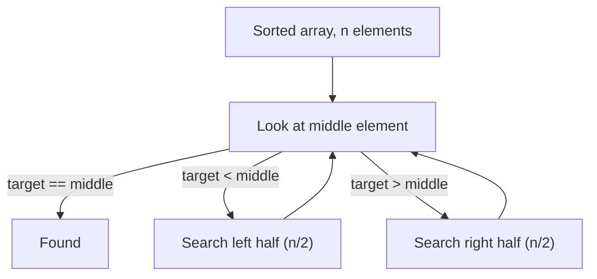

# Search Complexity After Sorting an Array

## The short answer

- **Unsorted array** → the only safe way to find an element is to look at each one
  in turn. That is **linear search, O(n)**.
- **Sorted array** → you can use **binary search**, which throws away half of the
  remaining elements at every step. That is **O(log n)**.

So the headline: *after sorting, search drops from O(n) to O(log n).*

> Real life: finding a name in an **unsorted pile of business cards** means flipping
> through all of them. Finding a name in a **phone book**, where names are already in
> order, lets you open to the middle, see whether you've gone too far, and keep
> halving — you never read the whole book.

## Why binary search is O(log n)

Binary search looks at the **middle** element. Because the array is sorted, that one
comparison tells you which half the target must be in, so you discard the other half
and repeat on what's left:

Each step halves the search range: n → n/2 → n/4 → … → 1. The number of halvings to
reach a single element is **log₂(n)**. For a million elements that is about **20**
comparisons instead of up to a million.

> Real life: a librarian finding a book by call number doesn't read every spine. She
> opens to the middle shelf, decides "too high" or "too low", and walks to the middle
> of the correct half — about twenty steps locate one book among a million.

## The catch: sorting isn't free

Sorting the array first costs **O(n log n)** with a good comparison sort (this is what
`Arrays.sort` / `Collections.sort` use). So the real comparison is:

| Situation | Cost |
| --- | --- |
| One lookup, unsorted | **O(n)** linear scan |
| Sort once, then one lookup | **O(n log n) + O(log n)** |
| Sort once, then **k** lookups | **O(n log n) + k·O(log n)** |

For a **single** search, sorting is *slower* — O(n log n) dwarfs a plain O(n) scan.
Sorting pays off only when you'll **search many times**: the one-time O(n log n) is
amortized over all the cheap O(log n) lookups that follow.

> Real life: a post office doesn't pre-sort mail to deliver **one** letter — it just
> goes and finds it. It sorts mail by address because **thousands** of letters will be
> looked up against that order all day; the sorting effort is shared across every
> delivery.

To order elements you need a comparison rule — in Java that's
[Comparator vs Comparable](topic:comparator-vs-comparable). Binary search must use the
**same ordering** the array was sorted by, or it gives wrong answers.

## Binary search also needs random access

Halving only works if jumping to the middle index is cheap. An array (or
[ArrayList](topic:arraylist-index-addressing)) gives **O(1)** indexed access, so the
"go to the middle" step is free. On a linked list, reaching the middle is itself O(n),
so binary search loses its advantage — see
[ArrayList vs LinkedList](topic:arraylist-vs-linkedlist).

> Real life: the phone-book trick works because you can flip straight to any page. If
> the names were on a chain of index cards where you can only step one card at a time,
> "open to the middle" would mean counting through half the chain first.

## When O(log n) still isn't the best you can do

If you need *many* lookups and don't care about order, a hash-based structure beats a
sorted array: [HashMap lookup](topic:hashmap-lookup-complexity) is **O(1)** average. A
sorted array (or a [TreeSet](topic:treeset)) wins when you also need **range queries**
or **ordered traversal** ("all values between 10 and 20", "the next bigger element") —
things a hash map can't do. This is exactly why
[database indexes](topic:database-indexes) keep keys sorted in B-trees.

## 60-second interview answer

> An unsorted array forces a linear search, **O(n)**, because any element could be
> anywhere. Once it's sorted, I can binary-search: compare to the middle element,
> discard the half that can't contain the target, and repeat — each step halves the
> range, so it's **O(log n)**. But sorting itself is **O(n log n)**, so for a single
> lookup sorting isn't worth it; it pays off when I'll search the same data many
> times, amortizing the sort over many cheap lookups. Binary search also needs O(1)
> random access (array, not linked list) and must use the same ordering the data was
> sorted by. If I just need fast membership tests and don't need order, a hash map at
> O(1) is even better.

## Common misconceptions

- ❌ "Sorting makes search faster, so always sort first." — Sorting is O(n log n); for
  one search it's slower than a plain O(n) scan. Sort only when you'll search repeatedly.
- ❌ "Binary search is O(log n) on any sorted collection." — Only with O(1) random
  access. On a `LinkedList` you can't cheaply reach the middle, so it degrades to O(n).
- ❌ "log n barely differs from n." — For a million elements it's ~20 vs ~1,000,000.
  The gap grows enormously with size.
- ❌ "You can binary-search with any comparison." — The search must use the **same
  order** the array was sorted by; mixing orderings returns wrong results.
- ❌ "O(log n) is the fastest possible search." — A hash map averages O(1). Sorted
  search wins only when you also need ordering or range queries.
