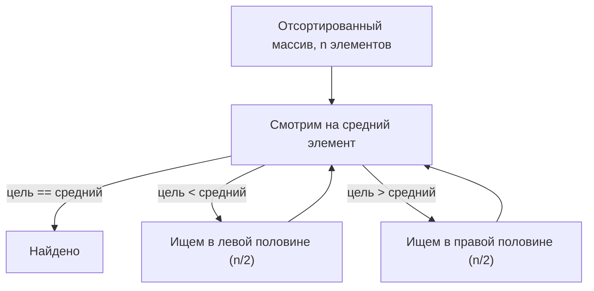

# Сложность поиска после сортировки массива

## Короткий ответ

- **Неотсортированный массив** → единственный надёжный способ найти элемент —
  посмотреть на каждый по очереди. Это **линейный поиск, O(n)**.
- **Отсортированный массив** → можно применить **бинарный поиск**, который на каждом
  шаге отбрасывает половину оставшихся элементов. Это **O(log n)**.

Итог: *после сортировки поиск падает с O(n) до O(log n).*

> Из жизни: найти имя в **неразобранной стопке визиток** — значит перебрать их все.
> Найти имя в **телефонном справочнике**, где имена уже упорядочены, позволяет открыть
> на середине, понять, не зашёл ли ты слишком далеко, и продолжать делить пополам — ты
> никогда не читаешь всю книгу.

## Почему бинарный поиск — это O(log n)

Бинарный поиск смотрит на **средний** элемент. Так как массив отсортирован, одно это
сравнение говорит, в какой половине должна быть цель, поэтому вторую половину
отбрасывают и повторяют на оставшейся части:

Каждый шаг делит диапазон поиска пополам: n → n/2 → n/4 → … → 1. Число делений, чтобы
дойти до одного элемента, — это **log₂(n)**. Для миллиона элементов это около **20**
сравнений вместо почти миллиона.

> Из жизни: библиотекарь, ищущий книгу по шифру, не читает каждый корешок. Он
> открывает среднюю полку, решает «слишком высоко» или «слишком низко» и идёт к
> середине нужной половины — примерно двадцать шагов находят одну книгу из миллиона.

## Подвох: сортировка не бесплатна

Сначала отсортировать массив стоит **O(n log n)** при хорошей сортировке сравнением
(именно её используют `Arrays.sort` / `Collections.sort`). Поэтому реальное сравнение
такое:

| Ситуация | Стоимость |
| --- | --- |
| Один поиск, не отсортировано | **O(n)** линейный перебор |
| Отсортировать раз, затем один поиск | **O(n log n) + O(log n)** |
| Отсортировать раз, затем **k** поисков | **O(n log n) + k·O(log n)** |

Ради **единственного** поиска сортировать *медленнее* — O(n log n) перекрывает простой
проход O(n). Сортировка окупается, только когда искать будут **много раз**: разовая
O(n log n) распределяется на все последующие дешёвые поиски O(log n).

> Из жизни: почта не сортирует всю корреспонденцию ради доставки **одного** письма —
> она просто идёт и находит его. Письма раскладывают по адресам, потому что **тысячи**
> писем будут искаться по этому порядку весь день; усилие на сортировку делится между
> всеми доставками.

Чтобы упорядочить элементы, нужно правило сравнения — в Java это
[Comparator vs Comparable](topic:comparator-vs-comparable). Бинарный поиск обязан
использовать **тот же порядок**, по которому массив был отсортирован, иначе он даст
неверные ответы.

## Бинарному поиску также нужен произвольный доступ

Деление пополам работает, только если прыжок к среднему индексу дёшев. Массив (или
[ArrayList](topic:arraylist-index-addressing)) даёт доступ по индексу за **O(1)**,
поэтому шаг «перейти к середине» бесплатен. В связном списке добраться до середины само
по себе O(n), так что бинарный поиск теряет преимущество — см.
[ArrayList vs LinkedList](topic:arraylist-vs-linkedlist).

> Из жизни: трюк с телефонным справочником работает, потому что можно сразу открыть
> любую страницу. Если бы имена лежали на цепочке карточек, где можно шагать только по
> одной карточке за раз, «открыть на середине» означало бы сперва отсчитать половину
> цепочки.

## Когда O(log n) — всё ещё не лучшее, что можно сделать

Если нужно *много* поисков и порядок не важен, структура на хешах обыграет
отсортированный массив: [выборка из HashMap](topic:hashmap-lookup-complexity) — в
среднем **O(1)**. Отсортированный массив (или [TreeSet](topic:treeset)) выигрывает,
когда также нужны **запросы по диапазону** или **обход по порядку** («все значения от
10 до 20», «следующий больший элемент») — то, что хеш-таблица не умеет. Именно поэтому
[индексы баз данных](topic:database-indexes) хранят ключи отсортированными в B-деревьях.

## Ответ за 60 секунд

> Неотсортированный массив вынуждает к линейному поиску, **O(n)**, потому что элемент
> может оказаться где угодно. Как только он отсортирован, я могу применить бинарный
> поиск: сравнить со средним элементом, отбросить половину, которая не может содержать
> цель, и повторить — каждый шаг делит диапазон пополам, значит это **O(log n)**. Но
> сама сортировка — **O(n log n)**, поэтому ради одного поиска сортировать не стоит; она
> окупается, когда я ищу в тех же данных много раз, распределяя сортировку на множество
> дешёвых поисков. Бинарному поиску также нужен доступ за O(1) (массив, а не связный
> список), и он должен использовать тот же порядок, по которому данные отсортированы.
> Если нужны лишь быстрые проверки принадлежности, а порядок не важен, хеш-таблица за
> O(1) ещё лучше.

## Частые заблуждения

- ❌ «Сортировка ускоряет поиск, поэтому всегда сортируй сначала.» — Сортировка стоит
  O(n log n); ради одного поиска это медленнее простого прохода O(n). Сортируй, только
  если искать будешь многократно.
- ❌ «Бинарный поиск — O(log n) на любой отсортированной коллекции.» — Только при доступе
  за O(1). В `LinkedList` нельзя дёшево добраться до середины, поэтому он вырождается в O(n).
- ❌ «log n почти не отличается от n.» — Для миллиона элементов это ~20 против ~1 000 000.
  Разрыв огромно растёт с размером.
- ❌ «Бинарный поиск работает с любым сравнением.» — Поиск обязан использовать **тот же
  порядок**, по которому массив отсортирован; смешение порядков даёт неверные результаты.
- ❌ «O(log n) — самый быстрый возможный поиск.» — Хеш-таблица в среднем O(1).
  Сортированный поиск выигрывает только когда нужны порядок или запросы по диапазону.
