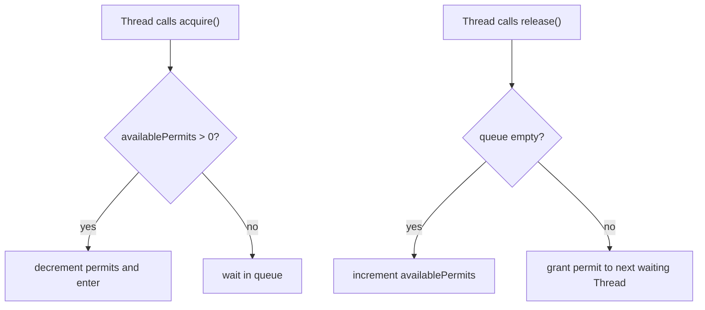
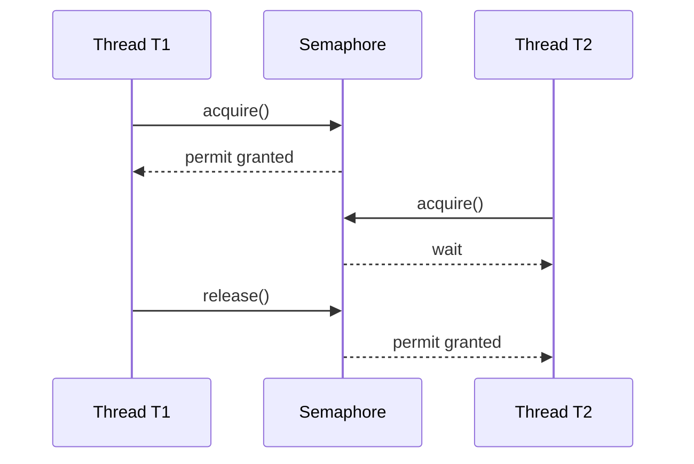

# Semaphore in Java

A `Semaphore` is a concurrency limiter based on a counter of permits. A thread calls `acquire()` to take one or more permits before using a protected resource, and calls `release()` when it is done. Think of a small post office with three service windows: each open window is a permit, and the fourth customer waits until a window is free.

It is part of [Java Multithreading](topic:java-multithreading), but it solves a different problem from a normal lock. A lock protects one [critical section](topic:critical-section). A semaphore usually limits how many threads may do something at the same time. In a kitchen analogy, a lock is one key to the pantry door; a semaphore is a rack with five oven gloves, so at most five cooks can use the hot ovens.



## Core Mechanics

`new Semaphore(3)` starts with three available permits. Each successful `acquire()` decrements the counter. Each `release()` increments it or wakes a waiting thread. The counter is the important thing, not the identity of a specific resource. It is like a restaurant with three free tables: the host counts tables, not the exact chair a guest used.

When no permit is available, `acquire()` blocks the calling thread. Blocking is not busy waiting: the thread stops running until it is allowed to continue, which can involve a [context switch](topic:context-switch). The everyday version is a ticket queue at a government office: you do not keep asking the clerk every millisecond; you wait until your number is called.

`tryAcquire()` is the non-blocking option. It returns `true` if a permit is available now and `false` otherwise. Use it for optional work, fallback behavior, or timeout-based control. It is like trying the express checkout lane: if it is closed, you decide to skip that errand instead of standing in line.



## Binary vs Counting Semaphore

A binary semaphore has one permit. It can look like a mutex because only one thread can pass at a time. The trap is that `Semaphore` does not enforce ownership: a different thread may call `release()`. A kitchen key with no name tag can be returned by the wrong cook, and suddenly the board says a key is free while somebody is still inside.

A counting semaphore has more than one permit. It is useful for pools and quotas: ten database connections, three external API slots, or two expensive report generators. This is like a post office with several service windows: the queue is shared, but several customers can be served in parallel.

## Fairness

`new Semaphore(permits, true)` asks for FIFO-style fairness, so waiting threads are served in arrival order. Fairness helps avoid starvation, but it may reduce throughput because newer threads cannot jump ahead when timing would make that faster. It is the difference between a strict ticket machine and a loose coffee-shop line: the strict line feels fair, but sometimes a free barista waits for the exact next ticket holder.

The default constructor is non-fair. In interviews, say that non-fair semaphores can be faster, while fair semaphores are more predictable under contention. In real systems, choose based on whether tail latency and starvation matter more than raw throughput.

## When You Need It

Use a semaphore when you must bound concurrency around a resource that has a real capacity. Common cases are limiting calls to a slow remote service, protecting a fixed connection pool, throttling file uploads, or allowing only a few CPU-heavy jobs at once. A [ThreadPool](topic:java-thread-pool) limits worker threads; a semaphore can limit a different resource inside those threads, like only four cooks using two deep fryers.

Use a lock when you need mutual exclusion for shared mutable state. Use a semaphore when the number of allowed concurrent users is the main rule. If the problem is a race on data, start with [Race Condition Avoidance](topic:race-condition-avoidance); if the problem is "only N may enter," a semaphore is often the right vocabulary.

## 60-Second Interview Answer

A `Semaphore` is a synchronization primitive that controls access with a number of permits. A thread must acquire a permit before entering some operation; if no permit is available, it waits or, with `tryAcquire()`, fails immediately. When the work finishes, the code releases the permit so another thread can proceed. It is useful for limiting concurrency, for example a maximum number of simultaneous database calls, uploads, or expensive jobs. A binary semaphore has one permit; a counting semaphore has many. Unlike `Lock`, `Semaphore` does not enforce ownership, so releasing too many permits is a real bug. Fair semaphores serve waiters more predictably, usually with some throughput cost.

## Production Relevance

Semaphores are common around scarce external capacity. If an API allows only 20 parallel requests, a semaphore makes that rule explicit in code. The everyday picture is a parking lot with 20 spaces: the road may fit more cars, but the lot still cannot.

They are also useful as local backpressure. A service may have a large [ThreadPool](topic:java-thread-pool), but only a few tasks should enter a memory-heavy conversion step. The kitchen analogy is clear: many waiters can take orders, but only two mixers can knead dough at once.

Always release permits in `finally`, because exceptions must not leak capacity. This is like returning the post-office ticket when you leave the counter even if your form was rejected. In Java, the shape is usually:

```java
semaphore.acquire();
try {
    doWork();
} finally {
    semaphore.release();
}
```

## Common Misconceptions

- "Semaphore is just a lock." Not quite. A lock has ownership and usually protects a single critical section. A semaphore counts permits and may allow many threads through. One pantry key and five oven gloves are different tools.
- "One `release()` must match a real owner." Java `Semaphore` does not check that. Extra releases can grow the permit count, like a clerk accidentally putting fake tickets back into the machine.
- "More permits always means faster." Only until the real bottleneck is saturated. Adding more checkout lanes does not help if there is still one cashier.
- "Fair is always better." Fairness reduces starvation risk, but it can lower throughput. A perfect ticket line can be slower than a pragmatic queue when tiny jobs appear.
- "Semaphore fixes data races." It can, if used as a binary gate around shared state, but that is not its main strength and it is easy to misuse. For shared data, prefer clear locking patterns and keep the [critical section](topic:critical-section) small.
