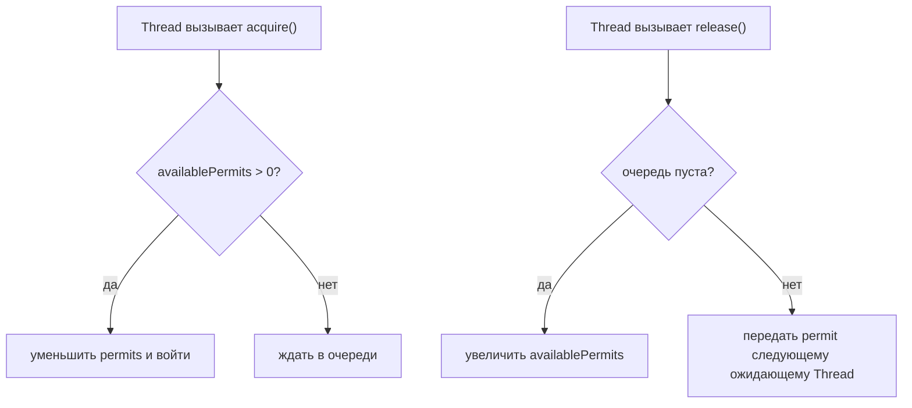
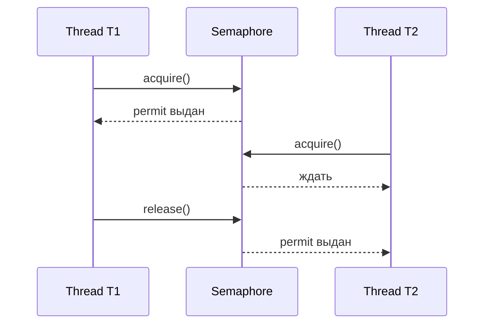

# Семафор в Java

`Semaphore` - это ограничитель concurrency, основанный на счётчике permits. Thread вызывает `acquire()`, чтобы взять один или несколько permits перед использованием защищённого ресурса, и вызывает `release()`, когда работа закончена. Представь маленькое почтовое отделение с тремя окнами: каждое открытое окно - это permit, а четвёртый клиент ждёт, пока окно освободится.

Это часть [Java Multithreading](topic:java-multithreading), но задача отличается от обычного lock. Lock защищает одну [critical section](topic:critical-section). Semaphore обычно ограничивает, сколько threads могут делать что-то одновременно. В кухонной аналогии lock - это один ключ от кладовой, а semaphore - стойка с пятью прихватками, поэтому у горячих духовок могут работать максимум пять поваров.



## Базовая механика

`new Semaphore(3)` стартует с тремя доступными permits. Каждый успешный `acquire()` уменьшает счётчик. Каждый `release()` увеличивает его или будит ожидающий thread. Важен счётчик, а не личность конкретного ресурса. Это как ресторан с тремя свободными столиками: хостес считает столики, а не конкретный стул гостя.

Когда доступного permit нет, `acquire()` блокирует вызывающий thread. Блокировка не является busy waiting: thread перестаёт выполняться, пока ему не разрешат продолжить, и это может включать [context switch](topic:context-switch). Бытовая версия - очередь по талонам в госучреждении: ты не спрашиваешь сотрудника каждую миллисекунду, а ждёшь, пока назовут твой номер.

`tryAcquire()` - неблокирующий вариант. Он возвращает `true`, если permit доступен прямо сейчас, и `false` иначе. Используй его для необязательной работы, fallback-поведения или контроля с timeout. Это как попробовать экспресс-кассу: если она закрыта, ты решаешь пропустить эту покупку, а не вставать в очередь.



## Binary vs Counting Semaphore

Binary semaphore имеет один permit. Он может быть похож на mutex, потому что одновременно проходит только один thread. Ловушка в том, что `Semaphore` не проверяет ownership: другой thread может вызвать `release()`. Кухонный ключ без бирки может вернуть не тот повар, и доска уже показывает свободный ключ, хотя кто-то всё ещё внутри.

Counting semaphore имеет больше одного permit. Он полезен для pools и квот: десять database connections, три места для внешнего API или два дорогих генератора отчётов. Это как почта с несколькими окнами: очередь общая, но несколько клиентов обслуживаются параллельно.

## Fairness

`new Semaphore(permits, true)` просит FIFO-style fairness, поэтому ожидающие threads обслуживаются в порядке прихода. Fairness помогает избежать starvation, но может снизить throughput, потому что новые threads не могут пройти вперёд, даже если по таймингу это было бы быстрее. Это разница между строгим автоматом с талонами и свободной очередью в кофейне: строгая очередь честная, но иногда свободный бариста ждёт именно владельца следующего талона.

Конструктор по умолчанию создаёт non-fair semaphore. На собеседовании скажи, что non-fair semaphores могут быть быстрее, а fair semaphores более предсказуемы при contention. В реальных системах выбор зависит от того, что важнее: tail latency и starvation или максимальный throughput.

## Когда он нужен

Используй semaphore, когда нужно ограничить concurrency вокруг ресурса с реальной capacity. Типичные случаи - ограничить вызовы медленного внешнего сервиса, защитить fixed connection pool, throttling загрузок файлов или разрешить только несколько CPU-heavy задач одновременно. [ThreadPool](topic:java-thread-pool) ограничивает worker threads; semaphore может ограничить другой ресурс внутри этих threads, как если бы много поваров принимали заказы, но фритюрниц было только две.

Используй lock, когда нужна mutual exclusion для shared mutable state. Используй semaphore, когда главное правило - сколько пользователей могут войти одновременно. Если проблема в race на данных, начни с [Race Condition Avoidance](topic:race-condition-avoidance); если проблема звучит как «войти могут только N», semaphore часто подходит лучше.

## Ответ за 60 секунд

`Semaphore` - это synchronization primitive, который контролирует доступ через число permits. Thread должен получить permit перед входом в операцию; если permit недоступен, он ждёт или, при `tryAcquire()`, сразу получает `false`. Когда работа завершена, код освобождает permit, чтобы другой thread мог продолжить. Это полезно для ограничения concurrency, например максимального числа одновременных database calls, uploads или дорогих jobs. Binary semaphore имеет один permit, counting semaphore - несколько. В отличие от `Lock`, `Semaphore` не проверяет ownership, поэтому лишние `release()` - реальный bug. Fair semaphores обслуживают ожидающих более предсказуемо, обычно ценой части throughput.

## Польза в production

Semaphores часто ставят вокруг дефицитной внешней capacity. Если API разрешает только 20 параллельных запросов, semaphore делает это правило явным в коде. Бытовая картинка - парковка на 20 мест: дорога может вместить больше машин, но сама парковка всё равно нет.

Они также полезны как локальный backpressure. У сервиса может быть большой [ThreadPool](topic:java-thread-pool), но только несколько задач должны входить в тяжёлый по памяти этап конвертации. Кухонная аналогия простая: много официантов могут принимать заказы, но тесто месят только два миксера.

Всегда освобождай permits в `finally`, потому что exceptions не должны утекать capacity. Это как вернуть талон на почте, когда отходишь от окна, даже если форму не приняли. В Java форма обычно такая:

```java
semaphore.acquire();
try {
    doWork();
} finally {
    semaphore.release();
}
```

## Частые заблуждения

- «Semaphore - это просто lock». Не совсем. Lock имеет ownership и обычно защищает одну critical section. Semaphore считает permits и может пропускать несколько threads. Один ключ от кладовой и пять кухонных прихваток - разные инструменты.
- «Один `release()` обязан соответствовать реальному владельцу». Java `Semaphore` этого не проверяет. Лишние releases могут увеличить число permits, как если бы сотрудник случайно положил фальшивые талоны обратно в автомат.
- «Больше permits всегда быстрее». Только пока реальное узкое место не насыщено. Новые кассы не помогут, если кассир всё равно один.
- «Fair всегда лучше». Fairness снижает риск starvation, но может уменьшить throughput. Идеальная очередь по талонам иногда медленнее прагматичной очереди, когда появляются маленькие задачи.
- «Semaphore исправляет data races». Может, если использовать его как binary gate вокруг shared state, но это не его главная сила, и так легко ошибиться. Для shared data предпочитай понятные locking patterns и держи [critical section](topic:critical-section) короткой.
