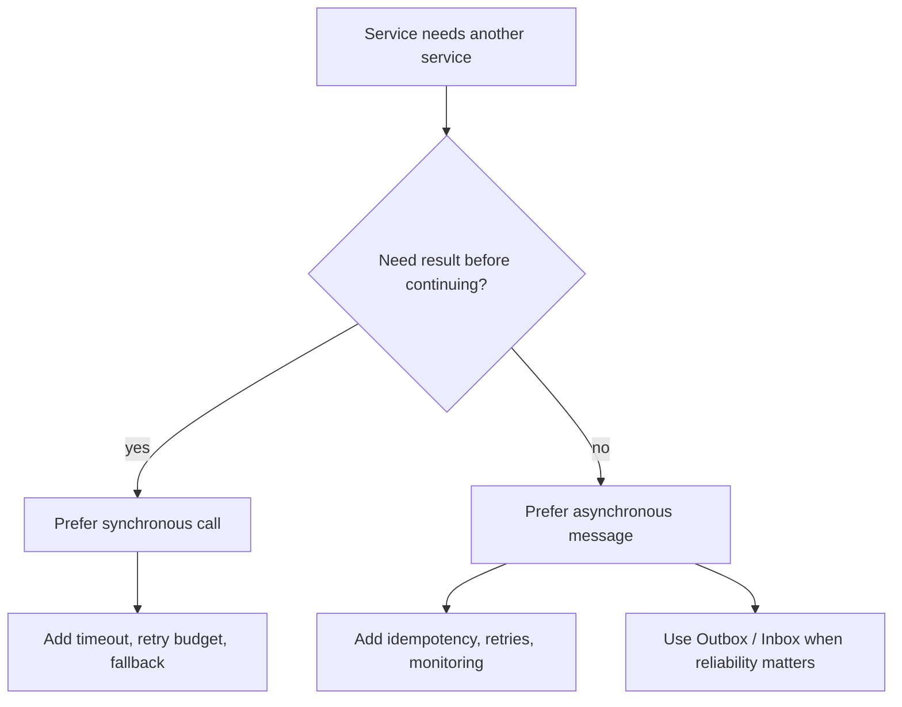
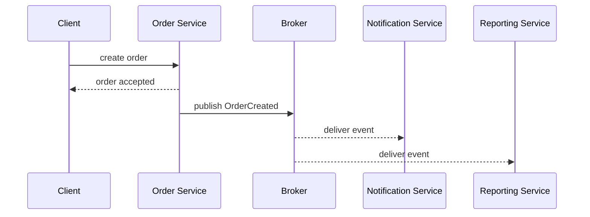

# Choosing Sync or Async Service Communication

The honest answer is: neither synchronous nor asynchronous communication is always preferable. A service interaction is preferable when it matches the business moment. If the caller needs an answer now, synchronous is usually clearer. If the caller only needs to hand off work or announce that something happened, asynchronous is usually stronger. Think of a kitchen: sometimes the cashier must ask the card terminal for approval before giving a receipt, and sometimes the cashier can put a ticket on the board so the kitchen works in the background.

For the basic definitions, review [Synchronous vs Asynchronous Communication](topic:sync-vs-async-communication). This topic is about the decision rule: choose by timing, consistency, failure behavior and operational cost. It is like choosing between a phone call, a parcel and a traffic signal: each solves a different coordination problem.

## 60-second interview answer

I would not say one is always better. Synchronous communication is preferable when the business flow needs an immediate answer: read data for a user request, validate a command, reserve inventory before confirming an order, or return a clear success or failure to the client. The tradeoff is runtime coupling: the caller now depends on the callee's latency and availability.

Asynchronous communication is preferable when the work can finish later or when several services must react to an event independently: send email, build a report, update a search index, process media, or publish a domain event after an order is created. It reduces time coupling and helps absorb spikes, but it adds eventual consistency, duplicate handling, retries, ordering, dead-letter queues and observability.

So my rule is: use sync for immediate decisions and simple query/command flows; use async for delayed work, integration events, fan-out and resilience. Many real systems use both in one flow. The front door may be synchronous, while downstream processing is asynchronous - like a post office accepting a parcel at the counter now, then sorting and delivering it later.

## Decision flow

The first question is whether the user or caller can continue without the result. If not, prefer a synchronous call with timeouts, retries with a budget, circuit breakers and a fallback. This is the restaurant-counter case: the customer cannot leave with the answer until the cashier knows whether the payment was approved.

If the work can happen after the first response, prefer asynchronous messaging. A queue or event stream lets the producer move on while consumers process at their own pace. This is the post-office case: the sender drops the parcel, gets a tracking number and does not wait until the recipient opens the box.

The second question is consistency. Synchronous communication often fits when the caller must return the current truth immediately. Asynchronous communication often fits when eventual consistency is acceptable. In kitchen terms, sync is asking the chef whether an ingredient is available before selling the dish; async is writing a prep task on a board and letting stations catch up.

The third question is fan-out. If one service must notify many independent services, asynchronous events are usually cleaner than a synchronous chain. The producer should not wait for email, analytics, search indexing and notifications just to return to the user. This is like one announcement over a station speaker instead of calling every passenger one by one.

## Common production shapes

A common shape is "sync at the edge, async inside." The API answers quickly after the core command is accepted, then publishes events for background work. This keeps the user's request understandable while avoiding a long chain of synchronous calls. It is like a reception desk taking your form now and routing copies to departments afterward.

When an event must not be lost after a database change, use the [Outbox pattern](topic:outbox-pattern). It records the event in the same local transaction as the business change, then publishes it later. The analogy is a dispatch ledger at the post office: the parcel is not considered handed off unless it is written into the ledger.

When a consumer may receive the same message twice, use idempotency and often the [Inbox pattern](topic:inbox-pattern). The consumer stores processed message ids and skips duplicates. This is like a receiving desk stamping parcel numbers so the same parcel is not paid for twice.

Broker choice also matters. Kafka and RabbitMQ encourage different delivery and retention models; see [Kafka vs RabbitMQ](topic:kafka-vs-rabbitmq). In everyday terms, Kafka is closer to a replayable conveyor belt with a history, while RabbitMQ is closer to a routing desk that hands tasks to workers.

## What makes synchronous preferable

Synchronous communication is preferable for immediate reads, request validation and decisions that must happen before the caller continues. It keeps control flow easy to follow: request, response, result. This is like a traffic light: every car needs the signal now, not a letter tomorrow.

It is also useful when the callee owns data and the caller only needs to ask a small question. Duplicating that data through events can be more expensive than a direct read. This is like asking the price scanner at the store instead of mailing every possible price change to every customer.

But synchronous calls need boundaries. Always think about timeout, retry budget, circuit breaker, bulkhead, fallback and observability. Otherwise one slow service can slow the whole chain. This is like one blocked checkout line delaying the entire store unless there is a rule for opening another counter.

## What makes asynchronous preferable

Asynchronous communication is preferable for work that can be delayed, retried or processed independently. It fits notifications, audit logs, report generation, indexing, media processing and integration between bounded contexts. This is like leaving clothes at a laundry counter: you get a ticket now, and the cleaning happens later.

It also helps absorb spikes. Producers can enqueue messages quickly while consumers work at a stable rate. Queue depth becomes the signal to watch. This is like a post-office sorting bin: it protects the counter during rush hour, but a growing pile means delivery is falling behind.

The cost is complexity. Async flows need schemas, versioning, correlation ids, tracing, retry limits, dead-letter queues, idempotent handlers and a way for users to learn final status. This is like parcel tracking: dropping the parcel is easy, but a real delivery network needs labels, scans and return rules.

## Common misconceptions

"Async is always better" is wrong. It can make the first response faster, but the business work may finish later and the system becomes harder to reason about. That is like leaving a parcel quickly: the sender is free sooner, but the delivery still takes time.

"Sync is bad in microservices" is wrong. Synchronous calls are normal for immediate reads and decisions. The problem is not sync itself; the problem is unbounded synchronous chains. That is like a phone call: useful for one urgent answer, painful if every answer depends on five more calls.

"A queue makes failures disappear" is wrong. Failures move from the user's request path into retries, dead-letter queues and operations. A failed delivery still exists even if the sender already left the counter.

"Eventual consistency means inconsistent design" is wrong. It is a deliberate choice when the business can tolerate delayed convergence. The important part is making the delay visible and handled. It is like a kitchen display: the order is accepted before every station has finished, but everyone can see the ticket status.

"Exactly-once delivery solves duplicates" is usually a trap. Many real systems still require idempotent consumers because retries, producer failures and handler failures can repeat work. This is why [Inbox pattern](topic:inbox-pattern) and careful message keys matter. It is like checking the parcel number before charging a customer again.

## Final rule of thumb

Prefer synchronous when the next step truly depends on the answer now. Prefer asynchronous when the system can accept work now and complete or notify later. Prefer a hybrid when the user needs a quick acknowledgement but the full workflow has independent side effects. The best answer names the tradeoff, not a favorite technology.
