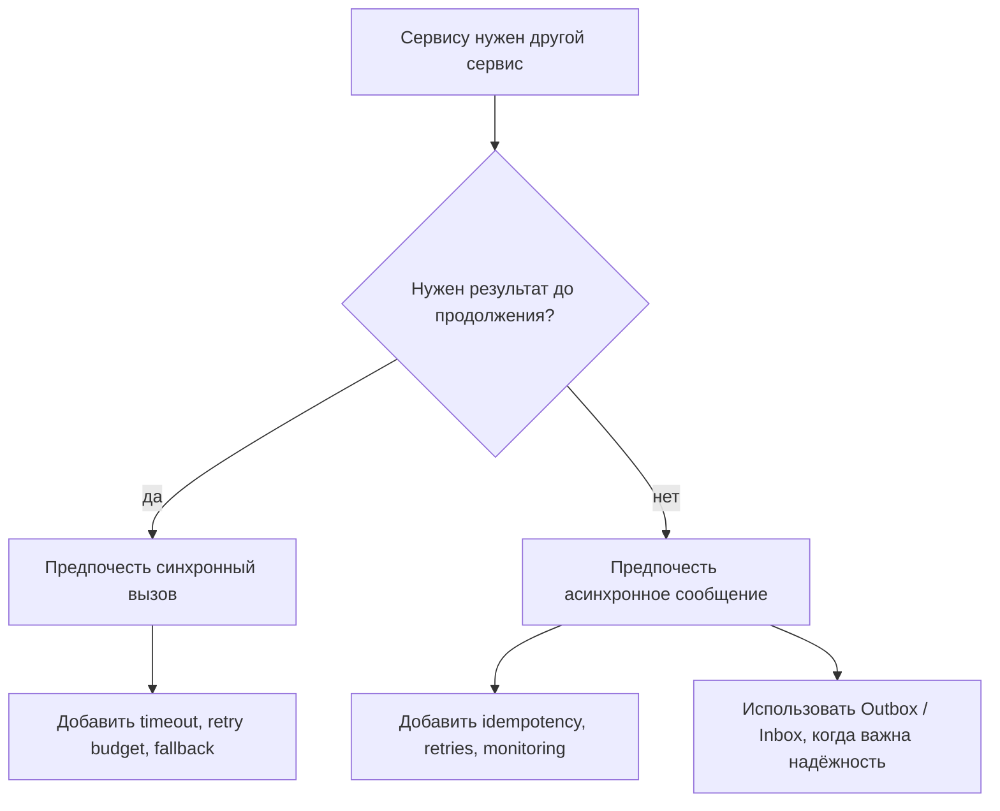
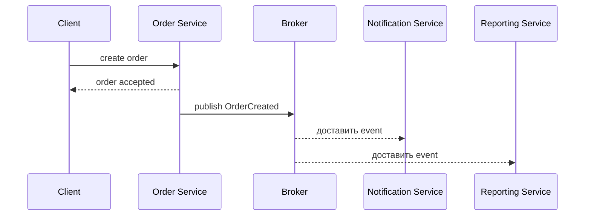

# Выбор синхронного или асинхронного взаимодействия сервисов

Честный ответ такой: ни синхронное, ни асинхронное взаимодействие не является предпочтительным всегда. Взаимодействие сервисов подходит тогда, когда оно совпадает с бизнес-моментом. Если вызывающему сервису нужен ответ прямо сейчас, синхронный вариант обычно понятнее. Если нужно только передать работу или сообщить, что что-то произошло, асинхронный вариант обычно сильнее. Представьте кухню: иногда кассир должен спросить платёжный терминал об одобрении до выдачи чека, а иногда кассир может повесить заказ на доску, чтобы кухня работала в фоне.

Базовые определения есть в теме [Synchronous vs Asynchronous Communication](topic:sync-vs-async-communication). Здесь важнее правило выбора: смотреть на сроки, согласованность, поведение при сбоях и операционную цену. Это похоже на выбор между телефонным звонком, посылкой и светофором: каждый способ решает свою задачу координации.

## Ответ на 60 секунд

Я бы не говорил, что один вариант всегда лучше. Синхронное взаимодействие предпочтительнее, когда бизнес-потоку нужен немедленный ответ: прочитать данные для пользовательского запроса, проверить команду, зарезервировать товар перед подтверждением заказа или вернуть клиенту понятный успех либо ошибку. Компромисс - runtime coupling: вызывающий сервис зависит от задержки и доступности вызываемого сервиса.

Асинхронное взаимодействие предпочтительнее, когда работа может завершиться позже или когда несколько сервисов должны независимо отреагировать на событие: отправить email, построить отчёт, обновить поисковый индекс, обработать медиа или опубликовать domain event после создания заказа. Оно уменьшает временную связность и помогает переживать всплески нагрузки, но добавляет eventual consistency, обработку дублей, повторы, порядок сообщений, dead-letter queues и наблюдаемость.

Моё правило такое: используйте sync для немедленных решений и простых query/command потоков; используйте async для отложенной работы, integration events, fan-out и устойчивости. Во многих реальных системах есть оба подхода в одном сценарии. Входная дверь может быть синхронной, а внутренняя обработка - асинхронной, как на почте: посылку принимают у стойки сейчас, а сортируют и доставляют позже.

## Схема выбора

Первый вопрос - может ли пользователь или вызывающий сервис продолжить без результата. Если нет, чаще выбирайте синхронный вызов с timeout, retry budget, circuit breaker и fallback. Это случай стойки в ресторане: клиент не может уйти с ответом, пока кассир не узнает, одобрен ли платёж.

Если работа может произойти после первого ответа, чаще выбирайте асинхронные сообщения. Queue или event stream позволяет producer продолжить работу, пока consumers обрабатывают сообщения в своём темпе. Это почтовый сценарий: отправитель сдаёт посылку, получает трек-номер и не ждёт, пока получатель откроет коробку.

Второй вопрос - согласованность. Синхронное взаимодействие часто подходит, когда вызывающий сервис должен сразу вернуть актуальную правду. Асинхронное взаимодействие часто подходит, когда допустима eventual consistency. В терминах кухни sync - спросить повара, есть ли ингредиент, до продажи блюда; async - записать задачу подготовки на доску и дать станциям догнать процесс.

Третий вопрос - fan-out. Если один сервис должен уведомить много независимых сервисов, асинхронные события обычно чище, чем синхронная цепочка. Producer не должен ждать email, analytics, search indexing и notifications только ради ответа пользователю. Это похоже на объявление по громкой связи на вокзале вместо звонка каждому пассажиру отдельно.

## Частые production-схемы

Распространённая схема - "sync на входе, async внутри". API быстро отвечает после принятия основной команды, а затем публикует события для фоновой работы. Так пользовательский запрос остаётся понятным, а длинная цепочка синхронных вызовов не появляется. Это как стойка регистрации: форму принимают сейчас, а копии потом расходятся по отделам.

Когда event нельзя потерять после изменения базы данных, используйте [Outbox pattern](topic:outbox-pattern). Он записывает event в той же локальной transaction, что и бизнес-изменение, а затем публикует его позже. Аналогия - журнал отправки на почте: посылка не считается переданной, пока она не записана в журнал.

Когда consumer может получить одно и то же сообщение дважды, нужны idempotency и часто [Inbox pattern](topic:inbox-pattern). Consumer хранит ids обработанных сообщений и пропускает дубли. Это как приёмный стол, который штампует номера посылок, чтобы за одну и ту же посылку не заплатили дважды.

Выбор broker тоже важен. Kafka и RabbitMQ задают разные модели доставки и хранения; см. [Kafka vs RabbitMQ](topic:kafka-vs-rabbitmq). В бытовой аналогии Kafka ближе к конвейеру с переигрываемой историей, а RabbitMQ - к диспетчерскому столу, который раздаёт задачи исполнителям.

## Когда синхронный вариант предпочтительнее

Синхронное взаимодействие предпочтительнее для немедленных чтений, проверки запросов и решений, которые должны произойти до продолжения. Поток управления легко читать: request, response, result. Это как светофор: каждой машине нужен сигнал сейчас, а не письмо завтра.

Оно также полезно, когда вызываемый сервис владеет данными, а вызывающему нужно задать небольшой вопрос. Дублировать эти данные через события может быть дороже, чем сделать прямое чтение. Это как спросить цену у сканера в магазине вместо того, чтобы рассылать каждому покупателю все возможные изменения цен.

Но синхронным вызовам нужны границы. Всегда думайте про timeout, retry budget, circuit breaker, bulkhead, fallback и observability. Иначе один медленный сервис может замедлить всю цепочку. Это как одна заблокированная касса, которая задерживает весь магазин, если нет правила открыть другую.

## Когда асинхронный вариант предпочтительнее

Асинхронное взаимодействие предпочтительнее для работы, которую можно отложить, повторить или обработать независимо. Оно подходит для notifications, audit logs, report generation, indexing, media processing и интеграции между bounded contexts. Это как сдать одежду в прачечную: талон вы получаете сейчас, а чистка происходит позже.

Оно также помогает сглаживать всплески нагрузки. Producers могут быстро ставить сообщения в очередь, пока consumers работают со стабильной скоростью. Queue depth становится важным сигналом. Это как сортировочная корзина на почте: она защищает стойку в час пик, но растущая куча означает, что доставка отстаёт.

Цена - сложность. Async-потокам нужны schemas, versioning, correlation ids, tracing, retry limits, dead-letter queues, idempotent handlers и способ показать пользователю финальный статус. Это как tracking посылки: сдать посылку легко, но настоящей сети доставки нужны ярлыки, сканы и правила возврата.

## Распространённые заблуждения

"Async всегда лучше" - неверно. Он может ускорить первый ответ, но бизнес-работа может завершиться позже, а систему становится сложнее понимать. Это как быстро оставить посылку: отправитель освобождается раньше, но доставка всё равно занимает время.

"Sync плох в микросервисах" - неверно. Синхронные вызовы нормальны для немедленных чтений и решений. Проблема не в sync как таковом, а в неограниченных синхронных цепочках. Это как телефонный звонок: полезен для одного срочного ответа, но мучителен, если каждый ответ зависит ещё от пяти звонков.

"Queue заставляет сбои исчезнуть" - неверно. Сбои переезжают из пользовательского запроса в retries, dead-letter queues и эксплуатацию. Неудачная доставка всё равно существует, даже если отправитель уже ушёл от стойки.

"Eventual consistency означает плохой дизайн" - неверно. Это осознанный выбор, когда бизнес допускает задержанную сходимость. Важно сделать задержку видимой и обработанной. Это как экран заказов на кухне: заказ принят до того, как все станции закончили работу, но все видят статус талона.

"Exactly-once delivery решает дубли" - обычно ловушка. Во многих реальных системах всё равно нужны idempotent consumers, потому что retries, сбои producer и сбои handler могут повторить работу. Поэтому важны [Inbox pattern](topic:inbox-pattern) и аккуратные message keys. Это как проверять номер посылки перед повторным списанием денег с клиента.

## Итоговое правило

Предпочитайте synchronous, когда следующий шаг действительно зависит от ответа прямо сейчас. Предпочитайте asynchronous, когда система может принять работу сейчас, а завершить или уведомить позже. Предпочитайте гибрид, когда пользователю нужно быстрое подтверждение, но полный workflow содержит независимые side effects. Лучший ответ называет компромисс, а не любимую технологию.
