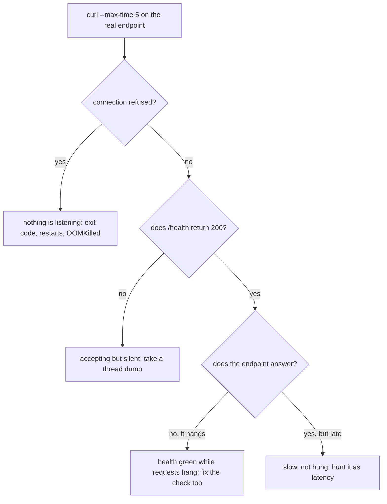
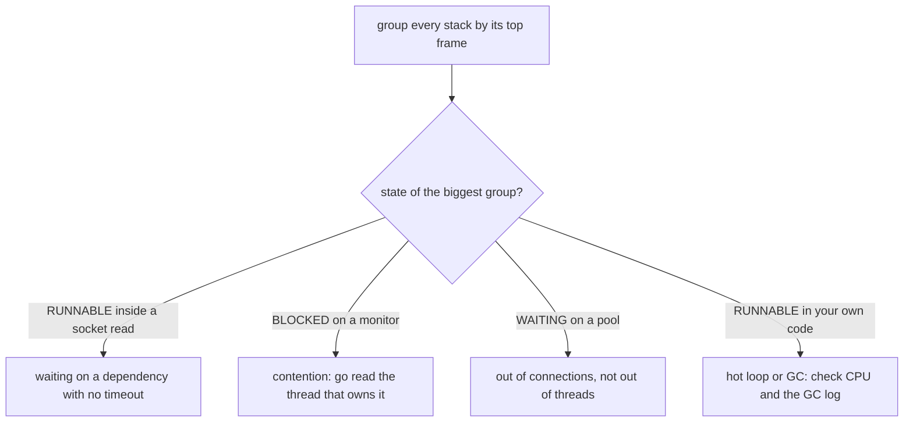
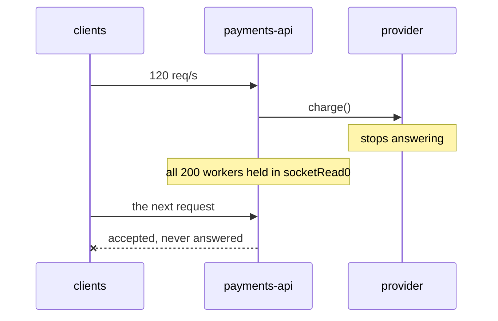

# A Service Stops Responding in Production

## What the question is really asking

Nobody expects you to name the bug. The interviewer wants to know whether you
have a **procedure** — whether, at 03:00, with a Product Owner in the channel and
no idea what is wrong, you produce ordered steps instead of a series of hunches.
The whole answer fits in one sentence: *find out which kind of "not responding"
it is, keep the evidence a restart would destroy, restore service, then find the
cause, fix both halves of it, prove it, and leave a guard behind.*

## Step 0: "not responding" is four different failures

This is the step that most candidates skip, and skipping it is what turns a
fifteen-minute incident into an afternoon. The same sentence — "it stopped
responding" — covers failures that share **no** causes and **no** fixes:

| What you see | What it means | Where you look next |
| --- | --- | --- |
| `Connection refused` | Nothing is listening on the port | Exit code, restart count, `OOMKilled`, crash-on-boot |
| Connects, no bytes back | The process is alive; no thread finishes your handler | Thread dump |
| Health returns `200`, the endpoint hangs | The check checks nothing a request touches | Thread dump **and** the check itself |
| Answers, but after the client gave up | A latency problem the client timeout converted into an outage | Treat it as [latency](topic:slow-website-diagnosis) |
| Some instances answer, some do not | Per-instance state: a leak, an exhausted pool, a bad node | Diff a sick instance against a healthy one |

Find out which one you have with the dumbest tools available, working outside in.
Every layer that answers deletes a whole family of hypotheses for free:



One extra probe is worth more than all the others: run the same `curl` **from
inside the container against `localhost`**. If localhost answers and the outside
does not, the process is healthy and the problem is in front of it — the load
balancer, the ingress, a security group, the service mesh, DNS. If localhost
hangs too, the problem is yours.

## Step 1: a hung JVM is a crime scene

Here is the hardest habit in this topic. A restart is simultaneously the correct
mitigation and the **destruction of all the evidence**. The thread stacks, the
heap, the open sockets, the pool counters — none of it is recoverable, and none
of it will be reconstructed from logs. Restart without capturing and the same
outage comes back tonight with exactly as much information as you have now, which
is none.

The rule is not "do not restart". You will restart, and often you should restart
first. The rule is that **twenty seconds** stand between you and keeping the
cause:

```bash
jcmd <pid> Thread.print > dump-1.txt   # repeat at +5s and +10s
jcmd <pid> GC.class_histogram | head -40
curl -s localhost:8080/actuator/metrics/tomcat.threads.busy
# heap dump only if memory is a suspect — it pauses the JVM and is large:
jcmd <pid> GC.heap_dump /tmp/heap.hprof
```

**Three dumps, not one.** One dump shows where threads are; three show whether
they are *moving*. A thread on the same frame in all three is stuck. Two hundred
threads on different frames each time are merely busy.

And if several instances are hung, restart all but one: keep a single hung
instance alive but drained out of the load balancer. It costs nothing and gives
you a live patient to study after service is restored.

## Step 2: read the dump by counting, not by reading

Nobody reads two hundred stacks. You **group them by top frame and count**, and
the biggest group is the outage:



Two details that catch people out. A thread blocked in a socket read is reported
as **`RUNNABLE`**, not `WAITING` — the JVM cannot tell that the OS is idle on its
behalf, so "most threads are RUNNABLE" does not mean "busy with work"; read the
frame. And a group `BLOCKED` on a monitor is never the answer by itself: find the
one thread that **owns** that monitor and read what *it* is doing. That single
stack is the whole outage.

If the dump ends with `Found one Java-level deadlock`, you are done arguing — the
JVM walked the monitor-ownership graph and printed the cycle. Two things are true
of deadlocks and both matter in an interview: **no timeout saves you**, because a
`synchronized` monitor has no timeout, and **no restart fixes it**, because the
lock ordering that caused it is still in the code. The fix is always the same
shape: acquire in one global order, hold one lock instead of two, or use a lock
that can time out ([Locks](topic:lock-alternatives)).

## Step 3: the arithmetic that makes it inevitable

This is the senior-level part of the answer, and it is one line:

> **concurrency = arrival rate × service time**

A pool of 200 workers can complete `200 / service time` requests per second. So:

| Provider latency | Capacity of 200 workers | Arriving | Result |
| --- | --- | --- | --- |
| 50 ms | 4000 req/s | 120 req/s | Enormous headroom |
| 8 s | **25 req/s** | 120 req/s | Every worker busy after 1.6 s, then silence |

Nothing in your code changed. A dependency's service time went up by 160×, so the
number of threads you need went up by 160×, and your pool stayed at 200. That is
the entire mechanism of a **cascading failure**:



Two consequences interviewers listen for:

- **A bigger pool is not a fix.** Doubling 200 to 400 buys 1.6 more seconds and
  doubles the load on a dependency that is already failing.
- **The lever is service time**, and a timeout is what puts a hard ceiling on it.
  A 1 s read timeout means a slow dependency can never own more than one second of
  each worker — capacity goes from 25 to 200 req/s for one line of config. Then
  a **bulkhead** (a separate small pool per dependency) stops it drinking the
  shared pool dry, and a **circuit breaker** fails fast instead of queueing. See
  [Service Timeouts, Fallbacks, and Circuit Breakers](topic:service-timeouts-fallbacks)
  and [Thread Pool](topic:java-thread-pool).

## Step 4: the other suspects

Not every silence is a blocked worker. Three more shapes are worth memorising,
and the CPU graph tells them apart in one glance:

- **GC thrash — CPU at 100%, no responses, nothing thrown.** The heap is full of
  *live* objects, so every full collection reclaims almost nothing and is
  immediately followed by another. The number that matters is not "how much heap
  is used" (a healthy JVM runs near its ceiling by design) but **how full it still
  is right after a full collection**, plus the share of wall clock spent in
  pauses. See [Memory Leaks](topic:memory-leaks),
  [Diagnosing Memory Growth in Production](topic:diagnosing-memory-leaks) and
  [Configuring the Garbage Collector](topic:gc-configuration).
- **Deadlock — CPU at 2%, memory flat, no responses.** Covered above; the dump
  proves it itself.
- **Below the JVM — no logs at all, which is the tell.** A full disk stops the log
  write that every request makes, and the service freezes with no exception
  visible because *writing the exception* is what fails. Exhausted file
  descriptors refuse every new connection while existing ones keep working. A
  container throttled by its CPU quota runs at a fraction of the speed the graph
  implies. A container killed by its **memory limit** (`OOMKilled`) is the
  platform's decision, not the JVM's — it is the container limit, not the heap.

## Step 5: restore service, which is not the same as fixing it

Users being served and the bug being gone are two separate facts, and conflating
them stretches a five-minute outage in both directions — by debugging while
customers are down, or by walking away the moment the graph turns green.

Mitigation is deliberately dumb, reversible, and does not require understanding:
restart the hung instances (you have the dumps now), roll back the release, turn
the feature flag off, drain and replace one bad pod, shed the traffic that is
hurting you, or fail fast on the dependency that is dragging you down so at least
the requests that do not need it succeed. **Pick the reversible option every
time.** One caution on rollbacks: a rollback undoes code, never writes — check
whether the release migrated a schema before you roll back onto data the old
version cannot read.

## Step 6: prove it, then leave a guard behind

Verification means the request that failed now succeeds, in the environment it
failed in — not a unit test, not "the errors stopped". For an outage, check three
things: the endpoint answers with a normal status *and* a normal latency; the
graphs return to where they were, **including queue depth and pool gauges**
(a service can answer while still working through a backlog); and a fresh thread
dump looks healthy, with workers idle rather than parked.

Then ask the only question that produces permanent value — *what would have made
this shorter?* — and there are four useful answers:

1. **Alert on what users experience** (successful requests per second, error
   rate, p99 latency), not on whether the process exists. "The process is up" was
   true throughout this entire incident. See
   [Application Metrics](topic:application-metrics) and [Kibana](topic:why-kibana).
2. **Readiness touches what a request touches; liveness does not.** Then a slow
   dependency takes an instance *out of rotation* instead of into a restart loop.
   Put a database check in the liveness probe and a slow database will restart
   your entire fleet ([Why Kubernetes](topic:why-kubernetes)).
3. **Defaults that make the next one survivable**: a finite timeout on every
   outbound call, bounded queues, a bulkhead per dependency.
4. **A committed capture script**, so the next person collects the dumps in
   twenty seconds without having to remember how at 03:00.

## The 60-second interview answer

> First I find out what "not responding" means here, because it is four different
> failures. I probe outside in — DNS, a TCP connect, one `curl` with an explicit
> timeout, then the same `curl` from inside the container against localhost.
> Refused means nothing is listening, so I read the exit code and the restart
> count. Connected with no bytes back means the process is alive and no thread
> finishes the handler.
>
> In that case, before anything restarts, I capture: three thread dumps five
> seconds apart, a heap histogram, the GC log, the pool gauges. That is twenty
> seconds and it is the difference between an answer and a rumour. If several
> instances are hung I restart all but one and keep that one drained but alive.
>
> Then I restore service with the most reversible thing available — roll back,
> flip the flag, restart — and only then diagnose. I read the dump by counting:
> the biggest group of identical top frames is the outage. A crowd in a socket
> read means a downstream dependency and a missing timeout; a crowd BLOCKED means
> contention, and I read the thread that owns the monitor; a crowd waiting on a
> pool means I ran out of connections, not threads; CPU pinned with no progress
> means GC, so I read the GC log.
>
> The arithmetic usually closes it: concurrency equals arrival rate times service
> time, so a dependency going from 50 ms to 8 seconds needs 160× the threads and
> my pool did not grow. The fix has two halves — the thing that broke, and the
> mechanism that let it take everything with it: timeouts, a bulkhead, a circuit
> breaker, a bounded queue. I verify with the request that failed, watch the
> queue and pool graphs come back, and leave behind an alert on successful
> requests rather than on whether the process exists.

## Common traps

- **Restarting before capturing.** The most common and most expensive habit in
  this topic. It fixes today and guarantees tomorrow.
- **Assuming which failure it is.** Reading thread dumps of a process that is not
  running, or restarting a process that was alive and would have told you
  everything.
- **Raising a limit instead of adding a timeout.** More workers against a dead
  dependency means more workers to lose — and more load on the thing that is
  already failing.
- **Trusting a health check that touches nothing.** A `/health` that returns a
  constant proves the HTTP thread pool has one free thread and nothing else.
- **Putting a dependency check in the liveness probe.** A slow database becomes a
  fleet-wide restart loop.
- **Reading a dump line by line.** Group and count; the shape is the answer.
- **Believing "most threads are RUNNABLE" means "busy".** A blocked socket read
  is reported as RUNNABLE.
- **Expecting an exception.** Hangs, deadlocks, GC thrash and a full disk all
  produce silence, not stack traces — which is why "nothing in the logs" is a
  clue, not a dead end.
- **Closing the incident when the graph turns green.** Recovery without a cause is
  a postponement, especially when the dependency simply came back on its own.
- **Skipping the follow-up.** The alert, the timeout and the capture script are
  the only permanent output of an outage.

## Related topics

[Service Timeouts, Fallbacks, and Circuit Breakers](topic:service-timeouts-fallbacks) ·
[The Site Is Slow: How Do You Find the Cause?](topic:slow-website-diagnosis) ·
[It Passed Tests and Broke in Production](topic:endpoint-broken-in-prod) ·
[A Single Server Is Overwhelmed](topic:scaling-an-overloaded-server) ·
[Java Thread Pool](topic:java-thread-pool) ·
[Diagnosing Memory Growth and Leaks in Production](topic:diagnosing-memory-leaks) ·
[Alternatives to synchronized: Locks](topic:lock-alternatives) ·
[Application Metrics](topic:application-metrics)
