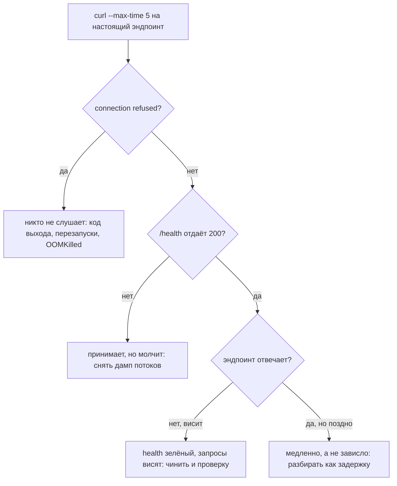
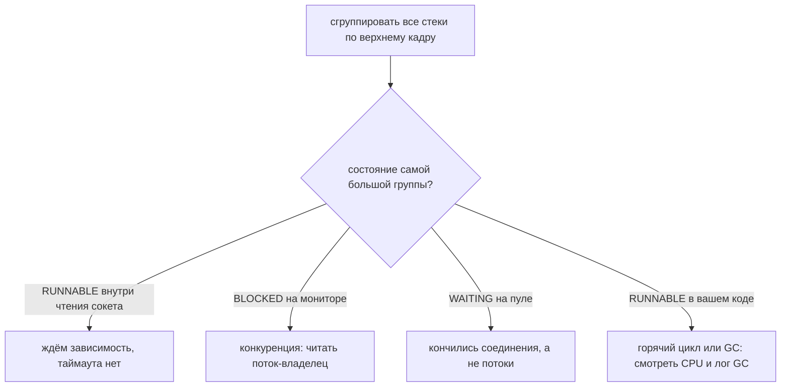
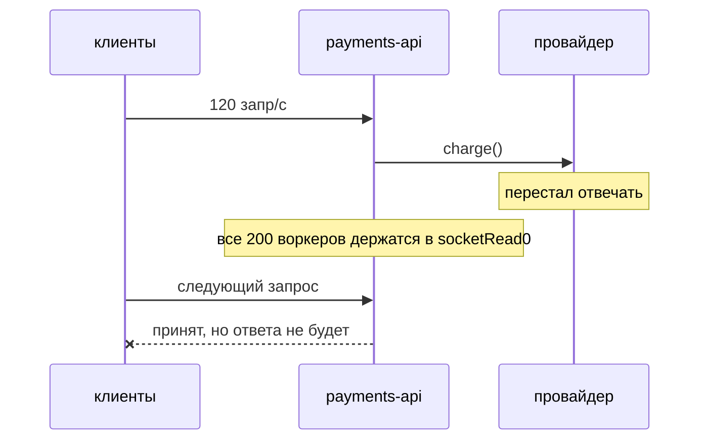

# Сервис в проде перестал отвечать

## О чём на самом деле спрашивают

Никто не ждёт, что вы назовёте баг. Интервьюер хочет понять, есть ли у вас
**процедура** — выдадите ли вы в 03:00, с владельцем продукта в канале и без
единой догадки о причине, упорядоченные шаги вместо череды предположений. Весь
ответ помещается в одну фразу: *выясните, какое именно «не отвечает» перед вами,
сохраните улики, которые уничтожит перезапуск, восстановите сервис, затем найдите
причину, почините обе её половины, докажите это и оставьте после себя защиту.*

## Шаг 0: «не отвечает» — это четыре разных сбоя

Именно этот шаг чаще всего пропускают, и именно пропуск превращает
пятнадцатиминутный инцидент в целый день. Одна и та же фраза — «перестало
отвечать» — покрывает сбои, у которых **нет** общих причин и **нет** общих
исправлений:

| Что вы видите | Что это значит | Куда смотреть дальше |
| --- | --- | --- |
| `Connection refused` | На порту никто не слушает | Код выхода, счётчик перезапусков, `OOMKilled`, падение при старте |
| Соединяется, ответа нет | Процесс жив, но ни один поток не доводит обработчик до конца | Дамп потоков |
| Health отдаёт `200`, эндпоинт висит | Проверка не трогает ничего из того, что трогает запрос | Дамп потоков **и** сама проверка |
| Отвечает, но клиент уже сдался | Проблема задержки, которую клиентский таймаут превратил в аварию | Разбирайте как [задержку](topic:slow-website-diagnosis) |
| Часть экземпляров отвечает, часть нет | Состояние конкретного экземпляра: утечка, исчерпанный пул, плохой узел | Сравните больной экземпляр со здоровым |

Выясняйте, какой случай у вас, самыми тупыми инструментами, идя снаружи внутрь.
Каждый ответивший слой бесплатно вычёркивает целое семейство гипотез:



Одна дополнительная проба стоит больше всех остальных: выполните тот же `curl`
**изнутри контейнера на `localhost`**. Если localhost отвечает, а снаружи — нет,
процесс здоров и проблема перед ним: балансировщик, ingress, группа безопасности,
service mesh, DNS. Если localhost тоже висит — проблема ваша.

## Шаг 1: зависшая JVM — это место преступления

Вот самая трудная привычка в теме. Перезапуск одновременно является правильным
смягчением и **уничтожением всех улик**. Стеки потоков, куча, открытые сокеты,
счётчики пулов — ничего из этого не восстановить и ничего не реконструировать по
логам. Перезапустите без сбора артефактов — и та же авария вернётся сегодня
ночью ровно с тем же объёмом информации, что у вас сейчас, то есть с нулевым.

Правило не «не перезапускать». Вы перезапустите, и часто именно первым делом.
Правило в том, что между вами и сохранённой причиной стоят **двадцать секунд**:

```bash
jcmd <pid> Thread.print > dump-1.txt   # повторить на +5с и +10с
jcmd <pid> GC.class_histogram | head -40
curl -s localhost:8080/actuator/metrics/tomcat.threads.busy
# дамп кучи — только если под подозрением память: он останавливает JVM и велик
jcmd <pid> GC.heap_dump /tmp/heap.hprof
```

**Три дампа, а не один.** Один дамп показывает, где потоки; три показывают,
*движутся* ли они. Поток на одном и том же кадре во всех трёх застрял. Двести
потоков, каждый раз на разных кадрах, просто заняты.

А если зависших экземпляров несколько — перезапустите все, кроме одного:
оставьте единственный зависший живым, но выведенным из балансировки. Это ничего
не стоит и даёт живого пациента для изучения после восстановления сервиса.

## Шаг 2: читайте дамп счётом, а не построчно

Двести стеков никто не читает. Их **группируют по верхнему кадру и считают**, и
самая большая группа и есть авария:



Две детали, на которых спотыкаются. Поток, заблокированный в чтении сокета,
показывается как **`RUNNABLE`**, а не `WAITING`: JVM не знает, что ОС простаивает
за него, поэтому «большинство потоков в RUNNABLE» не означает «заняты работой» —
читайте кадр. И группа в `BLOCKED` на мониторе сама по себе никогда не ответ:
найдите единственный поток, который **владеет** этим монитором, и прочитайте, что
делает *он*. Этот один стек и есть вся авария.

Если дамп заканчивается строкой `Found one Java-level deadlock`, спорить больше
не о чем — JVM обошла граф владения мониторами и напечатала цикл. Про
взаимоблокировки верны два утверждения, и оба важны на собеседовании: **никакой
таймаут не спасёт**, потому что у монитора `synchronized` нет таймаута, и
**никакой перезапуск не починит**, потому что порядок захвата, который к этому
привёл, остался в коде. Исправление всегда одной формы: захватывать в едином
глобальном порядке, держать одну блокировку вместо двух или брать блокировку,
умеющую истекать по времени ([Locks](topic:lock-alternatives)).

## Шаг 3: арифметика, которая делает сбой неизбежным

Это сеньорская часть ответа, и она укладывается в одну строку:

> **параллелизм = интенсивность прихода × время обслуживания**

Пул из 200 воркеров способен завершать `200 / время обслуживания` запросов в
секунду. Отсюда:

| Задержка провайдера | Способность 200 воркеров | Приходит | Результат |
| --- | --- | --- | --- |
| 50 мс | 4000 запр/с | 120 запр/с | Огромный запас |
| 8 с | **25 запр/с** | 120 запр/с | Все воркеры заняты через 1,6 с, дальше тишина |

В вашем коде не изменилось ничего. Время обслуживания у зависимости выросло в
160 раз, значит и нужное число потоков выросло в 160 раз, а ваш пул остался
равен 200. В этом и состоит весь механизм **каскадного отказа**:



Два следствия, которых ждут на собеседовании:

- **Больший пул — не исправление.** Удвоение с 200 до 400 покупает ещё 1,6
  секунды и вдвое увеличивает нагрузку на и без того падающую зависимость.
- **Рычаг — это время обслуживания**, а жёсткий потолок на него ставит таймаут.
  Таймаут чтения в 1 с означает, что медленная зависимость никогда не займёт
  больше секунды каждого воркера: способность растёт с 25 до 200 запр/с ценой
  одной строки конфигурации. Дальше **переборка** (отдельный маленький пул на
  каждую зависимость) не даёт ей выпить общий пул досуха, а **размыкатель цепи**
  быстро отказывает вместо ожидания в очереди. См.
  [Таймауты, фолбэки и circuit breaker](topic:service-timeouts-fallbacks) и
  [Пул потоков](topic:java-thread-pool).

## Шаг 4: остальные подозреваемые

Не всякая тишина — это заблокированный воркер. Ещё три формы стоит запомнить, и
график CPU различает их одним взглядом:

- **GC-трэшинг — CPU 100%, ответов нет, ничего не выброшено.** Куча забита
  *живыми* объектами, поэтому каждая полная сборка освобождает почти ничего и
  немедленно сменяется следующей. Значение имеет не «сколько кучи занято»
  (здоровая JVM по устройству работает у своего потолка), а **насколько она
  заполнена сразу после полной сборки**, плюс доля времени, проведённого в
  паузах. См. [Утечки памяти](topic:memory-leaks),
  [Диагностика роста памяти в проде](topic:diagnosing-memory-leaks) и
  [Настройка сборщика мусора](topic:gc-configuration).
- **Взаимоблокировка — CPU 2%, память ровная, ответов нет.** Разобрана выше;
  дамп доказывает её сам.
- **Ниже JVM — логов нет вообще, и это как раз примета.** Заполненный диск
  останавливает запись в лог, которую делает каждый запрос, и сервис замирает
  без единого видимого исключения, потому что падает именно *запись этого
  исключения*. Исчерпанные файловые дескрипторы отказывают каждому новому
  соединению, пока уже открытые продолжают работать. Контейнер, придушенный
  квотой CPU, работает на доле той скорости, которую подразумевает график. А
  контейнер, убитый **лимитом памяти** (`OOMKilled`), — это решение платформы, а
  не JVM: речь о лимите контейнера, а не о куче.

## Шаг 5: восстановить сервис — не то же самое, что починить

«Пользователей обслуживают» и «бага больше нет» — два разных факта, и их
смешение растягивает пятиминутную аварию в обе стороны: либо вы отлаживаете,
пока клиенты лежат, либо уходите, едва график позеленел.

Смягчение намеренно тупое, обратимое и не требует понимания: перезапустить
зависшие экземпляры (дампы у вас уже есть), откатить релиз, выключить
фича-флаг, вывести и заменить один плохой под, срезать трафик, который вас
убивает, или начать быстро падать на тянущей вниз зависимости, чтобы хотя бы
запросы, которым она не нужна, проходили. **Каждый раз выбирайте обратимый
вариант.** Одна оговорка про откат: откат отменяет код, но никогда не отменяет
записи — проверьте, не мигрировал ли релиз схему, прежде чем откатываться на
данные, которые старая версия не умеет читать.

## Шаг 6: докажите — и оставьте после себя защиту

Проверка означает, что запрос, который падал, теперь проходит, и выполнен он в
том окружении, где падал, — не юнит-тест и не «ошибки перестали идти». Для
аварии проверок три: эндпоинт отвечает нормальным статусом *и* с нормальной
задержкой; графики вернулись туда, где были, **включая глубину очереди и
показания пулов** (сервис может отвечать, всё ещё разгребая накопившееся); и
свежий дамп потоков выглядит здоровым — воркеры простаивают, а не припаркованы.

Затем задайте единственный вопрос, дающий постоянную ценность, — *что сделало бы
это короче?* — и полезных ответов будет четыре:

1. **Алерт на то, что переживают пользователи** (успешные запросы в секунду,
   доля ошибок, задержка p99), а не на существование процесса. «Процесс жив» было
   правдой на протяжении всего этого инцидента. См.
   [Метрики приложения](topic:application-metrics) и [Kibana](topic:why-kibana).
2. **Readiness трогает то же, что трогает запрос; liveness — нет.** Тогда
   медленная зависимость выводит экземпляр *из ротации*, а не загоняет его в цикл
   перезапусков. Поставьте проверку базы в liveness — и медленная база
   перезапустит вам весь парк ([Зачем Kubernetes](topic:why-kubernetes)).
3. **Умолчания, делающие следующий раз переживаемым**: конечный таймаут на
   каждом исходящем вызове, ограниченные очереди, переборка на каждую
   зависимость.
4. **Закоммиченный скрипт сбора артефактов**, чтобы следующий собрал дампы за
   двадцать секунд, не вспоминая в 03:00, как это делается.

## Ответ на собеседовании за 60 секунд

> Сначала я выясняю, что здесь означает «не отвечает», потому что это четыре
> разных сбоя. Пробую снаружи внутрь: DNS, TCP-соединение, один `curl` с явным
> таймаутом, затем тот же `curl` изнутри контейнера на localhost. Refused
> означает, что никто не слушает, — читаю код выхода и счётчик перезапусков.
> Соединение есть, ответа нет — процесс жив, и ни один поток не доводит
> обработчик до конца.
>
> В этом случае, до любого перезапуска, я собираю: три дампа потоков с
> интервалом в пять секунд, гистограмму кучи, лог GC, показания пулов. Это
> двадцать секунд, и они отделяют ответ от слуха. Если зависло несколько
> экземпляров, перезапускаю все, кроме одного, а этот один оставляю живым, но
> выведенным из балансировки.
>
> Затем восстанавливаю сервис самым обратимым доступным действием — откат, флаг,
> перезапуск — и только потом диагностирую. Дамп читаю счётом: самая большая
> группа одинаковых верхних кадров и есть авария. Толпа в чтении сокета — это
> зависимость и отсутствующий таймаут; толпа в BLOCKED — конкуренция, и я иду
> читать поток, владеющий монитором; толпа в ожидании пула — кончились
> соединения, а не потоки; загруженный CPU без прогресса — это GC, и я читаю его
> лог.
>
> Обычно всё закрывает арифметика: параллелизм равен интенсивности прихода на
> время обслуживания, поэтому зависимость, ушедшая с 50 мс на 8 секунд, требует в
> 160 раз больше потоков, а мой пул не вырос. У исправления две половины — то,
> что сломалось, и механизм, позволивший этому утащить всё остальное: таймауты,
> переборка, размыкатель цепи, ограниченная очередь. Проверяю тем запросом,
> который падал, смотрю, как возвращаются графики очереди и пулов, и оставляю
> алерт на успешные запросы, а не на существование процесса.

## Типичные ловушки

- **Перезапуск до сбора улик.** Самая частая и самая дорогая привычка в теме.
  Она чинит сегодня и гарантирует завтра.
- **Догадка вместо классификации сбоя.** Чтение дампов процесса, которого нет, —
  или перезапуск процесса, который был жив и рассказал бы всё.
- **Поднять лимит вместо того, чтобы добавить таймаут.** Больше воркеров против
  мёртвой зависимости — это больше воркеров, которые можно потерять, и больше
  нагрузки на то, что и так падает.
- **Доверие проверке, которая ничего не трогает.** `/health`, возвращающий
  константу, доказывает, что в HTTP-пуле есть один свободный поток, и больше
  ничего.
- **Проверка зависимости в liveness-пробе.** Медленная база превращается в цикл
  перезапусков всего парка.
- **Чтение дампа построчно.** Группируйте и считайте: ответ — в форме.
- **Вера, что «большинство потоков в RUNNABLE» значит «заняты».**
  Заблокированное чтение сокета показывается как RUNNABLE.
- **Ожидание исключения.** Зависания, взаимоблокировки, GC-трэшинг и полный диск
  дают тишину, а не стек-трейсы, — поэтому «в логах ничего нет» это улика, а не
  тупик.
- **Закрыть инцидент, когда график позеленел.** Восстановление без причины — это
  отсрочка, особенно если зависимость просто вернулась сама.
- **Пропустить последующие задачи.** Алерт, таймаут и скрипт сбора артефактов —
  единственный постоянный результат аварии.

## Связанные темы

[Таймауты, фолбэки и circuit breaker](topic:service-timeouts-fallbacks) ·
[Сайт тормозит: как найти причину?](topic:slow-website-diagnosis) ·
[Прошло тесты и сломалось в проде](topic:endpoint-broken-in-prod) ·
[Один сервер не справляется](topic:scaling-an-overloaded-server) ·
[Пул потоков в Java](topic:java-thread-pool) ·
[Диагностика роста памяти и утечек в проде](topic:diagnosing-memory-leaks) ·
[Альтернативы synchronized: Locks](topic:lock-alternatives) ·
[Метрики приложения](topic:application-metrics)
