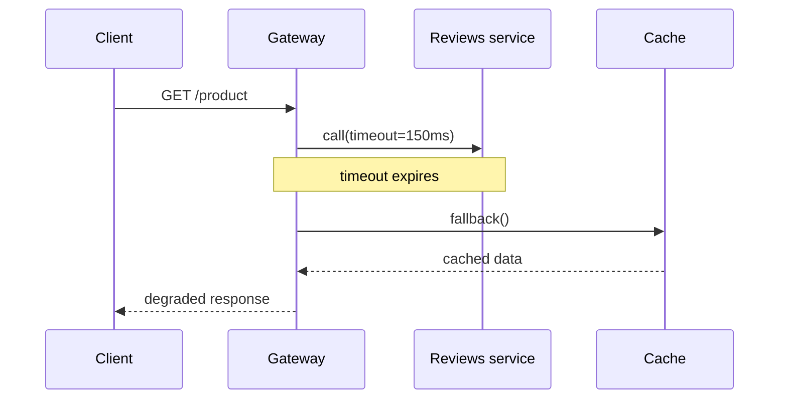
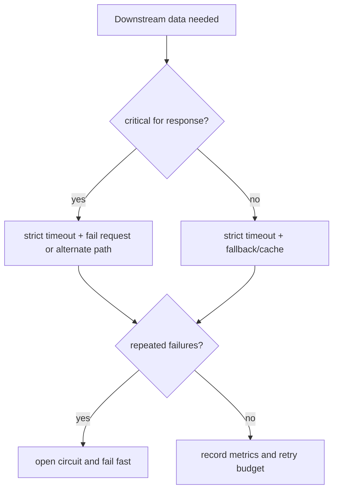

# Service Timeouts, Fallbacks, and Circuit Breakers

When a service calls several other services, the main risk is not only that one
dependency fails. The risk is that the caller waits too long, keeps threads busy,
and turns one dependency outage into slow responses everywhere. Like a post
office counter waiting for one missing stamp roll, the whole line should not stop
if there is a clear fallback process.

This topic is a focused follow-up to [Synchronous vs Asynchronous Communication](topic:sync-vs-async-communication)
and [Why Microservices](topic:why-microservices). The goal is to keep a
synchronous request bounded: the user gets either a normal answer, a degraded
answer, or a clear error quickly.

## The Mental Model

A request should have an end-to-end deadline, and every downstream call should
receive only a slice of that budget. If the page must return in 300 ms, a
non-critical service should not be allowed to consume 5 seconds. Like a kitchen
ticket with a pickup time, each station gets its own small timer instead of
keeping the guest waiting forever.

Classify downstream data as **critical** or **optional**. Critical data may have
to fail the whole request if it is missing; optional data can be replaced with
cached, default, or partial data. Like a delivery form, the address is critical,
but a promotional leaflet can be skipped.

## Practical Playbook

1. Set a total request deadline.
   The whole operation needs a maximum time, for example 300 ms. Pass the
   remaining budget into downstream clients instead of letting each client choose
   an unrelated timeout. Like a train connection, each transfer must fit the
   journey schedule, not only its own platform schedule.

2. Set short, explicit timeouts per dependency.
   A timeout turns "maybe it will answer" into a bounded decision. The timeout
   should be based on real latency percentiles and business value, not a random
   huge number. Like waiting at a service desk, you decide in advance when to try
   another counter.

3. Call independent services in parallel.
   If catalog, price, and reviews do not depend on each other, start them
   together and join with a deadline. The user then waits for the slowest bounded
   call, not the sum of all waits. Like preparing a meal, the salad and the tea
   can be prepared while the soup heats.

4. Use fallback for optional data.
   A fallback can be cached data, defaults, an empty block, or a simpler response.
   It must be honest and safe: do not use stale data for payment approval or stock
   reservation if correctness depends on freshness. Like a restaurant menu, you
   can replace a garnish, but not silently replace a paid main dish.

5. Use a circuit breaker after repeated failures.
   A circuit breaker opens after enough failures and skips the broken dependency
   for a while. This saves time and protects the failing service from more load.
   Like a traffic sign closing a flooded road, drivers stop trying that road
   until it is checked again.

6. Keep retries limited.
   Retries can help with short network blips, but unlimited or synchronized
   retries make an outage worse. Use a retry budget, small retry count,
   exponential backoff, jitter, and never retry after the caller's deadline has
   expired. Like ringing a doorbell, one extra try is reasonable; pressing it
   fifty times only annoys everyone.

7. Isolate resources with bulkheads.
   Slow calls should not consume every request thread or every connection. Use
   separate connection pools, small executor pools, or concurrency limits per
   dependency. This connects to [Java Thread Pool](topic:java-thread-pool). Like a
   supermarket with separate checkout lanes, one blocked lane should not trap all
   customers.

8. Move non-critical work out of the request path.
   If the user does not need the result immediately, publish work asynchronously
   and return quickly. For reliable event publishing, [Outbox Pattern](topic:outbox-pattern)
   is relevant; for duplicate-safe consumers, [Inbox Pattern](topic:inbox-pattern)
   is relevant. Like dropping a parcel at the post office, you do not stand there
   until it reaches the recipient.

## 60-Second Interview Answer

> I would not let the caller wait indefinitely. I would put an end-to-end
> deadline on the request and short timeouts on each downstream call. Independent
> calls should run in parallel and join within that budget. For optional data I
> would return a safe fallback or cached value; for critical data I would fail
> fast with a clear error or take an alternate path. If a dependency keeps timing
> out, I would use a circuit breaker so later requests skip it immediately for a
> cooling period. Retries must be limited by the same deadline with backoff and
> jitter, and slow dependencies should have isolated pools or bulkheads. The key
> is controlled degradation instead of cascading latency.

In kitchen terms: the order has a pickup time, each station has a timer, optional
garnish can be skipped, and a broken oven is marked closed instead of making
every order wait behind it.

## Production Relevance

This is about protecting p95 and p99 latency, not only average latency. One
unavailable dependency can fill connection pools, block request threads, and
cause upstream timeouts. Like a traffic jam at one intersection, the bad part is
how quickly it backs up neighboring streets.

Good production systems expose metrics for timeout rate, fallback rate, circuit
state, retry count, pool saturation, and downstream latency. Alerts should tell
whether users are getting degraded responses or complete failures. Like a kitchen
board, it is not enough to know "food is late"; you need to know which station is
stuck.

Configuration matters. Timeouts that are too long hide failure and waste
capacity; timeouts that are too short create false failures. Fallbacks that are
too broad can hide serious correctness problems. Like a post office rulebook, the
process must say which forms may be approximated and which require exact data.

## Common Misconceptions

- "Just increase the timeout." That usually makes user latency and resource
  pressure worse. It is like making the queue longer instead of opening another
  counter or setting a cutoff.
- "Retry until it works." Retries need a budget. During an outage, unlimited
  retries are extra load on an already broken system. It is like all drivers
  repeatedly circling the same closed road.
- "Fallback means any default is fine." A fallback must be safe for the business
  decision. Showing cached recommendations is often fine; approving payment from
  stale data is not. It is like substituting napkins, not substituting the
  customer's passport.
- "Circuit breaker replaces timeout." It does not. The timeout detects slow
  calls; the circuit breaker uses repeated failures to skip future calls for a
  while. It is like a stopwatch plus a closed-road sign.
- "Parallel calls always improve latency." Parallelism helps independent calls,
  but it can increase load and must still respect the deadline. Like cooking,
  parallel stations help only if they do not all fight for the same oven.
