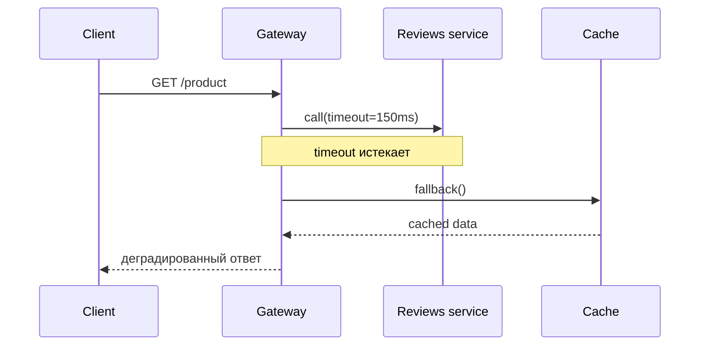
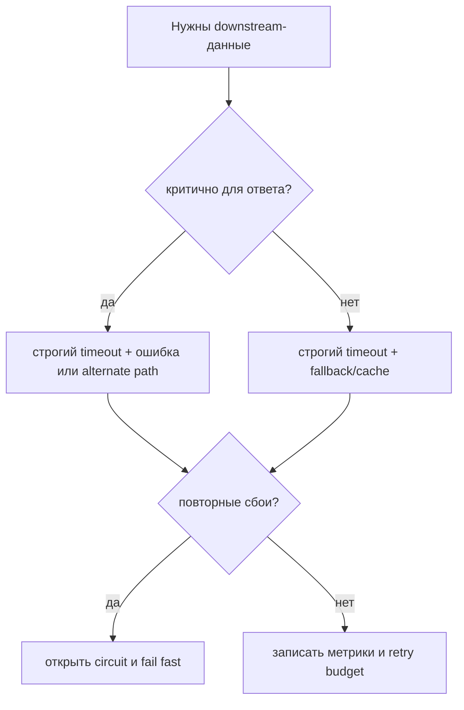

# Timeouts, fallbacks и circuit breakers для сервисов

Когда сервис вызывает несколько других сервисов, главный риск не только в том,
что одна зависимость упала. Риск в том, что вызывающий сервис ждет слишком
долго, держит потоки занятыми и превращает отказ одной зависимости в медленные
ответы везде. Как на стойке почты: если закончился один рулон марок, вся очередь
не должна останавливаться, если есть понятный fallback-процесс.

Эта тема - практическое продолжение [Синхронной и асинхронной коммуникации](topic:sync-vs-async-communication)
и [Зачем нужны микросервисы](topic:why-microservices). Цель - ограничить
синхронный запрос: пользователь быстро получает нормальный ответ,
деградированный ответ или понятную ошибку.

## Ментальная модель

У запроса должен быть общий end-to-end deadline, а каждый downstream-вызов должен
получать только часть этого бюджета. Если страница должна вернуться за 300 ms,
некритичный сервис не должен забирать 5 seconds. Как заказ на кухне со временем
выдачи: у каждой станции свой небольшой таймер, а не бесконечное ожидание гостя.

Раздели downstream-данные на **критичные** и **опциональные**. Без критичных
данных, возможно, нужно провалить весь запрос; опциональные данные можно
заменить cached, default или partial data. Как в форме доставки: адрес критичен,
а рекламный буклет можно пропустить.

## Практический план

1. Задай общий deadline запроса.
   У всей операции должно быть максимальное время, например 300 ms. Передавай
   оставшийся бюджет downstream-клиентам, а не позволяй каждому клиенту выбирать
   несвязанный timeout. Как пересадка на поезд: каждая пересадка должна вписаться
   в расписание всей поездки, а не только в расписание своей платформы.

2. Задай короткие явные timeouts для каждой зависимости.
   Timeout превращает "может быть, ответит" в ограниченное решение. Timeout
   должен опираться на реальные latency percentiles и бизнес-ценность, а не на
   случайное огромное число. Как ожидание у стойки сервиса: заранее решаешь,
   когда идти к другому окну.

3. Вызывай независимые сервисы параллельно.
   Если catalog, price и reviews не зависят друг от друга, стартуй их вместе и
   собирай результат с deadline. Тогда пользователь ждет самый медленный
   ограниченный вызов, а не сумму всех ожиданий. Как с готовкой: салат и чай
   можно делать, пока греется суп.

4. Используй fallback для опциональных данных.
   Fallback может быть cached data, defaults, пустой блок или более простой
   ответ. Он должен быть честным и безопасным: не используй stale data для
   payment approval или stock reservation, если корректность зависит от свежести.
   Как в меню ресторана: гарнир можно заменить, но нельзя тихо заменить
   оплаченное главное блюдо.

5. Используй circuit breaker после повторных сбоев.
   Circuit breaker открывается после достаточного числа failures и на время
   пропускает сломанную зависимость. Это экономит время и защищает падающий
   сервис от дополнительной нагрузки. Как дорожный знак, закрывающий затопленную
   дорогу: водители перестают пробовать этот путь, пока его не проверят.

6. Ограничивай retries.
   Retries могут помочь при коротких сетевых сбоях, но бесконечные или
   синхронные retries ухудшают outage. Используй retry budget, маленькое число
   повторов, exponential backoff, jitter и никогда не повторяй после истечения
   deadline вызывающей стороны. Как звонок в дверь: один дополнительный звонок
   разумен, а пятьдесят только мешают всем.

7. Изолируй ресурсы через bulkheads.
   Медленные вызовы не должны забирать все request threads или все connections.
   Используй отдельные connection pools, небольшие executor pools или concurrency
   limits для каждой зависимости. Это связано с [Java Thread Pool](topic:java-thread-pool).
   Как в супермаркете с отдельными кассами: одна заблокированная касса не должна
   держать всех покупателей.

8. Убирай некритичную работу из request path.
   Если пользователю не нужен результат прямо сейчас, публикуй работу
   асинхронно и быстро возвращай ответ. Для надежной публикации событий полезен
   [Outbox Pattern](topic:outbox-pattern), а для duplicate-safe consumers -
   [Inbox Pattern](topic:inbox-pattern). Как с посылкой на почте: ты не стоишь у
   стойки, пока она доедет до получателя.

## Ответ на 60 секунд

> Я бы не позволял вызывающему сервису ждать бесконечно. Я бы поставил
> end-to-end deadline на запрос и короткие timeouts на каждый downstream-вызов.
> Независимые вызовы стоит запускать параллельно и собирать в пределах этого
> бюджета. Для опциональных данных я бы вернул безопасный fallback или cached
> value; для критичных данных - быстро вернул понятную ошибку или пошел по
> alternate path. Если зависимость постоянно уходит в timeout, я бы использовал
> circuit breaker, чтобы следующие запросы сразу пропускали ее в течение
> cooling period. Retries должны быть ограничены тем же deadline, с backoff и
> jitter, а медленные зависимости должны иметь изолированные pools или
> bulkheads. Главное - контролируемая деградация вместо каскадной задержки.

На кухонном языке: у заказа есть время выдачи, у каждой станции есть таймер,
опциональный гарнир можно пропустить, а сломанная печь помечается закрытой, а не
заставляет каждый заказ ждать за ней.

## Зачем это в production

Это защита p95 и p99 latency, а не только average latency. Одна недоступная
зависимость может заполнить connection pools, заблокировать request threads и
вызвать upstream timeouts. Как пробка на одном перекрестке: проблема в том, как
быстро она блокирует соседние улицы.

Хорошие production-системы показывают metrics для timeout rate, fallback rate,
circuit state, retry count, pool saturation и downstream latency. Alerts должны
объяснять, получают пользователи degraded responses или полные failures. Как на
кухонном табло: мало знать, что "еда задерживается"; нужно знать, какая станция
застряла.

Конфигурация важна. Слишком длинные timeouts скрывают отказ и тратят capacity;
слишком короткие timeouts создают ложные failures. Слишком широкие fallbacks
могут скрыть серьезные проблемы корректности. Как в правилах почты: процесс
должен говорить, какие формы можно приблизить, а где нужны точные данные.

## Частые заблуждения

- "Просто увеличим timeout". Обычно это ухудшает user latency и resource
  pressure. Это как удлинить очередь вместо того, чтобы открыть другое окно или
  задать cutoff.
- "Retry, пока не заработает". У retries должен быть бюджет. Во время outage
  бесконечные retries создают дополнительную нагрузку на уже сломанную систему.
  Это как водители, которые снова и снова кружат к одной закрытой дороге.
- "Fallback значит любой default подойдет". Fallback должен быть безопасен для
  бизнес-решения. Показать cached recommendations часто нормально; approve
  payment по stale data - нет. Это как заменить салфетки, но не заменить паспорт
  клиента.
- "Circuit breaker заменяет timeout". Нет. Timeout обнаруживает медленные
  вызовы; circuit breaker использует повторные failures, чтобы некоторое время
  пропускать будущие вызовы. Это как секундомер плюс знак закрытой дороги.
- "Параллельные вызовы всегда улучшают latency". Parallelism помогает
  независимым вызовам, но может увеличить load и все равно должен уважать
  deadline. Как в готовке: параллельные станции помогают только если они не
  спорят за одну и ту же печь.
