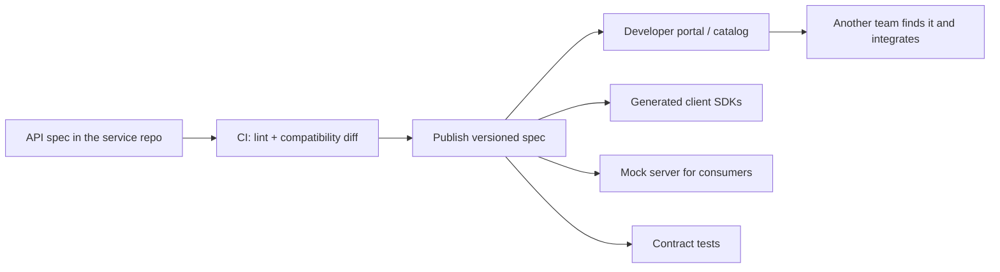
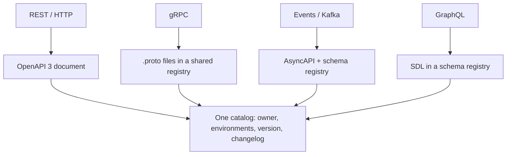
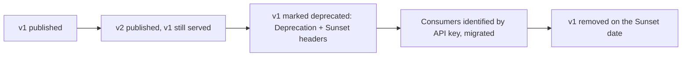

# Sharing API Endpoints Across an Organization

The question sounds like a tooling question — "which link do I send?" — but the interviewer is asking something else: **how does another team start calling your service without a meeting, and keep working when you change it?**

A URL is the smallest part of the answer. Everything hard about sharing an API is what the URL does not carry.

## What a consumer actually needs

Before choosing a tool, list what the other team has to know. If any of these is missing, they will come and ask you — and "come and ask me" does not scale past a couple of consumers.

| They need | Example |
| --- | --- |
| **Where** | base URL per environment: dev, staging, production |
| **What** | resources, methods, request/response schemas, examples |
| **How to get in** | auth scheme, how to obtain a token or key, required scopes |
| **What can go wrong** | status codes, the error body format, retry-safety |
| **The rules** | pagination, filtering, idempotency, rate limits, payload size |
| **Who and when** | owning team, support channel, version, changelog, deprecation policy |

Six categories; a URL covers one. This is why "I sent them the Swagger link" is only half an answer in an interview.

## The ladder, from ad-hoc to org-wide

**Level 0 — ad-hoc.** A `curl` snippet in a chat message, a wiki page, an exported Postman collection. It works for exactly one consumer for exactly one week. It is written by hand, so it starts drifting from the code the day it is written, and nobody knows it exists a month later. Fine as a demo, not as an interface.

**Level 1 — a machine-readable spec served by the service.** For REST that is an **OpenAPI 3** document. In a Spring Boot service (see [Spring Boot Starter Web](topic:spring-boot-starter-web)) `springdoc-openapi` derives it from the controllers and DTOs and exposes `/v3/api-docs` plus a Swagger UI page. The win is not the pretty page — it is that the document is *machine-readable*, so consumers can generate clients and tests from it instead of reading it.

**Level 2 — publish the spec as a build artifact.** The spec should not only be reachable on a running instance; it should be produced by CI on every merge, versioned, and pushed somewhere stable. Now a consumer can:

- generate a typed client SDK (`openapi-generator`) instead of hand-writing HTTP calls,
- run a **mock server** from the spec and build their side before yours is deployed,
- write **contract tests** that fail their build when your response shape changes.

**Level 3 — one catalog for the whole organization.** In a company with fifty services the real problem is *discovery*: teams re-implement an API that already exists because they could not find it. A developer portal or service catalog (Backstage, SwaggerHub, a gateway's portal) aggregates every service's spec into one searchable place with the owner, the environments, a try-it console and a changelog. The rule that makes it work: **each team owns its spec, the catalog only aggregates** — a central repo that other people edit rots immediately.

**Level 4 — governance in the pipeline.** Style-lint the spec (Spectral) so all APIs feel like one product, run an automatic **backward-compatibility diff** against the published version and fail the build on a breaking change, and require descriptions and examples. This is what turns "we have docs" into "our docs are trustworthy".

## Code-first or contract-first

Both produce an OpenAPI document; they differ in which artefact is the source of truth.

| | Code-first (annotations → spec) | Contract-first (spec → code) |
| --- | --- | --- |
| Source of truth | the implementation | the reviewed spec file |
| Drift | impossible by construction | possible; CI must verify |
| Design review | after the code exists | in a pull request, before code |
| Consumers can start | after you deploy | on day one, against a mock |
| Cost | none | discipline, generation step |

Code-first is the pragmatic default for a service whose only consumers are you. **Contract-first is the right answer when the API crosses a team boundary**, because the discussion about resources, names and error shapes happens while it is still cheap to change — the same design questions as in [Employee API: Design](topic:employee-api-design) and [REST and Separation of Concerns](topic:employee-api-rest-cqrs). The two are not exclusive: many teams write the spec first and then verify in CI that the running service still matches it.

## It is not only REST

The artefact changes with the protocol; the discipline does not.

For asynchronous integration the contract is the **message**, not the endpoint: the topic name, the payload schema and the compatibility mode enforced by a schema registry (Avro, Protobuf or JSON Schema). A producer that adds a required field to an event breaks every consumer exactly as an incompatible REST change would — see [Synchronous vs Asynchronous Communication](topic:sync-vs-async-communication), [Types of Interaction Between Microservices](topic:microservice-interaction-types) and [Async Data at a Synchronous Decision Point](topic:event-carried-state-transfer). Choosing which of these you are sharing in the first place is [Choosing Sync or Async Service Communication](topic:service-communication-choice); the full menu of transports is in [Options for Configuring Inter-Service Communication](topic:inter-service-communication-options).

## Where the endpoint lives

Internally, consumers usually resolve your service through service discovery or platform DNS. Externally — and often for other departments too — the address you publish is a route on an [API gateway](topic:api-gateway), not your pod. That matters for sharing: the gateway is where API keys are issued, quotas enforced and traffic attributed, so it is also where you learn **who your consumers actually are**. You cannot retire a version you cannot see being called.

## 60-second interview answer

> Sharing an endpoint means publishing a contract, not a URL. Concretely: the service exposes an OpenAPI 3 document — in Spring Boot, generated by springdoc from the controllers, or written contract-first and verified against the implementation in CI. That document is produced by the build on every merge, linted, diffed against the previous version so a breaking change fails the pipeline, and published to a place people can find: a developer portal or service catalog that lists every service with its owner, environments, changelog and a try-it console. From the spec consumers generate typed clients, run mock servers to build against before I deploy, and write contract tests that break their build if I change a response. Around the spec I publish what the spec does not carry: base URLs per environment, how to obtain a token and which scopes are needed, the standard error format, pagination and rate limits, a sandbox with test data, and the owning team's support channel. For non-REST it is the same discipline with different artefacts — .proto files for gRPC, AsyncAPI plus a schema registry with compatibility checks for Kafka events. Then versioning policy: additive changes stay in the current version, breaking ones get a new version, and the old one is deprecated with Deprecation and Sunset headers and a date, with consumers identified by their API keys at the gateway so I know who still has to migrate. What I would not do is hand over a hand-written wiki page, a Postman export with my own token in it, or database access instead of an API.

## Production relevance

**Documentation that is not generated is wrong.** Any doc maintained by hand diverges from the code within weeks, and a wrong doc is worse than none — people trust it and build on it. Generate or verify the spec in the same pipeline that deploys the service, so shipping a change and publishing it are one action.

**Ship a sandbox, not just a schema.** The fastest onboarding is an environment with seeded, deterministic data, self-service credential issuance, and a working example request that returns something. The slowest is a perfect spec plus a two-week wait for someone to create an account.

**Never share credentials inside the artefact.** Postman collections and `curl` snippets are the classic way a personal token leaks into a wiki, a chat channel or a git repository. Share the *scheme* — "get a client-credentials token from this URL with these scopes" — and issue every consumer their own key.

**Publish a filtered spec to the outside.** Your internal document often contains admin endpoints, internal-only fields and debug routes. Public consumers get a curated subset, and Swagger UI stays off (or behind auth) in production — an open UI is a request-shaped inventory of your attack surface.

**Versioning is a promise, not a path segment.** Adding an optional field or a new endpoint is not a new version; changing a field's type, removing one, or tightening validation is — even if the URL never changes. Publish the policy alongside the API and enforce it with an automated compatibility check.

**Deprecate with a date and a signal.** Announce the successor, mark the old version with `Deprecation` and `Sunset` response headers, monitor which API keys still call it, and remove it only after the traffic is gone.

**Standardize the boring parts across the organization.** One error body format (RFC 7807 `application/problem+json`), one pagination style, one date format, one auth scheme. Consumers then learn the platform once instead of learning each team's habits, and the catalog reads like one product rather than fifty.

**Contract tests are what keep the promise honest.** A consumer publishes the expectations it relies on; those run in *your* pipeline (Pact, Spring Cloud Contract). A response field you thought nobody used now fails your build instead of their production.

## Common misconceptions

- **"I sent them the Swagger link — that is sharing."** It answers *what*, not *where per environment*, *how do I authenticate*, *what are the limits*, or *who do I contact when it breaks*. Those questions are where integrations actually stall.
- **"Generated docs cannot be wrong."** They describe shapes, not semantics. Whether an empty result is `200` with an empty list or `404`, whether `PUT` is idempotent here, what "status" means — no annotation captures that. Write descriptions and realistic examples; the generator only saves you from typing the schema.
- **"Swagger UI in production is harmless."** It publishes a complete map of your surface plus a live request form. Serve the static spec to those who need it, keep the UI internal or behind authentication.
- **"A Postman collection is a contract."** It is a snapshot of one person's calls, frequently containing their credentials, and nothing verifies it against the running service. It is a convenience artefact you generate *from* the spec, not a substitute for it.
- **"It is internal, so compatibility does not matter — we will just tell them."** Internal consumers are still consumers you cannot redeploy atomically with yourself. The moment two services deploy independently you have a public API, whoever is on the other end.
- **"Versioning means putting /v2 in the path."** The path is one way to *express* a version. The version itself is a compatibility promise, and you can break consumers without touching the path at all.
- **"Just give them read access to my database — it is faster."** It is, once. After that every consumer is coupled to your table layout, you cannot refactor a column, and you have no idea who reads what. The API exists precisely to be the shared, stable, observable surface — the same boundary argument as in [Modular Architecture: Options](topic:modular-architecture-options) and [Why Microservices Are Used](topic:why-microservices).
- **"One central spec repository is the tidy solution."** Ownership beats tidiness: a spec that lives away from the code it describes is nobody's job to update. Keep specs with their services and let the catalog aggregate them.
- **"If it is on the intranet it does not need auth."** The gateway only sees north-south traffic; anything already inside the network can call you directly. Publish the auth requirement and enforce it, for internal consumers too.
- **"Documenting the endpoint is enough — they will figure out failures."** How you fail is part of the contract: which status codes, which error body, which calls are safe to retry, what happens at the rate limit. Consumers build [timeouts, retries and circuit breakers](topic:service-timeouts-fallbacks) from exactly that information.
