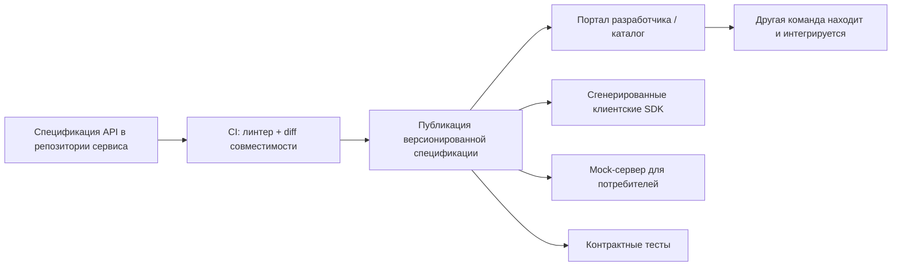
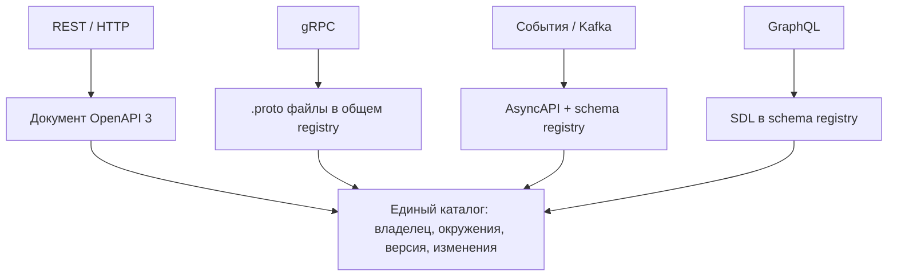
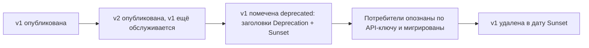

# Как делиться эндпоинтами внутри организации

Вопрос звучит как вопрос про инструменты — «какую ссылку отправить?» — но собеседующий спрашивает о другом: **как другая команда начнёт вызывать ваш сервис без совещания и продолжит работать, когда вы его измените?**

URL — наименьшая часть ответа. Всё сложное в шаринге API — это то, чего в URL нет.

## Что на самом деле нужно потребителю

Прежде чем выбирать инструмент, перечислите, что должна знать другая команда. Если чего-то не хватает, они придут спрашивать вас — а «приходите спрашивать меня» не масштабируется дальше пары потребителей.

| Что нужно | Пример |
| --- | --- |
| **Где** | базовый URL для каждого окружения: dev, staging, production |
| **Что** | ресурсы, методы, схемы запросов и ответов, примеры |
| **Как войти** | схема аутентификации, как получить токен или ключ, нужные scopes |
| **Что может пойти не так** | коды статусов, формат тела ошибки, безопасность повторов |
| **Правила** | пагинация, фильтрация, идемпотентность, лимиты запросов, размер payload |
| **Кто и когда** | команда-владелец, канал поддержки, версия, список изменений, политика deprecation |

Шесть категорий; URL покрывает одну. Поэтому «я отправил им ссылку на Swagger» — только половина ответа на собеседовании.

## Лестница: от ad-hoc до масштаба организации

**Уровень 0 — ad-hoc.** Сниппет `curl` в чате, страница в вики, экспортированная Postman-коллекция. Работает ровно для одного потребителя ровно неделю. Это написано руками, поэтому расходится с кодом с первого же дня, а через месяц никто не помнит, что оно существует. Годится как демо, но не как интерфейс.

**Уровень 1 — машиночитаемая спецификация, которую отдаёт сам сервис.** Для REST это документ **OpenAPI 3**. В Spring Boot сервисе (см. [Spring Boot Starter Web](topic:spring-boot-starter-web)) `springdoc-openapi` выводит его из контроллеров и DTO и публикует `/v3/api-docs` плюс страницу Swagger UI. Выигрыш не в красивой странице, а в том, что документ *машиночитаемый*: потребители могут генерировать из него клиентов и тесты вместо того, чтобы его читать.

**Уровень 2 — публикация спецификации как артефакта сборки.** Спецификация должна быть доступна не только на запущенном инстансе: её нужно собирать в CI на каждый merge, версионировать и класть в стабильное место. Тогда потребитель может:

- сгенерировать типизированный клиентский SDK (`openapi-generator`) вместо ручных HTTP-вызовов,
- поднять **mock-сервер** из спецификации и построить свою сторону раньше, чем задеплоена ваша,
- написать **контрактные тесты**, которые уронят их сборку, когда изменится форма вашего ответа.

**Уровень 3 — единый каталог на всю организацию.** В компании с полусотней сервисов настоящая проблема — *обнаружение*: команды заново реализуют API, который уже существует, просто потому что не смогли его найти. Портал разработчика или каталог сервисов (Backstage, SwaggerHub, портал gateway) собирает спецификации всех сервисов в одно поисковое место с владельцем, окружениями, консолью «попробовать» и списком изменений. Правило, благодаря которому это работает: **каждая команда владеет своей спецификацией, каталог только агрегирует** — центральный репозиторий, который правят посторонние, протухает моментально.

**Уровень 4 — governance в пайплайне.** Прогонять спецификацию через style-линтер (Spectral), чтобы все API ощущались одним продуктом, автоматически считать **diff обратной совместимости** с опубликованной версией и ронять сборку на ломающем изменении, требовать описания и примеры. Именно это превращает «у нас есть документация» в «нашей документации можно верить».

## Code-first или contract-first

Оба подхода дают документ OpenAPI; различаются они тем, какой артефакт является источником истины.

| | Code-first (аннотации → спецификация) | Contract-first (спецификация → код) |
| --- | --- | --- |
| Источник истины | реализация | проверенный файл спецификации |
| Расхождение | невозможно по построению | возможно; CI обязан проверять |
| Ревью дизайна | после того, как код написан | в pull request, до кода |
| Потребители могут начать | после вашего деплоя | в первый же день, против mock |
| Цена | никакой | дисциплина, шаг генерации |

Code-first — прагматичный вариант по умолчанию для сервиса, единственный потребитель которого вы сами. **Contract-first — правильный ответ, когда API пересекает границу команды**, потому что обсуждение ресурсов, имён и формы ошибок происходит, пока менять их ещё дёшево — те же вопросы дизайна, что в [API сотрудника: Дизайн](topic:employee-api-design) и [REST и разделение ответственности](topic:employee-api-rest-cqrs). Подходы не исключают друг друга: многие команды сначала пишут спецификацию, а потом в CI проверяют, что работающий сервис ей всё ещё соответствует.

## Это не только про REST

Артефакт меняется вместе с протоколом; дисциплина — нет.

Для асинхронной интеграции контрактом является **сообщение**, а не эндпоинт: имя топика, схема payload и режим совместимости, который проверяет schema registry (Avro, Protobuf или JSON Schema). Producer, добавивший обязательное поле в событие, ломает всех потребителей ровно так же, как несовместимое изменение в REST — см. [Синхронная и асинхронная коммуникация](topic:sync-vs-async-communication), [Типы взаимодействия между микросервисами](topic:microservice-interaction-types) и [Асинхронные данные в точке синхронного решения](topic:event-carried-state-transfer). Выбор того, чем именно вы делитесь, разбирается в [Выбор синхронного или асинхронного взаимодействия сервисов](topic:service-communication-choice); полный список транспортов — в [Варианты настройки взаимодействия между сервисами](topic:inter-service-communication-options).

## Где живёт эндпоинт

Внутри системы потребители обычно находят ваш сервис через service discovery или DNS платформы. Снаружи — а часто и для других подразделений — публикуемый адрес это маршрут на [API gateway](topic:api-gateway), а не ваш pod. Для шаринга это важно: именно на gateway выдаются API-ключи, применяются квоты и атрибутируется трафик, поэтому именно там вы узнаёте, **кто на самом деле ваши потребители**. Нельзя вывести из эксплуатации версию, вызовов которой вы не видите.

## Ответ на собеседовании за 60 секунд

> Поделиться эндпоинтом — значит опубликовать контракт, а не URL. Конкретно: сервис отдаёт документ OpenAPI 3 — в Spring Boot его генерирует springdoc из контроллеров, либо он пишется contract-first и в CI проверяется на соответствие реализации. Этот документ собирается сборкой на каждый merge, линтуется, сравнивается с предыдущей версией, чтобы ломающее изменение роняло пайплайн, и публикуется туда, где его найдут: в портал разработчика или каталог сервисов, где у каждого сервиса указаны владелец, окружения, список изменений и консоль «попробовать». Из спецификации потребители генерируют типизированных клиентов, поднимают mock-серверы, чтобы строить свою часть до моего деплоя, и пишут контрактные тесты, которые ломают их сборку, если я поменяю ответ. Вокруг спецификации я публикую то, чего в ней нет: базовые URL по окружениям, как получить токен и какие нужны scopes, стандартный формат ошибки, пагинацию и лимиты запросов, песочницу с тестовыми данными и канал поддержки команды-владельца. Для не-REST дисциплина та же, артефакты другие — .proto для gRPC, AsyncAPI плюс schema registry с проверкой совместимости для событий Kafka. Дальше политика версионирования: аддитивные изменения остаются в текущей версии, ломающие получают новую, а старая помечается заголовками Deprecation и Sunset с датой, и потребители опознаются по API-ключам на gateway, чтобы я знал, кому ещё предстоит мигрировать. Чего я точно не стал бы делать — отдавать написанную руками страницу вики, экспорт Postman со своим токеном внутри или доступ к базе вместо API.

## Значение на продакшене

**Документация, которая не генерируется, неверна.** Любой поддерживаемый руками документ расходится с кодом за недели, а неверный документ хуже отсутствующего — ему верят и строят на нём. Генерируйте или проверяйте спецификацию в том же пайплайне, что деплоит сервис, чтобы выкатить изменение и опубликовать его было одним действием.

**Отдавайте песочницу, а не только схему.** Самый быстрый онбординг — окружение с засеянными детерминированными данными, самостоятельной выдачей учётных данных и рабочим примером запроса, который что-то возвращает. Самый медленный — идеальная спецификация плюс две недели ожидания, пока кто-то заведёт аккаунт.

**Никогда не делитесь учётными данными внутри артефакта.** Postman-коллекции и сниппеты `curl` — классический способ утечки личного токена в вики, чат или git-репозиторий. Делитесь *схемой* — «получите client-credentials токен по этому URL с такими scopes» — и выдавайте каждому потребителю свой ключ.

**Наружу публикуйте отфильтрованную спецификацию.** Внутренний документ часто содержит админские эндпоинты, внутренние поля и отладочные маршруты. Внешние потребители получают выверенное подмножество, а Swagger UI в проде выключен (или закрыт аутентификацией) — открытый UI это инвентаризация вашей поверхности атаки в виде готовых запросов.

**Версионирование — это обещание, а не сегмент пути.** Добавление необязательного поля или нового эндпоинта не является новой версией; смена типа поля, его удаление или ужесточение валидации — является, даже если URL не менялся. Публикуйте политику рядом с API и подкрепляйте её автоматической проверкой совместимости.

**Выводите из эксплуатации с датой и сигналом.** Объявите преемника, пометьте старую версию заголовками ответа `Deprecation` и `Sunset`, следите, какие API-ключи ещё её вызывают, и удаляйте только после того, как трафик ушёл.

**Стандартизируйте скучные части на уровне организации.** Один формат тела ошибки (RFC 7807 `application/problem+json`), один стиль пагинации, один формат дат, одна схема аутентификации. Тогда потребители изучают платформу один раз, а не привычки каждой команды, и каталог читается как один продукт, а не как полсотни разных.

**Контрактные тесты — то, что удерживает обещание.** Потребитель публикует ожидания, на которые опирается, и они выполняются в *вашем* пайплайне (Pact, Spring Cloud Contract). Поле ответа, которое, как вы думали, никому не нужно, теперь роняет вашу сборку, а не их прод.

## Частые заблуждения

- **«Я отправил ссылку на Swagger — вот и поделился».** Это отвечает на *что*, но не на *где в каждом окружении*, *как аутентифицироваться*, *какие лимиты* и *к кому идти, когда сломается*. Именно на этих вопросах интеграции и застревают.
- **«Сгенерированная документация не может врать».** Она описывает формы, а не семантику. Пустой результат это `200` с пустым списком или `404`, идемпотентен ли здесь `PUT`, что означает поле «status» — ни одна аннотация этого не выражает. Пишите описания и реалистичные примеры; генератор лишь избавляет от ручного набора схемы.
- **«Swagger UI в проде безобиден».** Он публикует полную карту вашей поверхности плюс форму для живых запросов. Отдавайте статическую спецификацию тем, кому она нужна, а UI держите внутри периметра или за аутентификацией.
- **«Postman-коллекция — это контракт».** Это снимок вызовов одного человека, часто вместе с его учётными данными, и ничто не сверяет его с работающим сервисом. Это вспомогательный артефакт, который генерируют *из* спецификации, а не замена ей.
- **«Это внутреннее, совместимость неважна — мы просто скажем им».** Внутренние потребители — всё те же потребители, которых нельзя передеплоить атомарно вместе с собой. Как только два сервиса деплоятся независимо, у вас публичный API, кто бы ни был на другом конце.
- **«Версионирование — это добавить /v2 в путь».** Путь — лишь один из способов *выразить* версию. Сама версия это обещание о совместимости, и сломать потребителей можно, вообще не трогая путь.
- **«Просто дайте им read-доступ к моей базе — так быстрее».** Быстрее ровно один раз. Дальше каждый потребитель связан с раскладкой ваших таблиц, колонку уже не отрефакторить, и вы не знаете, кто что читает. API и существует затем, чтобы быть общей, стабильной и наблюдаемой поверхностью — тот же аргумент о границах, что в [Модульная архитектура: варианты](topic:modular-architecture-options) и [Зачем используют микросервисы](topic:why-microservices).
- **«Один центральный репозиторий спецификаций — аккуратное решение».** Владение важнее аккуратности: спецификация, лежащая отдельно от кода, который она описывает, не является ничьей задачей. Держите спецификации рядом с сервисами, а каталог пусть их агрегирует.
- **«Если это в интранете, аутентификация не нужна».** Gateway видит только north-south трафик; всё, что уже внутри сети, может обратиться к вам напрямую. Публикуйте требование аутентификации и применяйте его, в том числе к внутренним потребителям.
- **«Задокументировать эндпоинт достаточно — с ошибками разберутся сами».** То, как вы падаете, — часть контракта: какие коды статусов, какое тело ошибки, какие вызовы безопасно повторять, что происходит на лимите запросов. Именно из этой информации потребители строят [таймауты, fallback и circuit breaker](topic:service-timeouts-fallbacks).
