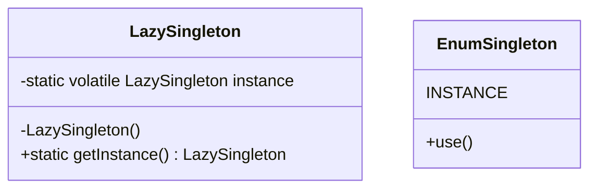
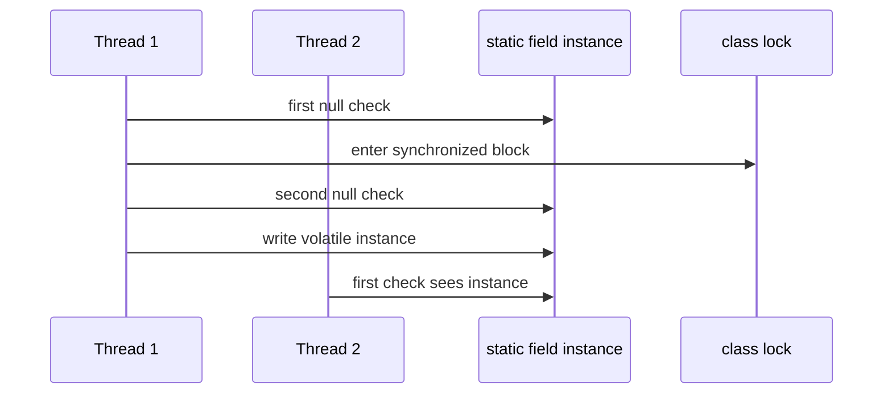

# Thread-Safe Singleton

Singleton means: one class owns exactly one shared instance and gives access to it through a controlled entry point, usually `getInstance()` or an enum constant. In a small office, this is like having one official stamp at the front desk: everyone uses the same stamp, and nobody is allowed to bring a private copy.

Use it when there is a real single resource or coordinator: configuration snapshot, registry, metrics sink, or a lightweight facade over another service. Do not use it just to avoid dependency injection; a global object is like a kitchen key left on every counter: convenient at first, hard to control later. For broader pattern context, see [Design Patterns Overview](topic:design-patterns-overview).



## The Core Shape

A classic Singleton has a private constructor, a private static field, and a public static access method. The private constructor is the locked storage room; the static accessor is the service window. Callers can ask for the object, but they cannot build their own.

Lazy initialization creates the instance only on first access. That saves work until the object is needed, like opening a checkout lane only when the first customer arrives. The danger is concurrency: two threads can both see `instance == null` before either write becomes visible. That is the interview trap.

## Why Naive Lazy Singleton Breaks

This version is not thread-safe:

```java
class Config {
    private static Config instance;

    private Config() {}

    static Config getInstance() {
        if (instance == null) {
            instance = new Config();
        }
        return instance;
    }
}
```

The `if` and the assignment are not one atomic operation. Thread 1 can check the empty shelf, Thread 2 can check the same empty shelf, and both can put a new jar there. In code, that means two constructor calls and two different objects.

## Safe Options

The simplest safe lazy version is a `synchronized` accessor. Only one thread can enter `getInstance()` at a time, like one customer at a service window. It is correct and easy to explain, but every call pays the lock cost, even after the instance already exists.

Double-checked locking reduces that cost:

```java
class Config {
    private static volatile Config instance;

    private Config() {}

    static Config getInstance() {
        Config local = instance;
        if (local == null) {
            synchronized (Config.class) {
                local = instance;
                if (local == null) {
                    local = new Config();
                    instance = local;
                }
            }
        }
        return local;
    }
}
```

The first check skips locking after initialization, like glancing through a post-office window before joining the line. The second check inside the lock is still required because another thread may have created the instance while this thread waited. `volatile` is required so other threads see a fully constructed object, not a half-stocked counter. For the underlying concurrency ideas, review [Java Multithreading](topic:java-multithreading), [Critical Section](topic:critical-section), and [Avoiding Race Conditions](topic:race-condition-avoidance).



An enum Singleton is usually the best answer when it fits:

```java
enum Config {
    INSTANCE
}
```

The JVM initializes enum constants once, handles serialization correctly, and blocks most reflection-based construction tricks. It is like the city issuing exactly one official mailbox key: you do not write the key factory yourself.

## 60-Second Interview Answer

Singleton restricts a class to one shared instance and exposes a controlled access point. In Java, the safest and simplest implementation is usually an enum Singleton because the JVM guarantees one enum constant per classloader and handles serialization. A lazy Singleton can also be made thread-safe with a `synchronized` `getInstance()`, but that locks on every call. Double-checked locking avoids locking after initialization, but the instance field must be `volatile`, and the code must check for `null` both before and inside the synchronized block. Without synchronization or `volatile`, two threads can create two instances or observe unsafe publication.

## Production Relevance

In production, prefer dependency injection over hand-written global access when possible. A Spring singleton bean is one instance per Spring container, not exactly the same as a GoF Singleton; [Spring Bean Scopes](topic:spring-bean-scopes) is the right mental model there. Think of DI as a building reception desk that lends you the right shared tool, while a static Singleton is a tool bolted to the wall.

Singletons are hard to test when they hide state, caches, clocks, or network clients. A shared coffee machine is fine if it only dispenses coffee; it becomes painful if every team secretly changes its settings. Keep Singleton state immutable or very carefully synchronized.

## Common Misconceptions

- "A private constructor is enough." It is not. Without a static access policy and thread-safe publication, callers can still race through `getInstance()`.
- "`volatile` makes everything thread-safe." It only gives visibility and ordering for the reference; it does not make compound logic atomic.
- "Double-checked locking works without `volatile`." In modern Java, correct DCL requires `volatile` on the instance field.
- "Enum Singleton is always perfect." It is excellent for simple singletons, but it cannot extend another class and is not lazy in the same way as a holder or DCL pattern.
- "A Spring singleton bean is the GoF Singleton." Spring controls one bean instance per container; the class itself may still allow normal construction elsewhere.
