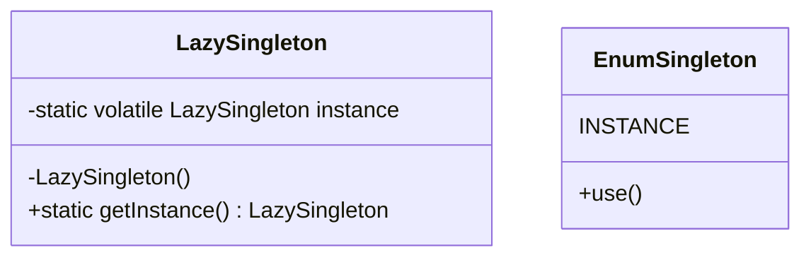
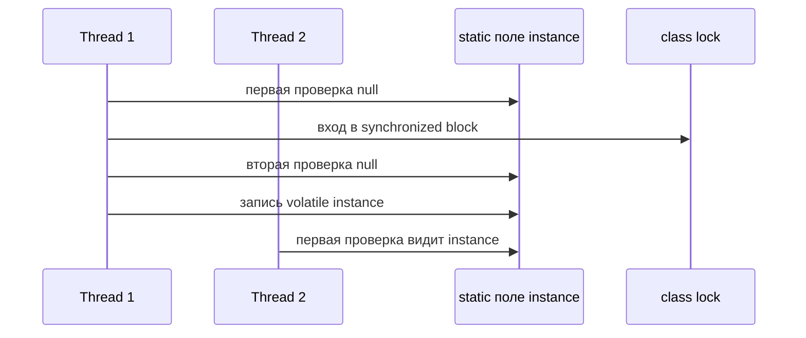

# Потокобезопасный Singleton

Singleton означает: один class владеет ровно одним общим экземпляром и даёт доступ к нему через контролируемую точку, обычно `getInstance()` или enum-константу. В маленьком офисе это похоже на одну официальную печать на стойке: все используют одну и ту же печать, и никто не приносит личную копию.

Используй его, когда есть действительно единственный ресурс или координатор: snapshot конфигурации, registry, metrics sink или лёгкий facade над другим service. Не используй его только ради обхода dependency injection; global object похож на кухонный ключ, оставленный на каждом столе: сначала удобно, потом трудно контролировать. Для общего контекста паттернов смотри [Design Patterns Overview](topic:design-patterns-overview).



## Базовая форма

Классический Singleton имеет private constructor, private static field и public static access method. Private constructor - это закрытая кладовая; static accessor - окошко обслуживания. Вызывающий код может попросить объект, но не может построить свой.

Lazy initialization создаёт экземпляр только при первом обращении. Это экономит работу до момента, когда объект реально нужен, как открытие кассы только после прихода первого покупателя. Опасность - concurrency: два threads могут оба увидеть `instance == null` до того, как запись одного из них станет видимой. Это типичная ловушка на интервью.

## Почему наивный lazy Singleton ломается

Эта версия не thread-safe:

```java
class Config {
    private static Config instance;

    private Config() {}

    static Config getInstance() {
        if (instance == null) {
            instance = new Config();
        }
        return instance;
    }
}
```

`if` и присваивание не являются одной atomic operation. Thread 1 может проверить пустую полку, Thread 2 может проверить ту же пустую полку, и оба поставят туда новую банку. В коде это означает два вызова конструктора и два разных объекта.

## Безопасные варианты

Самая простая безопасная lazy-версия - `synchronized` accessor. Только один thread может войти в `getInstance()` за раз, как один клиент у окошка обслуживания. Это корректно и легко объяснить, но каждый вызов платит стоимость lock, даже после того как экземпляр уже создан.

Double-checked locking уменьшает эту стоимость:

```java
class Config {
    private static volatile Config instance;

    private Config() {}

    static Config getInstance() {
        Config local = instance;
        if (local == null) {
            synchronized (Config.class) {
                local = instance;
                if (local == null) {
                    local = new Config();
                    instance = local;
                }
            }
        }
        return local;
    }
}
```

Первая проверка пропускает lock после initialization, как быстрый взгляд в окно почты перед тем, как вставать в очередь. Вторая проверка внутри lock всё равно нужна, потому что другой thread мог создать экземпляр, пока этот thread ждал. `volatile` требуется, чтобы другие threads увидели полностью созданный объект, а не наполовину заполненную стойку. Для базовых идей concurrency повтори [Java Multithreading](topic:java-multithreading), [Critical Section](topic:critical-section) и [Avoiding Race Conditions](topic:race-condition-avoidance).



Enum Singleton обычно лучший ответ, когда он подходит:

```java
enum Config {
    INSTANCE
}
```

JVM инициализирует enum-константы один раз, корректно обрабатывает serialization и блокирует большинство reflection-трюков с созданием. Это похоже на то, что город выдал ровно один официальный ключ от почтового ящика: ты не пишешь фабрику ключей сам.

## Ответ за 60 секунд

Singleton ограничивает class одним общим экземпляром и открывает контролируемую точку доступа. В Java самый безопасный и простой вариант обычно enum Singleton, потому что JVM гарантирует одну enum-константу на classloader и корректно обрабатывает serialization. Lazy Singleton тоже можно сделать thread-safe через `synchronized` `getInstance()`, но это берёт lock на каждом вызове. Double-checked locking избегает lock после initialization, но поле instance должно быть `volatile`, а код должен проверять `null` и до synchronized block, и внутри него. Без synchronization или `volatile` два threads могут создать два экземпляра или увидеть небезопасно опубликованный объект.

## Значение в production

В production по возможности предпочитай dependency injection ручному global access. Spring singleton bean - это один экземпляр на Spring container, а не ровно то же самое, что GoF Singleton; правильная модель описана в [Spring Bean Scopes](topic:spring-bean-scopes). DI похож на стойку ресепшена, которая выдаёт нужный общий инструмент, а static Singleton - на инструмент, прикрученный к стене.

Singleton трудно тестировать, если он прячет state, caches, clocks или network clients. Общая кофемашина нормальна, если она только выдаёт кофе; она становится проблемой, если каждая команда тайно меняет её настройки. Держи state Singleton immutable или очень аккуратно синхронизируй его.

## Частые заблуждения

- "Private constructor достаточно." Нет. Без static access policy и thread-safe publication вызывающий код всё ещё может устроить race в `getInstance()`.
- "`volatile` делает всё thread-safe." Он даёт visibility и ordering для reference; он не делает составную логику atomic.
- "Double-checked locking работает без `volatile`." В современной Java корректный DCL требует `volatile` на поле instance.
- "Enum Singleton всегда идеален." Он отличен для простых singletons, но не может наследоваться от другого class и не является lazy ровно так же, как holder или DCL pattern.
- "Spring singleton bean - это GoF Singleton." Spring контролирует один bean instance на container; сам class всё ещё может разрешать обычное создание в другом месте.
